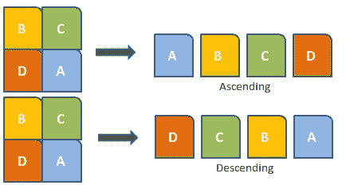

# 排序算法—综合指南

> 原文：<https://medium.com/analytics-vidhya/sorting-algorithms-a-comprehensive-guide-fe5a2470f2e0?source=collection_archive---------6----------------------->

## 每个程序员都应该知道的 6 大排序算法，并配有插图

排序是以特定格式组织数据的过程。排序算法明确说明了如何以特定的顺序排列数据。最流行的顺序是数字顺序或字典顺序。

