# 空间基础:自然语言处理中记号的重要性

> 原文：<https://medium.com/analytics-vidhya/spacy-basics-the-importance-of-tokens-in-natural-language-processing-89a698d8a76?source=collection_archive---------4----------------------->

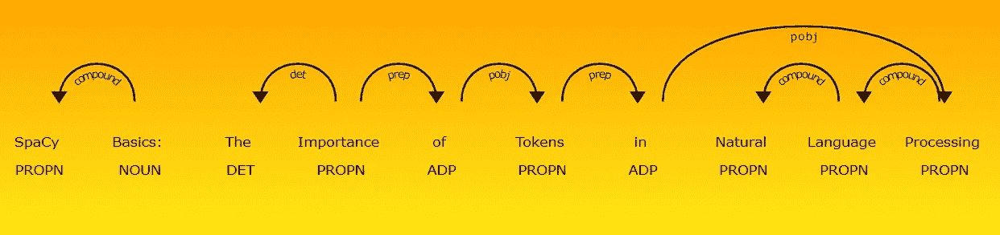

# 什么是标记化？

在处理自然语言之前，我们想要识别构成一串字符的单词。这就是为什么标记化是自然语言处理的基础步骤。这个过程是**重要的**，因为文本的意思可以通过分析文本中出现的单词来解释。记号化是将原始文本分解成单个片段(记号)以供进一步分析的过程。令牌是原始文本的片段；它们没有被分解成基本形式。在这篇博客中，我们将使用 [spaCy 库](https://spacy.io/)来标记一些创建的文本文档，通过检查标记之间的关系来帮助理解文本的含义。SpaCy 是一个免费的开源库，用于 Python 中的高级自然语言处理。

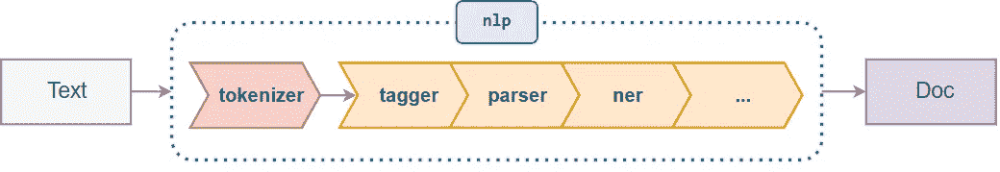

# 安装空间

要使用 spaCy 库，我们必须首先安装它。我们可以使用 **conda** 或 **pip** 安装 spaCy。请确保您拥有管理权限，以便可以成功安装特定的空间语言包。欲了解更多信息，请访问 https://spacy.io/usage/。

1.  用**导管**或**导管**安装空间:

`conda install -c conda-forge spacy`
或
`pip install -U spacy`

2.安装语言包(确保您拥有管理员权限):

`python -m spacy download en`

# 设置 Jupyter 笔记本

一旦我们成功安装了 spaCy 库和语言包，我们就可以打开 Jupyter 笔记本并访问 spaCy 了！我们需要做的第一件事是导入空间库:

```
# Import spaCy and load the language library
import spacy
```

一旦我们下载并安装了一个经过训练的管道，我们就可以通过 **spacy.load()** 加载它。这将返回一个包含处理文本所需的所有组件和数据的语言对象。引用语言对象的变量通常被称为 **nlp** 。

```
nlp = spacy.load(‘en_core_web_sm’)
```

我们也可以这样来查看 **NLP 管道**中的组件:

```
for item in nlp.pipeline:
    print(item)
```

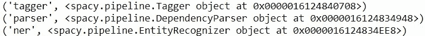

NLP 管道内的对象

# 创建文本文档

使用 **NLP 管道**，我们可以传入一个 Unicode 字符串，其中包含我们想要表示新文档的任何单词:

```
doc = nlp(u“Here is our new fancy document. It’s not very complex, but it will get the job done.”)
```

## 查看文档中的每个标记

理解**标记是文档对象**的基本构件。有助于我们理解文本含义的一切都来自于每个标记对象及其与其他标记的关系。要查看我们文档中的每个标记，我们可以说:

```
for token in doc:
    print(token.text)
```

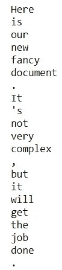

打印文档中的每个令牌

我们还可以通过简单地说`len(doc)`来查看文档中标记的数量。除了查看一个标记的实际文本，我们还可以查看每个标记的词性和句法依赖。下面，我们将创建一个简单的函数，允许我们查看每个标记的文本、词性和句法依赖:

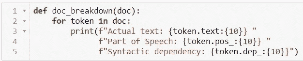

定义单据 _ 分解函数

当我们在 doc 变量上运行时:

```
doc_breakdown(doc)
```

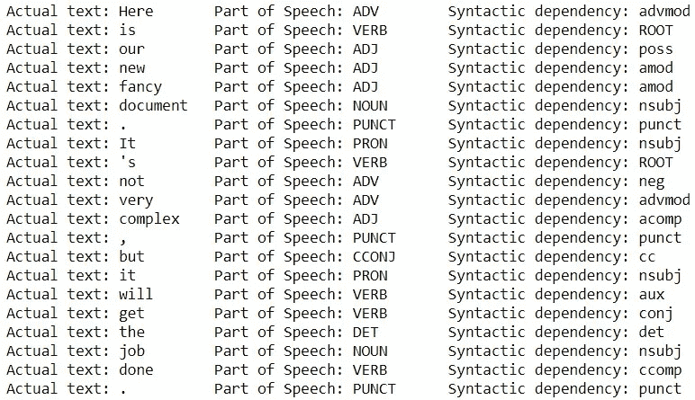

doc_breakdown 函数的输出

它返回一个输出，其中包含文档中每个标记的实际文本、词性和语法依赖标记。注意，即使我们的文档对象在技术上包含一个令牌列表，文档对象也不支持项的重新分配(我们不能说 doc[0] = 'New ')。此外，如果我们不确定某个标记或标签代表什么，我们可以通过传入我们想要识别的目标标签来利用 spacy.explain()方法:

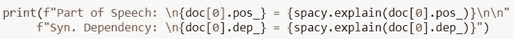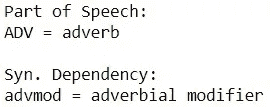

我们也可以简单地传入我们希望 spaCy 解释的标记或标签的字符串:

```
spacy.explain(‘advmod’)
```

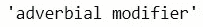

# 命名实体对象

命名实体对象将令牌带到下一个级别。如果我们检查 nlp 管道的内容，我们会看到它包含一个 **N.E.R.** 对象。这个对象是一个**命名的实体识别器**。这允许 nlp 管道识别某些单词是组织名称、位置、货币价值、日期等。命名实体可以通过**访问。文档对象的 ents** 属性。让我们创建一个新的文档并试用它！让我们使用这个字符串作为我们的新文档:

“特斯拉公司将支付 75 万美元，并建造一个太阳能屋顶，以解决其弗里蒙特工厂的几十起空气质量违规事件。”

```
# Creating a new document
doc2 = nlp(u”Tesla Company will pay $750,000 and build a solar roof to settle dozens of air-quality violations at its Fremont factory.”)
```

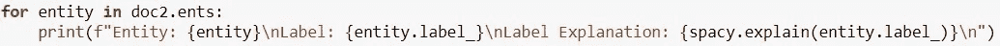

For 循环，打印实体、实体的标签和标签的解释

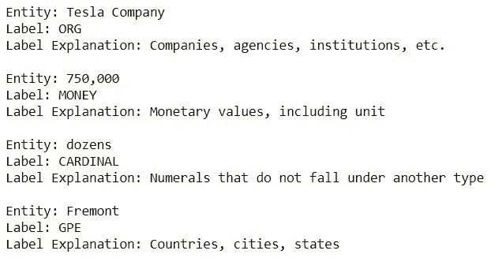

上面我们可以看到 spaCy 识别为命名实体的文档内的标记以及 spaCy 给每个实体的标签。

# 使用 displacy 和实验 Jupyter 参数

在结束这篇博客之前，我们将触及的最后一件事是 spaCy 库中的 **displacy** 模块。Displacy 是一个内置的依赖可视化工具，可以让我们检查模型的预测。我们可以传入一个或多个文档对象，启动 web 服务器，导出 HTML 文件，甚至直接从 Jupyter 笔记本上查看可视化效果。由于我们在这个博客中使用了 Jupyter 笔记本，我们将直接从笔记本上查看我们的可视化效果。要使用 displacy，我们将从空间库中导入模块:

```
from spacy import displacy
```

在 **displacy** 中我们要关注的方法是**。**方法 render()。此方法需要文档对象才能工作，并且可以以两种不同的可视化样式显示:“ent”或“dep”。“ent”样式根据标签类型突出显示文档中的命名实体。

## 实体样式

让我们使用带有 displacy 的 doc2 来可视化文档中的命名实体:

```
displacy.render(doc2, style=‘ent’, jupyter=True)
```

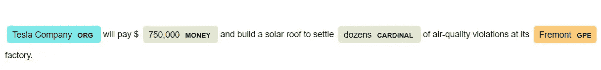

在上面的可视化中，我们看到了文档中的命名实体、它们的标签以及与标签类型相关联的颜色。请注意，**货币**和**红衣主教**的标签颜色相同。假设我们希望我们的基数和货币实体在视觉上有所不同。我们可以将一个选项字典传入 render()方法。

我们创建的第一个字典叫做 **colors** ，它包含实体标签的键值对以及与这些标签相关联的所需颜色。由于我们想要为**金钱**和**基数**实体创建不同的颜色，我们将它们的名称作为**键**包含在**颜色**字典中。我们可以给**货币**实体一个**浅绿色**的颜色，给**红衣主教**实体一个**黄色到橙色的线性渐变**(以显示你可以用这些颜色组合得到的复杂程度)。之后，我们创建另一个名为**选项**的字典。该字典将有一个名为“颜色”的键，其值将是**颜色字典**。然后将**选项字典**放入 render()方法的选项参数中。

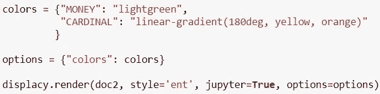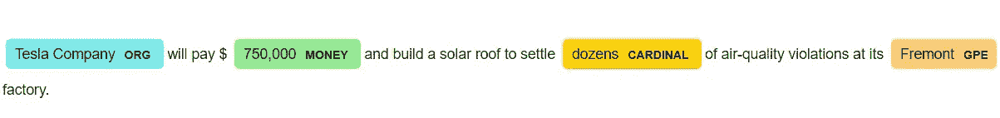

请注意，我们可以为每个实体提供自定义颜色，还可以通过传入一个“ents”键和一个我们希望可视化为 options 字典中的值的目标实体列表来排除可视化某些实体:

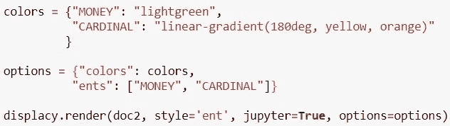

## 依赖风格

“dep”样式创建了一个依存关系图，它可视化了文档对象内标记的词性标记和语法依存关系。让我们创建一个新文档来可视化依赖关系图:

```
doc3 = nlp(u"SpaCy Basics: The Importance of Tokens in Natural Language Processing")
```

现在让我们通过 displacy.render()方法运行我们的新文档:

```
displacy.render(doc3, style=’dep’, jupyter=True)
```

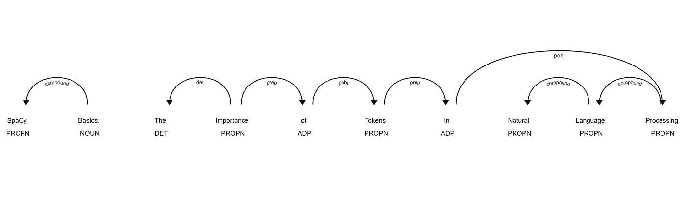

和以前一样，我们可以使用选项字典定制我们的图像，使它更流行！让我们添加一些背景颜色，更改字体，并最小化标记之间的视觉距离:

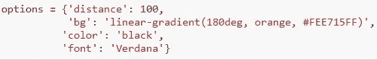

```
displacy.render(doc3, style=‘dep’, jupyter=True, options=options)
```


博客到此结束，我希望你喜欢它，也许能学到一些新东西！如果您有任何问题，请随时联系！