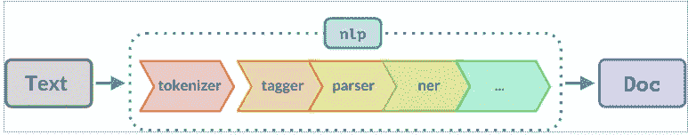

# 空间管道:初学者的奥德赛

> 原文：<https://medium.com/analytics-vidhya/spacy-pipelines-a-beginners-odyssey-f68977e0311a?source=collection_archive---------4----------------------->

嗨，读者们

处理大量文本数据是否给你带来了问题？你在无数时间里运行一百万张唱片吗？在运行你的程序和获得结果之间有一段永恒的时间吗？


瞧(鼓辊) :介绍空间管道

# 斯帕西:用几句话介绍我们的救世主

Spacy 是一个免费的开源 python 库。它是用 Cython 编写的，旨在提取语言特征并帮助其处理或在简短的 NLP 应用程序中使用。是的，我们可以让机器理解我们。


要安装 Spacy，请使用以下命令:

```
pip install spacy
```

# 空间管道:NLP 蝙蝠侠的公用事业带

像任何引导水流的管道一样，spaCy 管道引导文本数据的流动。



空间管道

空间管道提供了定制的方式，因此可以根据需要添加或删除管道的任何组件。这是它速度更快的主要原因之一——如果你不需要某个组件，就把它扔掉。不需要使用内存。很有效率，不是吗？

所以让我们直入主题吧

# **管道初始化**

```
import spacy
nlp = spacy.load('en_core_web_sm')
```

# **先睹为快的组件**

像任何电影的预告片一样，您可以查看管道的组件:使用 nlp.pipeline 命令，该命令返回包含组件名称和组件本身的元组列表。

```
print(nlp.pipeline)
```

## 输出:

```
[('tok2vec', <spacy.pipeline.tok2vec.Tok2Vec at 0x13b097fd228>),
 ('tagger', <spacy.pipeline.tagger.Tagger at 0x13b097fd408>),
 ('parser', <spacy.pipeline.dep_parser.DependencyParser at 0x13b0654a3c8>),
 ('attribute_ruler',
  <spacy.pipeline.attributeruler.AttributeRuler at 0x13b05e47888>),
 ('lemmatizer', <spacy.lang.en.lemmatizer.EnglishLemmatizer at 0x13b05f16e88>),
 ('ner', <spacy.pipeline.ner.EntityRecognizer at 0x13b0654a208>)]
```

而 nlp.pipe_names 返回列表中所有组件的名称。

```
nlp.pipe_names
```

## 输出:

```
['tok2vec', 'tagger', 'parser', 'attribute_ruler', 'lemmatizer', 'ner']
```

组件列表包括:

# 定制管道:添加您自己的想法

虽然 spacy 为文本数据提供了一个流，但是用户可以添加自己的组件或删除现有的组件。

管道的灵活性是其关键特征。如果您不想要某个组件，可以将其移除。您可以通过以下方式做到这一点:

```
nlp = spacy.load('en_core_web_sm', disable=['tagger', 'parser', 'ner']) # the disable command disables the command we do not require.
print(nlp.pipeline)
```

## 输出

```
[('tok2vec', <spacy.pipeline.tok2vec.Tok2Vec at 0x13b08187a08>),
 ('attribute_ruler',
  <spacy.pipeline.attributeruler.AttributeRuler at 0x13b07a75508>),
 ('lemmatizer', <spacy.lang.en.lemmatizer.EnglishLemmatizer at 0x13b07a823c8>)]
```

您还可以向管道添加自定义函数。您可以通过以下方式做到这一点:

```
from spacy.language import Language
[@Language](http://twitter.com/Language).component("component1")
def lemmatize(doc):
    lemma_list = [str(tok.lemma_).lower() for tok in doc
                  if tok.is_alpha and tok.text.lower() not in removal_words ]
    return lemma_listnlp.add_pipe("component2")
print(nlp.pipe_names)
```

**add_pipe** 参数用于定义你想要在管道中添加组件的位置。默认情况下，它被添加到管线的末端。您可以使用以下属性来管理定位:

## 输出:

```
['tok2vec', 'attribute_ruler', 'lemmatizer', 'component1']
```

通过组合以下成分，您可以准备自己的空间管道。请记住，您可以添加任意多的组件。重点应该是尽可能长时间地保持文档格式的输入。Spacy 更喜欢这种格式，因为它将它转换为哈希值，并使用它们进行更快的计算。祝你的菜好运。

编码快乐！！！