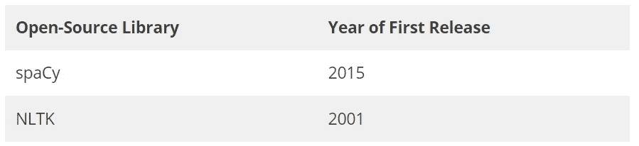

# SpaCy Vs NLTK —基本 NLP 操作代码和结果比较| Dev Skrol

> 原文：<https://medium.com/analytics-vidhya/spacy-vs-nltk-basic-nlp-operations-code-and-result-comparison-dev-skrol-7d7116608265?source=collection_archive---------14----------------------->

在本文中，我们将探索使用 NLTK 和 spaCy 的基本 NLP 操作的代码。


# NLTK

NLTK 是一个开源库，非常适合使用 Python 进行计算语言学的教学和工作。

它也有工业实力图书馆。

# 宽大的

spaCy 是 python 中高级 NLP 的开源库。

它是专门为生产使用而设计的，可以处理大量的文本，而 NLTK 和 CoreNLP 是专门为教学和研究目的而创建的。

spaCy 提供了先进的 NLP 技术，广泛应用于复杂的应用中，如文本摘要、文本到语音、特定领域 NER、问答、情感检测等。

我正打算一个一个地探索，并在一系列的帖子中与你分享。

# 首次发布



按作者分类的图片—首次发布比较

在许多博客帖子和文章中广泛提到 spaCy 更快，拥有其他库(NLTK、CodeNLP 等)提供的几乎所有功能。但或多或少有相似的精确度。

在本文中，我们将分析和比较 spaCy 和 NLTK 中 NLP 最基本操作的代码。

我们不打算比较这些库的速度和准确性。然而，了解这两个库的代码和结果可能有助于未来的研究。

```
#SPACY
import spacy 

#NLTK
import nltk
```

# 单词标记化

**在空间:**

```
text = "He is a 43 year old gentleman who is referred for consultation by Dr. Tamil Buhari.  About a week ago he slipped on the driveway at home and sustained an injury to his left ankle.  He was seen at My-City Hospital and was told he had a fracture.  He was placed in an air splint and advised to be partial weight bearing, and he is using a cane.  He is here for routine follow-up."nlp = spacy.load("en_core_web_sm")
doc = nlp(text)
tokens = [token.text for token in doc]
print(tokens)
```

输出:

```
['Most', 'of', 'the', 'outlay', 'will', 'be', 'at', 'home', '.', 'No', 'surprise', 'there', ',', 'either', '.', 'While', 'Samsung', 'has', 'expanded', 'overseas', ',', 'South', 'Korea', 'is', 'still', 'host', 'to', 'most', 'of', 'its', 'factories', 'and', 'research', 'engineers', '.']
```

**在 NLTK:**

```
from nltk.tokenize import word_tokenize
print(word_tokenize(text))
```

输出:

```
['Most', 'of', 'the', 'outlay', 'will', 'be', 'at', 'home', '.', 'No', 'surprise', 'there', ',', 'either', '.', 'While', 'Samsung', 'has', 'expanded', 'overseas', ',', 'South', 'Korea', 'is', 'still', 'host', 'to', 'most', 'of', 'its', 'factories', 'and', 'research', 'engineers', '.']
```

# 句子标记化

**在空间:**

```
doc = nlp(text)
for sent in doc.sents:
    print(sent)
```

输出:

```
He is a 43 year old gentleman who is referred for consultation by Dr. Tamil Buhari.
 About a week ago he slipped on the driveway at home and sustained an injury to his left ankle.  
He was seen at My-City Hospital and was told he had a fracture.  
He was placed in an air splint and advised to be partial weight bearing, and he is using a cane.  
He is here for routine follow-up.
```

**在 NLTK:**

```
from nltk.tokenize import sent_tokenize
```

输出:

```
['He is a 43 year old gentleman who is referred for consultation by Dr. Tamil Buhari.', 'About a week ago he slipped on the driveway at home and sustained an injury to his left ankle.', 'He was seen at My-City Hospital and was told he had a fracture.', 'He was placed in an air splint and advised to be partial weight bearing, and he is using a cane.', 'He is here for routine follow-up.']
```

# 停用词删除

**在空间:**

```
text = """Most of the outlay will be at home. No surprise there, either. While Samsung has expanded overseas, South Korea is still host to most of its factories and research engineers. """

doc = nlp(text)

text_without_sw = [token.text for token in doc if token.is_stop == False]
print(text_without_sw)
```

输出:

```
['outlay', 'home', '.', 'surprise', ',', '.', 'Samsung', 'expanded', 'overseas', ',', 'South', 'Korea', 'host', 'factories', 'research', 'engineers', '.']
```

**在 NLTK:**

```
from nltk.corpus import stopwords 
from nltk.tokenize import word_tokenize 

stop_words = set(stopwords.words('english')) 

words = text.split() 
text_without_sw = [token for token in words if not token in stop_words]
print(text_without_sw)
```

输出:

```
['Most', 'outlay', 'home.', 'No', 'surprise', 'there,', 'either.', 'While', 'Samsung', 'expanded', 'overseas,', 'South', 'Korea', 'still', 'host', 'factories', 'research', 'engineers.']
```

# 词性标注

**在空间:**

```
text = """Most of the outlay will be at home. No surprise there, either. While Samsung has expanded overseas, South Korea is still host to most of its factories and research engineers. """

doc = nlp(text)

tokens_with_POS = [token.text + " - " + token.pos_ for token in doc]
print(tokens_with_POS)
```

输出:

```
 ['Most - ADJ', 'of - ADP', 'the - DET', 'outlay - NOUN', 'will - AUX', 'be - VERB', 'at - ADP', 'home - NOUN', '. - PUNCT', 'No - DET', 'surprise - NOUN', 'there - ADV', ', - PUNCT', 'either - ADV', '. - PUNCT', 'While - SCONJ', 'Samsung - PROPN', 'has - AUX', 'expanded - VERB', 'overseas - ADV', ', - PUNCT', 'South - PROPN', 'Korea - PROPN', 'is - AUX', 'still - ADV', 'host - NOUN', 'to - ADP', 'most - ADJ', 'of - ADP', 'its - PRON', 'factories - NOUN', 'and - CCONJ', 'research - NOUN', 'engineers - NOUN', '. - PUNCT']
```

**在 NLTK:**

```
from nltk.tag import pos_tag

sent = nltk.word_tokenize(text)
sent = nltk.pos_tag(sent)
print(sent)
```

输出:

```
[('Most', 'JJS'), ('of', 'IN'), ('the', 'DT'), ('outlay', 'NN'), ('will', 'MD'), ('be', 'VB'), ('at', 'IN'), ('home', 'NN'), ('.', '.'), ('No', 'DT'), ('surprise', 'NN'), ('there', 'RB'), (',', ','), ('either', 'DT'), ('.', '.'), ('While', 'IN'), ('Samsung', 'NNP'), ('has', 'VBZ'), ('expanded', 'VBN'), ('overseas', 'RB'), (',', ','), ('South', 'NNP'), ('Korea', 'NNP'), ('is', 'VBZ'), ('still', 'RB'), ('host', 'VBN'), ('to', 'TO'), ('most', 'JJS'), ('of', 'IN'), ('its', 'PRP$'), ('factories', 'NNS'), ('and', 'CC'), ('research', 'NN'), ('engineers', 'NNS'), ('.', '.')]
```

# 命名实体识别

## **NER 使用空间:**

```
text = """Most of the outlay will be at home. No surprise there, either. While Samsung has expanded overseas, South Korea is still host to most of its factories and research engineers. """

doc = nlp(text)

for ent in doc.ents:
    print(ent.text, ent.start_char, ent.end_char, ent.label_)
```

输出:

```
Samsung 69 76 ORG
South Korea 100 111 GPE
```

## **NER 使用 NLTK:**

下载 NLTK 单词包:

```
nltk.download('words')
```

输出:

```
[nltk_data] Downloading package words to
[nltk_data]     C:\Users\aasha\AppData\Roaming\nltk_data...
[nltk_data]   Package words is already up-to-date!
```

**使用 ne_chunk，pos_tag:**

pos_tag 函数接受一个标记化的句子，并返回一个带标记的词类——名词、动词等。

ne_chunk 接受一个带词性标记的句子并返回一个树对象，该树对象标有 Person、location — GPE、organization。

```
import nltk
from nltk import ne_chunk, pos_tag, word_tokenizesent = "What is the weather in Chicago today?"
print(nltk.ne_chunk(nltk.pos_tag(nltk.word_tokenize(sent))))
```

输出:

```
(S
  What/WP
  is/VBZ
  the/DT
  weather/NN
  in/IN
  (GPE Chicago/NNP)
  today/NN
  ?/.)
```

您可以注意到命名实体被标记:chicago 位置被标记为 GPR。

**使用 ne_chunk 和 pos_tag 提取命名实体的完整代码:**

```
for sent in nltk.sent_tokenize(text):
    for chunk in nltk.ne_chunk(nltk.pos_tag(nltk.word_tokenize(sent))):
        if hasattr(chunk, 'label'):
            print(chunk.label(), ' '.join(c[0] for c in chunk))
```

**输出:**

```
PERSON Samsung
GPE South Korea
```

# 结论:

现在我们已经看到了如何在 NLTK 和 SpaCy 中完成基本的 NLP 操作。通过比较源代码来理解两个库的基本特性将会很有用，也很容易。

在本系列中，我们将看到更多关于 NLP 技术及其应用的内容。

感谢您阅读我们的文章，希望您喜欢。😊尝试所有这些技巧，玩文字游戏。

喜欢支持？只需点击喜欢按钮❤️.

快乐学习！👩‍💻

*原载于 2021 年 4 月 17 日*[*【https://devskrol.com】*](https://devskrol.com/index.php/2021/04/17/spacy-vs-nltk-basic-nlp-operations-code-and-result-comparison/)*。*