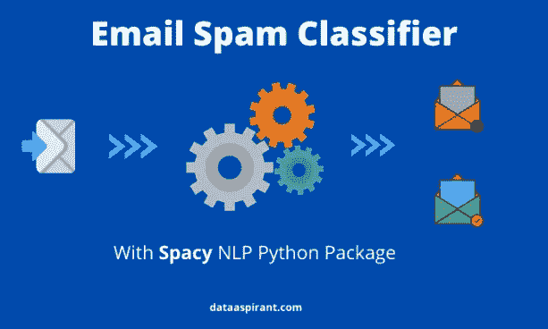
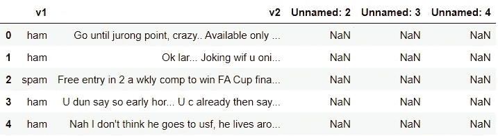
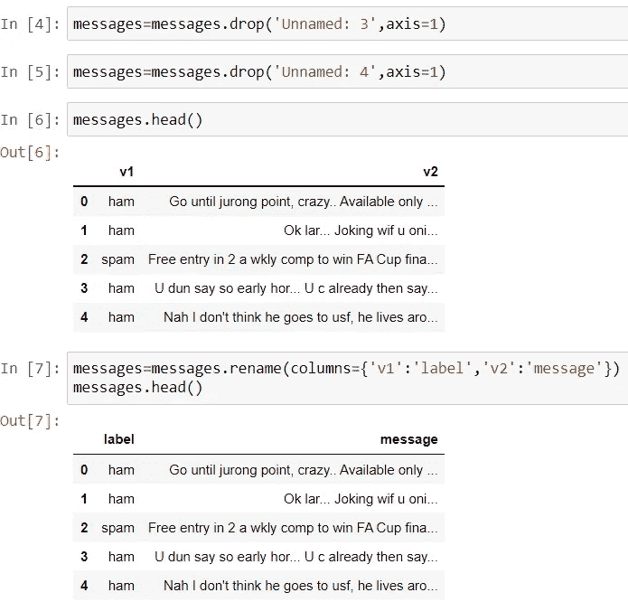
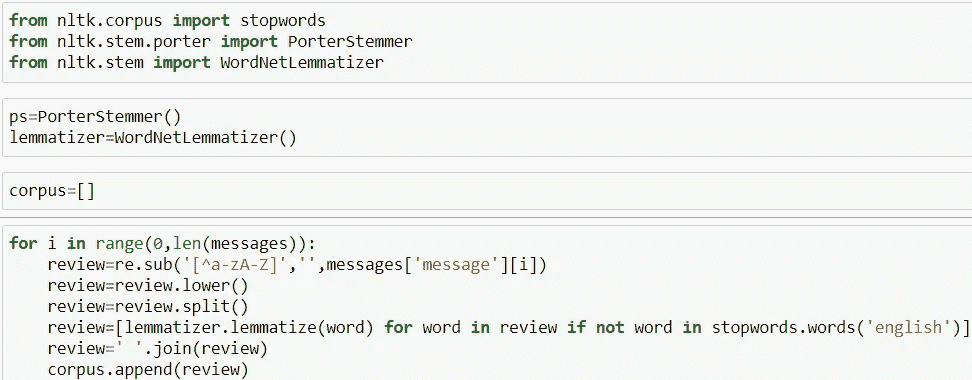
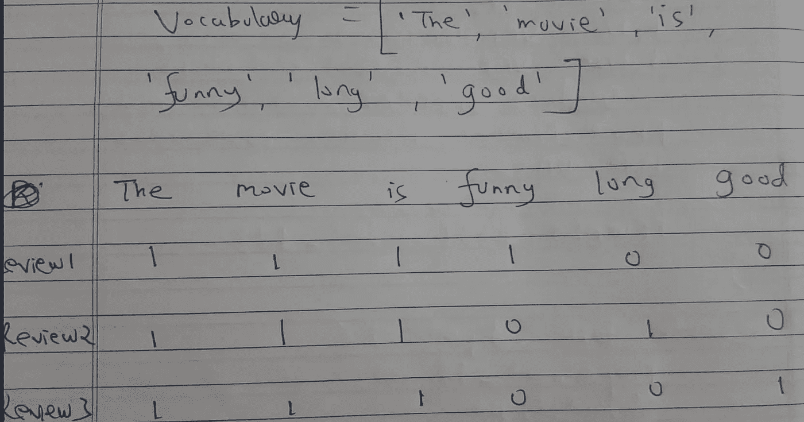
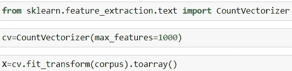
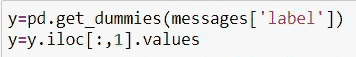

# 使用自然语言处理的垃圾邮件分类

> 原文：<https://medium.com/analytics-vidhya/spam-classification-using-nlp-f360bdad5723?source=collection_archive---------5----------------------->

# 介绍

自然语言处理(NLP)是人工智能的一个子集，它帮助计算机理解、解释和利用人类语言。它还为计算机提供了读取文本数据、语音数据等并解释它们的能力。

NLP 在现实世界中有多种应用，其中包括:

1.  情感分析
2.  问答应用程序
3.  文本摘要
4.  机器翻译
5.  垃圾邮件分类器
6.  命名实体识别

这些只是在 NLP 概念的基础上工作的几个例子。在本文中，我们将通过 NLP 项目中使用的基本演练，讨论一个使用 NLP 技术的关于**垃圾邮件分类器**的迷你项目。

以下是解决垃圾邮件分类器的小型 NLP 项目的步骤

1.  **标记化。**
2.  **删除停用词、标点符号和大小写(文本数据清理)。**
3.  **词干化/词汇化。**
4.  **通过单词包(BOW)将单词转换成向量。**
5.  **数据集中的自变量和因变量。**
6.  **创建模型和训练模型。**

现在让我们详细了解上述每个步骤:

# A]标记化

数据科学项目的第一步是获得正确的数据集。在垃圾邮件分类器数据集的情况下，包括输入和输出的大部分数据将是文本格式的。我们的第一项工作是将这些大量的文本转换成更小的标记(最小的语言单位)。

原始数据集图像

标记化是将大块文本分割成小块文本(标记)的过程。对一个段落来说，句子是一个记号，对一个句子来说，单词是一个记号。

**标记化的重要性是什么？**

大多数文本预处理模型，如单词袋、TF-IDF，通过将每个单词转换为向量并将其馈送给模型，在标记级别对每个单词进行预处理。这就是为什么我们把大文本转换成令牌。

# B]删除停用词、标点符号、大小写等(文本的数据清理)

当我们在数据集中观察这些大量的文本时，我们必须在将它们转换成向量之前清理这些文本。在处理文本数据时，诸如 is、on、if、as、the、why 等词经常出现。我们的工作是删除这些停用词，因为它们在与标点符号一起进行预处理时不会发挥很大的作用。

在此之前，我们首先删除不需要的列，并更改所需列的名称。

删除列

现在我们有了包含两列的数据集:“消息”包含传入的文本,“标签”包含垃圾邮件或垃圾邮件。

下一步是删除停用词，标点符号，并将其转换为小写，否则不同大小写的相同单词将被不同对待。

文本数据清理代码

我们将使用 NLTK 库并导入所有必需的类来完成必要的工作。

for 循环将对“messages”列中的每一行运行，它将首先用空格替换所有不是 a-z 或 A-Z 的字符。然后它会使用 lower()函数降低所有单词的大小写。下一步是在每一行上使用 split()函数，这样它将转换为单词列表，然后我们可以处理每个单词。

最后一步是对那些不在停用词列表中的词进行词汇化，然后用空格将其连接起来。

# C]什么是词汇化？

词元化是通过去除词尾将所有相似的词还原到其词根形式的过程，因为它出现在字典中。我们这样做是为了实现一致性，因为在我们的数据中会有许多单词有相同的词根。

像研究、学习这样的词被转化为学习。

词干化类似于词汇化，但是词干化有时不会产生有意义的单词。因此，在单词的含义至关重要的情况下，如聊天机器人和 Q/A 应用程序，词汇化通常是首选，而词干在情感分析中大量使用。

# D]单词袋(蝴蝶结)

既然我们已经对文本数据进行了清理，现在是时候将该文本转换为数字/向量了，因为该模型不理解人类语言，所以我们通过一些技术将单词转换为向量，如单词包、TF-IDF 和单词嵌入。

让我们在这里谈论一大堆单词。

## 什么是弓？

单词包(BOW)是一种技术，其中我们首先创建文本中存在的唯一单词的词汇表，并通过每个单词在文档中的出现次数来表示每个单词。

我们用一个例子来理解这个。让我们假设一个列包含一部电影的评论。

评论 1:电影很搞笑。

评论二:电影很长。

点评 3:电影不错。

首先创建独特单词的词汇表，然后为每个评论创建向量，在每一行中包含它们独特的外观。

这只是一个简短的例子来解释工作弓。

## 弓的缺点

1.  如果新句子包含新单词，那么词汇量也会增加，从而向量的长度也会增加。
2.  向量将包含许多 1 和 0，导致稀疏矩阵，并且稀疏矩阵在计算上是低效的。
3.  我们不保留文本的语法和排序信息。
4.  更重要的词有时并不重要。

CountVectorizer 是用于单词包的类。在创建向量时，向量的大小可能会呈指数增长。为了避免这种情况，我们使用一个名为 max_features 的参数来避免这个问题。

现在我们终于把单词转换成了向量。现在，我们将向量输入模型，用于训练目的。

# E]虚拟变量陷阱

Label 是我们数据集中的目标变量。标签包含两类:垃圾邮件和火腿。Model 不理解 spam 和 ham 的含义，所以我们使用熊猫的 get_dummies 函数将 spam 和 ham 转换为 1 和 0。

虚拟变量陷阱

现在我们还有自变量(X)(消息)和因变量(y)(标签)。

我们现在将数据分为训练和测试，并将训练数据提供给模型。我们将使用多项式朴素贝叶斯，我将在下一篇文章中讨论这一部分。

这就是这个迷你项目的特征工程部分，我们在其中处理了停用词、标点符号、大小写、词干、词汇化、单词包等。

我希望你们都喜欢这篇文章！

我将很快提出这个项目的最后阶段。

也可以在 LinkedIn 上与我联系，阅读更多与数据科学相关的帖子和文章。下面将提供链接。

 [## Sameer Kumar -研究实习生- SCAAI -应用人工智能共生中心| LinkedIn

### 嗨，我是 Sameer，目前我正在共生技术学院攻读工程学士学位。当我还是个孩子的时候，我…

www.linkedin.com](https://www.linkedin.com/in/sameer-kumar-20988b1a6/) 

快乐学习！！