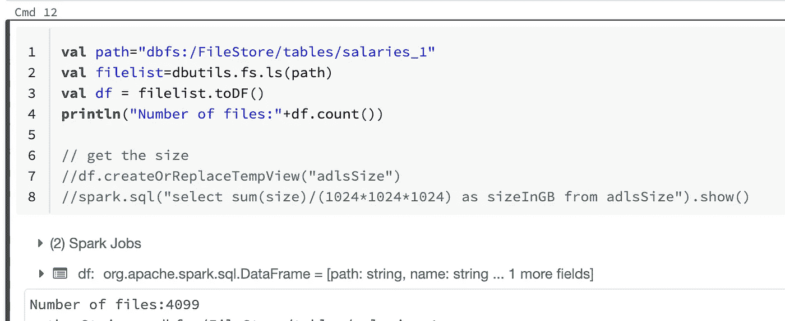
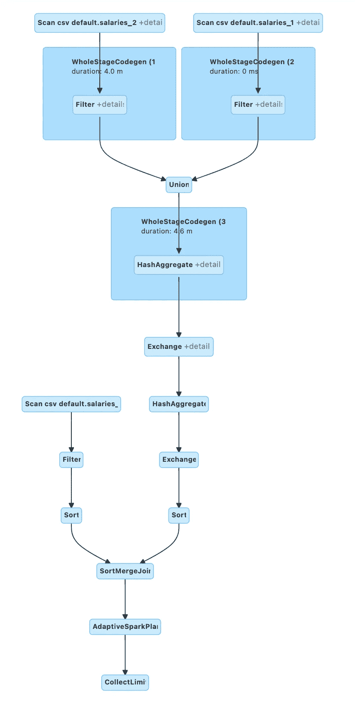

# 火花桶并不像看起来那么简单

> 原文：<https://medium.com/analytics-vidhya/spark-bucketing-is-not-as-simple-as-it-looks-c74f105f4af0?source=collection_archive---------1----------------------->

[@shawnanggg](https://unsplash.com/@shawnanggg?utm_source=medium&utm_medium=referral) 在 [Unsplash](https://unsplash.com?utm_source=medium&utm_medium=referral) 上的照片

分区和分桶是我们在 Hive 和 Spark 中最常用的优化技术。

在这篇博客中，我将特别谈论木桶理论以及如何使用它。

仅当满足给定的情况时，分桶才起作用。我们将讨论这些以及如何最大限度地利用木桶理论。

# 什么是 bucketing？

在 Spark 和 Hive 中，桶是一种优化技术。我们提供了需要对数据进行分区的列。

我们需要确保满足分桶条件，以获得最大收益。当它被恰当地应用时，它将通过避免洗牌来改善连接，洗牌是 Spark 中的一个痛点。

# Spark 中 bucket Tables 的优势

以下是 Spark 中存储(集群)的一些优点:

*   我们可以根据给定的列对数据进行分区
*   使用预混存储桶表时的优化连接。
*   数据的均匀分布。
*   最佳访问和查询改进。

# 火花桶和蜂巢桶有什么不同

配置单元存储与火花存储不兼容。

Hive 使用 Hive 散列函数创建桶，而 Spark 使用 Murmur3。因此，当我们将 Hive 桶形表与 Spark 桶形表连接时，这里会有一个额外的交换和排序。

在 Hive 中，它需要减少要创建的文件数量。

但是在 Spark bucketing 中，我们没有缩减器，所以它最终会根据任务的数量创建 N 个文件。

我们倾向于认为，当我们将存储桶的数量定义为 1024 时，文件的数量应该是 1024。

但 Spark 却不是这样。

在 Spark 中，向表中插入数据时关联的每个任务将乘以 1024 个桶。

例如在我们的例子中，

我们有 4 个任务正在运行。

So 4(任务)* 1024(时段数)= 4099

根据上面的计算，它创建的文件数量是:~4096

在 spark 中使用 bucketing 时，我们需要非常小心。

如果任务数量呈指数增长，最终可能会创建数百万个文件。

# 火花放电的限制

Spark 分桶有其自身的局限性，当我们创建分桶表并将它们连接在一起时，我们需要非常小心。

为了优化连接并利用 Spark 中的分桶，我们需要确保以下几点:

1.  **两张桌子都装了相同数量的桶。**如果连接表中的桶号不同，则不会应用预洗牌。
2.  为了连接，两个表被存储在同一列上。由于数据是基于给定的分桶列进行分区的，如果我们不使用相同的列进行连接，您就没有利用分桶，这会影响性能。

让我们用分桶表和非分桶表的各种条件运行一些测试，看看 Spark 将如何表现和应用交换/洗牌的查询计划。

我们的目标是减少洗牌/交换，并使用预洗牌来加入牌桌。

**测试 1:连接两个表，其中一个表被存储，另一个没有**

薪水:*在 ID 上分桶*有 1024 个桶

default . salary _ temp:*非分桶*表

让我们看一下查询计划。

这里我们可以清楚地看到，表中有一个未分桶的交换。现在，由于表的大小很小，它得到了广播。

我们可以确认 Spark 必须运行交换操作来连接分桶表和非分桶表。

**测试 2:用相同数量的桶连接 bucked 列上的两个 bucked 表**

default.salaries_1:在 Id 列上分桶，有 1024 个桶

default.salaries_2:在 Id 列上分时段，有 1024 个时段

这里可以清楚地看到，没有交换，它应用了 SortMergeJoin。在准备物理规划时，catalyst optimiser 意识到这两个表都已经分区，不需要对数据进行混排。

这是最好的情况，也是我们的目标。

**测试 3:在非分桶列上连接 2 个分桶表**

default.salaries_1:按 Id 分桶，有 1024 个桶

default.salaries_2:按 Id 分桶，有 1024 个桶

*但是我们将把表与列****EmployeeName****连接起来。*

这里我们可以清楚地看到，在表上应用了交换和广播散列连接。

尽管这些表在同一列上存储了相同数量的存储桶，但还是出现了混乱。因为连接列不同。

**测试 4:连接具有不同桶数的两个表**

default.salaries_1:按 Id 分桶，有 1024 个桶

default.salaries _ 3:按 Id 分时段，有 1500 个时段

尽管这两个表是分桶的，并且在同一列上，但是还是有数据交换。

当存储桶编号不同时，需要对其中一个存储桶表进行交换。

**测试 5:联合分桶表，然后连接**

default.salaries_1:按 Id 分桶，有 1024 个桶

default.salaries_2:按 Id 分桶，有 1024 个桶

这两个表都在 Id 列上分桶，并且具有相同的桶数。

在这里，我们将在加入之前运行 UNION。

将薪金 _1 与薪金 _2 结合，然后与薪金 _1 结合。

在应用 union 时，outputPartitioning 和 OutputOrdering 将被设置为 unknown，因为 spark 将在 UNION 之后和 join 之前引入交换。

尽管本例中涉及的表使用相同数量的桶存储在同一列上，但是 Spark 必须引入 shuffle 操作，因为存在 UNION。

**经验教训:**

充分利用分桶表。

1.  让两张桌子都成桶形。
2.  两个表中的桶数应该相同。
3.  两个表中的分桶列应该匹配。
4.  Spark 存储桶与 Hive 存储桶不兼容，它会引入额外的排序。
5.  注意任务的数量，因为这会影响 spark bucketing 中创建的文件数量。

我希望这篇博客对你有所帮助，帮助你理解火花桶以及它是如何在引擎盖下工作的。同时如何有效地利用火花放电。

你可以在我的 GitHub repo 中找到上述代码的 DBC 文件:

 [## ajithshetty/SparkBucketing

### 在 GitHub 上创建一个帐户，为 ajithshetty/SparkBucketing 的发展做出贡献。

github.com](https://github.com/ajithshetty/SparkBucketing) 

**阿吉特·库玛尔·谢蒂**

大数据工程师—热爱大数据、分析、云和基础设施。

[订阅](https://ajithshetty28.medium.com/subscribe) ✉️ || [更多博客](https://ajithshetty28.medium.com/)📝|| [链接在](https://www.linkedin.com/in/ajshetty28)📊|| [个人资料页面](https://ajithshetty.github.io/)📚|| [Git 回购](https://github.com/ajithshetty/)👓

**订阅我的:** [**每周简讯刚好够数据**](https://justenoughdata.substack.com/)