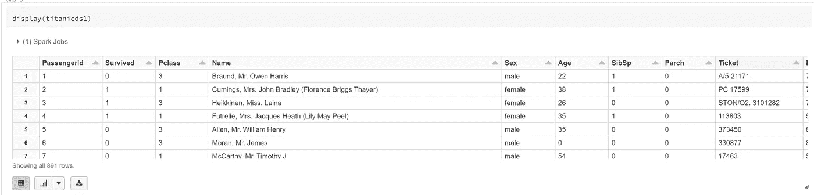
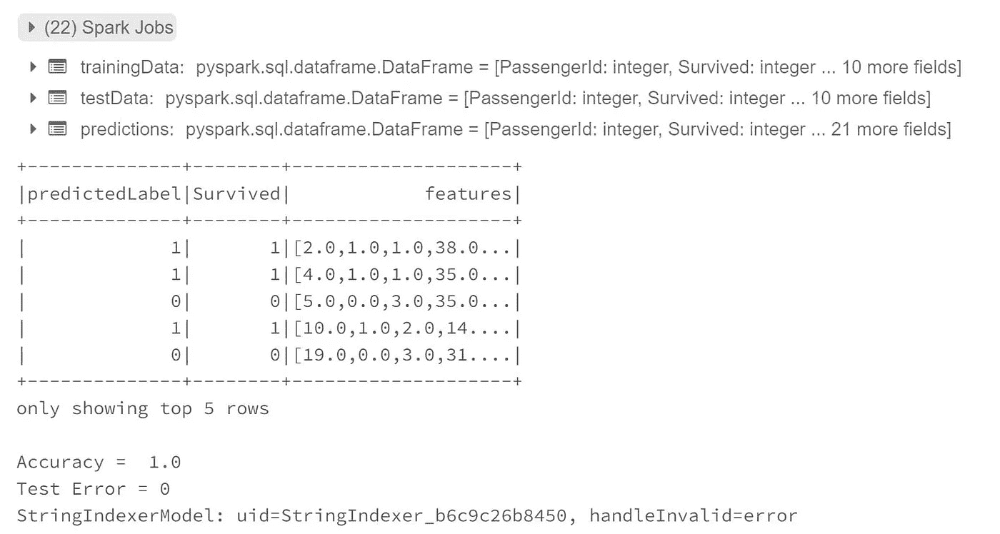

# 预测泰坦尼克号幸存者的火花分类模型

> 原文：<https://medium.com/analytics-vidhya/spark-classification-model-to-predict-titanic-survivors-e91ab1685f2e?source=collection_archive---------7----------------------->

# Spark 码预测分类实用数据集——泰坦尼克号幸存者数据集

# 用例

*   使用泰坦尼克号数据集
*   数据集位于名为 Titanic.csv 的文件夹中
*   将数据集上传到 Azure 存储

# 先决条件

*   Azure 帐户
*   Azure 存储帐户
*   创建一个名为 titanic 的容器，并将 Titanic.csv 文件上传到容器
*   创建 Azure 数据块资源
*   创建 azure 密钥库
*   将主键存储到秘密中
*   将密钥库配置为 azure 数据块

# 密码

*   首先让我们包括库

```
from pyspark.ml import Pipeline
from pyspark.ml.classification import RandomForestClassifier
from pyspark.ml.feature import IndexToString, StringIndexer, VectorIndexer
from pyspark.ml.evaluation import MulticlassClassificationEvaluator
from pyspark.sql import functions as f
```

*   从 keyvault 加载机密

```
storagekey = dbutils.secrets.get(scope = "allsecrects", key = "storagekey")
```

*   现在配置存储帐户

```
spark.conf.set(
  "fs.azure.account.key.storageaccountname.blob.core.windows.net",
  storagekey)
```

*   现在加载数据

```
titanicds = spark.read.option("header","true").option("inferSchema", "true").csv("wasbs://titanic@storageacctname.blob.core.windows.net/Titanic.csv")
```

*   显示数据集

```
display(titanicds)
```



*   显示数据集的架构

```
display(titanicds.printSchema())
```

*   只有 5 列应为字符串，其余所有列应为数字
*   为空值填充 0

```
titanicds1 = titanicds.na.fill(0)
display(titanicds1)
```


*   将所有分类列转换为字符串索引

```
categoricalColumns = [item[0] for item in titanicds1.dtypes if item[1].startswith('string') ]
```

*   用所有其他数字列创建一个列名

```
featurescol = ["PassengerId", "Survived", "Pclass", "Age", "SibSp", "Parch", "Fare"]
```

*   创建阶段
*   我们将组合字符串索引器和数字列来形成组合特征

```
stages = []
#iterate through all categorical values
for categoricalCol in categoricalColumns:
    #create a string indexer for those categorical values and assign a new name including the word 'Index'
    stringIndexer = StringIndexer(inputCol = categoricalCol, outputCol = categoricalCol + 'Index')

    #append the string Indexer to our list of stages
    stages += [stringIndexer]
```


*   现在创建标签索引器
*   为数字数据创建向量汇编程序。
*   将所有这些添加到阶段
*   训练模型
*   用测试数据预测模型
*   打印精确度

```
labelIndexer = StringIndexer(inputCol="Survived", outputCol="indexedLabel").fit(titanicds1)

#assembler = VectorAssembler(inputCols=featurescol, outputCol="features")
assembler = VectorAssembler(inputCols=featurescol, outputCol="features")

#featureIndexer = VectorIndexer(inputCol="features", outputCol="indexedFeatures", maxCategories=4).fit(titanicds1)

(trainingData, testData) = titanicds1.randomSplit([0.7, 0.3])

# Train a RandomForest model.
rf = RandomForestClassifier(labelCol="indexedLabel", featuresCol="features", numTrees=10)

# Convert indexed labels back to original labels.
labelConverter = IndexToString(inputCol="prediction", outputCol="predictedLabel",
                               labels=labelIndexer.labels)

# Chain indexers and forest in a Pipeline
#pipeline = Pipeline(stages=[labelIndexer, assembler, rf, labelConverter])
stages += [labelIndexer]
stages += [assembler]
stages += [rf]
stages += [labelConverter]

pipeline = Pipeline(stages=stages)

# Train model.  This also runs the indexers.
model = pipeline.fit(trainingData)

# Make predictions.
predictions = model.transform(testData)

# Select example rows to display.
predictions.select("predictedLabel", "Survived", "features").show(5)

# Select (prediction, true label) and compute test error
evaluator = MulticlassClassificationEvaluator(
    labelCol="indexedLabel", predictionCol="prediction", metricName="accuracy")
accuracy = evaluator.evaluate(predictions)
print("Accuracy = ", accuracy)
print("Test Error = %g" % (1.0 - accuracy))

rfModel = model.stages[2]
print(rfModel)  # summary only
```

*   输出



原文[samples 2021/titanic sample . MD at main balakreshnan/samples 2021(github.com)](https://github.com/balakreshnan/Samples2021/blob/main/SparkML/titanicsample.md)