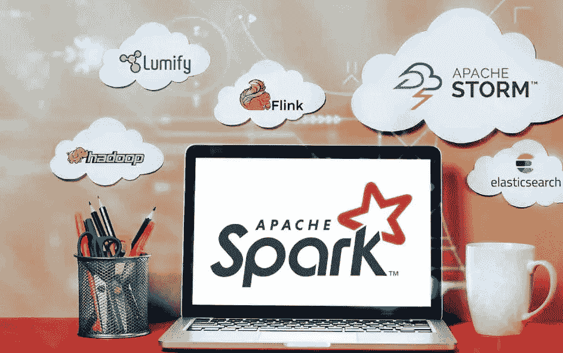

# 火花深潜——创世纪(上)

> 原文：<https://medium.com/analytics-vidhya/spark-deep-dive-the-genesis-part-1-a81987fa9b7f?source=collection_archive---------7----------------------->

# 介绍

自从第一个 1.x 版本发布以来，Spark 就成为了事实上的大数据统一处理引擎。由于 Spark 的速度、易用性、模块化和可扩展性，10 家公司中有 9 家选择 Spark 进行数据处理。本系列文章的目的是:

*   向您介绍大数据的发展以及 Spark 是如何诞生的。