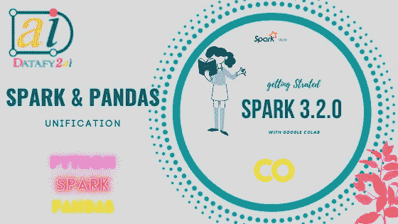

# 星火和熊猫统一的新时代

> 原文：<https://medium.com/analytics-vidhya/spark-pandas-unification-148d70c001ff?source=collection_archive---------0----------------------->

## 实用指南:SPARK 3.2.0

## Pyspark 和熊猫

作者图片

大多数数据科学家或机器学习工程师在转到其他库之前都是从 Pandas 和 Numpy 开始的。没有人可以围绕使用 Pandas 作为标准数据处理库展开辩论。使用熊猫有很多好处，但熊猫应用程序的一个关键瓶颈是…