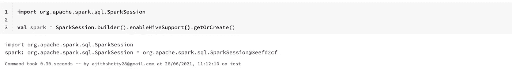
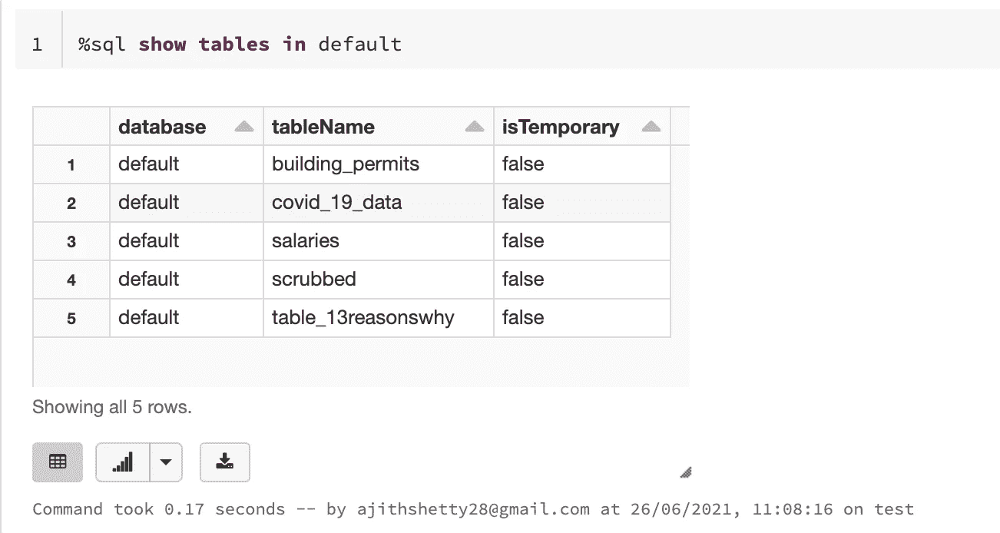
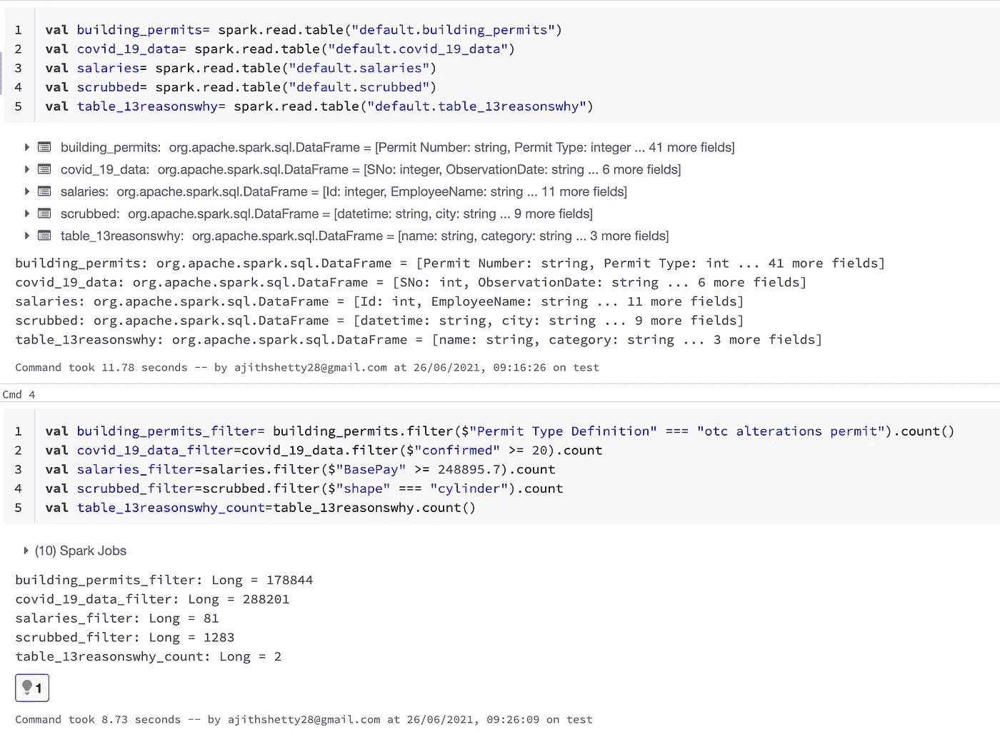
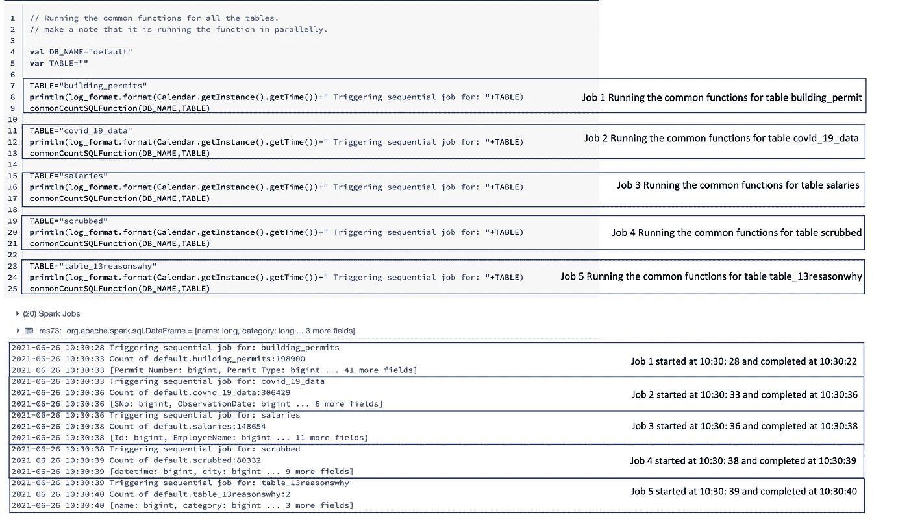
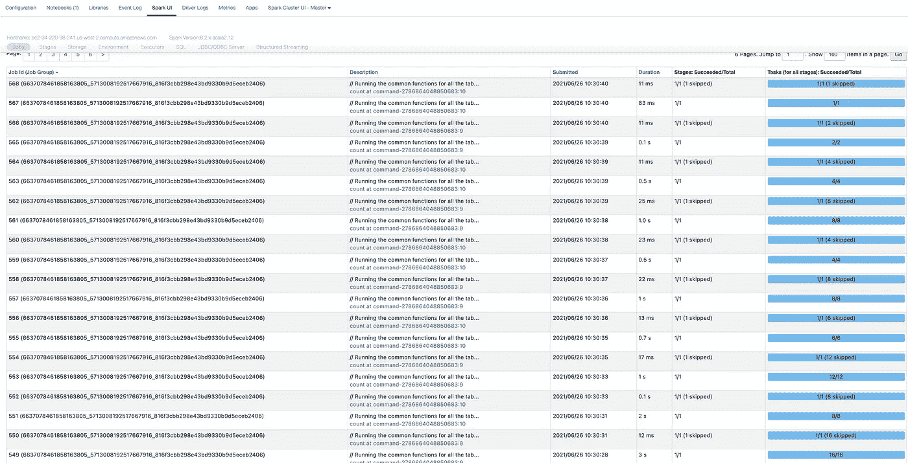
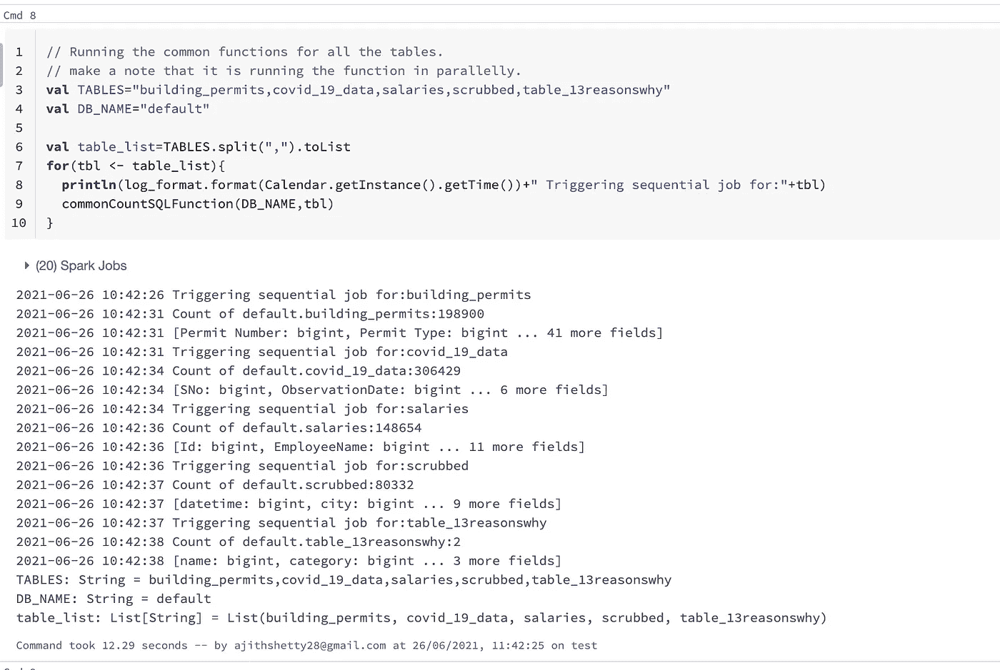
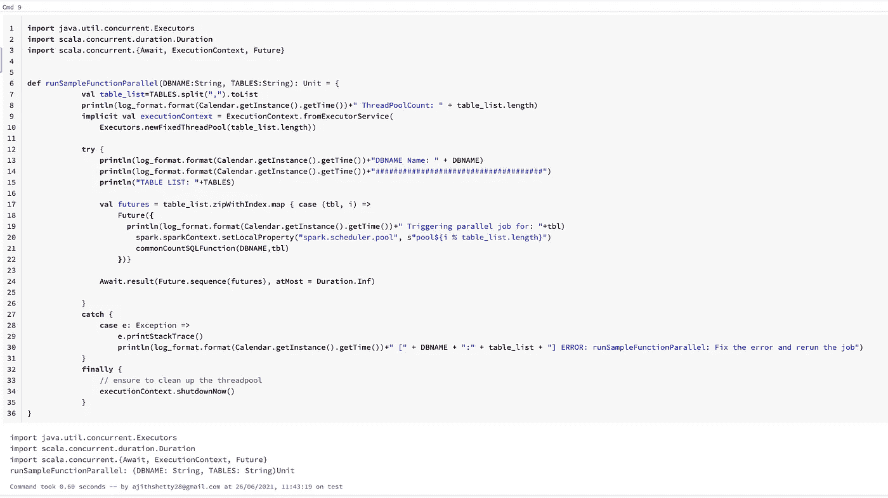
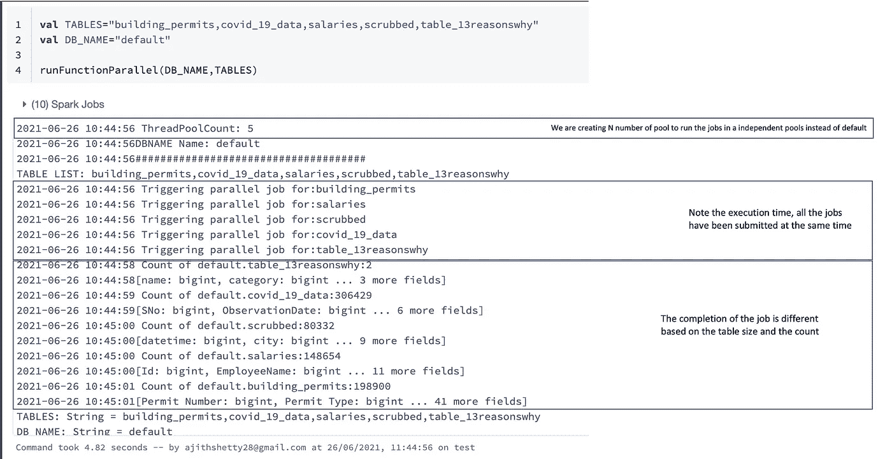
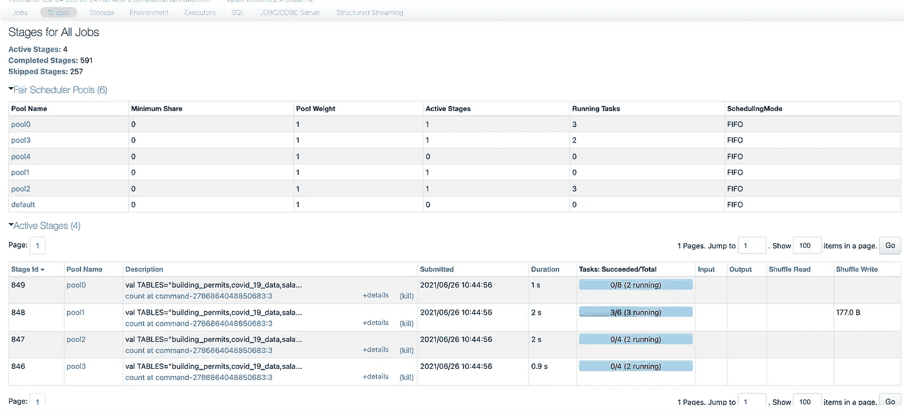
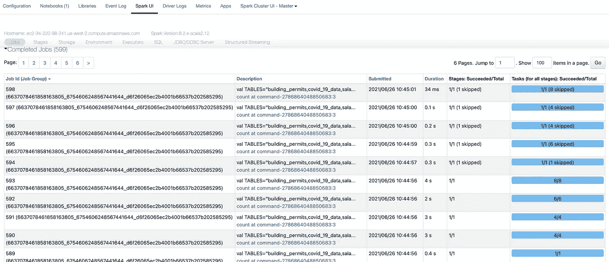

# 火花，并行化并行作业

> 原文：<https://medium.com/analytics-vidhya/spark-parallelising-the-parallel-jobs-77b819314d5a?source=collection_archive---------2----------------------->


在 [Unsplash](https://unsplash.com?utm_source=medium&utm_medium=referral) 上由[手工摄影](https://unsplash.com/@artisanalphoto?utm_source=medium&utm_medium=referral)拍摄

“并行化并行作业”到底是什么意思？？

不深入研究，用外行人的话来说，

Spark 根据我们创建 RDD、应用转换和动作的顺序创建 DAG 或沿袭。

它在数据帧或数据集上应用 Catalyst 优化器来优化您的查询。但是它**没有做的**是，彼此并行地运行你的功能。

我们总是倾向于认为 Spark 是一个框架，它将你的工作分成任务和阶段，并且并行运行。在某种程度上，这是 100%真实的。但不是以我们下面将要讨论的方式。

假设我有 10 个表，我需要对它们应用相同的函数，例如 **count，计算空值的数量，打印最上面的行，等等。**

因此，在这里，如果我提交 10 个表的作业，它会并行运行吗，因为这 10 个表是相互独立的？？？

Spark 足够聪明，能够找出依赖关系并并行运行，不是吗？

不完全是。

**演示时间**

**步骤 1:** 初始化 Spark 会话



**步骤 2:** 用样本记录创建虚拟表

对于这个例子，我使用了 **kaggle** 数据集并创建了表格

[https://www.kaggle.com/datasets](https://www.kaggle.com/datasets)



**步骤 3:** 测试数据和计数的示例命令



**步骤 4:** 创建一个通用函数，其中包含一些适用于所有给定表的转换


**步骤 5:** 对独立表执行相同的功能

在这里，您可以看到作业已经按顺序**触发**，尽管它们之间没有依赖关系。



为了证实这一点，让我们看看 SPARK UI



所以作业是按顺序运行的。

让我们做同样的练习，但要循环进行



正如预期的那样，作业按顺序运行。

我们如何让 Spark 知道，按照我们的示例，给定的 10 个表之间没有依赖关系，并并行运行它们。

现在有趣的部分来了


**Scala 并发**

[https://docs . Scala-lang . org/overviews/Scala-book/futures . html](https://docs.scala-lang.org/overviews/scala-book/futures.html)

根据官方文件，以下是从 Scaladoc 对**未来**的描述:

```
“A Future represents a value which may or may not currently be available, but will be available at some point, or an exception if that value could not be made available.”
```

**执行上下文**

```
An ExecutionContext can execute program logic asynchronously, typically but not necessarily on a thread pool.
A general purpose ExecutionContext must be asynchronous in executing any Runnable that is passed into its execute-method. A special purpose ExecutionContext may be synchronous but must only be passed to code that is explicitly safe to be run using a synchronously executing ExecutionContext.
```

**等待**

```
Await is what is used to ensure proper handling of blocking for Awaitable instances.
While occasionally useful, e.g. for testing, it is recommended that you avoid Await when possible in favor of callbacks and combinators like onComplete and use in for comprehensions. Await will block the thread on which it runs, and could cause performance and deadlock issues.
```

**a. Await.ready**

```
Await the “completed” state of an Awaitable.
```

b . wait . result

```
Await and return the result (of type T) of an Awaitable.
Params:
awaitable — the Awaitable to be awaited
atMost — maximum wait time, which may be negative (no waiting is done), **Duration.Inf** for unbounded waiting, or a finite positive duration
Returns:
the result value if awaitable is completed within the specific maximum wait time
```

让我们使用 Scala 并发来尝试 spark 并行



让我们看看我们在代码块中做了什么。

1.  [第 9 行]初始化执行上下文来定义我们的任务需要运行的线程数量。在我们的例子中，它是表的数量。
2.  [第 17 行]创建一个未来列表。
3.  [第 18 行]并传递表名列表，为每个表定义线程池名并给出应该运行的函数名[第 21 行]。
4.  [第 24 行]获取未来列表并运行 Await.result，这将触发所有线程，并等待最长时间(Duration.inf)以返回结果。
5.  [第 34 行]最后关闭执行上下文。

让我们执行并查看输出。



见鬼去吧。！这些作业是彼此并行触发的。

我们创建了 5 个线程池，在每个线程池中运行作业。

查看同时提交的日志“触发并行作业”

由于表的计数不同，作业在不同的时间完成。

让我们验证 SPARK UI



在这里，我们可以看到它创建了 5 个不同的池(0 到 4)，并彼此并行运行作业。

查看提交的时间，确保他们同时感到疲劳。

在作业页面中再次确认。

从底部检查，我们可以看到所有的作业同时提交。



希望你喜欢这个演示和解释。

你可以在我的 github repo 中找到上面的笔记本(DBC 文件)。

[](https://github.com/ajithshetty/SparkParallelism) [## ajithshetty/spark 并行度

### 通过在 GitHub 上创建一个帐户，为 ajithshetty/SparkParallelism 开发做出贡献。

github.com](https://github.com/ajithshetty/SparkParallelism) 

你可以在评论中发表你的反馈。

阿吉特·库玛尔·谢蒂

大数据工程师—热爱大数据、分析、云和基础设施。

[订阅](https://ajithshetty28.medium.com/subscribe) ✉️ || [更多博客](https://ajithshetty28.medium.com/)📝|| [链接于](https://www.linkedin.com/in/ajshetty28)📊|| [个人资料页面](https://ajithshetty.github.io/)📚|| [Git 回购](https://github.com/ajithshetty/)👓

**订阅我的:** [**每周简讯刚好够数据**](https://justenoughdata.substack.com/)