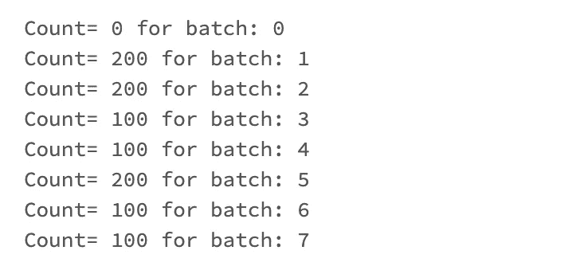

# 火花会议和单例误解

> 原文：<https://medium.com/analytics-vidhya/spark-session-and-the-singleton-misconception-1aa0eb06535a?source=collection_archive---------1----------------------->

## 关于 Spark 会话，结构化流揭示了什么


照片由 pix abay:[https://www . pexels . com/photo/黄黑蝴蝶-cocoon-39862/](https://www.pexels.com/photo/yellow-and-black-butterflies-cocoon-39862/)

# 为什么要在乎呢？

在过去的 Spark 中，Spark 应用程序的入口点是`SparkContext`，根据 Spark 源代码注释，它“*表示到 Spark 集群的连接，可用于在该集群上创建 rdd、累加器和广播变量*。从 Spark 2.0 开始，引入了一个新的入口点，叫做`SparkSession`。Spark 会话是访问大多数 spark 功能的首选方式，特别是关注 SQL API 之类的高级 API，而不是低级 RDD API。

乍一看，Spark session 听起来像是一个单例，似乎整个应用程序只有一个实例，不管你如何获取指向那个会话的指针。有时你只是使用`spark`变量，有时你从一个数据帧变量中得到它，但在所有情况下都是一样的。


作者图片

从上面的截图可以看出，无论是使用著名的`spark`变量还是从数据帧中获取，变量 address 和`sessionUUID`属性都是相同的。

你认为这种模式是普遍的吗？或者换句话说，Spark session 是单一的吗？

很长一段时间，我认为是的，它是一个单一的，在大多数情况下，你甚至不关心它的性质。但我最近遇到了一个案例，证明我是错的，那就是 Spark 结构化流。


[https://imgflip.com/i/6a6mit](https://imgflip.com/i/6a6mit)

让我们试试这个片段，它使用`foreachBatch`在流微批处理上运行批处理操作。

这是结果。


作者图片

全局`spark`变量和连接到微批处理数据帧的 Spark 会话之间的会话存储器地址和 UUID 属性不同。但是为什么会发生这种情况，以及它会如何影响您的代码呢？

# 先问为什么！

在对源代码(我使用的 Spark 版本是 3.2.1)进行了一番挖掘之后，我在一个名为`StreamExecution.scala`的文件中找到了[这一行](https://github.com/apache/spark/blob/v3.2.1/sql/core/src/main/scala/org/apache/spark/sql/execution/streaming/StreamExecution.scala#L196)。

```
/** Isolated spark session to run the batches with. */
private val sparkSessionForStream = sparkSession.cloneSession()
```

**提示:**如果你使用 Databricks，那么你会发现它们的 Spark 实现与 GitHub 上的开源 Spark repo 并不完全相同。

我首先检查了`SparkSession`类，看看它是如何构造的，然后发现了一个`cloneSession`方法，它似乎是从一个位置调用的，并且是流执行文件。这里的克隆意味着运行流代码的 Spark SQL API 代码将有一个独立的会话。该会话将从根 Spark 会话继承状态，但它将独立工作，因为它需要实施一些可能不同于根会话配置的行为。

例如，似乎必须对流式处理禁用自适应查询执行。

```
// Adaptive execution can change num shuffle partitions, disallow        sparkSessionForStream.conf.set(SQLConf.ADAPTIVE_EXECUTION_ENABLED.key, "false") // Disable cost-based join optimization as we do not want stateful operations        
// to be rearranged        sparkSessionForStream.conf.set(SQLConf.CBO_ENABLED.key, "false")
```

很好，现在我们知道每个应用程序可以有多个会话，并且每个会话可以有不同的配置。这用于结构化流 API，但也可用于用户应用程序代码，并且有两个公共 API(new session 和 cloneSession)允许您创建新会话。多个会话可以在映射到单个 SparkContext 的同一个 Spark 应用程序中愉快地生活。


上面显示的两个会话有不同的内存地址，但是它们绑定到同一个 SparkContext。它们仍可用于创建数据帧，一般来说，其行为类似于根`spark`会话，尽管如果需要，它们可以有不同的配置设置。

# 但是我为什么需要关心呢？


[https://imgflip.com/i/6a6oc3](https://imgflip.com/i/6a6oc3)

嗯，有时候你可能需要关心。首先，知道一些新的东西，在你的工具箱里有一个新的工具，或者知道事情如何在引擎盖下工作是很好的。如果这还不够，让我们看看这个使用 PySpark 编写的案例，原因我稍后会提到。

上述操作将失败，并出现错误`Table or view not found: microBatch`。在上面的代码片段中，假设我们需要使用 SQL 语句来运行一些逻辑，例如 MERGE 语句。是的，它可以使用函数式 API 来完成，但有时编写 SQL 代码更具可读性。

在 PySpark 中，至少在 3.2.1 版之前，DataFrame 实例上没有`sparkSession`属性(顺便说一下，Scala 有)。所以另一个选择是使用`df.sql_ctx`属性，它可以指向一个 Spark 会话，但不幸的是，它似乎指向了根 Spark 会话。这就是我们得到该错误消息的原因，因为`microBatch`临时视图是在流微批处理的会话上注册的，而第 3 行的 SQL 语句是针对根 Spark 会话运行的，因此该视图在那里是不可见的。

如果你在谷歌上搜索"**spark streaming for each batch createOrReplaceTempView**":你可能会从 Databricks 网站上得到一个带有[这样代码的笔记本](https://docs.databricks.com/_static/notebooks/merge-in-streaming.html)。

```
# NOTE: You have to use the SparkSession that has been used to define the `updates` dataframe

microBatchOutputDF._jdf.sparkSession().sql("""
    MERGE INTO aggregates t
    USING updates s
    ON s.key = t.key
    WHEN MATCHED THEN UPDATE SET *
    WHEN NOT MATCHED THEN INSERT *
  """)
```

嗯，这通过使用`microBatchOutputDF._jdf.sparkSession()`方法解决了问题。评论中提到使用 **SparkSession** 来定义`updates` DataFrame，但是它非常模糊。另外，在 Python 中使用以下划线开头的方法不是很习惯/推荐，因为它们被认为是私有的。

实际上，如果你检查[数据帧](https://spark.apache.org/docs/latest/api/python/reference/api/pyspark.sql.DataFrame.html)的 PySpark 文档，你不会找到一个叫做`_jdf`的公共属性，也不会找到一个`sql_ctx`。我仍然更喜欢`sql_ctx`方法，因为它以一种火花自然的方式表现。如果您从 SQL 语句中收集一些记录，您将得到一个由`Row`元素组成的数组。


作者图片

使用`_jdf`做同样的事情会产生 Java 对象，这很奇怪，或者至少不太自然，如果你使用类型注释并使用像 VS 代码这样的 IDE 开发的话。


作者图片

# 短期解决方案

回到我们的流问题，针对正确的 Spark 会话运行 SQL 语句的解决方案是什么？

最简单的解决方案是使用全局临时视图。只要名称在 SQL 语句中带有前缀`global_temp.`，就可以从任何 Spark 会话中访问该视图。

这里的主要区别在第 2 行和第 3 行。该视图在第 2 行被创建为全局临时视图。在第 3 行，使用根 Spark 会话访问视图，但是必须加上前缀`global_temp.`。一旦这样做了，事情就不会有任何错误了。



作者图片

使用`sql_ctx`并不是真正的最佳选择，但它比`_jdf`方法要好得多。

# 长期解决方案

Spark 背后的社区意识到了`DataFrame`的 PySpark 接口中的这些限制，以及当它没有真正匹配 Scala 等效 API(具有到 Spark 会话的简单接口)时，它如何使开发人员生活艰难。这就是为什么有一个长期的解决方案，但它可能会伴随着下一个(希望是次要的)Spark 版本。

有一个名为[的 JIRA 问题，在 PySpark](https://issues.apache.org/jira/browse/SPARK-38121) 中使用 SparkSession 而不是 SQLContext。本期有一个最近[合并的 PR](https://github.com/apache/spark/pull/35410) ，描述如下:

> 本公关提议`SparkSession`在 PySpark 内部。这是尊重运行时配置等的基础工作。目前，我们在内部依赖旧的不推荐的`SQLContext`，它不能正确地尊重 Spark 会话的运行时配置。
> 
> 该公关还包含相关变更(以及该公关涉及的代码中的一点重构)，如下所示:
> 
> -像 Scala API 一样公开`DataFrame.sparkSession`。
> 
> -移动`SQLContext._conf`->-`SparkSession._jconf`。
> 
> -在`DataFrame.randomSplit`处将`rdd_array`重命名为`df_array`。
> 
> -发出警告，劝阻使用`DataFrame.sql_ctx`和`DataFrame(..., sql_ctx)`。

一旦这个 PR 在你使用的 Spark 安装上可用，更新代码和移除对`sql_ctx`的依赖就很容易了，而且我们不再需要使用全局临时视图了。下面将顺利工作(手指交叉)。

```
df.createOrReplaceTempView("microBatch")  
count = df.sparkSession.sql("select * from microBatch").count()
```

**2022 年 6 月 16 日更新:**

Spark 3.3 已经在 Databricks runtime 11.0 beta 上发布。因此 PySpark 数据帧有一个`SparkSession`属性。


# 这是所有的乡亲

这可能不是一个非常常见的用例，或者对您编写的应用程序产生巨大影响的东西。尽管如此，多了解一些关于 Spark session 的知识以及它在不同情况下的表现是非常有用的。它可能有助于诊断一个愚蠢的问题，甚至给你一个想法来写一个困难任务的创新解决方案。

希望有所帮助！🙂