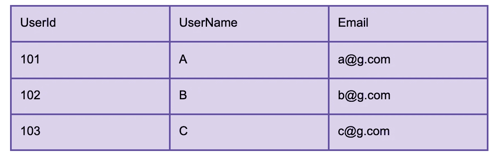
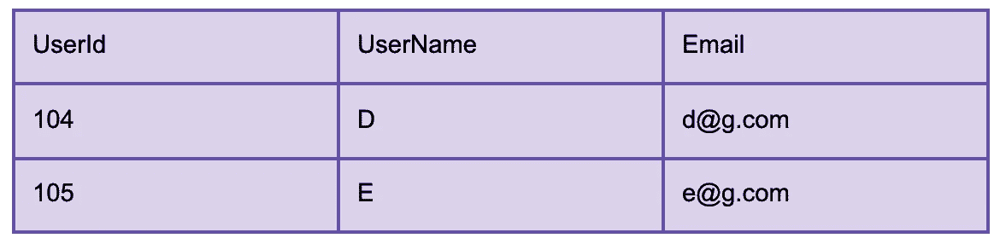
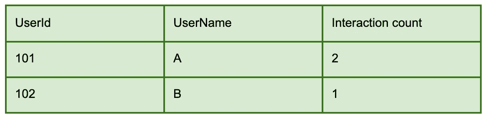
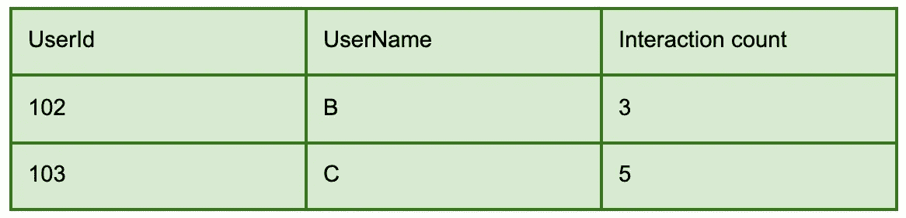
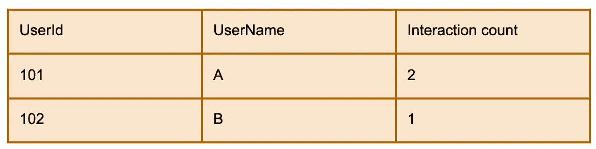
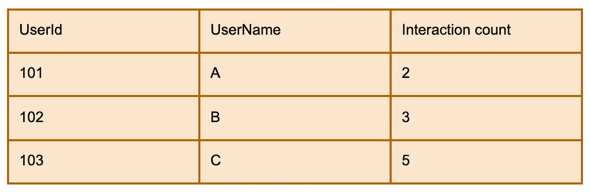

# 火花流输出模式

> 原文：<https://medium.com/analytics-vidhya/spark-streaming-output-modes-600c689b6bf9?source=collection_archive---------0----------------------->

火花流

Apache Spark Streaming 支持对来自 kafka 等数据源的数据流进行流处理，并将它们推送到 filesystem 等接收器。在这篇博客中，我们将关注 spark 流的输出模式。

输出模式决定了如何处理数据并将其推送到接收器。有三种输出模式:

**追加模式:**

它只将新的传入数据写入接收器。因此，当只需要插入新数据而不需要更新以前的数据状态时，可以使用这种方法。这是默认的输出模式。它不支持聚合操作，因为聚合依赖于旧数据。

下面是一个使用案例示例:

我们正在流式传输用户的注册数据。每当用户在网站上注册时，就会有一个事件被推送到 kafka。这个事件被 spark 流读取并放入结果表，结果表可以被 sink 读取。

假设用户 A、B 和 C 注册，他们的事件在同一个批处理中处理。数据输出到结果表中，如下所示。

追加模式—第一批

稍后，当用户 D 和 E 注册并且他们的事件在一个间隔之后被触发的下一批中被处理时，只有这些新事件被输出到结果表中。

附加模式—第二批

如我们所见，在这一批中写入的数据不涉及涉及用户 A、B 和 c 的旧数据。

但是，当应用水印时，聚合可以在事件时间列上发生。只有在水印时间过去后才会写入结果。

**更新模式:**

它包括写入新的或旧值被更新的数据记录。因此，当需要使用“上插”操作模式进行某些聚合时，可以使用这种模式。如果没有应用聚合，更新模式与追加模式的工作方式相同。

下面是一个使用案例示例:

我们想分析网站上的订婚。因此，每当用户在网站上进行一些特定的交互时，就会有一个事件被推送到 kafka。Spark streaming 从 kafka 读取数据，汇总每个用户的交互次数，并输出到结果表。

在这个用例中，假设我们只想为当前批处理中有交互的用户输出数据。输出模式必须设置为“更新”。

在第一批中，用户 A 在网站上进行了 2 次交互，用户 B 在网站上进行了 1 次交互。该批用户的交互计数数据输出如下:

更新模式—第一批

在第二批中，用户 B 在网站上进行了 2 次交互，用户 C 在网站上进行了 5 次交互。该批用户的交互计数数据输出如下:

更新模式—第二批

正如我们所看到的，在第二批中写入的数据没有来自用户 A 的数据。这是因为来自用户 A 的交互事件没有在第二批中出现。

如果应用水印，经过水印时间的数据的旧状态将被清除。

**完成模式:**

它包括再次写入完整的数据。这意味着每次将全部数据写入结果表时。因此，当需要覆盖所有以前的数据时，可以使用这种模式。仅当应用聚合时，才能使用此模式。

让我们以更新模式中使用的相同示例为例。需求的变化是，我们希望为所有有交互的用户输出数据；而不仅仅是当前批次中的用户。

在第一批中，用户 A 在网站上进行了 2 次交互，用户 B 在网站上进行了 1 次交互。该批用户的交互计数数据输出如下:

完整模式—第一批

在第二批中，用户 B 在网站上进行了 2 次交互，用户 C 在网站上进行了 5 次交互。该批用户的交互计数数据输出如下:

完整模式—第二批

正如我们所看到的，在第二批中写入的数据也包含来自用户 A 的数据，因为所有数据都写入了每一批。

感谢阅读！

**参考文献**:

[星火流媒体文件](https://spark.apache.org/docs/latest/structured-streaming-programming-guide.html)