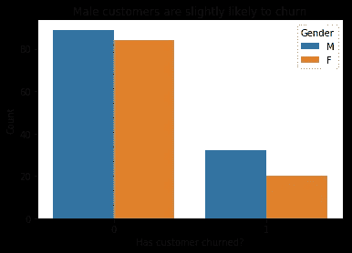

# Sparkify 流失分析

> 原文：<https://medium.com/analytics-vidhya/sparkify-churn-analysis-a8b6a60ffde9?source=collection_archive---------20----------------------->

Udacity 数据科学纳米学位的顶点项目。

# 项目概述

在本帖中，我们将为一家名为 **Sparkify** 的“公司”分析并构建一个客户流失模型。这家公司向客户提供音乐流媒体服务，就像 Spotify 或 Pandora 一样。

为了利用 **Spark，**我们需要在开始时建立一个 Spark 会话。通过使用本地集群，您也可以在没有实际服务器的情况下实现这一点。

你可以在我的 [GitHub](https://github.com/pato0301/sparkify_capstone_udacity) 中看到更详细的分析。

# 问题陈述

该项目的工作是从这些用户的行为数据中发现被搅动用户的特征，并采取措施尽早留住潜在的流失用户。

项目的难点在于交给模型训练的数据要一人一项。虽然我们的数据是行为数据，但我们需要从行为数据中提取用户特征，然后交给模型进行训练，得到结果。这些特征将从探索性数据分析和特征工程中产生。在结果不佳的情况下，该过程可以迭代多次，直到模型表现良好。

# **数据集**

提供的原始数据是应用程序跟踪的用户活动数据。该应用程序记录艺术家，歌曲，持续时间，用户信息，包括一些人口统计和地理数据，时间戳和其他相关信息。

有一个**页面**功能，它在我们的分析中起着重要的作用，因为它包含了用户在使用我们的应用程序的每个会话中查看位置的跟踪信息。

# **什么是客户流失？**

我们可以将客户流失定义为一个企业的客户不再购买或与该企业互动的现象。

在我们的例子中，当这个人点击取消确认时，我们得到一个客户流失。

# **有没有办法识别极有可能流失的用户？**

正如我们所看到的，我们可以说，在一般情况下，男性更容易流失。然而，这并不是一个很好的方式来判断一个人是否会流失。我们也可以看到，不倾听或不给予太多喜欢女性会转而更多地搅动。但是，这并不足以说明有人会流失，即使是，也只是针对女性群体。

# **我们可以从已经获得的数据中生成哪些特征？**

*   *用户参与度的衡量:*

自注册以来的时间，竖起/放下拇指的次数，添加到播放列表的歌曲数，添加的朋友数，每次会话收听的歌曲数。

*   *用户基本统计信息:*

性别。

# **如何选择模特？**

因为这是一个分类模型(我们需要将用户分类为流失或不流失)，我们尝试了 3 个不同的模型:

*   支持向量机
*   梯度增强树
*   随机森林。

# **选择指标**

为了评估和选择模型，我们选择了两个指标:

*   准确(性)
*   F1 分数。

然而，这最后一个对我们来说更重要。这是因为它给了我们一个简单的方法来衡量[、**精度**(我们是否将报价发送给了正确的人)和**召回**(我们是否错过了一个我们应该发送报价的型号](https://towardsdatascience.com/precision-vs-recall-386cf9f89488)。我们希望确定那些可能流失的客户，并为他们提供一些特别优惠以留住客户，但同时，我们不希望向那些不太可能流失的客户提供太多优惠(最有可能是金钱激励)，从而浪费金钱和资源。

# **最终型号**

我们将前面提到的 3 个模型中的每一个与基础模型进行比较，在基础模型中，我们将每个人都视为客户流失或每个人都不流失。

在对它们进行比较之后，最好的模型是随机森林，它给我们的准确度是 0.833，F1 值是 0.757。

在进行超参数调整后，我们获得了 0.788 的 F1 分数，比基本模型高 20%。

最后，我们可以通过下图看到模型中每个特征的权重:

从图表中，我们可以看到寿命实际上起着非常重要的作用。但这可能是有偏见的，因为那些搅动的人使用服务的时间肯定更短，因此，我们可能会重新考虑我们的模型或做一些转换来减少偏见。除此之外，拇指向下数、拇指向上数、添加的好友数和播放的平均歌曲数也起着重要作用。比如大量的拇指向下可能说明我们的服务无法正确的推荐歌曲给用户；添加的大量歌曲可能说明用户喜爱我们服务提供的歌曲。

你可以在 [**LinkedIn**](https://www.linkedin.com/in/patricio-villanueva/) 或者访问我的网站 [**Github**](https://github.com/pato0301) **与他联系。**