# Sparkify:使用 Apache Spark 预测用户流失

> 原文：<https://medium.com/analytics-vidhya/sparkify-predicting-the-user-churn-using-apache-spark-ee4178f859c8?source=collection_archive---------2----------------------->

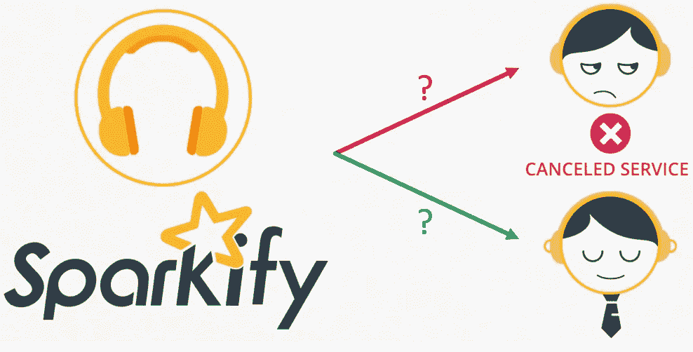

这个项目旨在预测一个名为 **Sparkify** 的虚拟数字音乐流媒体服务的用户流失

客户流失预测是业内最受欢迎的大数据用例之一，如果预测客户在不久的将来会流失，它可以帮助企业主动做出如何留住客户的决策，方法是针对客户开展促销活动，并给他们留下继续经营的理由。

我们将使用 **CRISP-DM** (数据挖掘的跨行业流程)的行业实践来分析、探索和建模我们的解决方案，我们将在以下部分解释该解决方案:

1.  **商业理解**
2.  **数据理解**
3.  **准备数据**
4.  **数据建模**
5.  **评估结果**
6.  **展开**

# 商业理解

Sparkify 是一项数字音乐流媒体服务，用户可以通过收听歌曲之间的广告或支付月订阅费来获得无广告体验。只要用户愿意，他们也可以决定从高级降级到免费，从免费升级到高级，甚至取消服务。

当用户从服务中取消时，就是我们表示用户已经改变的时候。

# **数据理解&数据准备**

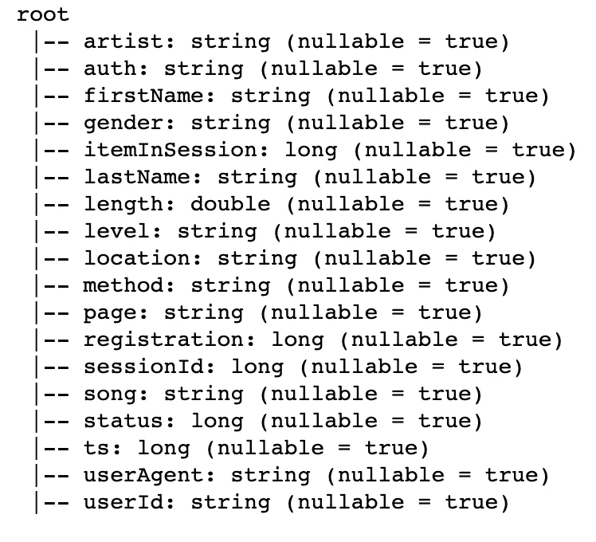

所提供的数据集基本上由平台上的每个用户操作的日志组成。每一个动作都标有一个特定的时间戳，即该动作发生的时间

在数据集中，我们有 691 个用户，有 543705 个事件

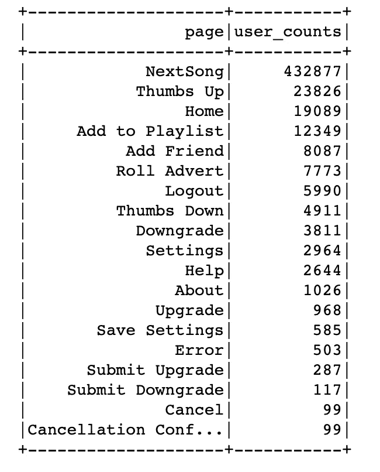

这些用户执行不同的操作，点击不同的页面，正如你在分布图中看到的，用户执行的大部分操作是点击下一首歌曲

也有用户升级/降级了他们的服务，然后也有 99 个用户取消了他们的服务，这 99 个用户将被标记为被搅动。

我们现在来看一下有过搅动的用户的一些方面，以及他们与没有搅动的用户的比较

我们将首先看一下与被搅动的用户相比，性别是如何分布的

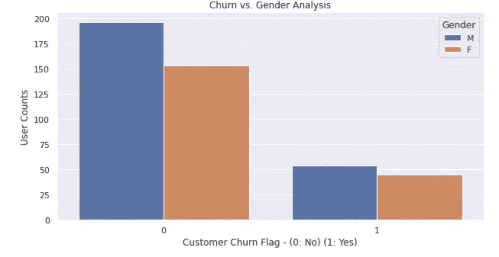

*男性顾客比女性顾客更容易流失*

我们现在来看一些指标，以及它们如何在活跃用户和不活跃用户之间进行比较

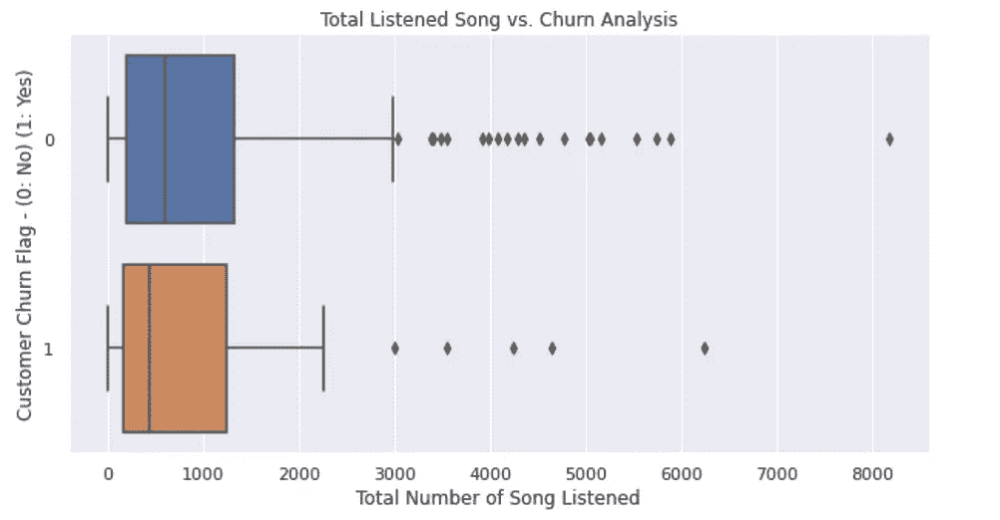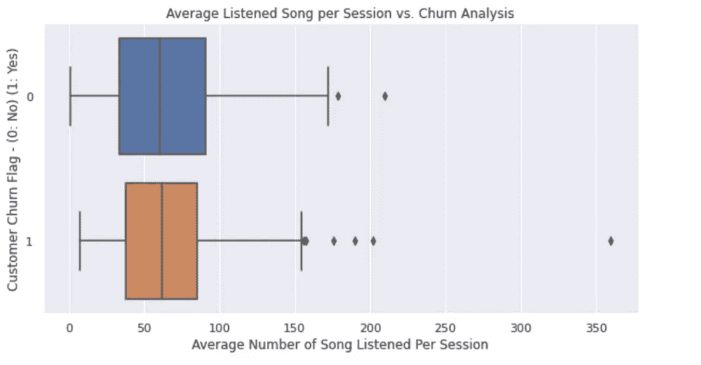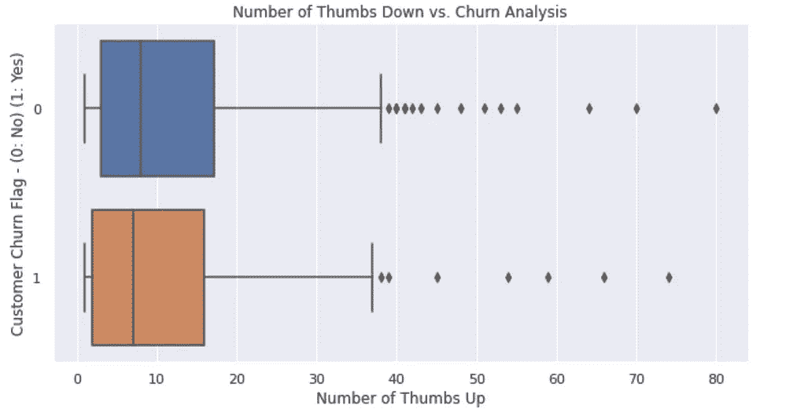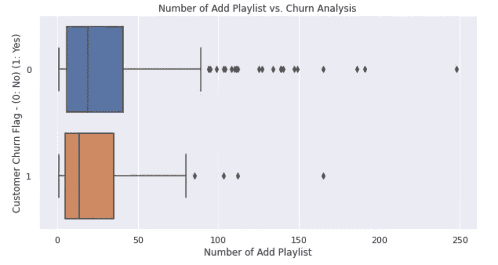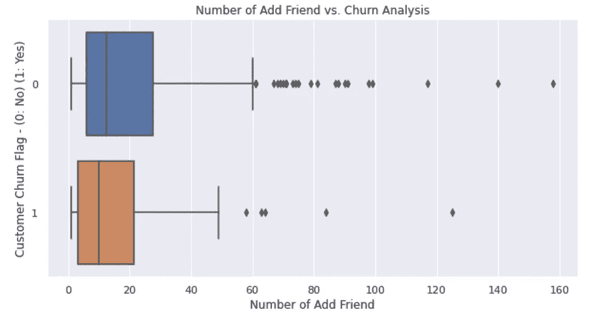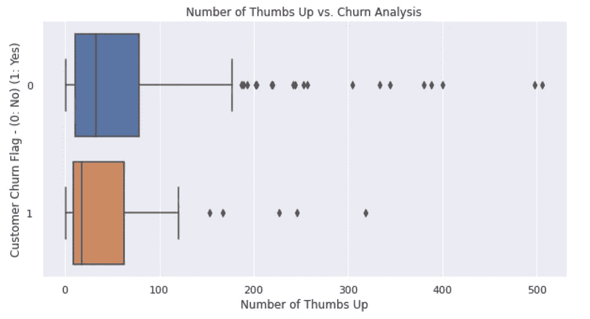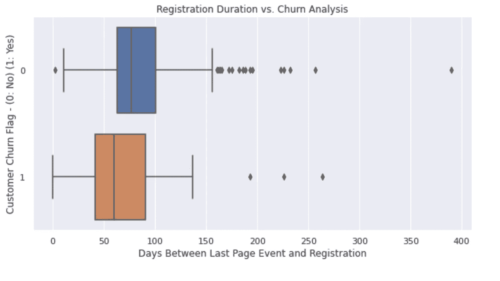

# **数据建模**

作为数据建模的一部分，在用户流失预测中识别并使用了 11 个特征，这些特征是:

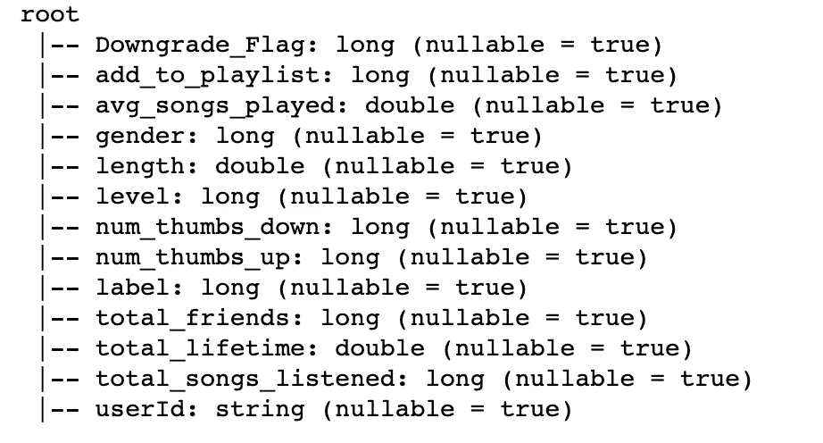

在上面的字段列表中， **userId** 被省略，性别和级别等分类变量被一键编码，因为它们都只有两个不同的值，所以它们被转换为二进制列。

诸如 **total_lifetime** (自注册以来的时间)、 **average_songs_played** (每次会话播放的平均歌曲数)等功能必须经过设计

```
*# Total time since registration*
total_lifetime = user_log_valid.select('userId', 'registration', 'ts').withColumn('total_lifetime', (user_log_valid.ts - user_log_valid.registration))\
    .groupBy('userId').agg({'total_lifetime' : 'max'})\
    .withColumnRenamed('max(total_lifetime)', 'total_lifetime')\
    .select('userId', (col('total_lifetime')/1000/3600/24).alias('total_lifetime'))
total_lifetime.show(5)*# Average songs played per session*
avg_song_played = user_log_valid.where('page == "NextSong"').groupby(['userId', 'sessionId']).count().groupby(['userId']).agg({'count':'avg'}).withColumnRenamed('avg(count)', 'avg_songs_played')
avg_song_played.show(5)
```

大多数其他功能都是按**用户 id**分组时的总和

**标签(用户流失)**和**降级**也是使用窗口函数计算的

在省略了 **userId** 和 **label** 变量后，使用 **VectorAssembler** 和 **StandardScaler** 对这些特征进行矢量化和缩放

```
*# Three ML algorithms will be used to build model and f1 score will be used to optimize.  These are*
*# 1\. Logistic Regression, 2\. Random Forest Classifier and 3\. Gradient Boosting Trees*
*# First of vectorize numerical variables in model data, transform them for feature pipeline.*
columns = []   
**for** field **in** model_data.schema.fields :
            columns.append(field.name)

columns.remove('label')
columns.remove('userId')
assembler = VectorAssembler(inputCols=columns, outputCol="num_features")
model_data = assembler.transform(model_data)

*# using standard scaler*
scaler = StandardScaler(inputCol="num_features", outputCol="features", withStd=**True**)
scalerModel = scaler.fit(model_data)
model_data = scalerModel.transform(model_data)
```

然后，最终矢量化、缩放的特征数据集被分成训练集、测试集和验证集，以执行模型的训练和评估。

```
*#Split the full dataset into train, test, and validation sets.* train, rest = model_data.randomSplit([0.6, 0.4], seed=42) validation, test = rest.randomSplit([0.5, 0.5], seed=42)
```

# **评估结果**

**混淆矩阵**是一个表格，通常用于描述一个分类模型对一组真实值已知的测试数据的性能。

**准确性**衡量分类器做出正确预测的频率。它是正确预测数与总预测数的比率:

`Accuracy = (True Positives + True Negative) / (True Positives + False Positives + True Negatives + False Negatives)`

精度告诉我们正确预测的比例实际上是正确的。它是真阳性与所有阳性的比率:

`Precision = True Positives / (True Positives + False Positives)`

**回忆(敏感度)**告诉我们实际上正确的预测中有多少被我们归类为正确的。它是真阳性与所有实际阳性预测的比率:

`Recall = True Positives / (True Positives + False Negative)`

**F-beta 评分**是一个同时考虑精确度和召回率的指标:

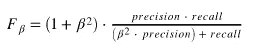

数据集不平衡的事实也意味着**精确度**没有太大帮助，因为即使我们获得高精确度，实际预测也不一定那么好。在这些情况下，通常建议使用**精确**和**召回**

让我们比较 3 个模型的结果:

*   **逻辑回归**
*   **随机福里斯特**
*   **梯度提升树**

1.  **逻辑回归**

```
*# 1\. Logistic Regression* 

*# initialize classifier, set evaluater and build paramGrid*
lr = LogisticRegression(maxIter=10)
f1_evaluator = MulticlassClassificationEvaluator(metricName='f1')
paramGrid = ParamGridBuilder().build()
crossval_lr = CrossValidator(estimator=lr, evaluator=f1_evaluator, estimatorParamMaps=paramGrid,numFolds=3)

*# Calculate time metric of model.* 
start_time = time()
cvModel_lr = crossval_lr.fit(train)
end_time = time()
cvModel_lr.avgMetrics
seconds = end_time- start_time

results_lr = cvModel_lr.transform(validation)

evaluator = MulticlassClassificationEvaluator(predictionCol="prediction")**Logistic Regression Metrics:
Accuracy of model is : 0.7443609022556391
F1 score of model is :0.6724855617304131
The training process of model took 13.907336235046387 seconds**
```

**2。随机森林**

```
*# 2\. Random Forest Classifier* 

*# initialize classifier, set evaluater and build paramGrid*
rf = RandomForestClassifier()
f1_evaluator = MulticlassClassificationEvaluator(metricName='f1')
paramGrid = ParamGridBuilder().build()
crossval_rf = CrossValidator(estimator=rf,estimatorParamMaps=paramGrid,evaluator=f1_evaluator,numFolds=3)

*# Calculate time metric of model.* 
start_time = time()
cvModel_rf = crossval_rf.fit(train)
end_time = time()
cvModel_rf.avgMetrics
seconds = end_time- start_time

results_rf = cvModel_rf.transform(validation)

evaluator = MulticlassClassificationEvaluator(predictionCol="prediction")**Random Forest Metrics:
Accuracy of model is : 0.7969924812030075
F1 score of model is :0.7585255822483037
The training process of model took 12.764495134353638 seconds**
```

**3。梯度增强树**

```
*# 3\. Gradient Boosting Trees*

*# initialize classifier, set evaluater and build paramGrid*
gbt = GBTClassifier(maxIter=10,seed=42)
f1_evaluator = MulticlassClassificationEvaluator(metricName='f1')
paramGrid = ParamGridBuilder().build()
crossval_gbt = CrossValidator(estimator=gbt,estimatorParamMaps=paramGrid,evaluator=f1_evaluator,numFolds=3)

*# Calculate time metric of model.* 
start_time = time()
cvModel_gbt = crossval_gbt.fit(train)
end_time = time()
cvModel_gbt.avgMetrics
seconds = end_time- start_time

results_gbt = cvModel_gbt.transform(validation)

evaluator = MulticlassClassificationEvaluator(predictionCol="prediction")**Gradient Boosted Trees Metrics: 
Accuracy of model is : 0.8270676691729323 
F1 score of model is :0.799474962304081 
The training process of model took 31.332529306411743 seconds**
```

**细化**

在这里，梯度增强树具有最好的 f1 值，这就是为什么我选择它用于下一步，通过让`ParamGridBuilder()`和`CrossValidator()`搜索所有参数，我将找到最好的超参数

```
*# Optimizing Hyperparameters in Random Forest Classification*
clf = GBTClassifier()
maxIter=[5,10,20]
maxDepth=[10,20]    
paramGrid = ParamGridBuilder().addGrid(clf.maxIter, maxIter).addGrid(clf.maxDepth, maxDepth).build()       
crossval = CrossValidator(estimator = Pipeline(stages=[clf]),
                         estimatorParamMaps = paramGrid,
                         evaluator = MulticlassClassificationEvaluator(metricName='f1'),
                         numFolds = 3)

cvModel_gbt = crossval.fit(train)
predictions = cvModel_gbt.transform(test)

evaluator = MulticlassClassificationEvaluator(metricName='f1')
f1_score = evaluator.evaluate(predictions.select(col('label'), col('prediction')))
print('The F1 score is **{:.2%}**'.format(f1_score)) 

bestPipeline = cvModel_gbt.bestModel**The F1 score is 0.818
Best parameters : max depth:10, max Iter:5**
```

**特征重要性**

然后，我们在最终调整和优化的模型中发现特性的重要性

```
Feature_Importance_Scores = gbt_best_model.featureImportances.values.tolist()
Feature_Importance_df = pd.DataFrame({'Feature_Importance_Scores': Feature_Importance_Scores, 'Features': columns})
plt.title('Features Importance Scores of Gradient Boosted Trees Model')
sns.barplot(x='Feature_Importance_Scores', y='Features', data=Feature_Importance_df, color="blue")
```

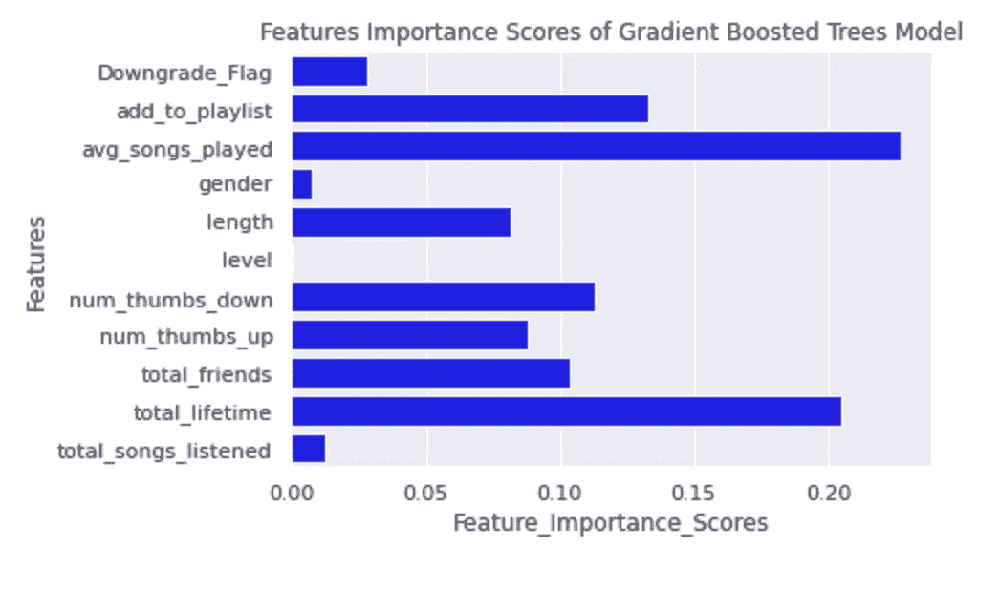

```
*We observe that register_duration (days) and average listened songs per session are top 2 most important features while predicting churn.*
```

# 部署

为了训练和部署模型，我们使用了 IBM Watson Studio，它让您可以在自由层中用有限的资源创建一个 Spark 环境，我利用它来探索、训练和评估我的模型。

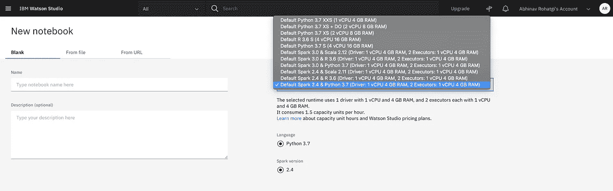

使用 Spark 2.4 和 Python 3.7 环境创建一个项目

该环境由一个 Apache Spark 集群组成，该集群由 1 个驱动程序节点(1 个 vCPU 和 4GB RAM)和 2 个执行器节点(1 个 vCPU 和 4GB RAM)组成

这些节点运行 Apache Spark v2.4 和 Python 3.7，并附带一个笔记本，用于探索、训练和评估模型。

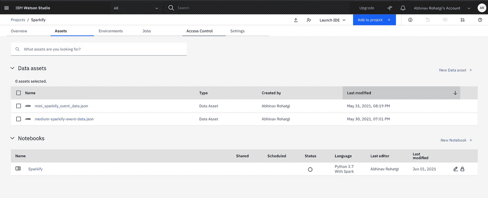

带有笔记本和 Apache Spark 环境的 IBM Watson 项目

# **结论**

我们的目标是预测用户是否会取消服务，以使公司能够为他提供优惠或折扣，从而留住这些用户。在清理数据并将它们建模为准备用于 ML 训练的数据集之后，我们测试了三个不同模型的性能。考虑到 **F-1 分数**最佳模型是**梯度提升树。**尽管结果很好，但该模型可以通过设计更多的工程特性来捕捉一些与用户对服务的满意度相关的行为模式，从而得到改进:推荐引擎好吗？意思是推荐给用户的歌真的符合他们的口味。从 **GBT** 的特性重要性来看，原始特性 *register_duration* 和*平均每期收听歌曲数*相当重要

**注意:**代码可以在这个 G [ithub 库](https://github.com/abhinavrohatgi30/sparkify-user-churn)中找到