# 火花——搅动还是不搅动

> 原文：<https://medium.com/analytics-vidhya/sparkify-to-churn-or-not-to-churn-4a62438a934?source=collection_archive---------14----------------------->

布雷特·乔丹在 [Unsplash](https://unsplash.com/s/photos/happy-skull-headphones?utm_source=unsplash&utm_medium=referral&utm_content=creditCopyText) 上的照片

# 该项目

Sparkify 是一个虚拟的音乐流媒体服务，它是我的 [udacity](https://www.udacity.com/) 数据科学家学位的最后一个项目。这是一个大数据机器学习挑战，我想开发一个模型，根据用户与网站的交互来预测即将取消订阅的用户，这被称为“流失”。

因为它是一个包含所有用户日志的大约 12 GB 的大数据集，所以不能在单台机器上计算，PySpark 是处理这种数据的工具。数据集托管在 AWS(亚马逊网络服务)S3 存储库(s3n://uda city-dsnd/spark ify/spark ify _ event _ data . JSON)上，为了处理数据，有必要在 AWS 上设置一个 EMR 集群。

在我进入工作细节之前，我想概述一下我的工作方法。

# 方法

使用 AWS 需要资金，一个好的方法是从一小部分数据开始，在本地机器上测试代码和方法。udacity 还提供了一个大约 123 MB 的样本数据集(s3n://uda city-dsnd/spark ify/mini _ spark ify _ event _ data . JSON)来处理这个问题。我确实这么做了，并提供了我在我的 [github](https://github.com/snkrause/Sparkify.git) 上开发的代码。为了给我的 ML 算法提供一个合适的数据框架，我经历了以下步骤。

> 了解您的数据

首先探索您的数据集并了解您的要素始终非常重要。没有提供描述，因此我在这里提供了一个**概述表**:

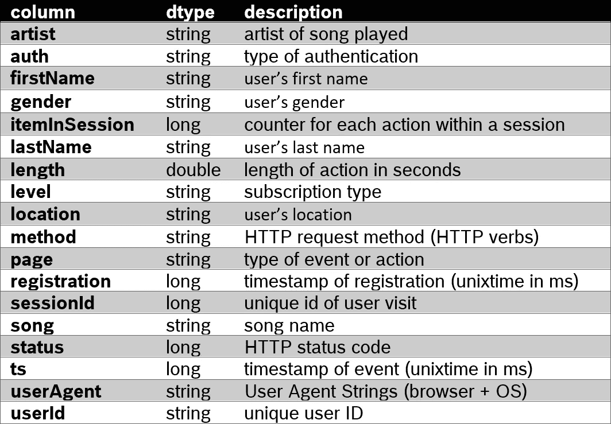

数据集的功能概述

对于我的项目，我想预测流失率，因此我将重点放在用户与网站的互动，存储在“页面”功能。页面功能具有以下独特的值:

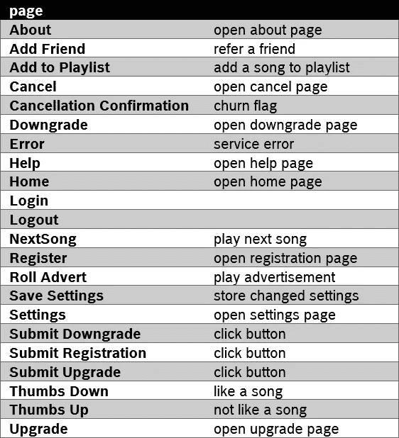

页面功能的唯一值

> **清理您的数据**

现在我知道了特性，我想检查数据的“**清洁度**”。几乎每一行都有 nan 值，但是真正对我的模型有影响的是空的“userId”。因此，清理这些是我唯一关心的事情。以下是 nan 值的快速概述:

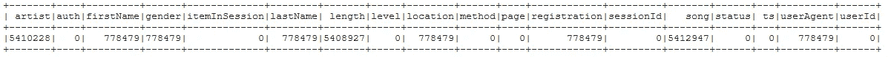

大型数据集中的 nan 值

nan“userId”可能来自访问网页时没有登录的用户。因为我不能将他们的操作分配给任何用户，所以我删除了这些行。

> **必要时创建新特征**

“ts”是一个很好的绝对时间参考，但每个用户都有自己的 Sparkify 体验。这是一个自然的特性，会让人想起自用户注册以来所经历的时间。我创建了功能“**会员 _ 天数**”，给所有用户一个相互的时间参考。从我的经验来看，我通常会尝试一项新服务一段时间，然后在某个时候决定是否要坚持下去。

在我的数据探索部分，我还想深入了解 Sparkify 的整体发展。服务是增长还是萎缩，用户活跃度如何？一个很好的方法是按周汇总数字，看看它们是如何演变的。这也显著降低了方差噪声。因此，我创建了特性“**周**，我可以利用它进行聚合。

> 为 ML 创建一个“userId”聚合表

为 ML 准备数据的最后一步是通过“userId”以合适的方式聚集“相关的”特性。我将所有“page”值定义为相关的，并创建了新的列，用 1 标记它们在一行中的出现——就像 Pandas 中的“get_dummies”函数一样。对于“性别”、“级别”、“地位”，我也是这么做的，我也认为相关。

之后，我总结了每个用户的 1，除了“级别”和“性别”，我只想知道他们在用户日志中最后一个条目的最大值。

从“membership_days”中，我实际上提取了两个特征:

1.  最大值:用户在其最后一条记录中成为会员的时间有多长
2.  CountDistinct:这是对用户在数据集中活动的天数的度量

最终的数据帧具有以下模式:

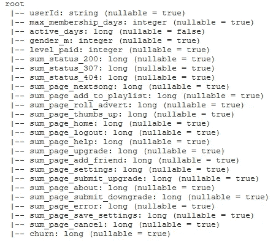

ML 数据帧的模式

现在数据已经可以深入研究了。

# 探索数据

第一个出发点是看用户如何与 Sparkify 交互。有关这方面的更详细信息，我查看了唯一“page”值的出现情况。最快的方法是绘制柱状图:

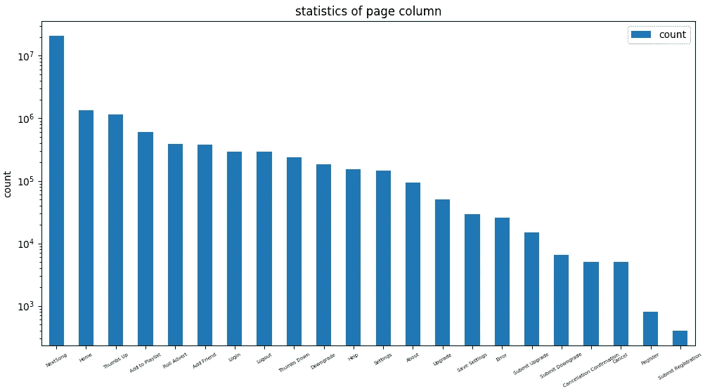

具有对数 y 刻度的唯一“页面”值的出现次数

乍一看这个情节已经揭示了一些有趣的事实:

*   升级的数量**比降级的数量****——因此更多的用户转向付费订阅，而不是回到免费订阅**
*   **用户注册(新用户)和用户取消(流失用户)之间的差距不止一个数量级——**spark ify 在寻找和留住新用户方面有问题吗**？**

**这让我对这些数字的每周发展产生了兴趣。**

**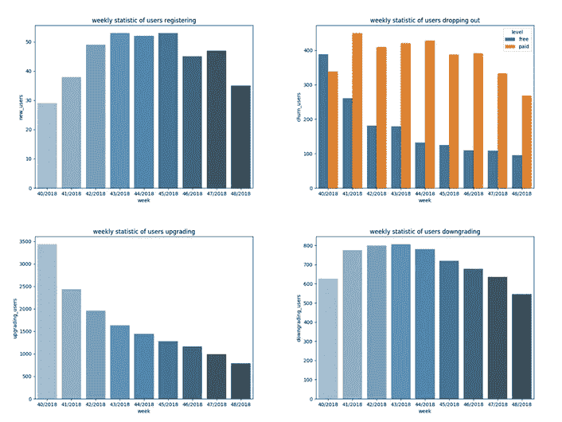**

**周累计数字**

**这里我们可以看到用户流失的明显趋势。每周只有 30 到 50 个新用户注册，而有 300 到 400 个用户流失——这对 Sparkify 的商业案例来说并不乐观。**

**此外，服务升级和降级的发展前景并不乐观。在数据集开始时，有超过 3000 个用户升级，大约 600 个用户降级。这是一个 5:1 的比例。在数据集的最后一周，这一比例已经下降到 1:1。**

**我想看看活跃用户的不同订阅级别的比例是如何变化的。**

**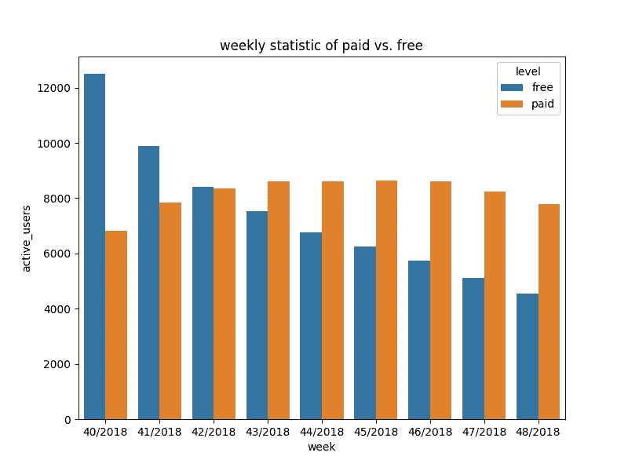**

**两种订阅级别的每周活跃用户变化**

**这里你可以看到付费用户群相当稳定，在 6000 到 8000 之间，而免费用户群在稳步下降。**

**我想探究的最后一个问题是会员用户流失多少天后，订阅水平之间是否有差异。**

**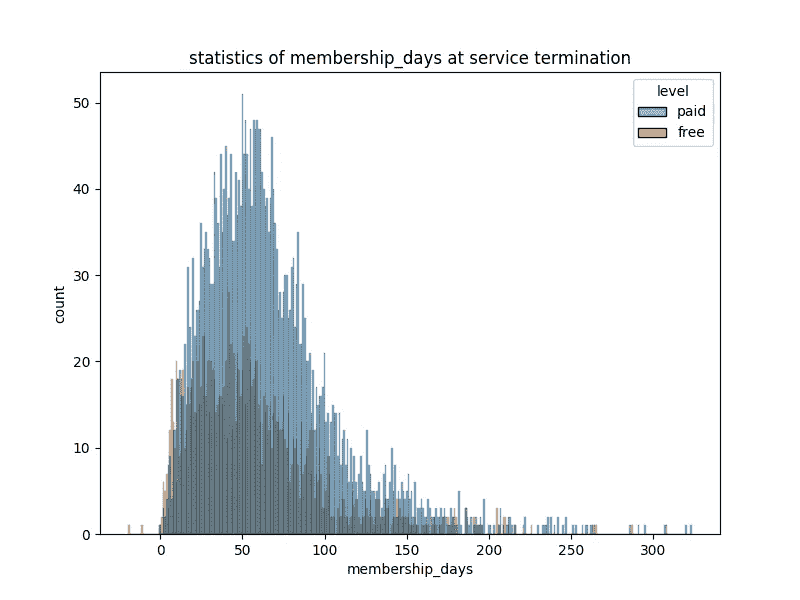**

**按订阅级别划分的会员流失最长天数**

**这是一个非常好的分布，免费用户最多 25 到 50 天，付费用户大约 60 天。似乎付费用户在做出最终决定之前会给 Sparkify 更长的试用期。**

**我从评估中得出的结论是，Sparkify 必须解决两点:**

*   **为什么我们不能吸引更多的新用户？我们必须改变我们的营销方式吗？**
*   **为什么不能把用户留在 Sparkify？**

**虽然第一点是一个营销问题，但我希望在 ML 分类器的帮助下找到第二点的答案。**

# **机器学习的力量**

**在每一次机器学习之旅的开始，都有这样一个问题:我想用哪个指标来选择最佳方法？我将这个问题视为将每个用户分为流失或不流失(因此有了这个标题)。**

> **实施指标**

**SciKit-Learn 有很多函数可以提供很好的度量，但是 PySpark ML 库似乎没有那么好。因为我不能总是跟踪度量函数如何得到它们的值，所以我决定使用我自己的函数来计算真正的正和真正的负以及它们的假对应物。在 PySpark ML 库中，必须首先对数据帧进行矢量化，我的最终模型为预测的测试数据提供了一个新特性“预测”。从这里开始，它只是比较“预测”和“流失”。从这一点来看，它只使用准确度、精确度、f1 和召回的定义来计算它们的值。混淆矩阵基本上是这种方法的副产品。**

> **设置 ML 管道**

**在为我的首选分类器准备超参数调整时，我建立了一个 ML 管道。它从 VectorAssembler 开始。然后我使用一个 StandardScaler 来避免一个特性仅仅因为它的值而占主导地位。之后，我只需要一个分类器。数据集不是不平衡的，但我在过去用决策树和随机森林分类器取得了很好的结果。这两个是我的起点。**

**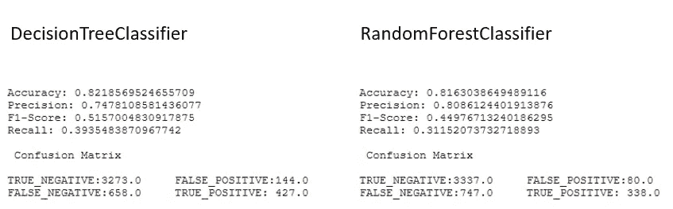**

**两个分类器初次运行的结果**

**两者产生了非常相似的结果。然而，RandomForestClassifier 使用了我所有的特征来预测。因为我想了解用户流失的原因，所以我决定用这个进入超参数调优。**

> **超参数调谐**

**我的方法是在较小的数据集上尝试更大范围的参数，在整个数据集上只调整较小的数量和范围。我使用 f1 分数作为我定义最佳模型的标准。这是我的设置和结果:**

**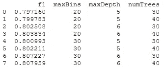**

**f1 的参数网格和结果**

**如您所见，内置指标的 f1 得分明显更高。将我的衡量标准应用于最佳模型会产生以下结果:**

**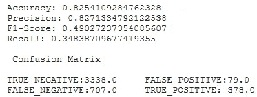**

**最佳模型的最终指标**

**我想得到的最重要的信息是特性的重要性。最佳模型的排名如下:**

**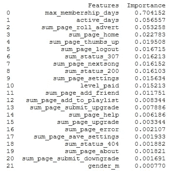**

**最佳模型的特征重要性排序**

**从这个排名中，我可以清楚地看到用户流失的迹象:**

1.  **正如我在 data exploration 中看到的，用户给服务 1 到 2 个月的时间来检查，然后留下或离开(membership_days)。这就是 Sparkify 必须加大力度留住新用户的地方。**
2.  **如果用户对 Sparkify 保持兴趣，对“活跃天数”的依赖是一个很好的指标。如果下降，他更有可能流失。**
3.  **对“滚动广告”的依赖，可能对免费用户群体更有意思。用户愿意接受的广告数量似乎是有限的。**
4.  **令我感兴趣的是，Sparkify 在吸引男女两性方面做得很好。这是我的模型中最不重要的因素。**

# **结论**

**探索性数据分析和机器学习的结合让我们对 Sparkify 的业务“健康”有了很好的了解，并有助于确定它可以在哪些领域留住用户并吸引新用户。**

**由于时间有限，我没有充分探索所有的分类器选项和完整的参数网格空间，例如我的 VectorAssembler 或 StandardScaler。因此，如果需要部署的话，我的模型的质量肯定还有改进的空间。**

**然而，在这种方法中，已经可以很好地提取关于用户流失原因的洞察。**

**请在我的 github 中找到全套文件:**

**[https://github.com/snkrause/Sparkify.git](https://github.com/snkrause/Sparkify.git)**