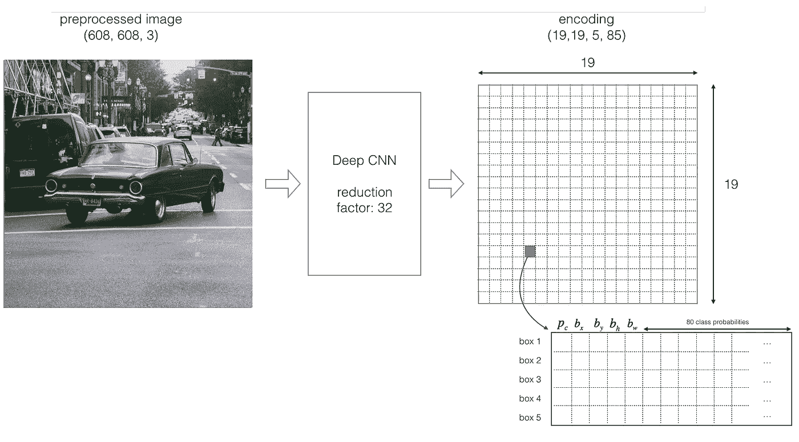
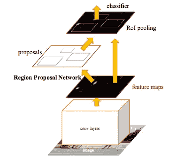
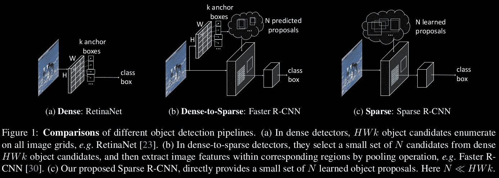
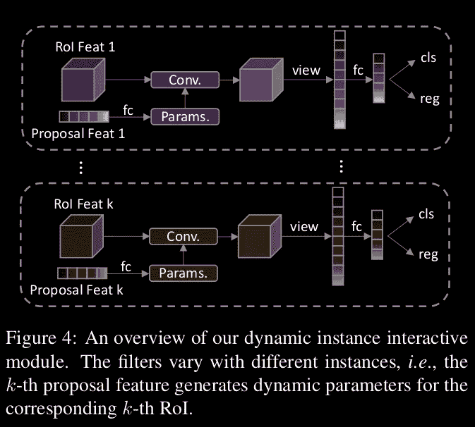
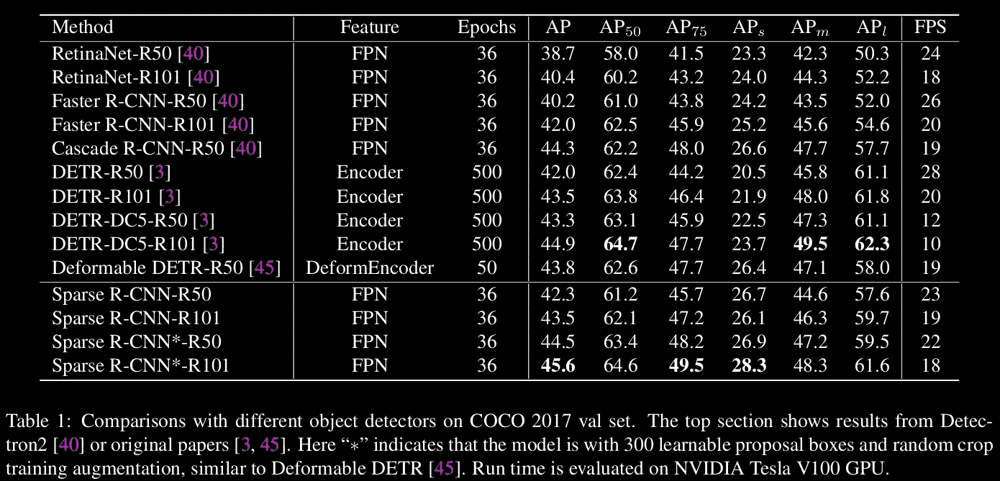
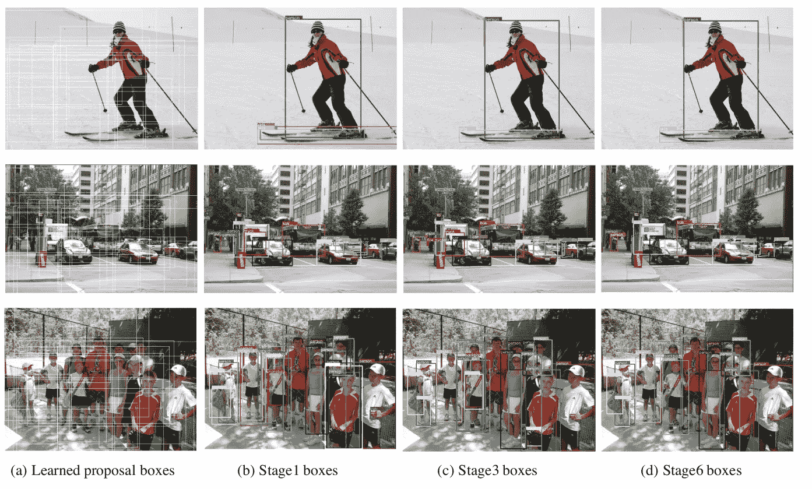

# 稀疏 R-CNN:新的检测器类型

> 原文：<https://medium.com/analytics-vidhya/sparse-r-cnn-the-new-detector-type-799ce31fb403?source=collection_archive---------6----------------------->

今天我们将讨论一种由四个机构的研究人员提出的[方法](https://arxiv.org/abs/2011.12450)，其中一个机构是字节跳动人工智能实验室(以其抖音应用而闻名)。他们为我们提供了一种新方法，称为稀疏 R-CNN(不要与稀疏 R-CNN 混淆，稀疏 R-CNN 在 3D 计算机视觉任务中使用稀疏卷积，如[、](http://kaldir.vc.in.tum.de/scannet_benchmark/)，它在对象检测中实现了接近最先进的性能，并使用完全稀疏和可学习的边界框生成

# 相关著作

让我们从现有检测方法的简要概述开始。

## 密集方法

广泛使用的管道之一是一级检测器，
以单次方式直接预测密集覆盖空间位置、比例和纵横比
的锚盒
的标签和位置。例如 [SSD](https://arxiv.org/abs/1512.02325) 或者 [YOLO](https://arxiv.org/abs/1506.02640) 。

让我们考虑一下 YOLO 算法。最终，它旨在预测图像上对象的类别和指定对象位置的边界框。每个边界框可以用四个描述符来描述:

1.  边框中心( ***bx，by*** )
2.  宽度( ***宽度*** )
3.  高度( ***bh*** )
4.  值 ***c*** 对应一类物体(如:汽车、红绿灯等。).

另外我们还要预测 ***pc*** 值，也就是包围盒中有物体的概率。

这是一种**密集方法**，因为它不是在给定图像中搜索可能包含对象的感兴趣区域。相反，YOLO 使用 19×19 的网格将图像分割成单元。但是一般来说，一级检测器可以产生 **W** × **H** 个单元，每个像素一个。每个单元负责预测 ***k*** 边界框(在这个例子中 **k** 被选为 5)。因此，对于一幅图像，我们得到大量的**W**×**H**×**k**边界框。

对于网格中的每个单元格和每个 bbox，产生上述值([源](https://appsilon.com/object-detection-yolo-algorithm/))

## 密集到稀疏方法

有两级检测器，搭载在使用 RPN 生成的密集建议上，如[更快的 R-CNN](https://arxiv.org/abs/1506.01497) 论文提出的。这些探测器多年来一直主导着现代物体探测。

使用 RPN，它从密集区域候选中获得一个稀疏的前景建议框集，然后细化每个建议的位置，
预测其特定类别。

([来源](https://arxiv.org/pdf/1506.01497.pdf))

以与一级检测器中类似的方式获得建议，但是它不是直接预测目标的类别，而是预测目标概率。然后，第二阶段通过目标过滤和重叠分数包围盒来预测类别。

## 稀疏方法

本文作者将其新的稀疏 R-CNN 范式归类为现有对象检测器范式的扩展，该范式包括从完全密集到密集到稀疏，以及导致完全稀疏的新步骤。

模型架构比较([来源](https://arxiv.org/pdf/2011.12450.pdf))

在审阅的论文中，避免使用 RPN，代之以一小组建议框(例如每张图片 100 个)。这些框是使用网络的可学习的*建议框*部分和*建议特征*部分获得的。前者预测每个建议的 *4* 值 *(x，y，h，w)* ，后者预测每个 bbox 内容的长度为 256 的潜在表示向量。学习到的建议框被用作一个合理的统计量来执行随后的提炼步骤，并且学习到的建议特征被用于引入注意机制。这种机制与 DETR 论文中使用的机制非常相似。这种操作是在动态实例交互头中执行的，我们将在下一节中介绍。

# 建议的模型特征

顾名思义，这个模型是端到端的。建筑很优雅。它包括从图像中获取特征的基于 FPN 的主干、上面提到的可学习的*建议框*和*建议特征*以及动态实例交互头，这是对本文的神经网络架构的主要贡献。

## 动态实例交互头

给定 *N 个*提议框，稀疏 R-CNN 首先利用 RoIAlign 操作
为用提议边界框定义的每个区域从主干提取特征。每个 RoI 特征被馈送到其自己的专用头部中，用于对象定位和分类，其中每个头部以特定的可学习提议特征为条件。

动态模块([源](https://arxiv.org/pdf/2011.12450.pdf))

提议特征被用作卷积的权重，在上面的图像中，它们被称为“参数”RoI 特征通过
处理这个生成的卷积来获得最终的特征。以这种
方式，那些具有最多前景信息的箱对最终的对象定位和分类产生影响。自我注意模块被嵌入到动态头中，以推理对象之间的关系，并通过这种卷积影响预测。

# 主要结果

作者提供了几个显示新方法性能的比较表。在 ResNet50 和 ResNet100 的两个变体中，将稀疏 R-CNN 与 RetinaNet、更快 R-CNN 和 DETR 进行比较。

模特表演([来源](https://arxiv.org/pdf/2011.12450.pdf))

这里我们可以看到，在 R50 和 R100 中，稀疏 R-CNN 的性能优于 RetinaNet 和更快的 R-CNN，但其性能与基于 DETR 的架构非常相似。

根据作者，DETR 模型实际上是密集到稀疏模型，因为它利用一组稀疏的对象查询来与全局(密集)图像特征交互。因此，与 DETR 相比，这篇文章很新颖。

定性分析([来源](https://arxiv.org/pdf/2011.12450.pdf))

在图像上，您可以看到 COCO 数据集上模型推断定性结果。在第一列中示出了已学习的提议框，它们是针对任何新图像预测的。在接下来的专栏中，您可以看到从提案中提炼出来的最终结果。它们因迭代学习过程的不同阶段而不同。

# 给我看看代码！

最后，我想说的是，在 2020 年，我们会看到很多将变形金刚应用于图像的论文。变形金刚已经在自然语言处理领域证明了自己的价值，现在也逐渐进入图像处理领域。这篇论文向我们展示了使用变压器可以创建快速单级检波器，其性能在质量方面可与目前最好的两级检波器相媲美。

你可以在作者的代码中找到关于实现的所有细节，这些代码基于费尔的 DETR 和 detectron2 代码库:[https://github.com/PeizeSun/SparseR-CNN](https://github.com/PeizeSun/SparseR-CNN)

# 参考

[1]更快的 R-CNN:用区域提议网络实现实时目标检测[https://arxiv.org/abs/1506.01497](https://arxiv.org/abs/1506.01497)

[2]https://appsilon.com/object-detection-yolo-algorithm/[YOLO 算法和 YOLO 目标检测简介](https://appsilon.com/object-detection-yolo-algorithm/)

[3]稀疏 R-CNN:具有可学建议的端到端对象检测[https://arxiv.org/abs/2011.12450](https://arxiv.org/abs/2011.12450)