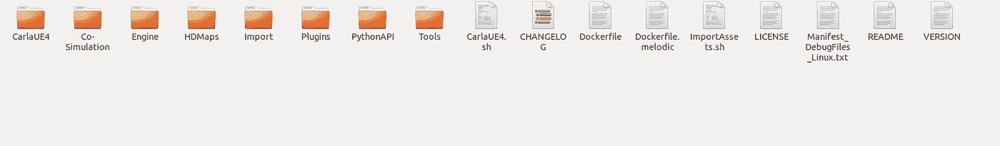
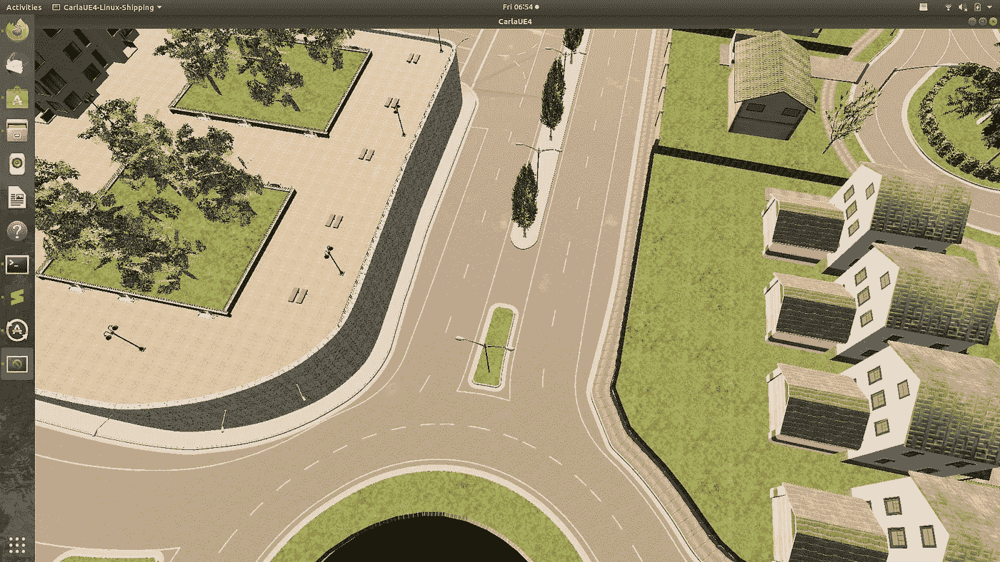
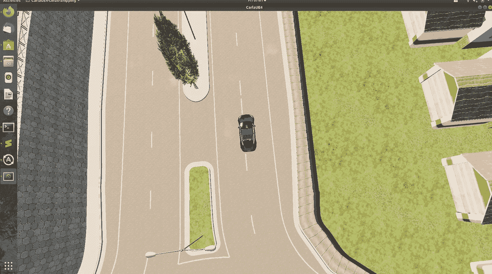

# 在卡拉繁殖车辆

> 原文：<https://medium.com/analytics-vidhya/spawning-vehicles-in-carla-86429f767040?source=collection_archive---------5----------------------->

**CARLA** 是一款开源的**模拟器**，用于自动驾驶。它带有自定义地图、车辆、传感器等等。在这篇文章中，我将告诉你如何在卡拉的期望位置生成一个车辆。我们可以使用 Python API 与 CARLA 进行交互。

让我们现在开始吧

首先，您必须导航到您的 Carla 的安装位置，如下所示。



Carla 的安装目录

然后，您必须打开您的终端并编写以下代码来运行 Carla 服务器。

> 。/Carla UE 4 . sh-windowed-ResX = 320 ResY = 240 fps = 3-benc mark-quality-level = Low

我将 fps 和质量保持在较低水平，这样 Carla 就可以流畅运行，因为我没有强大的 GPU。



现在让我们编写一个 python 脚本来在预定义的位置生成一辆车。

```
import glob
import os
import sys
import timetry:
 sys.path.append(glob.glob(‘./PythonAPI/carla/dist/carla-*%d.%d-%s.egg’ % (
 sys.version_info.major,
 sys.version_info.minor,
 ‘win-amd64’ if os.name == ‘nt’ else ‘linux-x86_64’))[0])
except IndexError:
 passimport carlaclient = carla.Client(‘localhost’, 2000)
client.set_timeout(2.0)
world = client.get_world()
blueprint_library = world.get_blueprint_library()
bp = blueprint_library.filter(‘model3’)[0]
world = client.get_world()
spawnPoint=carla.Transform(carla.Location(x=38.6,y=5.8, z=0.598),carla.Rotation(pitch=0.0, yaw=0.0, roll=0.000000))
vehicle = world.spawn_actor(bp, spawnPoint)
time.sleep(10)
vehicle.destroy()
```

该代码将在以下位置生成 model3 类型的车辆。要运行它，只需将脚本保存在任何地方，然后使用终端运行它

```
x=38.6,y=5.8, z=0.598
```



车辆在所需位置生成

要用你的车辆产卵传感器检查我的[T5 本 T7 篇。](/me/stats/post/aa66af359caa)