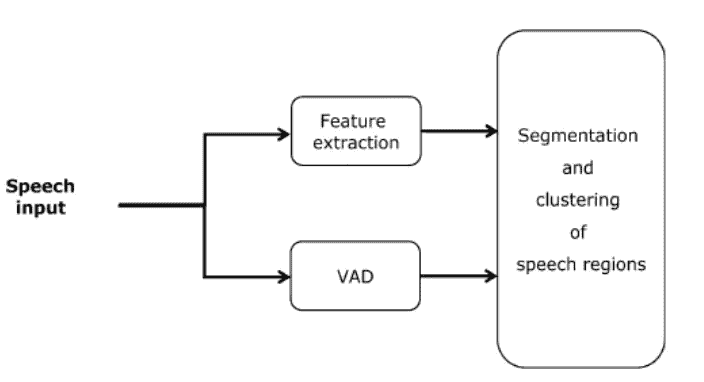
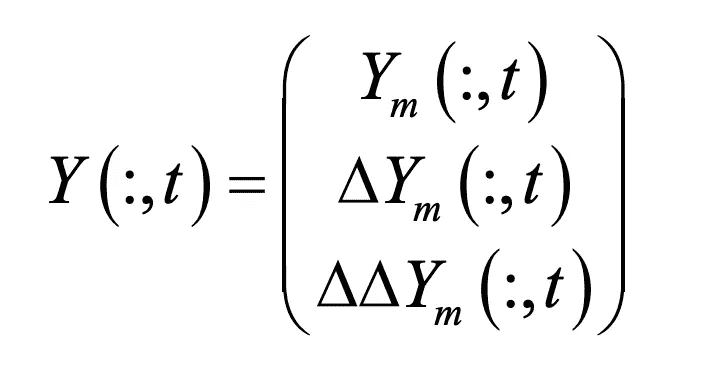
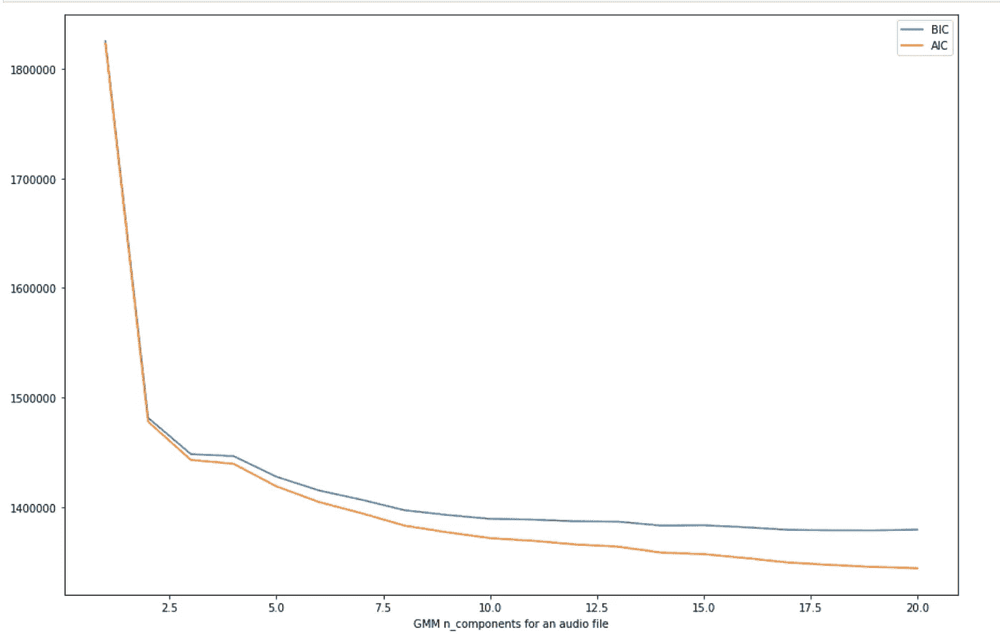
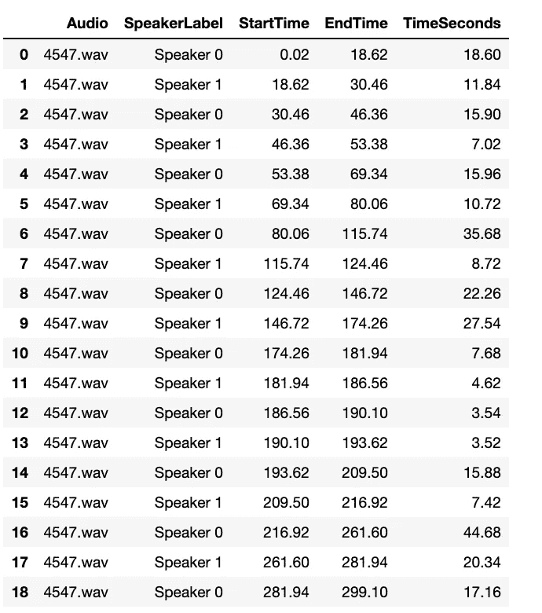

# 说话者日记化

> 原文：<https://medium.com/analytics-vidhya/speaker-diarisation-89c963fa4fe8?source=collection_archive---------1----------------------->

> 在只有两个说话者的音频文件中，找出“谁在什么时候说话”的一种无人监管的方法。

语音处理可以分为两大类:
1 .**语音**识别:检测语音音频内容
2。说话者识别:识别对话中的说话者

说话人日记属于第二类。说话人日记化是识别音频文件中说话人的开始和结束时间的任务。

# 1.先决条件

对于这个帖子，我们需要 [Python](https://www.python.org/downloads/release/python-360/) ，Librosa，Scipy。

# 2.数据集描述

这里使用的数据集来自
[https://media.talkbank.org/ca/CallHome/eng](https://media.talkbank.org/ca/CallHome/eng/6313.mp3)
，我已经将[https://media.talkbank.org/ca/CallHome/eng/4547.mp3](https://media.talkbank.org/ca/CallHome/eng/6313.mp3)的音频文件进行了扬声器细分并执行了下采样。

# 3.导入所需的库，缩减采样并将 mp3 转换为 wav 格式

要对信号进行下采样，您需要在数据之间进行插值。对于下采样和转换，使用下面的代码。

# 4.框图

**扬声器变音系统简图**

## 扬声器日记系统由 3 个主要模块组成

语音活动检测模块
特征提取模块【聚类和分段分帧】

# **5。提议的方法**

**a)分段(使用 VAD):** 通过使用 librosa.feature.rms，我们计算短期能量。VAD 模块是混合的基于能量的检测器和基于模型的解码器。在第一步中，基于能量的检测器找到所有低能量的段，同时应用最小段持续时间。自动设置能量阈值以获得足够的非语音段。

**b)特征向量提取和 GMM 训练:**通过使用 librosa.feature.mfcc，我们计算 Mel 频率倒谱系数(mfcc)及其一阶和二阶导数，并将它们组合如下:

**GMM 训练**:

高斯混合模型(GMM)使用期望最大化方法，定性地做以下事情:

1.  选择位置和形状的开始猜测
2.  重复直到收敛:
    ***E-步骤* :** 对于每个点，找到编码每个聚类中的隶属概率的权重
    ***M-步骤* :** 对于每个聚类，更新其位置，基于*所有*数据点，利用权重来归一化权重和形状编码

这样的结果是，每个集群不是与一个硬边球体相关联，而是与一个平滑的高斯模型相关联。

下一步是找出对于给定的用于 GMM 训练的音频文件，我们需要多少最佳数量的组件。

最佳聚类数是使 AIC 或 BIC 最小的值，这取决于我们想要使用的近似值。因此，AIC 和 BIC 都告诉我们，20 或更多的组件将是更好的选择。
请注意，组件数量的选择衡量的是 GMM 作为 ***密度估计器*** 的效果如何，而不是作为聚类算法的效果如何*。*

现在下一步将是为 **GMM 训练**编写函数

wavFile:音频文件的完整路径
frameRate:每秒帧数，我每秒拍摄了 50 帧
segLen:以秒为单位的段长度，我每秒拍摄了 3 段
vad:帧级别的有声活动决策。
numMix:混合物模型中混合物的数量。通过查看每秒比特率，我将 numMix 设置为 128。

GMM 函数返回基于段的预测概率数组。

**C)聚类和分割框架:**

现在，在下一步中，我们将对 GMM 结果执行**聚类分析。
在当前场景中，我们的主要目标是调整 **n_cluster** ，我们知道我们只有 2 个扬声器，因此将使用凝聚聚类来调整它。**凝聚** **聚类**使用“自下而上”的方法，其中每个观察值从其自己的聚类开始，随着一个聚类在层次结构中向上移动，聚类对被合并。
在聚类分析之前，我们执行数据缩放和标准化，以便所有特征变得可比较，并且数据近似遵循高斯分布。**

**分段:**在执行聚类之后，我们在分段级别获得说话者假设值，现在下一步是将分段转换到帧级别。为此，请使用下面的函数

最后一步:谢谢你读到这里！现在，我们使用下面的函数根据开始时间和结束时间标记说话者，并使用 pandas dataframe 显示日记化结果。

**扬声器日记化输出**

感谢你的阅读，如果你喜欢这个帖子！打拍手！

演讲者日记完整代码 [**Git Hub 库**](https://github.com/rvipandey/SpeakerDiarisation/blob/main/SpeakerDiarization.ipynb)

**参考文献** [说话人二值化特征](https://www.researchgate.net/publication/220655267_Speaker_Diarization_Features_The_UPM_Contribution_to_the_RT09_Evaluation#pf1)
[用于广播二值化的 PLDA 模型的无监督适应](https://link.springer.com/article/10.1186/s13636-019-0167-7)
[说话人二值化系统中的凝聚层次聚类](https://sail.usc.edu/publications/files/haninterspeech2007.pdf)
特别感谢 [Priyanka](/@ppandey170993) 和 [Nikhil](https://towardsdatascience.com/@nikhilsharma129540) ！