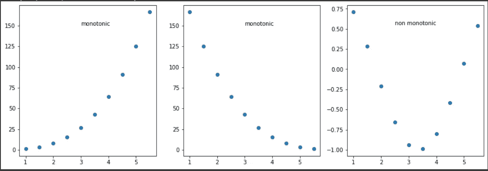
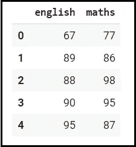
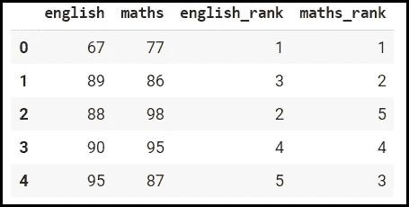
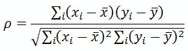
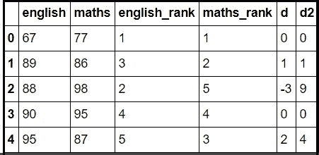

# 斯皮尔曼相关

> 原文：<https://medium.com/analytics-vidhya/spearmans-correlation-f34c094d99d8?source=collection_archive---------11----------------------->

*   **斯皮尔曼相关**是特征选择法。
*   **斯皮尔曼关联**决定了你的两个变量之间的**单调关系**的**强度**和**方向**。

**什么是单调关系？**

1.  当一个变量的值增加时，另一个变量的值也增加，反之亦然，但不是以线性方式。
2.  请看下图以获得更多的理解。



**斯皮尔曼关联背后的数学**

*   **斯皮尔曼关联**基于变量的秩。
*   我们需要为每个变量设置等级。
*   考虑下面的例子。

**例如:**

*   我们正在创建一个包含学生分数的学生数据集。

```
english = np.array([67,89,88,90,95])
maths = np.array([77,86,98,95,87])

d = {'english':english, 'maths':maths}
```

*   使用上面的字典，我们正在创建一个熊猫数据框架。

```
data = pd.DataFrame(d)
data
```

*   下面是我们学生的数据图表。



资料组

*   现在，我们必须根据变量的递增顺序给每个变量分配一个等级。
*   因此，我们为每一列创建了一个等级。

```
english_rank = np.array([1,3,2,4,5])
maths_rank = np.array([1,2,5,4,3])
```

*   将这些等级添加到我们的数据框中。

```
data['english_rank'] = english_rank
data['maths_rank'] = maths_rank
data
```

*   这是我们最后的数据框。



带有等级的数据集

*   查看上表，了解我们如何对变量进行排序。
*   我们考虑的数据集没有重复的值，因此我们可以使用公式 1。

**公式:**

*   有两个公式来计算斯皮尔曼相关性。

1.  如果数据集中没有重复项，那么我们使用以下公式:


其中“di”是等级之间的差异,“n”是观察值的总数。

2.如果数据集中有重复项，那么我们使用以下公式:



**计算斯皮尔曼相关性:**

*   首先，我们需要计算 d 和 d2。

```
data['d'] = data['english_rank'] -data['maths_rank']
data['d2'] = data['d']**2
```

*   我们已经计算了 d 和 d2

```
data
```



包含 d 和 d2 的数据集

这里，我们使用第一个公式计算 spearman 相关性。

```
sc = 1 - (6*data['d2'].sum() / ( len(data.index) * ( len(data.index)**2  -1)) )
```

*   变量“sc”存储 spearman 的相关分数。

```
*# sc gives the score of relationship between ranks of two individual features.*
scoutput :0.30000000000000004
```

**使用 Scipy 库实现:**

*   我们可以使用 Scipy 模块中的 spearman 相关性。
*   我们已经从 scipy 进口了 spearmanr。stats 模块，还导入了 SelectKBest 类。

```
*# SelectKBest is used to select k best features.*

**from** **sklearn.feature_selection** **import** SelectKBest
**from** **scipy.stats** **import** spearmanr
```

*   SelectKBest 用于根据分类器得分选择 k 个最佳特征。(这里我们的分类器是 spearmanr)

```
skb = SelectKBest(score_func=spearmanr, k=1)
```

*   把我们的数据分成 X 和 y。
*   这里，X 是输入变量，y 是输出变量。

```
X = data[['english']]
y = data['maths']
```

*   将我们的模型拟合到 X 和 y。

```
skb.fit(X, y)output:SelectKBest(k=1, score_func=<function spearmanr at 0x7f3d563c15f0>)
```

*   这是斯皮尔曼的相关分数。

```
skb.scores_output: array(0.3)
```

*   我们可以看到，我们之前使用公式计算的分数与我们使用 **spearmanr** 方法计算的分数几乎相同。
*   这是我关于斯皮尔曼相关性的完整笔记本。 [**点击这里**](https://colab.research.google.com/drive/10-QPxXx_Tp0iEN3CucZsLuv1rLqUVLJM?usp=sharing)

**总结**:

*   我们已经明白什么是斯皮尔曼相关。
*   也知道何时以及如何使用它