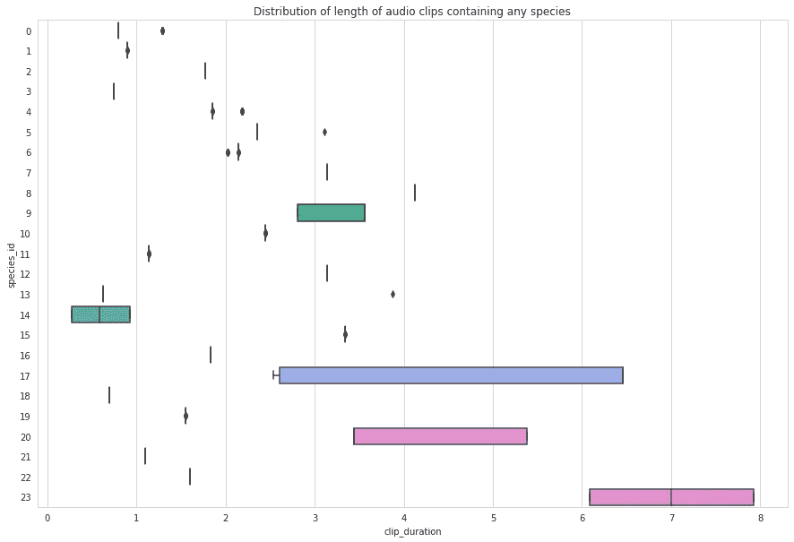
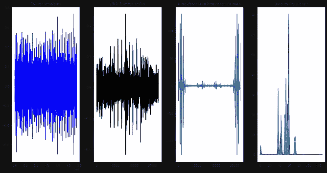
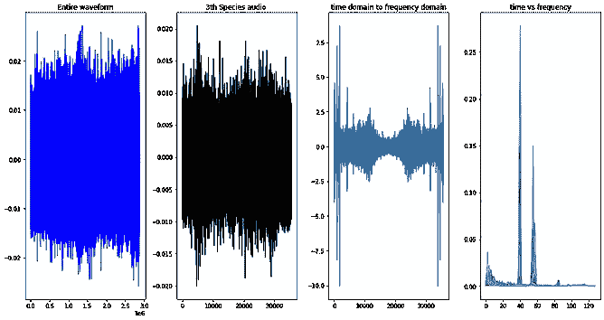

# 使用音频进行物种检测(雨林连接)

> 原文：<https://medium.com/analytics-vidhya/species-detection-using-audio-rainforest-connection-f899c8cefaf8?source=collection_archive---------2----------------------->


## **简介**

*随着地球人口的增长，人口的供给和需求也在不断增加。现在，这种需求正通过开发自然及其存在而直接或间接地得到满足。雨林中发生了许多非法砍伐和偷猎行为。森林面积的减少导致环境中二氧化碳的增加，动物和鸟类栖息地的减少，许多鸟类和动物物种的灭绝，气候变化和许多其他问题。如果今天不停止，影响将是非常严重的。为了拯救我们的大自然，拯救濒危物种，我们必须利用现有的技术，如人工智能和机器学习，在森林里追踪它们的位置，并采取行动。这种技术适用于图像或音频等数据，与图像数据(因为大部分地区覆盖着茂密的雨林，所以图像数据有限)相比，音频数据在数据采集的简易性和鲁棒性、低数据量和高信息密度方面可能更好。对雨林进行声学监测的一些早期尝试已经报告了音频信息的有希望的价值。*

## **商业问题**

*识别音频片段中的音频种类。我们必须预测物种出现在给定音频剪辑中的概率。*

## **ML 公式化(** *多类多标签分类问题* **)**

*在训练数据中，我们标记了 24 种鸟类和青蛙的音频剪辑(持续时间的边界框)。使用经过训练的模型，我们已经预测了测试音频文件中存在的物种(音频文件中不同类型的鸟或青蛙的声音)。*

## **业务约束**

*1。当部署模型并处理实时数据时，我们需要输出中更少的延迟，以便可以验证检测到的濒危物种。如果我们的模型能够识别卡车或电锯机的声音，以提醒森林管理员，我们也可以使用这个模型来捕捉伐木工人。*

*2。我们必须尽量减少出错的机会，因为进入森林是生命的威胁。*

*3。我们必须提供音频文件中物种出现的概率百分比。*

## **数据集分析**

我们使用 Kaggle 上的“雨林连接”数据集来完成我们的任务。

*1。24 不同种类的鸟和青蛙*

*2。1 分钟的 flac 音频文件，其中 48 千赫。*

*3。训练文件部分带有强标签。*

*4。为培训文件提供真阴性和真阳性。*

*5。数据包括列车数据种类音频的开始/结束时间和低/高频率的边界框*

*6。训练样本= 4727*

*7。测试样本= 1992 年*

*8。列/特征*

> *recording_id —记录的唯一标识符*
> 
> *物种 id —物种的唯一标识符*
> 
> *歌曲类型 id —歌曲类型的唯一标识符*
> 
> *t_min —注释信号的开始秒*
> 
> *t_max —注释信号的结束秒*
> 
> *f_min —注释信号的较低频率*
> 
> *f_max-注释信号的上限频率*

## **探索性数据分析**

*独特物种数量:24*

*唯一记录数:1132*

*唯一歌曲 id 的数量:2*

大多数录制的火车音频片段都是单一种类的。


除了第 23 种和第 17 种，其他数据基本平衡。


有专家为该物种识别的歌曲类型，这里表示为 1 和 4，这是不平衡的，因为大多数音频由歌曲类型 1 组成。


数据包括听到物种声音的持续时间(tmin 和 tmax)。使用，我们计算了物种音频的总持续时间，发现大多数物种声音在音频文件中的持续时间为 1 到 3 秒。



**所有物种的音频分析**



## **评估指标**

主要的竞争指标是标签加权的[标签排名平均精度](https://scikit-learn.org/stable/modules/model_evaluation.html#label-ranking-average-precision) ( *lwlrap* ，读作“Lol wrap”)。[标签排名平均精度(LRAP)](https://scikit-learn.org/stable/modules/model_evaluation.html#label-ranking-average-precision) 衡量预测模型的平均精度，而不是使用精度和召回率。简而言之，它回答了这样一个问题:对于每个给定的样本，排序较高的标签中有百分之多少是真实标签。


示例:

```
Given,
y_true = np.array([[1, 0, 0], [0, 0, 1],[1,0,1]])
y_*score* = np.array([[0.75, 0.5, 1], [1, 0.2, 0.1],[1, 0.4, 0.2]])
```

1.  在第一个样本中，y_true 为`[1, 0, 0]`，y_ *得分为* `*[0.75, 0.5, 1]*` *，这意味着只有 A 类在预测标签中获得第二名。所以，秩= 2。接下来我们需要找出一路上有多少正确的标签。只有一个正确的标签是 A 类，所以分子值是 1。因此，分数变成 1/2 = 0.5*

> Lrap_1st = 0.5/1 = 0.5

2.在第二个样本中，y_true 是`[0, 0, 1]`，y_ *得分是* `*[1, 0.2,0.1]*` *，这意味着 C 类被给予*第三*等级。*

这里分数变成 1/3 = 0.333

> Lrap_2nd = 0.3333/1 = 0.333

3.在第三个样本中，y_true 是`[1, 0, 1]`并且 y_ *得分是* `*[1, 0.4,0.2]*` *，这意味着 C 类被给予*第三*等级，A 类被给予第一等级。*A 类的分数为 1/1 = 1，C 类的分数为 2/3 = 0.66(沿途真实标签排名数/C 类在预测标签中的排名)。

> Lrap_3rd = 1+0.66/2 = 0.83

因此，总 LRAP 是每个样本的 LRAP 的总和除以样本数

> LRAP = 1/3(0.5+0.3333+0.83)= 0.55443


“标签加权”部分意味着总得分是测试集中所有标签的平均值，其中每个标签都获得相同的权重(相比之下，plain *lrap* 给予每个测试项目相同的权重，从而当单个标签与多个其他标签出现在同一项目上时，不考虑它们的贡献)。

我们使用标签加权，因为它允许计算每个类的值，并且仍然将总体指标表示为每个类指标的简单平均值(由测试集中每个标签的先验值加权)

## **理解音频数据并将音频转换成声谱图图像**

**音频信号**定义为气压随时间的变化。现在，为了捕捉这些音频信息，我们对气压随时间的变化进行采样。对于 1 分钟的音频记录文件，我们拥有的数据是每秒 48000 个样本。

**傅立叶变换**一个音频信号由几个单频声波组成。当随着时间的推移对信号进行采样时，我们只捕获结果幅度。**傅立叶变换**是一个数学公式，它允许我们将信号分解成其单独的频率和频率的振幅。换句话说，它将信号从时域转换到频域。结果被称为**光谱**。


FFT(快速傅立叶变换)是在信号的重叠窗口段上计算的，我们得到所谓的**频谱图。**


## 为了更多的理解

[](/analytics-vidhya/understanding-the-mel-spectrogram-fca2afa2ce53) [## 了解 Mel 光谱图

### (以及信号处理中的其他主题)

medium.com](/analytics-vidhya/understanding-the-mel-spectrogram-fca2afa2ce53) 

## **研究部分**

1.  [**https://rfcx.org/**](https://rfcx.org/)

雨林连接的系统是利用回收的 Android 智能手机网络构建的，这些智能手机经过修改可以检测特定的声音，包括电锯、枪声和车辆的音频信号。当系统记录到其中一种声音时，它会实时向地方当局发送信号，地方当局可能会采取行动，阻止非法伐木或偷猎行为的发生。每个 RFCx 设备可以监控大约三平方公里的森林。所有物种的音频记录都被这个设备捕获，在专家的帮助下，训练数据被标记。


2.[T3【https://arxiv.org/ftp/arxiv/papers/1908/1908.07517.pdf】T5](https://arxiv.org/ftp/arxiv/papers/1908/1908.07517.pdf)

AI for Earth:通过声学监测保护雨林:在这篇论文中，他们对公共音频数据集和我们真实的雨林声音数据集进行了音频检测。在分析了音频 log-Mel 频谱图后，很明显，公共数据集和森林数据集的波形完全不同，因为雨林有各种昆虫、鸟类和各种动物的声音。他们还强调了构建云人工智能驱动的保护系统的要点，以连接领域专家和人工智能专家，同时使技术利用变得更容易。


3.[**https://arxiv.org/pdf/1608.04363v2.pdf**](https://arxiv.org/pdf/1608.04363v2.pdf)

他们提出了两种用于音频检测的深度学习模型架构。第一种是深度卷积网络，第二种是具有数据扩充的深度卷积网络，以处理标记数据缺乏的问题。结合数据扩充，所提出的模型产生环境声音分类的最新结果。

具有高模型容量的深度神经网络特别依赖于大量训练数据的可用性，以便学习从输入到输出的非线性函数，该非线性函数能够很好地概括并对未知数据产生高分类精度。改善 CNN 模型的性能和用于环境声音分类的标记数据的稀缺性的优雅解决方案是数据扩充。

数据扩充描述:数据扩充的一个关键概念是应用于被标记数据的变形不会改变标记的语义。以计算机视觉为例，汽车的旋转、平移、镜像或缩放图像仍然是汽车的连贯图像，因此有可能应用这些变形来产生附加的训练数据，同时保持标签的语义有效性。

4.[**https://www . science direct . com/science/article/pii/s 1574954120300637**](https://www.sciencedirect.com/science/article/pii/S1574954120300637)

他们采用了各种技术来满足每个音频样本中完全标记的目标数据的需求。为了解决这个问题，他们开发了一个管道，使用单标签真阳性和假阳性来训练 CNN 进行音景记录。为了收集训练数据，他们使用了基于模板的声音检测器和图形用户界面进行检测后验证。

三个主要步骤:

1.模板创建

2.模板匹配检测

3.模板匹配验证

## **训练数据的各种方法**

> 利用竞赛提供的物种录音时长的包围盒，进行数据扩充。
> 
> 利用整个 1 分钟的音频记录文件，通过在 6 秒和 3 秒的重叠上断开音频文件来准备列车数据。
> 
> 获取全部数据，执行数据扩充，并使用迁移学习技术训练模型。
> 
> 获取全部数据，执行数据扩充，并使用迁移学习技术训练模型，执行所有训练模型的集合，以根据测试数据进行预测。
> 
> 使用 YAMNET 在音频集上训练模型。

## 预处理音频数据，转换为图像和数据增强


## 模型

*我已经尝试在不同的方法上应用定制模型，但是没有提高模型性能，所以我尝试利用已经训练好的模型或者使用迁移学习技术。*

*我使用过 DenseNet 和 EfficientNet，它们是根据“ImageNet”的重量进行训练的。*

*DensetNet 模型架构:*


## 损失和 Lrap 图(基于 EfficientNet 培训的模型性能)


## 结果

1.  *DensetNet 交叉验证数据得分:64.49%*
2.  *交叉验证数据的有效净得分:71.97%*
3.  *集合模型(DenseNet 和 EfficentNet)对 Kaggle 测试数据:66.257%*

## 未来范围

1.  我们可以扩展该项目来拯救我们的动植物，如检查树木的砍伐，跟踪森林中的动物等等。
2.  我们还可以尝试使用 Kaggle 竞赛中提供的假阳性数据来提高性能。
3.  *为提高模型性能，尝试对模型进行不同参数的调谐和其他各种增强技术。*

## **参考文献**

1.  https://www.youtube.com/watch?v=Vf_FIMDVs00&t = 2529s
2.  [https://leimao.github.io/blog/Focal-Loss-Explained/](https://leimao.github.io/blog/Focal-Loss-Explained/)
3.  [https://www . tensor flow . org/addons/API _ docs/python/TFA/loss/SigmoidFocalCrossEntrop](https://www.tensorflow.org/addons/api_docs/python/tfa/losses/SigmoidFocalCrossEntropy)y
4.  [https://www . tensor flow . org/tutorials/audio/transfer _ learning _ audio](https://www.tensorflow.org/tutorials/audio/transfer_learning_audio)

[](https://github.com/Ashutoshbhayde/Species-Detection-using-Audio-Rainforest-Connection-) [## GitHub-Ashutoshbhayde/物种-检测-使用-音频-雨林-连接-

### 为 Ashutoshbhayde/物种检测-使用-音频-雨林-连接-发展创建一个帐户…

github.com](https://github.com/Ashutoshbhayde/Species-Detection-using-Audio-Rainforest-Connection-)  [## Ashutosh Bhayde -技术专家- HCL Technologies | LinkedIn

### 一位技术传道者和机器学习工程师，在管理、数据…

www.linkedin.com](https://www.linkedin.com/in/ashutosh-bhayde-26772984/)