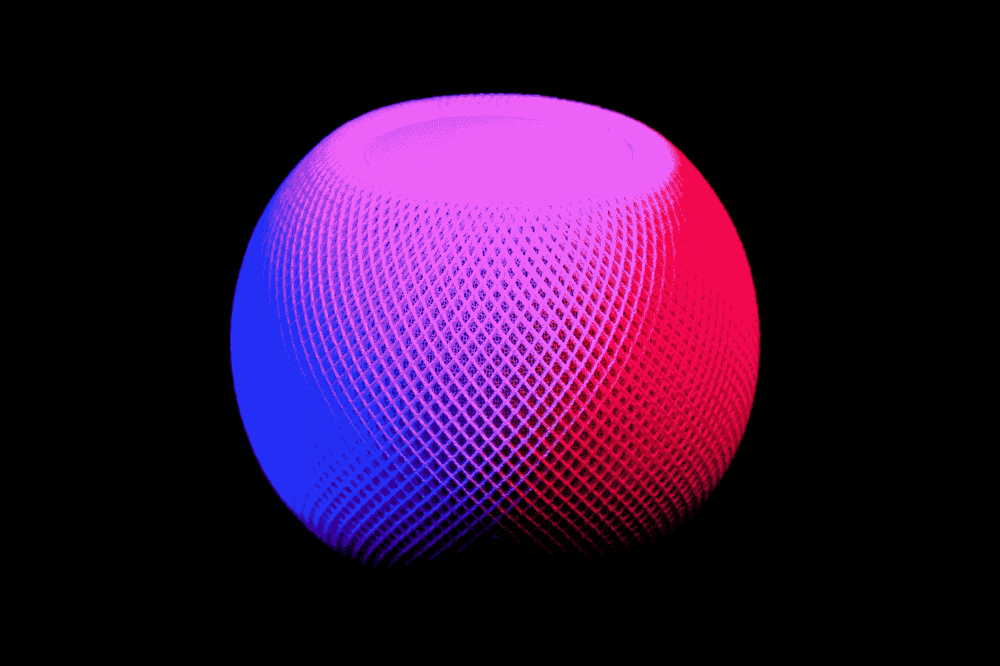
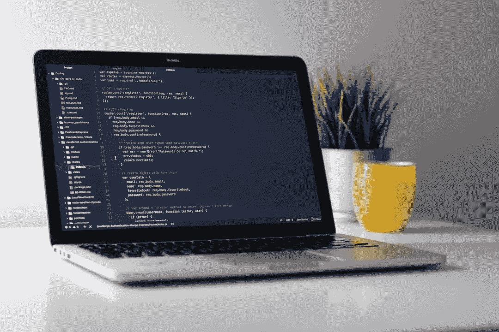

# 如何使用 Python 构建语音合成器？

> 原文：<https://medium.com/analytics-vidhya/speech-synthesizer-using-python-b3f1c83a1fc8?source=collection_archive---------4----------------------->



[伊万·班杜拉](https://unsplash.com/@unstable_affliction?utm_source=unsplash&utm_medium=referral&utm_content=creditCopyText)在 [Unsplash](https://unsplash.com/?utm_source=unsplash&utm_medium=referral&utm_content=creditCopyText) 拍摄的照片

# **简介**

他们在那里！在这篇文章中，我们将讨论如何创建和定制一个简单而强大的语音合成器，将任何文本输入转换成语音。您可以选择将其保存为音频文件，或者让它为您大声朗读出来。这是一个分步指南，每个步骤都有完整的代码片段。对于那些想要完整代码的人，我在文章末尾添加了 Github 资源库链接。

# **要求**

*   python(显然。3+推荐)
*   pyttsx3(它是 Python 中的一个文本到语音转换库。)
*   一个代码编辑器，我用的是 Jupyter Notebook，你可以用 Vscode/Atom/Sublime 或者任何你选择的。

> 使用`pip install pyttsx3`安装 pyttsx3 库。

# **概述**

这里是本文涵盖的所有主题的完整列表。

*   如何使用 pyttsx3 库进行 tts 转换？
*   在男声和女声之间转换。
*   改变语速和输出音频的音量。
*   如何将您的演讲保存为音频文件？

# **说了这么多，我们开始吧**

*   让我们从导入 pyttsx3 库开始

```
import pyttsx3
```

*   现在我们用一个变量来初始化它。这是一个变量，我们将用它来调用库的所有函数，以便在整个代码中使用。让我们将转换器命名为“合成器”。

```
synthesizer = pyttsx3.init()
```

*   我们可以给“合成器”一个静态或动态输入源。
*   “say”功能告诉合成器读出给定的文本，而“save_to_file”功能告诉它将音频保存为文件。
*   然后，我们告诉合成器运行转换过程。
*   要将文本转换成语音并朗读出来:

## **静态输入:**

```
synthesizer.say("Hello World") 
synthesizer.runAndWait() 
synthesizer.stop()
```

## 或者

## **动态输入:**

```
my_text = input("Enter the text: ")
synthesizer.say(my_text) 
synthesizer.runAndWait() 
synthesizer.stop()
```

*   要将转换后的语音存储在音频文件中:

## 静态输入:

```
synthesizer.save_to_file("Hello World", 'test.mp3')
synthesizer.runAndWait()
```

## 或者

## 动态输入:

```
synthesizer.save_to_file(my_text, 'test.mp3')
synthesizer.runAndWait()
```

> 在上面的例子中，我将音频保存到文件“test.mp3”



照片由[克莱门特·赫拉尔多](https://unsplash.com/@clemhlrdt?utm_source=unsplash&utm_medium=referral&utm_content=creditCopyText)在 [Unsplash](https://unsplash.com/?utm_source=unsplash&utm_medium=referral&utm_content=creditCopyText) 上拍摄

# **定制您的合成器**

*   为了查看您系统中的声音列表，我们获取可用的声音并将它们存储在变量“voices”中。

```
voices = synthesizer.getProperty('voices')
```

*   现在，为了显示声音和它们的属性。

```
for voice in voices: 
    print("Voice:") 
    print("ID: %s" %voice.id) 
    print("Name: %s" %voice.name) 
    print("Age: %s" %voice.age) 
    print("Gender: %s" %voice.gender) 
    print("Languages Known: %s" %voice.languages)
```

*   我们看到默认有两个声音，一个男性，一个女性。如果没有另外指定，合成器将男声设置为默认。
*   索引 0 设置男性声音，而索引 1 设置女性声音。

## 对于男性:

```
synthesizer.setProperty('voice', voices[0].id) 
```

## **女性:**

```
synthesizer.setProperty('voice', voices[1].id) 
```

*   如果您想使用语音键而不是索引值，那么，

## **男:**

```
voice_id = "HKEY_LOCAL_MACHINE\SOFTWARE\Microsoft\Speech\Voices\Tokens\TTS_MS_EN-US_DAVID_11.0"
synthesizer.setProperty('voice', voice_id)
```

## **女:**

```
voice_id = "HKEY_LOCAL_MACHINE\SOFTWARE\Microsoft\Speech\Voices\Tokens\TTS_MS_EN-US_ZIRA_11.0"
synthesizer.setProperty('voice', voice_id)
```

*   如果您想查看或更改语速和音量，那么

## **对于语速:**

```
rate = synthesizer.getProperty('rate')
print(rate)
synthesizer.setProperty('rate', 150)
```

> 我已经把速度调到 150 了。

## 对于音量:

```
volume = synthesizer.getProperty('volume')
print(volume)
synthesizer.setProperty('volume', 0.7)
```

> 我已经把音量调到 0.7 了

# 结论:

希望这对你有帮助！以后一定要关注更多这样的文章！下面是 GitHub 上完整代码的链接:[https://github.com/FabChris01/Speech-Synthesizer](https://github.com/FabChris01/Speech-Synthesizer)

谢谢你的来访！快乐学习！