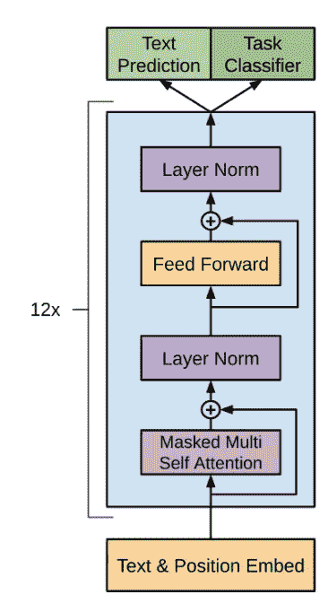
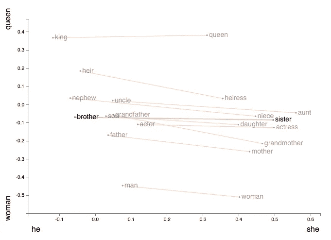
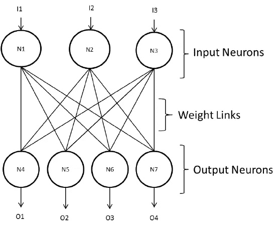
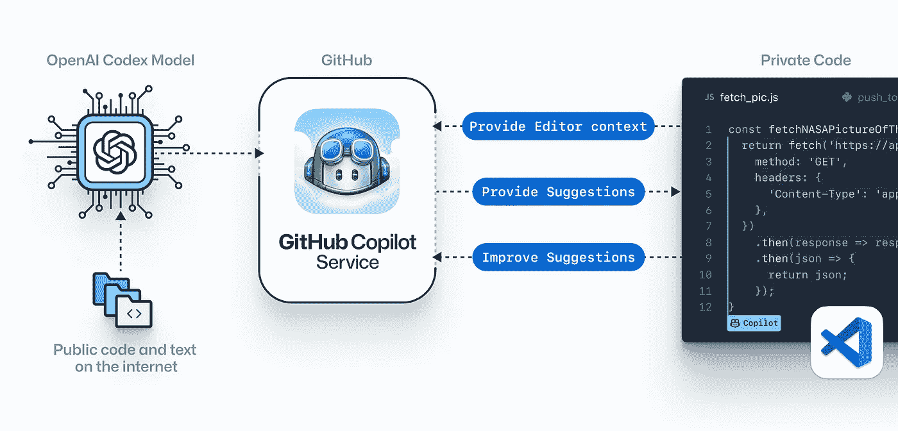
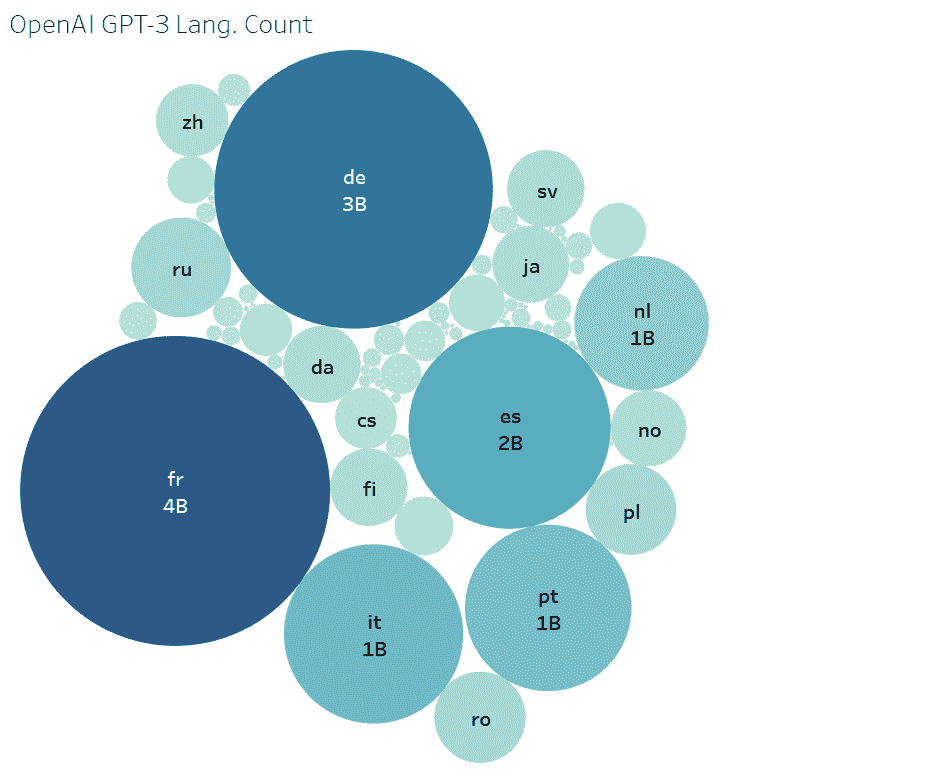

# 使用高级成对编程加速开发:GitHub Copilot

> 原文：<https://medium.com/analytics-vidhya/speed-up-the-development-with-advanced-pair-programming-github-copilot-68eb6d30a993?source=collection_archive---------13----------------------->

## 微软无法摆脱的东西，你可能也无法摆脱！

## 你好，技术爱好者，欢迎来到我的博客！请继续阅读，了解政治、技术和公众对本周推出的伟大神奇人工智能算法的理解和观点。

# “任何在 OpenAI 投资的人只能期待 100 倍于他们投资的回报”

## 先说微软对 OpenAI 的 10 亿美元投资

OpenAI 是一家总部位于旧金山的研究实验室，由包括埃隆·马斯克和萨姆·奥特曼在内的硅谷名人创立，致力于创造人工通用智能(AGI)。

为了抑制投资者的贪婪，OpenAI 作为一个利润受限的实体运营。

CEO 时刻:[山姆·奥特曼](https://medium.com/u/22acd7905c72?source=post_page-----68eb6d30a993--------------------------------)和[塞特亚·纳德拉](https://medium.com/u/d989edf5a0ea?source=post_page-----68eb6d30a993--------------------------------)

这项投资使微软成为 OpenAI 云计算服务的“独家”提供商，两家公司将合作开发新技术，探索人工智能的*神奇公式。*

# GPT -3 和资本主义；繁荣之后会有萧条吗？

我们已经注意到，政治家们被首席执行官创造的巨额税收以及通过支付选民工资获得的声望所吸引。政客们认为山姆和其他试图说服政府接受寡头政治的资本家没有什么不同。

[山姆·奥特曼](https://medium.com/u/22acd7905c72?source=post_page-----68eb6d30a993--------------------------------)建议**财富征税策略**，提到

> “美国股票基金将通过对超过一定估值的公司每年征收其市值的 2.5%的税，以转让给该基金的股份支付，以及对所有私人持有的土地价值的 2.5%的税，以美元支付。”

对此，麻省理工学院的经济学家德隆·阿西莫格鲁和科技咨询公司米勒-克莱恩联合公司的创始人理查德·米勒告诉美国消费者新闻与商业频道:

> "奥特曼的文章让人感觉混乱，其模式是不受约束的资本主义."
> 
> "对人工智能的能力有一种令人难以置信的错误乐观."

# 副驾驶的秘诀:GPT 3 号的结构

GitHub Copilot 已经接受了数十亿行公开代码的训练。虽然我们有趣地探索了后果，但其背后的处理最终是基于 GPT-3 的，所以让我们看看它是如何工作的。

*为了更好地理解基于 Transformer 的语言模型的架构，我想让你按照问题进行解释:*

# 模型如何接受输入，GPT 的输入和输出是什么？

## 1.定义输入和输出:

[来源](https://arxiv.org/abs/1706.03762v5)

> 输入序列—获取下一个单词。

**输入:**

对于 GPT-3，输入是 2048 个单词的序列(也称为标记)。

**输出:**一旦我们给出了输入，我们就会得到对下一个单词的猜测作为输出。

GPT 输出不仅仅是一个猜测，它是一个猜测序列(长度为 2048)(每个可能单词的概率)。不断重复以获得生成的长文本。[举例](https://dugas.ch/blog.html):

> **不是所有英雄都戴斗篷** - > *而是*
> **不是所有英雄都戴斗篷而是** - > *所有*
> **不是所有英雄都戴斗篷而是所有** - > *反派*
> **不是所有英雄都戴斗篷而是所有反派** - > *做*

# 机器不懂单词，那么我们怎么把单词变成向量呢？

## 2.字节对编码

GPT-3 使用字节级字节对编码(BPE)来提高效率。这表明词汇表的“单词”不是完整的单词，而是在文本中频繁出现的字符组(对于字节级 BPE，字节)。

*   第一步:保存一个所有单词的词汇表，这将允许我们给每个单词一个值。
*   **第二步:**把每个单词变成一个 **one-hot 编码向量。**

> ***GPT 有 50257 个单词的词汇表，*** 我们对序列中的每个单词都这样做，结果得到一个 2048×50257 的 1 和 0 的矩阵。

# 生成的矩阵大多用零填充，浪费了很多空间。我们将如何解决这个问题？

## 3.把...嵌入

***GPT 使用 12288 维度。***

维度基本上是数据的属性**(国王/王后)**，因此对于文本嵌入，我们必须根据特征**(他/她)**准确地知道哪个单词意味着找到它们之间的关系，如图*图*所示。

这有助于通过每个属性的值将单词的含义信息存储到一个更小的维度空间中。

2D 嵌入的向量表示。[来源](https://res.cloudinary.com/practicaldev/image/fetch/s--R97eB0d_--/c_limit%2Cf_auto%2Cfl_progressive%2Cq_auto%2Cw_880/https://www.nexmo.com/wp-content/uploads/2020/10/word2viz-queen.png)

> 我们将 2048×50257 序列编码矩阵与 50257×12288 嵌入权重矩阵(已学习)相乘，并最终得到 2048×12288 序列嵌入矩阵。

# 对于序列中的输出，如何预测关注哪个输入单词，关注多少？

## 4.注意:

**注意力做什么:**

它将一个查询和一组键值对映射到向量形式的输出。输出计算为这些值的加权和。

**GPT 的多头注意力:**作者提出的 GPT 模型，他们使用多头注意力。这意味着*注意力*过程被重复多次(在 GPT-3 中是 96x)，每次都有不同的学习查询、键、值投影权重。

**GPT-3 中的稀疏注意力:**变压器是强大的序列模型，对于非常大的输入，计算单个注意力矩阵变得不切实际。因此，在**稀疏注意力模式中，每个输出位置仅从输入位置的子集计算权重。**

它具有以下优点:

除了显著加快注意力矩阵的重新计算以节省内存之外，它还提供了比完全注意力更低的损失。

> 稀疏注意力是对*注意力*机制的算法改进，从比以前可能长 30 倍的序列中提取模式。

## 5.正向输送

这是一个简单的多层感知器，有一个隐藏层

前馈工作:它接受输入，乘以学习的权重，加上学习的偏差，应用于 ReLU(激活函数)并得到结果。

## 6.添加定额

在多头注意和前馈块之后，块的输入被添加到它的输出，并且结果被归一化。

# 在输入被处理成一个巨大的矩阵后，它包含了下一个预测单词的信息。我们如何提取这些信息？

## 7.解码

为了获得信息，在嵌入部分中完成的映射被反转，以将我们的输出 12288 向量嵌入转换回 50257 字编码。

在一个快速的 *softmax* 之后，我们可以将结果值视为每个单词的概率。

# GitHub 副驾驶背诵

## GitHub Copilot 是一个设计用于与程序员一起工作而不是独立工作的工具(例如，结对程序员)。这是一个巨大的成就。向 GitHub Copilot 团队致敬！

对于许多人来说，Copilot 将成为类似于 IDE autocomplete 的程序员工具箱中不可或缺的一部分。

它十次中有一次能猜出我们想要写的确切代码，其余时间它会建议一些**相当好的**，或者**完全不要**。但是当它猜对的时候，感觉它在读我们的思想！

GitHub Copilot 作为 VS 代码扩展的工作:编辑器插件向 GitHub Copilot 服务发送评论和代码，然后使用 OpenAI Codex 合成并向用户提供想法。【[来源](https://copilot.github.com/diagram.png)

# GitHub Copilot 架构，语言不可知吗？

根据 GitHub 的说法，Copilot **支持广泛的框架和语言**，尽管正如我们看到的技术预览版，它主要专注于动态语言，如 *Python、JavaScript、TypeScript、Ruby、*和 *Go。*

它使用**相同的 GPT-3 架构用于不同的语言**，因为它是使用 GitHub 的公共源代码的巨大语料库作为数据集的数据源进行训练的，数据集包含多种语言。

表示气泡图:GPT-3 使用多种语言数据集来源进行训练

这个专业可以消除进入壁垒。它有助于学习新的语言，也有助于从事多语种代码工作的人们。

# GitHub Copilot 的实践演示及其对特定领域优势的影响。

# **在发展领域:**

Github Copilot 对于那些正确记录和注释代码的开发人员来说是非常棒的。据我说，这让程序员变得更有效率，这将增加 T21 对技能的需求。

## 1.API 开发领域:

*   它能够编写 Javscript 代码，也可以编写用于开发完整 API 和 Python 脚本的代码。
*   它可以用来编写不同的算法，如二分搜索法，二进制排序，合并排序等。
*   它在重复性的低信噪比语言中很有用，比如 React 或 Java，但是如果你在 [Clojure](https://clojure.org/about/functional_programming) 环境中编写代码，它就没那么吸引人了。

Github Copilot 最棒的地方在于，它会自动生成最佳代码，同时考虑到时间复杂度。

## 2.Web 开发域:

*   Github Copilot 在预测**反应代码**方面做得相当不错。
*   当我们试图预测 **React+Typescript** 时，Github Copilot 无法执行有效的预测，它继续预测最常见的用例。
*   Redux 需要很多样板函数。在 Redux 上尝试 Github Copilot 时，它经常不确定相关性。它不知道什么是相关的，什么是无关的。

## 3. **App 开发领域:**

*   在使用 flutter 时，Github Copilot 的基本样板代码很容易预测。
*   随着代码开始变得复杂，我们需要创建带有查询和响应的 API，它无法准确预测完整的代码。

*   像 [Geeks For Geeks](https://medium.com/u/158bf765767a?source=post_page-----68eb6d30a993--------------------------------) 和 [LeetCode](https://medium.com/u/33f6b9a1a861?source=post_page-----68eb6d30a993--------------------------------) 这样的平台，不用花时间和资金雇人写代码教学。这将为新生带来更有效的教学和学习。

根据测试由[克里希·纳伊克](https://medium.com/u/d67809141db2?source=post_page-----68eb6d30a993--------------------------------)编写一个函数，寻找一个数组中最小的五个元素并按升序排列； **Copilot 创建该功能仅用了 2 秒钟。**

## 3.机器学习管道和深度学习的数据科学:

*   擅长基础数据预处理和探索性数据分析。
*   它能够为一个基本的神经网络编写一个函数。
*   它努力编写基本的机器学习模型代码。
*   很多时候，当我们传递注释时，它无法定义特定的机器学习模型。
*   每次我们让 [GitHub](https://medium.com/u/8df3bf3c40ae?source=post_page-----68eb6d30a993--------------------------------) Copilot 编写基本机器学习的代码时，它通常会给出一个基本的代码结构，作为输出的机器学习代码应该是什么样子。

*   **Github Copilot 对于数据科学来说不如它对于编写 DSA 和 Python 脚本来说那么好。**当涉及到编写需要一些严肃思考的代码时，如编写复杂的深度神经网络，Github Copilot 无法达到预期。

# 对最热门讨论的看法

## **观察到的缺点:**

*   副驾驶建议的代号不是 ***测试的*** 。代码几乎总是无法编译或运行。
*   Github Copilot 只存储一个 ***限量*** 的上下文。任何超过 100 行的源文件都会被截取，该工具只查看它之前的上下文。因此，在编写长代码时，期望工具的 ***持续性能*** 真的会令人失望。
*   GitHub Copilot 经过了数十亿行公开代码的训练，非常准确。因此，建议的代码和它所通知的代码可能有直接的联系。

# 进一步的想法和观点:

## 在生成代码的末尾生成简短的摘要以便更好地理解，

自动代码完成会让新手很难理解 GitHub Copilot 创建的代码，而对于 AI 编写的大代码，需要更多的时间来理解

我想知道我们是否可以做一个修改的版本，在生成的代码的结尾创建一个简短的书面摘要，使用序列代码作为输入。

## 采用语音形式的输入功能，方便使用

我们可以通过使用最先进的 ASR 模型(如 Wav2Vec2)执行语音到文本转换的任务来实现这一点。

不过，在这一步之前，我们需要在一个大型数据集上训练模型，该数据集包含关于不同编程语言和计算机科学相关领域的技术对话。

## 谢谢读者陪我到最后；我的博客促使你加入 GitHub Copilot 的等候名单了吗？请在评论中让我知道它对你的效果如何！