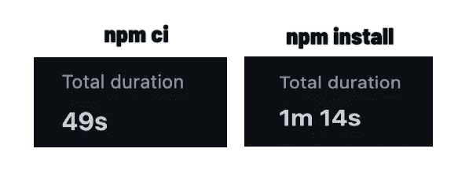

# 加快您的节点 CI 流程

> 原文：<https://medium.com/analytics-vidhya/speed-up-your-node-ci-pipelines-9934127c1fae?source=collection_archive---------28----------------------->

今天，我们将讨论一个小的改进，它可以使我们的节点流水线更快。

由 [Unsplash](https://unsplash.com?utm_source=medium&utm_medium=referral) 上的 [CHUTTERSNAP](https://unsplash.com/@chuttersnap?utm_source=medium&utm_medium=referral) 拍摄

几天前，我遇到了一个我从未读过或听说过的 npm 命令。在那之前，我使用 npm install 来准备环境，在我的持续集成管道中包含所有依赖项。但是在我稍微处理了一下并测试了一下之后，我留下了深刻的印象。管道速度提高了 30%以上。

更改为 npm ci 之前和之后

# npm ci

正如您在标题中看到的，我所说的命令是 npm ci。但是它实际上做什么呢？为什么会快这么多？npm 安装有什么不同？下面你可以看到 ***npm 安装*** 和 ***npm ci*** 最重要的区别列表。

1.  ***npm ci*** 忽略 package.json 中指定的依赖项，只安装 package-lock.json 文件中的依赖项。
2.  如果 package.json 和 package-lock.json 不包含相同的依赖项，则会返回错误。另一方面， ***npm install*** 命令会调整 package-lock.json 文件。
3.  如果 node_modules 文件夹已经存在，将通过 npm ci 将其删除并完全重新创建。
4.  package.json 和 package-lock.json 被冻结。两者都不会改变。

通过以上我列举的种种， ***npm ci*** 比 ***npm 安装*** 要快得多。我可以推荐大家在自己的 ci 里试试。不仅仅是因为时间的提升。还因为如果 package.json 和 package-lock.json 不包含相同的依赖项，就会引发错误。

# 最后的想法

今天我们讲了 ***npm ci*** 和 ***npm 安装*** 的区别。我希望这篇短文是有帮助的，你能够带走一些东西。如果你有任何问题或笔记，请在评论中留下。