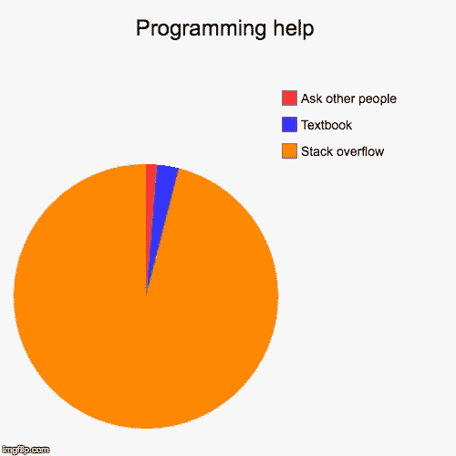

# 将您的熊猫计算速度提高 10 倍—更快地读取文件！

> 原文：<https://medium.com/analytics-vidhya/speed-up-your-pandas-computation-10x-read-files-faster-58c43a2122a1?source=collection_archive---------20----------------------->

# 当你的数百万条数据记录被熊猫读取时被卡住了？

我们都经历过并面临这个问题。

最近，我有一个价值数百万行的数据集，通常，通过一行普通代码读取数据需要 35-40 分钟

> **df = PD . read _ CSV(' All _ data . CSV ')**

感谢互联网提供了免费的在线资源！

1.  Stackoverflow
2.  油管（国外视频网站）
3.  中号和更多。

来源:谷歌图片。

我在 read_csv()库中遇到了一个非常有趣的参数，它可以帮助您成块地阅读，并且显然可以将您的处理速度提高 10 倍。

# 代码:

> **chunk size = 100000
> list _ =[]
> 对于 pd.read_csv("All_data.csv "，chunksize=chunksize):
> list_。append(chunk)
> df = PD . concat(list _，axis=0)**

假设您希望惰性地遍历一个(可能非常大的)文件，而不是将整个文件读入内存，如下所示:

通过指定一个`chunksize`到`read_csv`，返回值将是一个`TextFileReader.`类型的可迭代对象

我敢打赌，这一小块代码将创造奇迹，并肯定会加快你的进程 10 倍

资料来源:联合国人类住区规划署

来源:

1.  [熊猫文档](https://pandas.pydata.org/pandas-docs/stable/user_guide/io.html#io-chunking)
2.  [堆栈溢出](https://stackoverflow.com/questions/25962114/how-do-i-read-a-large-csv-file-with-pandas)
3.  [卡格尔](https://www.kaggle.com/getting-started/203415)

如果这对你的下一个项目有用，请在下面评论，直到那时，

编码快乐！