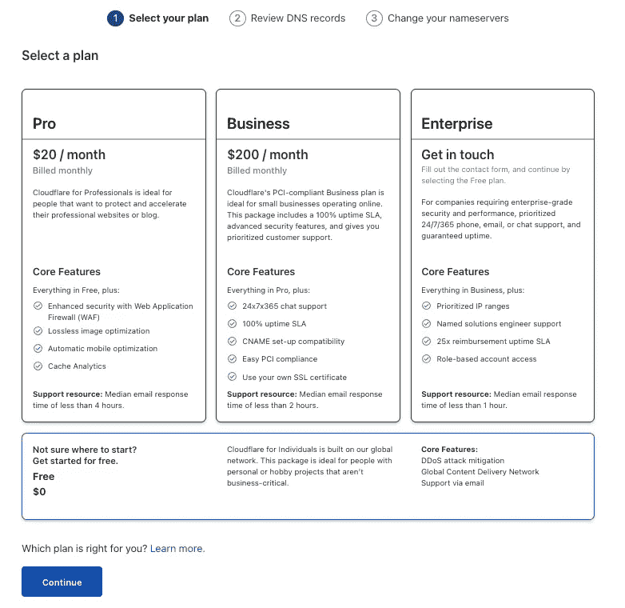
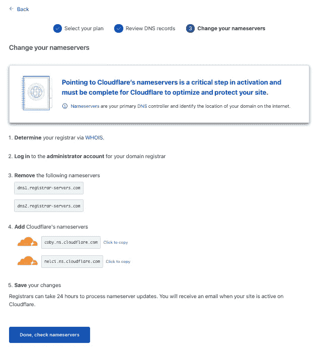

# 免费使用 Cloudflare 加速您的网站

> 原文：<https://medium.com/analytics-vidhya/speed-up-your-website-with-cloudflare-8c72570c8d22?source=collection_archive---------1----------------------->

来源:[囤货](https://stockup.sitebuilderreport.com/)

参观者在面对装货时非常严格。即使你的网站会让他们受益，但是对于一个缓慢加载的网站，他们可能不会容忍。

有两种常见的方法可以提高网站的访问速度:(1) **减少你的捆绑包大小**和(2)使用**内容交付网络(CDN)** 。

第一种解决方案可能需要复杂的步骤，尤其是对于大型项目。有很多内容需要讨论，比如:优化依赖关系、统一模块、替换库等等。换句话说，你必须检查并修改你的项目文件。我们不会跳到这一部分，但是减少您的包大小可以削减您的云请求成本或带宽成本(如果有的话)。

第二个解决方案比前一个相对简单。没有必要改变你的代码。**简而言之，你的网络将被 CDN 全球缓存**。所以对于下一个请求，CDN 会从最近的地方给你缓存的文件，而不是从你真正的主机网站请求和获取。除了减少加载时间，它还可以提高可用性和安全性。想象一下，你的主机站点既没有启动也没有处于正常状态，但是因为你的站点被缓存了，你的用户仍然可以访问它。

有几个服务我们可以使用:GCP 云 CDN，AWS CloudFront，或者 Azure CDN。这些服务采用现收现付的方式。即使有免费层，但一段时间后，你必须支付权利？对我来说，我需要没有一堆配置的终身免费服务。这些日子我能得到一生的自由吗？别担心！有一家提供商为你提供免费的 CDN 和一系列功能(至少现在是这样)。也就是 Cloudflare，还记得 CloudFront ≠ Cloudflare 吗——cloud flare 的产品之一是[1.1.1.1](http://1.1.1.1)

我喜欢的一些功能是安全性— SSL/TLS、保护 DDoS 攻击、防火墙(过滤一些 IP、国家等以访问您的网站)、内置分析，当然还有性能！我们将介绍如何使用 Cloudflare 加速您的 web。在建立您的网站之前，**确保您拥有一个域名**或者购买 Cloudflare。

# 带 Cloudflare 的 CDN

## 注册 Cloudflare

使用您的电子邮件注册 [Cloudflare](https://cloudflare.com/) ，登录并不要忘记激活您的电子邮件。很简单，不需要教程，对吗？

## 添加网站

转到[仪表板](https://dash.cloudflare.com/)并添加一个站点。

键入您的站点，并添加站点

确保选择免费计划，然后继续。你也可以用别人的，但我从来不碰它，我们的目的是终身免费使用，对吗？

在检查 DNS 记录时，不需要任何步骤。基本上，确保您的域提供者中的记录存在。继续。

更改您的名称服务器，Cloudflare 为您提供了一个通用的解决方案来更改它，但每个域提供商都有自己的设置。探索您的提供商！

完成，检查名称服务器

## 快速入门指南

检查所有表格，随意使用您自己的表格，以下是我的总结:

## 完成的

完成了。是的，完成了。等待你的网站上线，对我来说不到一个小时。

## 探索

有许多功能要涵盖。自己探索，是免费的吧？

以下是我对这些特性的一些概述:

*   **分析**

你知道[谷歌分析](https://analytics.google.com/)吗？和这个很相似，但是更简单。我们可以检查我们的 web 流量:聚合器、带宽和人口统计。希望他们加实时访客。

*   **DNS**

类似于我们的域名提供商，您可以添加类型 A，AAA，CNAME，TXT。

*   **电子邮件**

知道这个我很激动。基本上，你必须支付更多的费用给你的域名提供商来使用你自己的电子邮件，但是有了这个，你就有了同样的功能！不幸的是，我仍然要求访问，将给予更多的概述一旦获准。

*   **SSL/TLS**

保留默认设置。

*   **防火墙**

向访问您网站的任何人添加过滤器。你可以阻止国家或甚至 IP 访问你的网站。

*   **访问**

千万不要用。我相信这是一个很好的功能，可以在没有 VPN 的情况下根据一些策略(通常是电子邮件)来控制访问。

*   **速度**

类似于灯塔给你像第一个内容丰富的油漆(FCP)和第一个有意义的油漆(FMP)速度概述

*   **缓存**

如果您部署了您的网站，但您的网站没有更新？可能是因为 CDN 还在缓存你之前的版本。您可以在此设置中清除。

*   **工人**

我相信无服务器是描述这一特性的最佳词汇。嗯，常见的无服务器，你部署代码而不是应用程序。

最酷的是你可以使用 **Workers KV** ，它的应用程序商店有键值对。像` *await NAMESPACE.put(key，value)* 一样简单地存储数据，并通过`*await namespace . get(key)*获取数据。最终，您可以拥有配置更少的无服务器应用和数据存储。

*   **规则**

类似于防火墙，但针对特定 URL 进行配置

*   **应用程序**

扩展到您的网络，类似于 AWS 中的 Marketplace 或 ZOOM 中的 Apps。

记住，我们使用**免费计划**。看到了吗？除了域名，我们可以免费获得一系列功能。

# 摘要

CDN 可以通过减少加载时间来优化和加速您的网站。我已经感觉到了，也很满足。在此使用案例中，我们使用 Cloudflare。Cloudflare 是免费为您提供更多功能的 CDN 提供商之一。Cloudflare 还为您访问网站提供了更多配置。

我不建议你将免费计划用于商业目的。但是自由计划对于副业、个人网站和/或爱好来说已经足够了。

感谢 Cloudflare！继续努力，别忘了给 free plan 添加更多功能。

干杯！

[抚摸我](https://ilhamsyahids.com/)