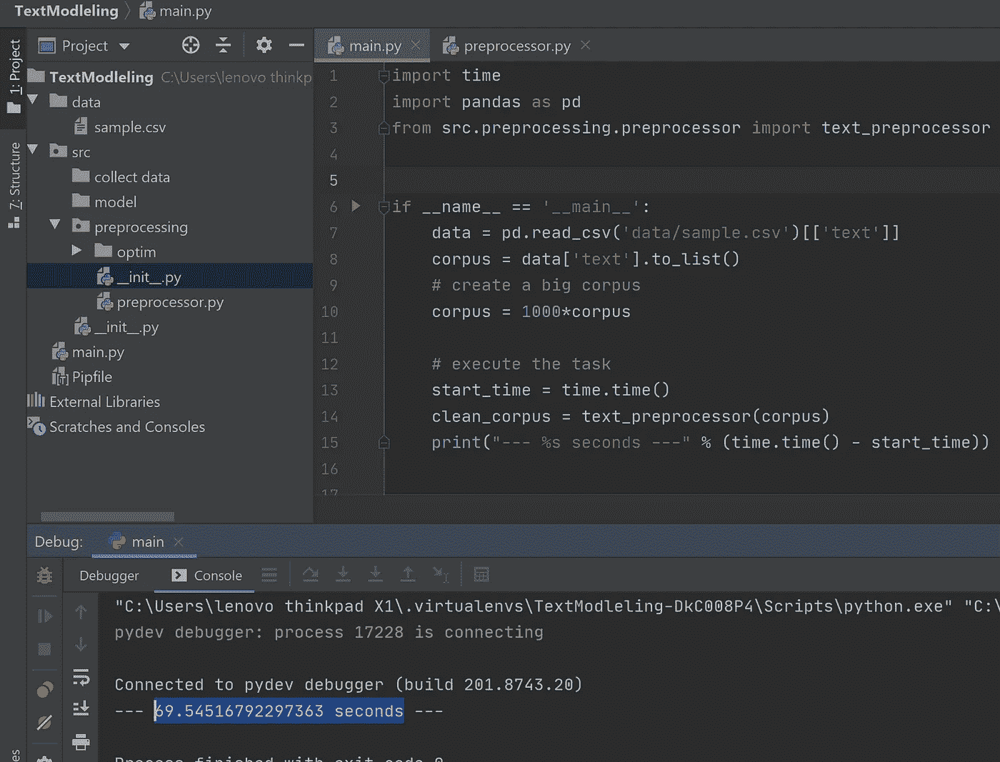

# 使用 cy thon+30 倍加速您现有的 Python 项目

> 原文：<https://medium.com/analytics-vidhya/speedup-your-existing-python-project-with-cython-30x-1dc1ffaf147a?source=collection_archive---------2----------------------->

你喜欢 Python 吗？我也是。但是说实话。虽然 Python 是 2 年以来最好的编程语言，但他的速度表现与刚才相差甚远。

我听到你的声音告诉我:我们有许多工具来加速我们的代码:dusk，dask，swifter，pyparallelize(我创建的那个。[此处更](https://github.com/isaac47/pyparallelizer))；是的，你是对的。但是，即使我们使用了所有这些工具，与其他语言相比，我们代码的性能仍然很差。

速度计划对比(来源:【https://www.researchgate.net/】T2)

为什么？Python 是解释语言，不是编译语言。我不会深究这种差异的细节(你可以在这里了解更多关于那个[)。](/young-coder/the-difference-between-compiled-and-interpreted-languages-d54f66aa71f0)

但是如果我告诉你，我们可以用 Python 实现和最好的语言如 C 一样的速度性能呢？你兴奋吗？所以，让我们进入主题，向您介绍 Cython，Python 的加速包装器。

# **什么是 Cython**

正如我们之前看到的，Python 在加速方面的性能很差，并且随着要处理的数据量的增加，性能会呈指数级增长。这就是 Cython 的用武之地。

**Cython** 是 Python 的一个修改包装器，增加了 C/C++数据类型。它在 other 中扩展了 Python 的功能，以处理许多新特性，如:加速执行、访问内存中的变量、指针…为了实现这一点，Cython 增加了类型变量的可能性；然后，Cython 将 Python 代码编译成字节码表示，并在运行时在虚拟机中执行结果。

# **为什么需要 Cython**

当我们想要加速我们的代码时，通常会实现 Cython。但是它可以做更多事情:

*   它可以用来访问 RAM 中的数据以释放其他空间。这非常有用，但 Python 不允许这样做
*   它可以用来将 C/C++翻译成 python，因为它是 C/C++到 Python 和 Python 到 C/C++的双向包装器

你已经被说服了吗？让我们跳到下一部分，看看您的 it 工作

# **工作原理**

为了完成前面列出的所有任务，Cython 需要将我们的 Python 代码转换成 C/C++字节码表示。我们将通过 3 个步骤来实现这一目标:

*   **步骤 1** :用我们的文件扩展名编写我们的 python 函数。巴拉圭
*   **第二步**:在文件扩展名中编写该函数的 Cython 版本。圣体容器
*   **第三步**:创建设置文件。指向。pyx 文件
*   **第四步**:进入 setup.py 目录，运行安装程序。这将生成 C/C++字节码和其他文件

> > python setup.py

*   步骤 5 :导入我们函数的新版本，并在我们的项目中使用它

## 就是这样！

注意，Cython 提供了不同类型的函数(cdef、cpdef)，但是我们将在下一节中看到如何使用它。

# **用 Cython 的简单例子**

假设您的数据科学家工作是处理+100 Go 文本数据，该过程需要几天时间才能完成。该项目组织如下:

1.  **安装包**

我们需要首先从[这里](https://pypi.org/project/Cython/)安装 Cython。如果尚未安装，您需要安装 setuptools

> > pip 安装 Cython==0.29.23
> > pip 安装设置工具

请注意，Cython 有一个新的测试版，如果您愿意，可以尝试一下。

2.**创建 Cython 版本的代码**

我们将使用来自[这个视频](https://www.kaggle.com/sudalairajkumar/getting-started-with-text-preprocessing/data)的样本数据。对于基线，我们构造了处理函数并得到了运行时间。

现在假设我们只想将一个函数(预处理)Cythonize。为此，我们将创建一个新的文件夹(不是强制的)"/optim "并将我们所有的 Cython 文件存储在上面。

我们将复制。py 文件，并将扩展名重命名为。pyx into /optim。完成后，我们将创建 setup.py 文件。

之后，我们可以运行 setup.py，并在代码中使用“/optim”中的 preporcessing 函数。这种运行将生成新的文件。

要生成文件，请使用以下命令:*python setup . py build _ ext—in place*

*注意:当我们试图运行 setup.py 时，可能会出现错误。__init__ 时可能会出现此错误。/optim 中存在 py 文件。所以，建议运行 setup.py，然后创建 __init__。py 文件。*

最后，我们可以使用这个新的 cythonize 预处理函数运行 main.py。

哦等等！稍等一下。您不必定制。之前有变量类型的 pyx？

好问题。请注意，您不必定制函数来获得性能。就像你在下面的结果中看到的那样，在现有的 python 函数上使用 Cython 而不做任何改变会产生更大的不同。

使用 Python 的结果

使用 Cython 的结果

正如你所看到的，我们仅仅使用 Cython 就获得了 10 秒的加速，没有任何变化。听起来不错吧？

现在让我们通过优化超越这一点。pyx 函数。

# Cython 优化

在深入真正的 Cython opyimization 步骤之前，只需查看设置时生成的 preprocessor.html 文件。

这个文件帮助我们可视化我们的代码编译水平。黄色越多，使用 python 运行的代码就越多，因此速度就越慢。我们的主要目标是更好地优化它，以便用 c 语言编译

为了优化 Cython 函数，我们可以在两个级别进行游戏:

1.  **一级**:功能

基本的 Python 函数关键词是“def”。在 Cython 中，我们有两个功能关键词:

**a. cdef** :这个函数是 C/C++版本。所以:

*   函数变量和参数必须是 C/C++(例如变量类型)。
*   不能从本机 Python 文件中调用此函数。py(如从…导入…)
*   它更多地用作子功能(优化功能的一部分)。

**b. cpdef** :这个函数是 C/C++和 Python 的混合体。

*   C/C++和 Python 必须理解变量参数。但是也可以不使用 C/C++变量。
*   可以从任何 python 文件中调用该函数。巴拉圭

2.**第二级**:变量

Cython 允许我们使用所有的 python 类型(取决于函数的情况)。但是我们需要知道 C/C++ x Python 的类型等价如下。

更多[这里](https://documentation.help/Cython/language_basics.html) …

现在我们对 Cython 有了很好的了解，让我们实现最终的解决方案，看看我们获得的结果。

# Cython 在现有项目上的最终整合

对于最后一个优化，我们将通过设置变量类型来修改 preprocessor.pyx 文件，并将本机 python 函数类型转换为 C 类型。

结果如下:

我更改了文本编辑器，以更多地显示修改。

然后，我们需要使用 setup build 命令重新构建所有安装文件(如果出现错误，首先删除 optim 上的 __init__ 文件，并在构建结束后创建它)，我们可以通过打开 reprocessor.html 文件快速查看结果。

如你所见，我们的黄线比以前少了。它证实了代码比原生 Python 更 C 的事实。现在让我们找出新版本所花费的时间。我们还可以注意到，我们仍然有黄线，所以仍然有纯 Python 代码。我们可以继续更好地改造这些代码。

正如我们所看到的，程序的速度明显提高，意味着新的 Cython 代码版本更好。

我们可以继续努力使代码在其他方面更好，从而获得更快的速度。

# 结论

我们的工作是展示如何转换我们的原生 Python 脚本以获得更快的速度。Cython 是完成这项任务的一种方法。我们可以找到其他类似的 Cython 分布。也可以直接用 natice C 编程写代码，作为 Python 模块导入。

Ps:可以在这里找到[项目](https://github.com/isaac47/cython_project)！

# 不要做数据等待，开始编码！