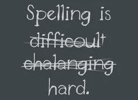
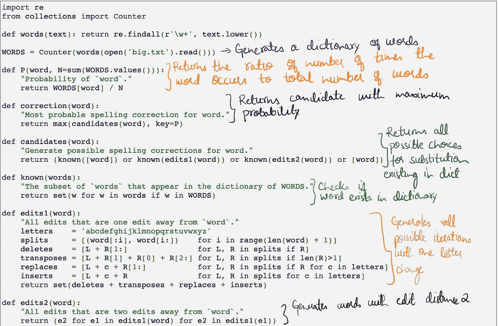
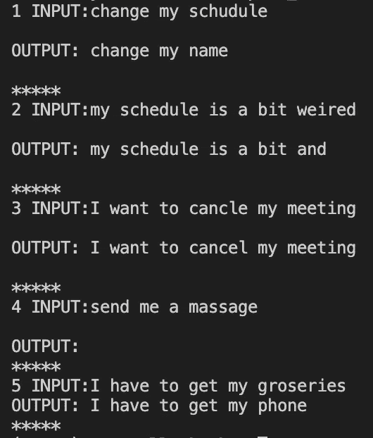

# 拼写检查:你可能想知道的一切

> 原文：<https://medium.com/analytics-vidhya/spellchecker-review-71a461e20279?source=collection_archive---------7----------------------->

"他们为什么不挑选 ***或者*** 的袋子？"

不是吗？

我们知道上面的句子应该被改正，把“theer”替换成“their ”,但是我们如何确保计算机知道呢？

我最近深入到拼写检查领域，这一切都是从[彼得·诺维格的博客](https://norvig.com/spell-correct.html)开始的，他的博客讲述了他在飞行途中想到的最简单的拼写检查器，以及其他所有的库，它们都是同一种方法的变体。在本文中，我将更详细地阐述这种方法，确定拼写检查的范围以及本文中需要改进的地方。

Peter Norvig 的实现(带我的评论)

我试着注释了上面的代码，这是一个简单的算法，它从传入的文本文件(这里是 big.txt)中获得智能。它使用文本文件生成单词字典，并假设这些单词存在于英语中，还使用它来计算单词在英语文本中出现的概率。因此，当一个拼写错误的单词被提供给**校正**函数时，该算法通过执行以下操作之一生成其编辑距离为 1 的变体:删除、转置、替换、插入。类似地，它简单地对生成的单词再次调用函数，以生成编辑距离为 2 的单词列表。下一步是从生成的纠正单词列表中选择最合适的单词；为此，它使用每个单词从最初保存的概率中出现的概率。例如，如果它必须在“the”和“then”之间做出选择，它会选择“the ”,因为它在文本中出现的频率更高。

# 限制

**与上下文无关** —算法在做出决定时不会考虑周围的单词。我们无法知道它应该是“他们的”还是“那里的”。

**超出编辑距离 2** —生成超出编辑距离 2 的变化很慢。

**增加选择的智能—** 权衡不同的替代，一个“r”—>“RR”应该比“c”—>“r”需要更低的成本

基于上述算法的包

1.  [Pyspellchecker](https://pypi.org/project/pyspellchecker/)
2.  [文本块](https://textblob.readthedocs.io/en/dev/quickstart.html)
3.  [自动更正](https://github.com/fsondej/autocorrect)

## 上下文拼写检查器

让我们来看一下[上下文拼写检查器](https://spacy.io/universe/project/contextualSpellCheck)，我在 [BERT](https://arxiv.org/abs/1810.04805) 的基础上做了进一步的探索，它只对词汇表之外的单词或非单词错误有效。以下是对我的一些意见的回应。

上下文拼写检查器的输出

数字 4 没有输出，因为输入不包含任何词汇以外的单词(但是我们当然希望将“消息”更正为“消息”——尽管就个人而言，我更喜欢接收消息)。对于其他示例，看起来 BERT 改变单词以形成它以前在其训练数据中见过的句子，似乎没有考虑不正确拼写的单词是什么。

## **审查不同的拼写检查方法**

1.  Soundex:这是一个基于声音的拼写检查器，它为每个单词创建代码，并使用它进行比较。
2.  语音相似性:它同样基于声音，将单词分成三个音素来进行比较，例如，肺炎<=> newmoanya
3.  Speedcop 系统:通过删除重复字符并使用精简版本进行比较来减少词典的单词量。
4.  字符串匹配:使用编辑距离/比较子字符串(两个字符串共有多少个三元模型)
5.  特征向量:根据字母的存在/不存在将单词转换成向量，并用于比较。
6.  错误概率:不同种类的错误有不同的权重，基于哪种错误更有可能是因为使用的键盘或系统。

## 有待解决的问题

在所有的探索之后，仍然需要解决的两个问题是:

1.  根据上下文将一个不在词汇表中的单词修正为正确的单词(从“theer”到“their”而不是“there”)
2.  基于上下文修复词汇表中的单词(“消息”->“消息”)

我们该如何着手呢？

要么我们可以“谷歌”人们构建句子的所有不同方式的语料库，并专注于深度学习模型，要么我们可以使用不那么沉重的方法。

通过为每个潜在选项生成嵌入并在输入句子中找到与其周围单词的相似性，单词嵌入可以是一种解决方案，但这里的问题是，像“their”这样的单词没有它们通常出现的特定单词组合(单词嵌入的整个基础)，所以它不能解决第一个问题。对于第二个问题，我们将不得不为句子中的每个单词生成潜在的选择，因为我们不知道哪个是不正确的单词(因为没有什么是不在词汇表中的)，然后尝试在生成的所有排列之间找到相似性，这导致问题空间的高度复杂性，并且可能将句子“给我发消息”改为“给我发消息”。

另一种方法是使用 POS 标签来寻找某些不被遵循的模式，同时避免无意中将一个不常用的名字与一个字典中没有的单词固定在一起。

注意:这里我们将拼写错误分为两大类，一类是不在词汇表之内的，另一类是属于词汇表的一部分，但不适合上下文。

参考资料:

*   彼得·诺维格的拼写检查器
*   [拼写检查器调查](https://www.dcs.bbk.ac.uk/~roger/spellchecking.html)

*我是一名机器学习工程师，兴趣范围从统计学、NLP 到 MLOps。我用媒介记下我对最近感兴趣的话题的想法。可以在* [*linkedin*](https://www.linkedin.com/in/apurva-misra/) 和我联系