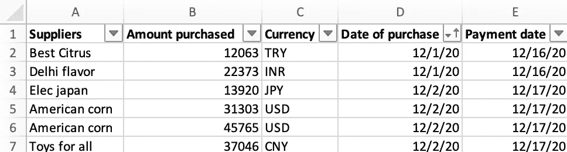
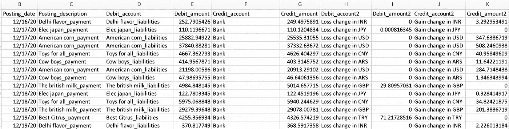
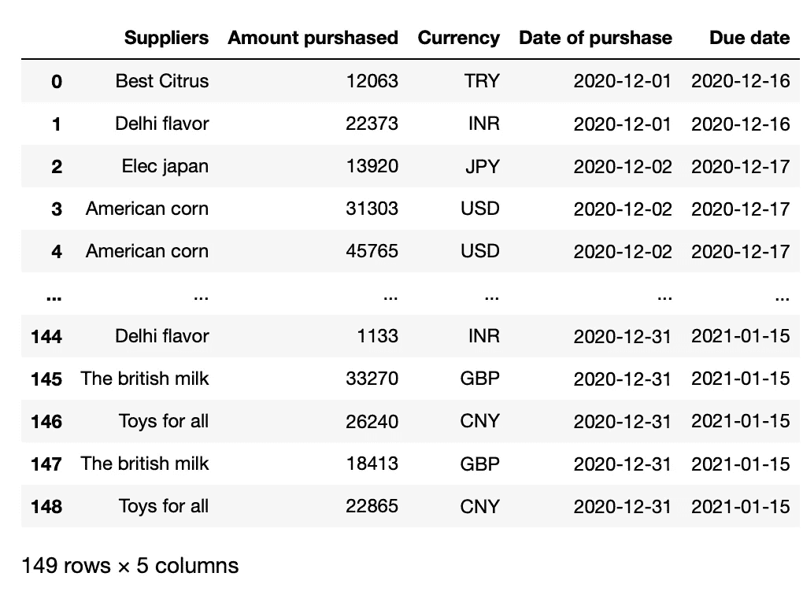

# 使用 Python 1/2 为您的 Excel FX 报表增添趣味

> 原文：<https://medium.com/analytics-vidhya/spice-up-your-excel-fx-report-with-python-1-2-183be5386a4e?source=collection_archive---------15----------------------->

一个简单的方法来自动化你的汇率 P&L 影响。第一步:与你的会计团队沟通。


[梁杰森](https://unsplash.com/@ninjason?utm_source=medium&utm_medium=referral)在 [Unsplash](https://unsplash.com?utm_source=medium&utm_medium=referral) 上的照片

汇率管理是自动化有意义的话题之一。我们正在讨论一个具有高度波动性的问题，如果你管理一家进出口公司，那么汇率可能是你 P&L 业绩的一个重要组成部分。

在本教程中，我将向你展示一个简单的方法来获得购买过程中每一步的最新汇率。在第一部分中，我将向您展示如何向您的会计团队发送与在世界各地购买的产品的购买成本相关的过账，并以正确的汇率转换付款。

为了避免过多的信息，我将在另一篇文章中介绍符合 IAS 标准的财务报表(以及对您当地 gaap 的一些建议)，以及如何使用这些数据来执行一些财务分析并在您的财务报告中绘制它们。

## 项目介绍:

我们有一个 excel 报表，其中有一个简单的 150 笔采购的列表，包括供应商名称、采购金额和运营货币；购买日期和付款日期。如果你想用的话，我的 github 上有这个文件。

[](https://github.com/Aymen-lng/IAS_21/blob/main/IAS21_part1.xlsx) [## 阿曼-液化天然气/IAS_21

### 在 GitHub 上创建一个帐户，为 Aymen-lng/IAS_21 的开发做出贡献。

github.com](https://github.com/Aymen-lng/IAS_21/blob/main/IAS21_part1.xlsx) 

图片来自作者

我们将构建一个 python 脚本，该脚本将分析每一笔采购，必须完成的会计过账(用正确的汇率转换的借贷)，计算每次付款时实现的外汇损益，并最终将会计过账写回到 excel 报告中，准备发送给您的会计团队。



## 标准框架:IAS 21(编码前的几个业务解释)

在开始编写代码之前，让我们解释一下购买的每一步我们将使用哪个比率。我们将使用的框架是 IASB(国际会计准则委员会)标准。这是适用于世界上大多数国家的标准，取决于公司的规模或您工作的市场([https://www . IFRS . org/use-around-the-world/use-of-IFRS-standards-by-jurisdiction/](https://www.ifrs.org/use-around-the-world/use-of-ifrs-standards-by-jurisdiction/))

我们将使用的具体标准是 IAS 21。如果你想了解更多细节，我在下面放了 IASB 文章的链接:

 [## 国际财务报告准则（InternationalFinancialReportingStandards）

### 国际财务报告准则基金会是一家在美国注册的非营利公司

www.ifrs.org](https://www.ifrs.org/issued-standards/list-of-standards/ias-21-the-effects-of-changes-in-foreign-exchange-rates/#about) 

这里使用的标准的要点是:

1.  购买材料时，我们使用购买日期来转换损益表中的成本和资产负债表中的供应商负债。
2.  当支付材料时，我们将使用支付日期的汇率在资产负债表上记录现金支出，使用“历史汇率”(购买日期的汇率)来结清负债，两者的差额就是损益
3.  在期末，当提交财务报表时，我们将保持历史汇率的非货币要素(如存货)和以实际汇率(报表日的汇率)记账的货币要素(如负债)分开。

不要担心它仍然有点混乱，现在我们将一步一步地构建项目:

## 步骤 1:设置 python 脚本并导入数据

让我们从脚本中使用的库开始:

那么我们这里有什么:

**OS** :用于导航进入你的电脑，找到你的 excel 报表的路径，其中有采购清单。
**熊猫**:著名的用来玩数据的图书馆。
**Datetime** :操作我们将用于这个项目的所有日期。
**Itertools** :如果你已经对循环很有信心，但还不知道 Itertools，你会发现一个很好的工具，它可以为代码后面使用的循环增添趣味。
**请求**和 **bs4** :用于废弃特定网站的汇率。
**Xlwings** :最适合我玩 Excel 的库。

然后，我们使用“os”找到报告，并创建一个变量“Data_Base”。

让我们通过打印数据框来看看结果:



图片来自作者

最后，我建议创建列表变量来存储数据框的元素，我们将在这些数据框上循环获取汇率并进行所需的计算。

## 步骤 2:采购成本和负债过帐

在这个项目中，我们将根据购买日期和/或付款日期对购买进行多次循环，以检查不同的汇率。我将在此介绍如何完成物料采购的会计过账循环。

让我们从购买日期的汇率开始。我们将删除来自 x-rates.com 的日期，以便获得汇率，我们只需将 1 种外币转换成欧元，然后删除结果。在 URL 中，我们只需用一个变量更改货币，用第二个变量更改日期，用另一个变量更改金额:

```
[‘https://www.x-rates.com/historical/?from='+**x(first variable)**+'&amount'=**z(third variable)**+'&date='+](https://www.x-rates.com/historical/?from='+x+'&amount=1&date='+y)**y(second variable)**
```

 [## 美元历史汇率(美元)— X 汇率

### 获取过去美元国外费用的历史汇率。选择您的货币和日期获得历史…

www.x-rates.com](https://www.x-rates.com/historical/?from=USD&amount=1&date=2020-12-12) 

我首先创建一个空的“H_price”列表，其中存储了截至购买日期的所有历史转换价格。然后我使用 Zip for 循环来同时循环三个列表(currency、P_date 和 P_amount)。基本上，我要求同时获得货币、购买日期和购买金额，存储在变量 x、y 和 z 中。
然后我将日期 y 转换为 URL 所需格式的字符串，金额也转换为字符串，并使用 URL 创建一个漂亮的组请求，其中 x 表示货币，y 表示日期，z 表示金额。

我已经写了一篇文章，详细介绍了 BeautifulSoup 请求以及准备 HTML 以定位所需信息的方法:

[](/analytics-vidhya/web-price-survey-currency-conversion-and-whatsapp-notification-1-2-27ff0d9a3db7) [## 带有网络抓取和 whatsapp 通知的亚马逊价格调查

### 一个让网络成为你的数据库的美汤的实际案例。

medium.com](/analytics-vidhya/web-price-survey-currency-conversion-and-whatsapp-notification-1-2-27ff0d9a3db7) 

提醒一下，在变量“page”中，我将请求和 URL 存储在一起。在变量“soup”中，我指定我将在变量“page”中读取 HTML。在变量“price_box”中，我存储了支票的特定 HTML 行，以便确定汇率。我将结果存储在变量“price”中，并将其放入最初创建的列表(“H_price”)。

现在，我们有了正确的购买转换价格，我们可以将其添加到我们的数据框中，并转换为浮动金额。

让我们将采购的会计过账放在一个单独的数据框中。为此，我创建了一个字典“purch_post”如下:
发布日期:列表 P_date 的值。
过账描述:列表供应商的值与“_ 采购”连接。
借记账户:“材料采购”。
借方金额:在列表 H_price 中刮取的值。
贷方账户:列表供应商的值与“_ 负债”连接。
贷方金额:H_price 的值。

## 步骤 3:付款过账

对于付款，我们将使用与购买完全相同的基础，除了我们将使用付款日期循环。但是如果我们就此止步，我们将面临不平衡的排名。

唯一的区别是，如果您使用完全相同的循环，您将转换所有带有付款日期的发票。但是如果付款日期在未来呢？可以肯定的是，在你检查这个项目的时候，所有的付款日期都将成为过去。但是我将在这里提供一个代码，可能对您的日常监控有用。因此，我将创建一个变量“Today ”,它将存储今天的日期，如果付款日期小于或等于今天，我将转换金额，如果不是，我们将只存储 0 到列表中。

PS:我在这里放了下面 2 行代码，但是你只能选择一行。如果你想练习把一个随机的日期放在 2020 年 12 月，如果你想要一个对你有用的代码，使用 today datetime 函数。

我们将它添加到第一个数据帧中，以浮点形式转换:

但是现在我们有了历史汇率的负债，存储在列表“Pay_price”中的提款是以实际汇率进行的。我们如何处理这种差异？轻松点。我们将创建一个简单的函数，如果付款金额低于负债金额，该函数将向列表“gain”追加差额的绝对值，并在相反的情况下追加列表“loss”:

要创建的最后一个列表。要结清的负债清单。非常简单。如果付款日期低于或等于今天，我们采用历史价格，如果不是，我们将设置为 0(我们不想关闭负债)。

现在，让我们创建数据框发布。所以我们从如下字典开始:

过账日期:列表 D_date 的值。
过账描述:列表供应商的值与“_ 付款”连接。
借记账户:我们借记供应商负债以取消它们。
借方金额:列表 close_pay 中的值。
借方账户 2:“损失变化”+货币
借方金额 2:如果需要，我们将损失计入汇率。
贷方账户:“银行”
贷方金额:支付值 _ 价格。
贷方账户 2:“收益变动”+币种。信用额度 2:如果需要的话，我们将收益计入汇率

## 步骤 4:在 Excel 中进行会计过账

这一步是最简单的一步。首先，让我们将创建的两个过帐数据框架合并成一个名为“Accounting_posting”的数据框架。我添加了一个“填写 na”选项，以在借方和贷方 2 中提及采购过账行的“无过账”。

然后，我们创建两个变量，一个用于我们将发布的工作簿，另一个用于工作表。我们用数据框设置该工作表的单元格“A1”的值:

## 结论:

我希望你喜欢这篇结合了金融和编码技能的文章。在下一篇文章中，我们将重点介绍外汇变化的报告过账和财务分析，包括数据可视化。

## 完整代码: