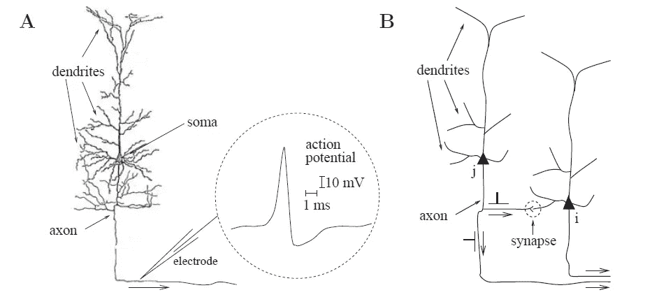

# 尖峰神经元

> 原文：<https://medium.com/analytics-vidhya/spiking-neuron-a739d0dfd5d3?source=collection_archive---------5----------------------->

在这段视频中，我解释了神经元在人脑中的作用。说明了人工神经元和生物神经元的性能差异。感谢邓磊([https://www.sciencedirect.com/science...](https://www.youtube.com/redirect?event=video_description&redir_token=QUFFLUhqazRydHlKRXo5cU5LUzFHTGdaT3RJQnlnaXVPd3xBQ3Jtc0tuMnN2VjVVN05nbXc5bzQ3ajFLbTNBOEdCa1FHS1R5MlFoWlRZQlY4VUVvTVFHVVljTDQ2RWtuMzJIazFTY1IwVDh0OHBXSTRYU1J0Z1hnbEEyMXNDY1FjYWNkeGtrOFAtdmg2Y2ZacGJCUjhPU3kxYw&q=https%3A%2F%2Fwww.sciencedirect.com%2Fscience%2Farticle%2Fabs%2Fpii%2FS0893608019302667))写的关于检验脉冲神经网络和人工神经网络性能的论文。

尖峰神经元受到生物大脑的启发。一个生物神经元分为三个基本不同的部分，称为树突、胞体和轴突。总的来说，树突的功能是“输入方法”，从其他神经元收集信号，并将它们传输到细胞体。soma 是执行关键非线性处理步骤的“中央处理单元”:如果到达 soma 的总输入超过某个阈值，则产生输出信号。轴突，即“输出”，接收输出信号并将其发送给其他神经元。突触是两个神经元之间的连接[1][5]。

尖峰神经元模型是神经系统中特定细胞属性的数学特征，这些细胞在细胞膜上产生持续约 1 毫秒的尖锐电位，称为动作电位或尖峰。脉冲神经元被认为是神经系统的主要信息处理单位，因为脉冲沿着轴突和突触从发送神经元传输到许多其他神经元[1]。

图 1 Ram'on y Cajal 绘制的单个神经元图[2]

图 1 A 部分，树突、胞体和轴突之间有明显的区别。神经元动作电位显示在本页的插图中(示意图)。这是一个持续时间约为 1-2 毫秒、幅度约为 100 毫伏的短电压脉冲。B 部分，突触前神经元 j 和我互相发送信号，反之亦然。虚线圆圈表示大脑地图上的突触点。右下端的轴突通向其他神经元(图示意图)[2]。

**图 2**y 轴表示膜电位，x 轴表示以毫秒为单位的时间【3】。

一般来说，尖峰神经元模仿生物神经元，所以它们有某种尖峰或动作电位，我们可以记为电压。现在我们来看看 d(电压)/ dt。当电压超过某一阈值时，就会出现尖峰或动作电位。之后膜电位复位或进入不应期。在此期间，如果我们不提供更高的阈值，我们可能看不到任何峰值。

让我们了解一下人工神经网络(ANN)和脉冲神经网络(SNN)之间的区别

图 3 (a)人工神经网络和(b) SNNs [4]

图 3(a)描述了一个典型的人工神经元的模型。其中 x、y、w 和 b 分别是输入激活、输出激活、突触权重和偏置，j 是输入神经元的指数。ϕ()是非线性激活函数，例如ϕ(x) = ReLU(x) = max(x，0)。人工神经网络中的神经元使用以高精度和连续值编码的激活相互通信，并且仅在空间域中传播信息(即逐层)。从上面的等式可以看出，输入和权重的乘加(MAC)是人工神经网络中的主要操作。部分(b)示出了典型的尖峰神经元，其与 ANN 神经元相比具有相似的结构但不同的行为。相比之下，脉冲神经元通过二进制事件编码的脉冲序列进行通信，而不是人工神经网络中的连续激活。树突整合输入锋电位，胞体因此进行非线性转换，产生输出锋电位序列[4]。这种行为通常由流行的 LIF 模型来建模。

SNNs 以锋电位模式表示信息，每个锋电位神经元经历丰富的动态行为。具体来说，除了空间域中的信息传播之外，当前状态还受到时间域中的过去历史的紧密影响。因此，与主要具有空间传播和连续激活的人工神经网络相比，SNNs 通常具有更高的时间灵活性，但精度较低。由于只有当膜电位超过阈值时才会触发棘波，因此整个棘波信号通常是稀疏的，并且计算可以是事件驱动的(只有当棘波输入到达时才启用)。此外，因为尖峰是二进制的，即 0 或 1，所以可以去除输入和权重之间的高成本乘法[4]。

由于上述原因，与具有密集计算的神经网络相比，SNNs 通常可以实现更低的功耗。

参考资料:

[1]郭士纳 W，Kistler WM (2002)。 [*尖峰神经元模型:单个神经元、群体、可塑性*](https://www.worldcat.org/oclc/57417395) 。英国剑桥:剑桥大学出版社。[ISBN](https://en.wikipedia.org/wiki/ISBN_(identifier))[0–511–07817-X](https://en.wikipedia.org/wiki/Special:BookSources/0-511-07817-X)。OCLC [57417395](https://www.worldcat.org/oclc/57417395) 。

[2]ram ' on y Cajal,《人类神经系统的组织学与进化》,巴黎，e. A. Maloine 出版社。

[3]a . v . t . m . f . r . m . r . e . v . e . b . max ence Bouvier，“尖峰神经网络硬件实现和挑战:调查”，神经和进化计算，arXiv.org，第 35 页，2020 年。

[4]邓，吴，胡等，与人工神经网络绩效比较的再思考。神经网络(2019)，doi:[https://doi.org/10.1016/j.neunet.2019.09.005](https://doi.org/10.1016/j.neunet.2019.09.005)。

【https://neuronaldynamics.epfl.ch/online/Ch1.S1.html 