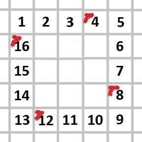

# 螺旋、基准和 Java

> 原文：<https://medium.com/analytics-vidhya/spirals-benchmarks-68f5bf283e5?source=collection_archive---------19----------------------->

最近，我在一个友好的 Java 服务器上接受了提高代码速度的挑战。代码是关于生成螺旋矩阵的:


螺旋矩阵图案，油漆制成的❤

由于我目前正在阅读机械同情和相关的东西，我发现这是一个很好的实验 CPU 友好的方法的例子。

# 首次实施和瓶颈

我想到的第一个算法反映了一个简单的递归思想。我们首先在自相似矩阵上循环，对于每个矩阵，我们遍历顶部标题行，4 乘 4 地填充条目:


外部边界上的首次迭代


外部边界的第二次迭代


外部边界上的第三次迭代



外部边界上的第四次迭代

在完全填充了外部矩阵的边界后，我们放大并聚焦于未被触及的内部矩阵。完整的代码如下所示:


(别问为什么，`n`是矩阵维数，作为单独的参数。)我对这段代码不满意，因为它违反了机械同情。事实上，让它在`n = 1 << 14`上运行使它在大约 4.5 秒内运行。

*剧透警告:*我尝试的第二个实现让算法在 300 毫秒内完成。

## 机械同情:背景

在介绍优化方法之前，让我们回顾一些非常基础的东西。

我们目前正在处理一个双整数数组。

在 Java 中，整数的大小是 32 位，也就是 4 个字节。引用的大小是 64 位，即 8 个字节。

对于一个维度为`1 << n`(2^n 的位风格)的矩阵，我们需要的总数据存储量至少是

```
(2^n * 8) + 2^n * (2^n * 4) ~>~ 2^(2n + 2)
```

对于规模来说，1gb 大约是`1 << 30`。在我现在使用的电脑上，它仍然略低于 2g(无可奉告)。因此，我应该在`2n + 2 > 30`时就离开内存，因此在`n = 14`附近……事实上，在`OutOfMemoryError`时超过那个点会严重失败，低于或相同是可以的。

但是 RAM 大小不是我应该考虑的唯一关键点。通过 Windows 任务管理器查看我的计算机，我看到我的一级 CPU 缓存为 256 千字节。这大约是`1 << 18`字节。

有趣的是，L1 缓存通常分为两部分:一半用于存储指令，另一半用于存储数据。因此，我的缓存可以处理的整数数量大约是`1 << (7+8)` (大小除以 2(因为拆分)，再除以 4(因为 int 的大小))。

## 机械同情:冲击

以上关于我的硬件的背景强调了几个事实。

数据存储在堆中，访问 RAM 大约需要 50 个 CPU 周期(快)。像我在算法中使用的局部变量很可能存储在寄存器中，其访问大约是 1 个周期(便宜)。另一方面，访问 L1 缓存大约需要 5 个周期(超级事实)。所以我真的应该努力让 CPU 尽可能多的放在那个地方。

重要的是要知道，当我的 CPU 工作时，它试图预见哪些数据将在即将到来的指令中使用。我的实现中的数据访问模式是完全可预测的。一个天真的判断(我必须承认，这是我第一眼看到的)可能会认为它是“缓存友好的”，因为我的 CPU 应该能够很容易地预见到哪些数据将被提取到缓存中。

坏消息是:CPU 不会提取“矩阵的单个条目”。通常，它获取块:缓存行；连续的记忆片段。这正是我的问题所在！对行进行迭代是可以的，因为 CPU 将获取连续的数据。每当我们处理一行时，数据都可能来自缓存，这很快。然而，相同的缓存行策略也用于列，产生实际上没有完全使用的信息提取。最坏的情况:获取那些无用的数据会使相关的数据离开缓存，增加缓存缺失的可能性。

# 解药

我就这样用一种(我的！)电脑。正如我之前说过的，我的 L1 缓存大约是`1 << 15` ints，适合 2 个`1 << 14`整数的矩阵行。(我在这里可能过于近似，但这是第一次优化试验，可能不是完全有效，但目前已经足够了。)

因此，我打算进行重构，一次处理 2 行，并且只处理行。完整的代码如下所示:


完全更好优化的代码

下面，我们描述代码的基本思想。如果您真的不在乎，并且想进入基准测试部分，请随意跳过它！

第一个 while 循环及其两个后续指令旨在填充自顶向下和自底向上的三角形。下面是这次在`n=7`上封杀的结果:

```
*1     2     3     4     5     6     7     
0     25    26    27    28    29    0     
0     0     41    42    43    0     0     
0     0     0     0     0     0     0     
0     0     47    46    45    0     0     
0     37    36    35    34    33    0     
19    18    17    16    15    14    13*
```

下一个 for 循环将填充矩阵的左侧，首先填充底部的行，然后填充顶部的行。底线被重新组合使用一个周长像诡计，从邻居运行回螺旋。

```
*1     2     3     4     5     6     7     
24    25    26    27    28    29    0     
23    40    41    42    43    0     0     
0     0     0     0     0     0     0     
21    38    47    46    45    0     0     
20    37    36    35    34    33    0     
19    18    17    16    15    14    13* 
```

第二个内部 for 循环使用左边的内容重新组合右边的内容。同样，使用了螺旋反向运行技巧:

```
*1     2     3     4     5     6     7     
24    25    26    27    28    29    8     
23    40    41    42    43    30    9     
0     0     0     0     0     0     0     
21    38    47    46    45    32    11    
20    37    36    35    34    33    12    
19    18    17    16    15    14    13* 
```

最后，在相关的情况下，使用顶部的一行或底部的一行重新组合中间的一行:

```
*1     2     3     4     5     6     7     
24    25    26    27    28    29    8     
23    40    41    42    43    30    9     
22    39    48    49    44    31    10    
21    38    47    46    45    32    11    
20    37    36    35    34    33    12    
19    18    17    16    15    14    13*
```

在每个迭代阶段，改进只是使用了 2 行，不会更多。我想我会时不时地再次错过缓存，因为我的极端用例`n = 1 << 14`有点模糊，正好填满了我的 L1 缓存。然而，这种现象不应该像以前那样频繁出现。

补充说明:正如你所看到的，在第二个实现中，我没有试图完全优化计算或局部变量的使用；因为我其实不在乎(目前)。

# 结果呢

以下是我为简单实现和优化实现所做的基准测试(JMH，平均时间，1 次热身):

```
***1 << 14*** *(milliseconds/op)

Benchmark                            Mode  Cnt     Score      Error
SpiralMatrix.naiveFillBenchmark      avgt    5  4778,838 ± 1116,666
SpiralMatrix.optimizedFillBenchmark  avgt    5   302,008 ±   27,536* ***n = 1 << 13*** *(milliseconds/op)

Benchmark                            Mode  Cnt    Score    Error
SpiralMatrix.naiveFillBenchmark      avgt    5  525,858 ± 18,257
SpiralMatrix.optimizedFillBenchmark  avgt    5   68,188 ±  3,068* ***n = 1 << 12*** *(milliseconds/op)

Benchmark                            Mode  Cnt    Score   Error
SpiralMatrix.naiveFillBenchmark      avgt    5  111,950 ± 3,625
SpiralMatrix.optimizedFillBenchmark  avgt    5   18,343 ± 6,507* ***n = 1 << 9*** *(milliseconds/op)

Benchmark                            Mode  Cnt  Score   Error
SpiralMatrix.naiveFillBenchmark      avgt    5  0,679 ± 0,005
SpiralMatrix.optimizedFillBenchmark  avgt    5  0,277 ± 0,002* ***n = 1 << 8*** *(milliseconds/op)

Benchmark                            Mode  Cnt  Score   Error
SpiralMatrix.naiveFillBenchmark      avgt    5  0,101 ± 0,001
SpiralMatrix.optimizedFillBenchmark  avgt    5  0,068 ± 0,002* ***n = 1 << 7* ***(milliseconds/op)

Benchmark                            Mode  Cnt  Score    Error  
SpiralMatrix.naiveFillBenchmark      avgt    5  0,013 ±  0,001  
SpiralMatrix.optimizedFillBenchmark  avgt    5  0,016 ±  0,001* ***n = 1 << 6*** *(milliseconds/op)

Benchmark                            Mode  Cnt  Score    Error  
SpiralMatrix.naiveFillBenchmark      avgt    5  0,003 ±  0,001
SpiralMatrix.optimizedFillBenchmark  avgt    5  0,004 ±  0,001****n = 1 << 2 (microseconds/op!)*** *Benchmark                            Mode  Cnt  Score    Error  
SpiralMatrix.naiveFillBenchmark      avgt    5  0,024 ±  0,001  
SpiralMatrix.optimizedFillBenchmark  avgt    5  0,030 ±  0,001* 
```

对于大型矩阵，您应该可以看到原始版本和优化版本之间的数量级差异。差异在`1 << 7`消失。回想一下，我的 L1 缓存是`1 << 15` ints，所以这种情况是所有数据进入缓存的(大约)*最高的情况！此外，优化版本明显优于原始版本 10 倍，这也是 RAM 和 L1 缓存访问之间的数量级差异所预期的。*

# 外卖食品

如果要我总结以上实验，我至少会说:*你在一个方法中进行的局部变量和局部计算的数量不会成为你的代码变慢的原因。*

这些似乎通常很便宜，并且依赖于寄存器(看看最后一个`1 << 2`的例子，其中的差别是纳秒量级的！)

你的代码的真正瓶颈更可能是硬件误解。

事实上，正如人们经常告诉你的那样，遍历列实际上并不是问题。事实上，问题在于高速缓存行及其存在的必然结果。

当然，这种有趣的事实可能不会成为整个应用程序的瓶颈，它可能处理 IO 操作或垃圾收集。您知道更改线程会引发上下文切换，并且预计会破坏缓存吗？为了更好地优化必要的东西(IO、线程、GC 等等)而不在不必要的东西上浪费时间，更好地理解硬件及其对代码的影响从来都不是浪费时间。

在做这个实验之前，我从来没有打赌第二个实现会比第一个实现好得多，因为我总是被告知… *像在许多其他领域(例如安全性)一样，没有测量就谈论性能是绝对没有意义的。*这个例子证明了一切。下次有人问你这个问题时，明智地回答。

也许最后一点是:我们在这里为数据所做的，在概念上也适用于指令。还记得 L1 高速缓存被一分为二吗？*所以保持你的方法简短*:这样，它们将更好地适应缓存，并且从存储它们的地方更快地获取。(这里再次强调:以事实为基准，不要盲目相信你在媒体上读到的东西！)

干杯！