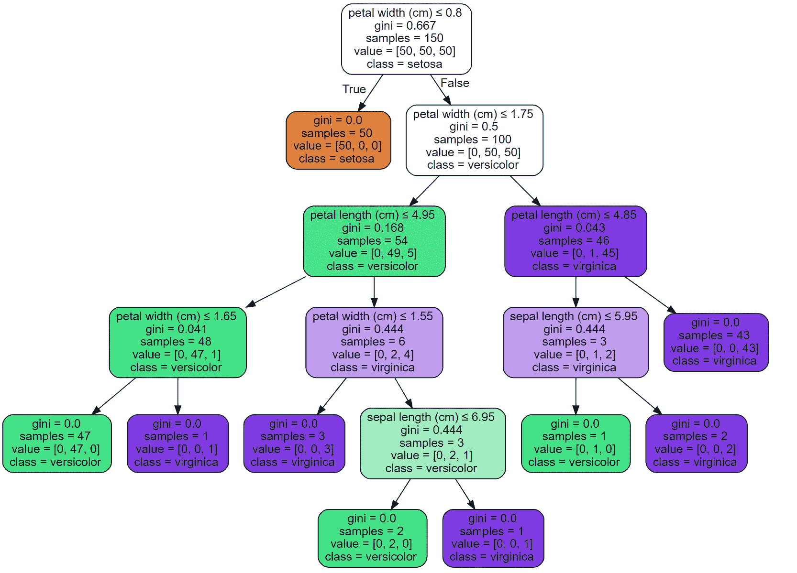

# 决策树算法的分裂准则——第二部分

> 原文：<https://medium.com/analytics-vidhya/splitting-criteria-for-decision-tree-algorithm-part-1-49f4f39df53b?source=collection_archive---------12----------------------->

## 基尼指数及其 Python 实现

在本系列的第 1 部分中，我们看到了决策树算法的一个重要的分裂标准，那就是信息增益。

在本系列的第 2 部分中，我将详细讨论另一个分割标准，该标准总是基于节点异构性的概念，它…