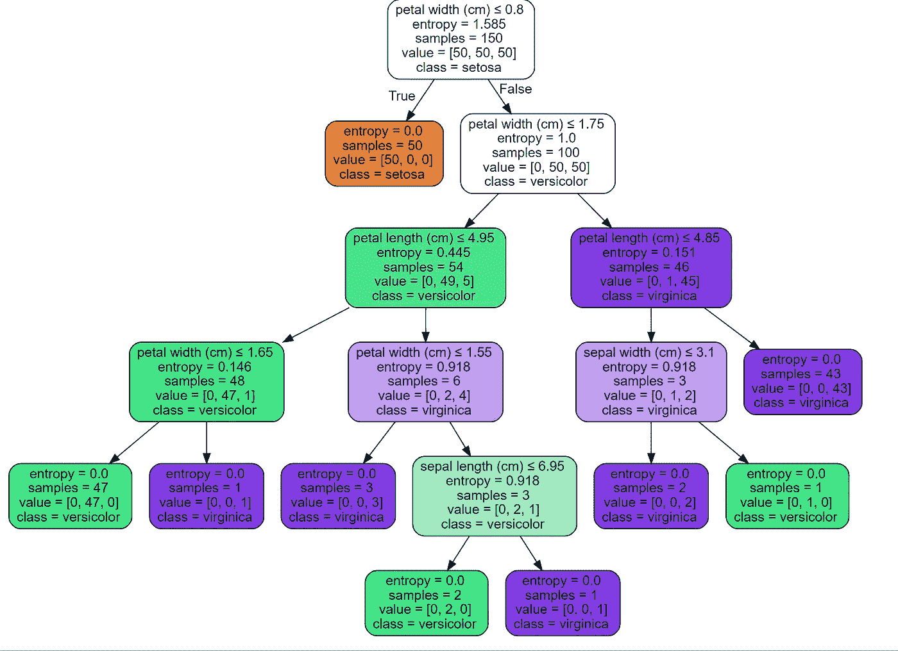

# 决策树算法的分裂准则—第一部分

> 原文：<https://medium.com/analytics-vidhya/splitting-criteria-for-decision-tree-algorithm-part-1-64e949aa2465?source=collection_archive---------2----------------------->

## 信息增益及其在 Python 中的实现

[决策树](/analytics-vidhya/visualizing-decision-tree-with-r-774f58ac23c)是流行的机器学习算法，用于回归和分类任务。它们之所以受欢迎，主要是因为它们的可解释性和可表达性，因为它们模仿了人脑做出决策的方式。