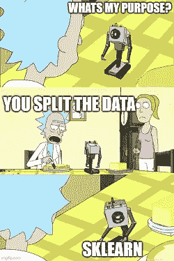

# 拆分数据:超越 train_test_split

> 原文：<https://medium.com/analytics-vidhya/splitting-your-data-growing-beyond-train-test-split-dc0eb83d7dac?source=collection_archive---------26----------------------->

简·安东宁·科拉尔在 [Unsplash](https://unsplash.com/?utm_source=unsplash&utm_medium=referral&utm_content=creditCopyText) 上拍摄的照片

正确分割机器学习项目的数据对其成功至关重要。您希望用尽可能多的数据来训练模型，但也要确保它不是简单地记住了解决方案。
通常，你把数据分成三类:
~80 %训练，10 %验证& 10 %测试。
然后，将模型与训练数据相匹配，直到验证误差开始增加，最后在测试集上进行测试。

## sk learn . model _ selection . train _ test _ split 前往救援

幸运的是，有工具可以帮助我们实现这一点，我已经无数次导入了 sklearns train_test_split 来完成这项工作。

这种方法有一个缺点:如果您使用的不是一个静态数据集，而是一个随时间不断增长的数据集，那么每次添加新的示例时，您都会得到完全不同的分割。

再添加一个示例后，分布会发生变化。

混洗数据意味着您不能比较两次运行的结果，因为您的验证分割可能只是由简单或非常困难的例子组成。这可能会在您的训练结果中添加大量噪声，尤其是在训练数据量很少的情况下。最终，这使得项目难以继续进行。

为了减少模型性能的噪声量，您可以使用 [k-fold-cross-validation](https://scikit-learn.org/stable/modules/generated/sklearn.model_selection.KFold.html) 。在该方法中，数据分布在 k 个箱上，并且这些箱中的每一个被用作一次验证数据集，而其余的被用于训练。这种方法的缺点是训练 k 模型需要巨大的时间复杂度。[在 YouTube 上有一个由 Ritvikmath 制作的很棒的视频，更详细地解释了这个策略](https://www.youtube.com/watch?v=wjILv3-UGM8&ab_channel=ritvikmath)。

Sklearn 可以做更多的事情…？

在我的例子中，完全训练我的分类器需要 10 个小时。每当我注释额外的数据时，运行我的训练脚本 5 或 10 次是不可行的，只是为了决定我是否需要改变我的模型或者我是否需要收集和注释特定的数据。

*我需要不同的解决方案。*

## 再见 train_test_split —你好 Splitter。

我发现这个问题的解决方案是持久化测试序列分割，并使其可扩展。此外，我保留了 k-fold-cross-validation 的想法，将我的数据集分成 k 个大约相同大小的箱，或者我称之为“桶”。每当我注释额外的数据时，这段数据被分配到一个桶中，而所有以前的数据都像以前一样留在同一个桶中。
桶的选择与桶中的数据量成反比，除以所有桶中的数据总量:
实例较少的桶比实例较多的桶更容易被填满。

通常，我会创建 10 个存储桶，并保留最后一个用于测试。在项目结束时，我可以简单地用我保留的测试集进行 9 重交叉验证，并在看不见的数据上获得良好的性能估计。

我对我最初的实验很满意，当我开始下一个项目时，我创建了一个小的 python 类，它可以将数据点分配给任意数量的桶，并为您创建拆分。

因为我的工具只不过是一个字典、一个列表和一个 k 数大小的 NumPy 数组，所以它可以非常容易地持久化，以便在每次训练迭代中对 split 进行磁盘和重新加载。
唯一的依赖是 NumPy。

## 用法示例

 [## p-索德曼/分离器

### 具有持久性的 k 倍数据分裂。在 GitHub 上创建一个帐户，为 p-sodmann/splitter 的开发做出贡献。

github.com](https://github.com/p-sodmann/splitter)