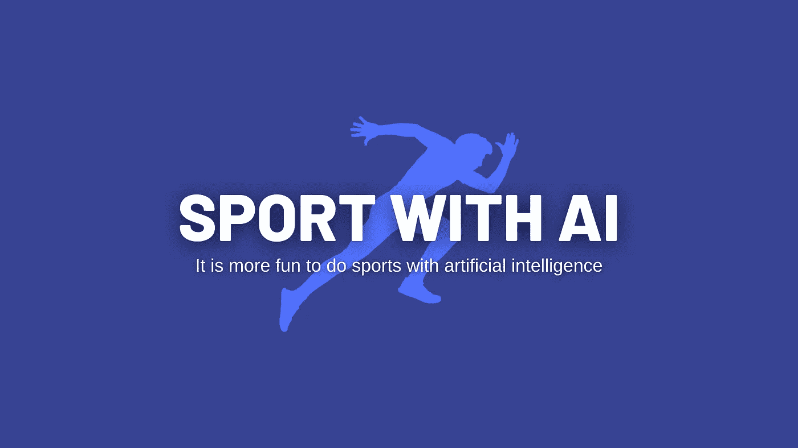
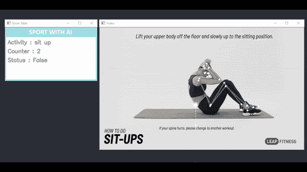
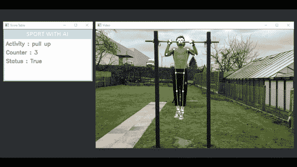
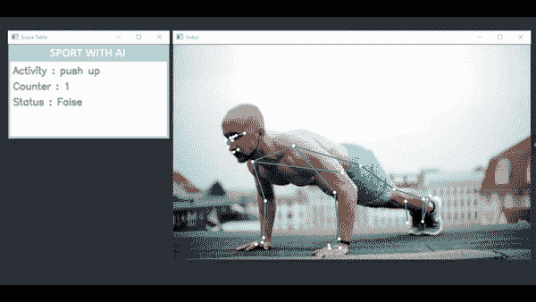
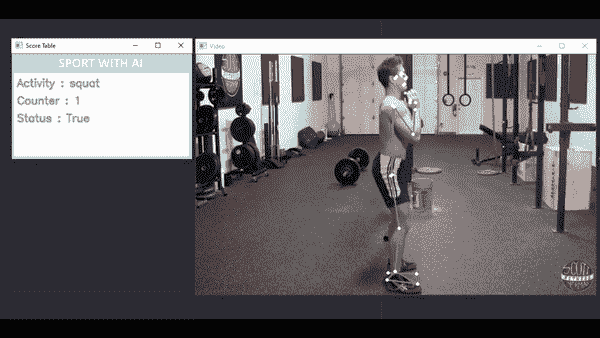
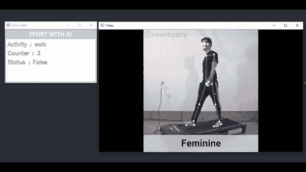

# 人工智能运动

> 原文：<https://medium.com/analytics-vidhya/sport-with-ai-39a3d567beb2?source=collection_archive---------12----------------------->



> *借助*[*media pipe*](https://github.com/google/mediapipe)*库检测人体。然后，使用应用的数学方法，确定完成了多少锻炼计数。*

Github 项目链接:[https://github.com/Furkan-Gulsen/Sport-With-AI](https://github.com/Furkan-Gulsen/Sport-With-AI)

# 仰卧起坐练习



视频:[https://www.youtube.com/watch?v=aQh52cRfH-w](https://www.youtube.com/watch?v=aQh52cRfH-w)

仰卧起坐是一种腹部耐力训练，旨在加强、收紧和调节腹部肌肉。它类似于仰卧起坐，但仰卧起坐有更大的活动范围，并锻炼更多的肌肉。

```
python main.py -t sit-up -vs videos/sit-up.mp4
```

# 引体向上练习



视频:[https://www.youtube.com/watch?v=8hkTMATEuUc](https://www.youtube.com/watch?v=8hkTMATEuUc)

引体向上是一种上身力量练习。引体向上是一个闭链动作，身体被双手悬吊，向上拉起。当这种情况发生时，肘部弯曲，肩部内收并伸展，使肘部靠近躯干。

```
python main.py -t pull-up -vs videos/pull-up.mp4
```

# 俯卧撑练习



视频:[https://www.youtube.com/watch?v=IGjHIXAZAak](https://www.youtube.com/watch?v=IGjHIXAZAak)

俯卧撑是一种常见的健美操运动，从俯卧位开始。通过使用手臂抬高和降低身体，俯卧撑锻炼了胸肌、三头肌和前三角肌，对三角肌的其余部分、前锯肌、喙肱肌和整个上腹部有辅助益处。

```
python main.py -t push-up -vs videos/push-up.mp4
```

# 深蹲练习



视频:[https://www.youtube.com/watch?v=iQrXRTk7KE0](https://www.youtube.com/watch?v=iQrXRTk7KE0)

深蹲是一种力量练习，练习者从站立位置放低臀部，然后再站起来。在下蹲过程中，髋关节和膝关节弯曲，而踝关节背屈；相反，站立时，髋关节和膝关节伸展，踝关节跖屈。

```
python main.py -t squat -vs videos/squat.mp4
```

# 步行锻炼



视频:[https://www.youtube.com/watch?v=pPTeSd_GXoc](https://www.youtube.com/watch?v=pPTeSd_GXoc)

```
python main.py -t walk -vs videos/walk.mp4
```

如果你想用摄像头实时检测你的动作，你可以运行下面的代码行。

```
python main.py -t sit-up
# or python main.py -t pull-up
# or python main.py -t push-up
# or python main.py -t squat
# or python main.py -t walk
```

该项目的详细描述将稍后。继续跟着。