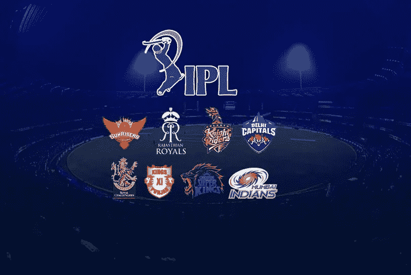
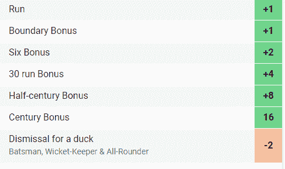
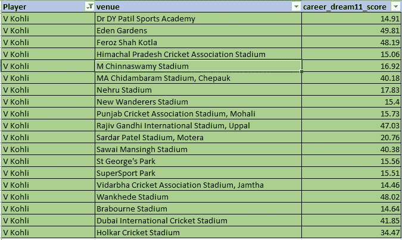
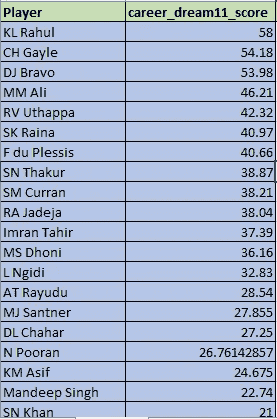
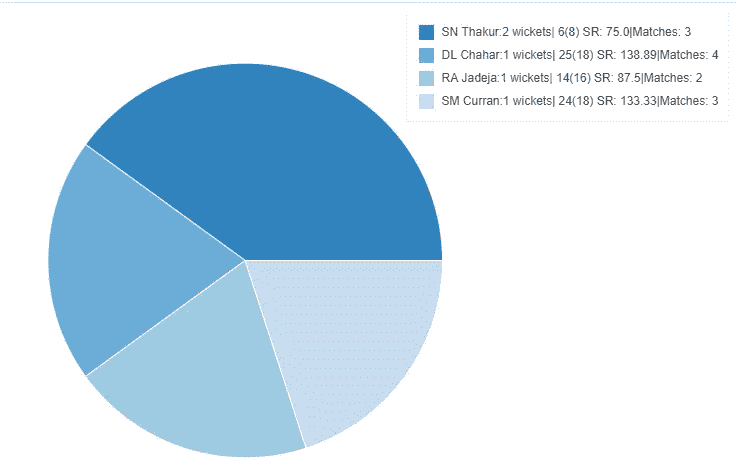

# 体育分析:建立自己的冠军 IPL 梦之队

> 原文：<https://medium.com/analytics-vidhya/sports-analytics-build-your-own-winning-ipl-dream-team-be42132df7ab?source=collection_archive---------20----------------------->



随着梦幻应用数量的增加，我们有没有办法建立一种方法来帮助我们组建最佳团队？..嗯，答案是既肯定又否定..继续读下去，了解更多关于我的经历，以及为什么这个问题没有一个结论性的答案。

因此，在这篇博文中，我将讨论我在构建一个基于规则的模型时采用的强力方法，该模型为我们提供了最佳的 11 项匹配，然后还将讨论这一结果与我们的领域专业知识相结合时如何帮助我们做出更好的决策。

## 内容

1.  建立模型。
2.  分析结果
3.  需要考虑的人工因素
4.  将模型结果与人工方面相结合，以便更好地做出决策
5.  结论

# 构建模型

在我们深入探讨之前，重要的是，我们要花点时间思考实现目标的最佳方式，同时确保方法尽可能简单。

因此，在回答我自己的这个问题时，我想当我们为一个特定的幻想应用程序建立一个团队时，我们为什么不利用他们自己的指针系统来帮助我们实现我们的目标。

最简单的方法是考虑所有球员的过去数据，这些球员具有不同的属性，需要根据 dream11 的指针系统对他们进行评级。下图让你一窥梦想 11 如何评价每个击球手。



击球手指针系统。来源:[梦 11](https://www.dream11.com/games/point-system)

所以，我们需要做的就是开发一个代码，根据属性给出玩家的总点数。下面的代码片段让你先睹为快。

```
def batting_points(self,**params):
# eliminated 30+ run points reward 
        total = 0
        total = params.get("runs",0) + params.get("boundaries",0) \
        + 2*(params.get("sixes",0)) + 8*(params.get("half_cen",0)) \
        + 16*(params.get("cen",0)) - 2*(params.get("ducks",0))
        try:
            return round(total/params.get("Inns",1),2)
        except ZeroDivisionError:
            return 0
```

上面的代码考虑了击球手的边界，半个世纪和几个世纪，他得分的鸭子数量，并给击球手一个适当的平均评级。(注:平均评分是根据玩家击球的局数计算的，而不是根据他参加的比赛数。)

类似地，我们计算投球手的评分，然后也计算投球手的评分，最后综合所有这些来得到每个球员的最终评分。

但话虽如此，根据我们的领域知识，我们清楚地知道比赛的地点和球员的状态对表现有明显的影响。因此，我们在模型中包含这一点的最佳方式是，根据我们对游戏的综合能力，给这些属性赋予权重。因此，我考虑了前三年的表现，最近的表现占 70%的权重，前几年占 30%的权重。同样，对于场馆，我们给当前比赛场馆 25%的权重，给所有其他场馆的总分 75%的权重。

现在代码已经就绪，当我们在数据集上运行它时，我们得到了每个场地的每个球员的分数，其中也包括他最近的表现。

注意:这个模型是对击球手、投球手和外野手分别运行，然后合并得到击球手的总得分。为了避免任何形式的混乱，我已经克制自己不粘贴代码。请点击最后的 github 链接，它提供了完整的代码解释。



不同场馆的 **Virat Kohli** 模型输出样本

我们的最后一步是创建一个代码，当给定两支球队以及比赛场地时，该代码将按排序顺序给出该队每个球员的得分。



**PBKS vs CSK** 在**万科德体育场**的样本输出

# 分析结果

最初，在最初的几场比赛中，只要不违反梦想 11 的条件，我会盲目地选择模特中的前 11 名。这导致我在最终的梦之队中平均只有 5-6 名球员。

但是，我观察到一些有趣的见解:

1.  由于我的投球手和击球手在顶端，要么我的投球手拿走了我自己击球手的三柱门，要么反之亦然，最终将他们挤出了梦之队。
2.  抛球在万克赫德的比赛中发挥了至关重要的作用。球场在第一个小时支持缝合员，这使得像 Chahar 这样的摇摆投球手更容易选择快速的三柱门，并在比赛早期让他的球队处于舒适的位置。
3.  这些快速的三柱门给对手球员带来了压力，然后引发了崩溃，这使得我的模型中表现不佳的球员在最终的梦之队中突然出现，或者如果顶部的击球手突然出现，那么我的团队中的全能球员将没有机会击球，这使得他们必须在保龄球中表现出色，才能进入梦之队。
4.  很少有最佳接球和跑位也能改变比赛的进程，这会把你的击球手挤出梦之队。

这些难题完全可以被归类为不可控因素，因此不可能被纳入模型。

因此，必须以一种更好的方式来处理这个问题，这样我们就会发现自己常常处于更安全的区域。

# 人工因素

根据以上观点，可以肯定地说

> 我们建立的模型肯定能帮助我们做出更好的决策，但我们不能仅仅依靠它来建立一个梦之队。

因此，让我们看看在决定是否让这名球员加入我们最终的梦之队之前可以考虑的不同因素。

## 难题 1:

在建立模型时，我们完全消除了击球手对投球手的潜在弱点，反之亦然，这是决定球员命运的一个基本因素。(cricbuzz 称之为著名的比赛)

## 潜在解决方案

一种可能的方法是汇总数据，然后可视化每个球员的单挑表现。然后，我们必须手动决定查看该球员的统计数据以及上面计算的最终得分，以对该球员做出决定。



**马尼什·潘迪**无力对抗 **CSK 保龄球手**

## 难题 2:

如上所述，既然抛硬币起着至关重要的作用，我们需要想出一种技术来帮助我们更好地做出决策。

## 潜在解决方案:

给予投球同等的重要性(在这个例子中是 Wankhede ),并且一旦投掷完成，我们可以首先从团队保龄球中挑选前两名投球手，因为他们有机会挑选一个三柱门(在第一个小时),因为它帮助步行者，并且不言而喻，因为那个三柱门可能是开场击球手之一，即使两个开场击球手都是模型中的前两名表演者，我们也只挑选一个在安全区。(是的，有可能你选择的击球手会离开而不是另一个，但根据我们的模型，对我们有利的概率略高于 0.5)

类似地，对于像切帕克球场这样的击球手来说，我们已经看到随着比赛的进行，击球变得越来越困难。因此，我们确保开场击球手在我们队中，并且只有四个开场投球手(包括两个队)中最好的两个在我们队中。

# 将模型结果与手工方面相结合:

1.  一旦投掷完成，挑选保龄球队的前两名和对方的前两名。(前提是在万科德)
2.  然后从第一棒球队和第二棒球队中选出前两名击球手。(不考虑第二棒球队的击球顺序)
3.  然后根据我们的模型分数盲目挑选顶级的全能和守门员。
4.  最后，我们可以完全依靠我们的模型分数，然后混合和匹配球员，以达到最佳可能的团队。

上面提到的所有步骤都要遵守建立团队的梦想 11 规则。

# 结论

模型结果与人工因素相结合，帮助我们做出更好的决策，最终梦之队的平均人数也从 5-6 人增加到 7-9 人。

[Git-hub 回购链接](https://github.com/abhishekperambai/IPL_dream_11)

我对我的一个朋友说了这句话，他认为赢得梦想竞赛需要运气...

> 是的，你需要运气来赢得比赛，但如果我们走这条路，运气站在你这边的可能性会更高。😉

## 潜在的改进领域

像蒙特卡洛模拟这样的其他方法可以用来计算击球手在给定比赛中至少得分 25 分，投球手至少捡起 1 个检票口的概率，但由于今年的 IPL 已经停止，我们无法改进这一点与我们的主要模型的集成，以查看任何性能改进。

非常感谢任何反馈。