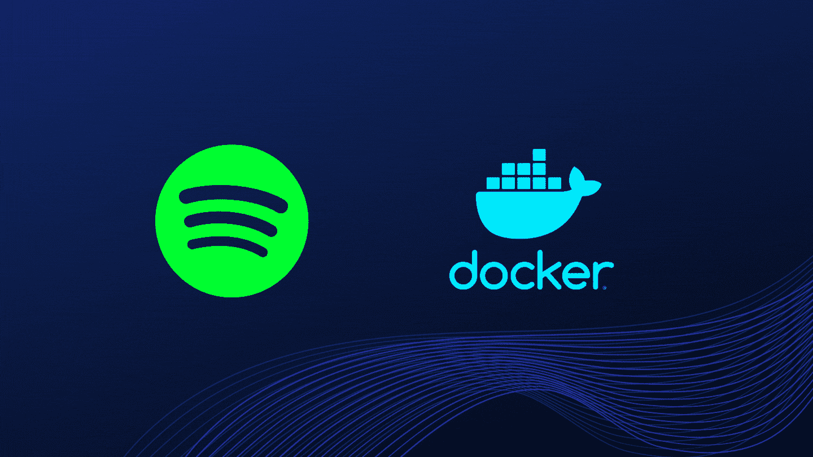

# Docker 容器中的 Spotify

> 原文：<https://medium.com/analytics-vidhya/spotify-in-docker-container-881cbe798269?source=collection_archive---------1----------------------->



图片由我:)

如果你遇到一个问题，你是否可以在 docker 容器中运行图形应用程序，因为你很好奇或者你已经创建了一些 GUI 应用程序，你想在容器中运行，那么你的问题的答案是肯定的，我们可以在容器中运行 GUI 应用程序。

但是如果你尝试过用传统的 docker 命令运行它，那么它就不会工作。这是因为 Docker 容器只是基于 CLI 的，需要物理显示器来运行 GUI 应用程序。因此，为了在容器中运行图形应用程序，我们需要与容器共享基本主机的显示。

这很容易做到。这只是一个命令，但是要理解这个命令，首先需要理解两件事

1.  x 服务器或 X11
2.  显示环境变量

## 什么是 X 服务器？

x 服务器是在 Linux 系统/内核中实现图形用户界面的一种方式。Linux 主要是关于 CLI 的，但是在 X server 的帮助下，你可以在 Linux 上运行图形应用程序和其他任何东西，就像在 Microsoft Windows 中一样。X 服务器只是一个在显示屏上图形化绘制窗口的套接字。

> 有趣的事实:-在 X server 的帮助下，您可以通过网络将输出发送到一些远程显示器。

## 显示器是什么？

它是一个环境变量，包括

*   一个键盘，
*   一只老鼠
*   和一个屏幕。

X 服务器从这个变量中获取值，以知道它必须将输出发送到哪里，或者简单地说，通过这个变量，X 服务器知道您的显示器在哪里。

显示变量的格式如下

```
hostname:D.S
```

在哪里，

1.  主机名是主机的名称或 IP
2.  如果有多台显示器，d 是显示器编号(通常为 0)
3.  如果有多个屏幕，s 是屏幕号(通常为 0)

现在我们知道了这两个概念，是时候实现它们了。我们将在这里做一个惊人的项目。我们将在容器中启动一个 Spotify 应用程序。是不是很神奇？

下面是创建图像的 Dockerfile 文件，你可以复制它，它非常容易理解

```
FROM debian:sid-slim
LABEL maintainer “Saurabh Rohankar”
RUN apt-get update && apt-get install -y 
RUN apt-get install curl -y 
RUN apt-get update && apt-get install -y gnupg2 sudo
RUN curl -sS [https://download.spotify.com/debian/pubkey_0D811D58.gpg](https://download.spotify.com/debian/pubkey_0D811D58.gpg) | apt-key add — 
RUN echo “deb [http://repository.spotify.com](http://repository.spotify.com) stable non-free” >> /etc/apt/sources.list.d/spotify.list
RUN sudo apt-get update && sudo apt-get install spotify-client -y
ENTRYPOINT [ “spotify” ]
```

但是如果你不想创建图像，你可以使用我已经创建并上传到 Docker [Hub](https://hub.docker.com/r/saurabh19/spotify_instance) 上的那个。

只需运行下面的命令来从 docker hub 中提取它

```
docker pull saurabh19/spotify_instance:v1
```

现在，在容器中运行 Spotify 应用程序的最后一个命令是

```
docker run -it -e DISPLAY=:0 -v /tmp/.X11-unix:/tmp/.X11-unix --device /dev/snd spotify_instance:v1 bash
```

在哪里，

*   -e 代表导出环境变量，(共享环境变量)
*   -v 代表绑定挂载卷(以附加卷)
*   -设备允许主机设备访问容器

在上面的命令中，我们首先使用 **-e** 选项设置显示的环境变量。

然后，我们使用 **-v** 选项将主机中的 X 服务器套接字的文件夹安装到 docker 容器中。我们这样做是因为 docker 容器没有 X 服务器，所以我们从主机复制它(不完全是复制而是共享文件夹)。

由于它是一个 Spotify 应用程序，我们肯定希望听到音乐，而不仅仅是能够运行它，所以我们还需要与容器共享主机的声音驱动程序/设备，我们正在借助- **设备**选项来实现这一点。

因此，最后当您运行上述命令时，您的容器将被启动，它将运行 Spotify 应用程序。

现在坐下来，喝杯咖啡，享受你最喜欢的音乐。顺便说一下，你也可以在这里听我的[播放列表](https://open.spotify.com/playlist/3UsA2oWh9duWjxmSJQjtWO?si=QVvhZCOZRMqbIa0Pj3Yh0w&utm_source=copy-link&dl_branch=1)。

这一次就这样了。希望你喜欢这个博客。我会在下一个有趣的话题中看到你。