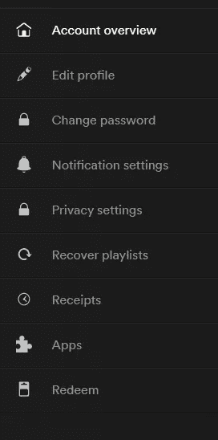
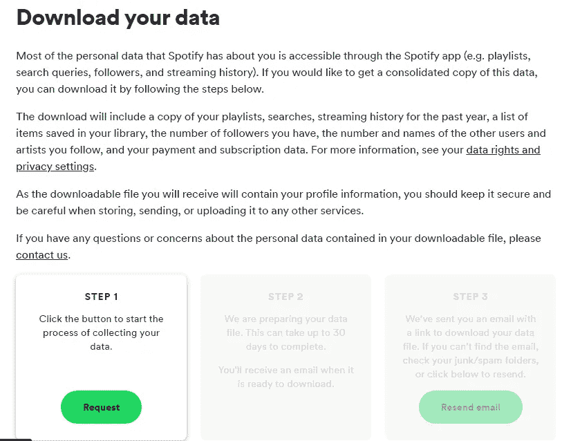
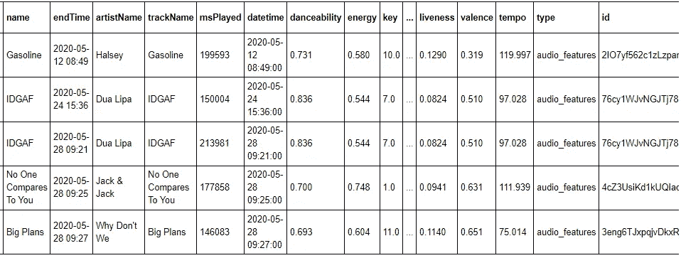
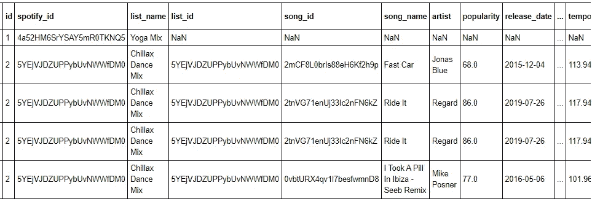

# Spotify 音乐数据分析:第 1 部分

> 原文：<https://medium.com/analytics-vidhya/spotify-music-data-analysis-part-1-c8457bfc53a?source=collection_archive---------2----------------------->

## 了解你自己系列—

## 数据采集

纳丁·沙巴纳在 [Unsplash](https://unsplash.com?utm_source=medium&utm_medium=referral) 上拍摄的照片

每个人都整天听音乐。连我都迷上了音乐。无论我做什么活动，我都需要音乐。我对音乐有着不拘一格的品味，我听的音乐类型从高节奏的舞曲到甜美圆润的原声音乐。

作为一名分析师，调查任何事情的有趣方式是什么

> 我们来量化一下数据。

在这一系列文章中，我将探索我的音乐流历史，并推断我不同的音乐品味。有了这个分析的帮助，我会对自己的听力品味和习惯有更好的了解。

为了进行这项分析，我将从 Spotify 获取数据，因为过去两年我一直在使用 Spotify，从那以后就没有更换过平台。因此，我所有的收听历史都在 Spotify 上，我可以很容易地收集我的数据集来研究我的音乐品味。

在系列的这一部分，我们将使用 Spotify API 抓取数据，然后执行数据清理和预处理，以便我们的结果是准确的。

# 目录

1.  Spotify 简介
2.  从 Spotify Dashboard 下载数据
3.  提取相关数据
4.  结论
5.  链接到本系列的其他部分

# Spotify 简介

Spotify 是一项音乐流媒体服务，你可以在这里收听世界各地的音乐和播客。Spotify 免费提供服务，但有一些限制是为付费用户保留的。

# 从 Spotify Dashboard 下载数据

现在，要下载您的 Spotify 数据，第一步也是最重要的一步是登录您的 Spotify 帐户。你可以通过访问官方的 [Spotify 网站](https://www.spotify.com/us/home/)来实现。

登录后，转到屏幕的右上角。您将看到您的 ***剖面图*** 部分。从下拉菜单中选择您的 ***账户*** 。

Spotify 帐户仪表板中的导航列表

您将被转到您的帐户控制面板。在这里，您可以导航到屏幕左侧的菜单窗格。从旁边所示的导航菜单中，选择 ***隐私设置*** 。

选择 ***隐私设置*** 后，向下滚动到页面底部。在这里你可以找到 ***下载你的数据*** 部分如下图所示。

Spotify 页面—下载数据

单击请求按钮启动数据收集过程。Spotify 通常需要 4-5 天时间通过电子邮件发送您的数据。然而，他们有时可能需要长达 30 天。

收到 Spotify 的邮件后，下载这个 zip 文件夹并提取其中的内容。Spotify 提供的所有信息都是 JSON 格式的。

# 提取相关数据

提取 Spotify 提供的 zip 文件夹后，您将可以访问流媒体历史记录、个人详细信息和关注的艺术家等信息。zip 文件夹中的 JSON 文件列表如下:

1.  **Follow.json —** 包含以下列表以及当前关注者。
2.  **Identity.json** **—** 包含您在 Spotify 应用上显示的信息，如姓名、照片和验证等。
3.  **推论. json** **—** 包含 Spotify 对你作为用户的理解，即你在 Spotify 上消费什么样的内容，如教育、商业、舞蹈等等。
4.  **payments . JSON****—**包含您的付款信息。
5.  **Playlist1.json —** 这个 json 有您创建的播放列表信息。
6.  **SearchQueries.json —** 它存储了你的搜索历史，例如:你在什么时间、在什么系统上查询了一首歌、艺术家或播客。
7.  **streaming history 0 . JSON—**这是你的流媒体播放历史，即你何时听过哪首歌，听了多长时间。
8.  **UserData.json —** 这包含您在注册时提供的个人信息，例如，您的用户名、出生日期、电子邮件、性别等。
9.  **YourLibrary.json —** 你保存或喜欢的内容都可以在这个 json 文件中找到。

然而，JSON 不包含日期-音乐时间戳、歌曲 id、歌曲特征等信息。因此，要获取这些信息，你可以使用由 Vlad Gheorghe 编写的代码。你可以在他的[博客](https://towardsdatascience.com/get-your-spotify-streaming-history-with-python-d5a208bbcbd3)和 [Github](https://github.com/vlad-ds/spoty-records) 查看他的数据抓取代码。

用 Vlad 的代码收集的前几行数据如下:

此外，我还收集了播放列表信息。我这里用的代码是 [Vinci Hu](/@vinhu) 写的。你也可以看看她的[博客](https://towardsdatascience.com/viz-your-music-with-spotify-api-and-plotly-eaa65f652191)和 [GitHub](https://github.com/VincyHu/MusicForYou) 来了解同样的情况。

从杨永晴的代码中抓取的播放列表数据的前几行如下:

您也可以在我的 [Github](https://github.com/pragyy/my-music-analysis) 中找到前面提到的用于数据抓取的 python 脚本。

# 结论

这些数据是使用 Spotify API 收集的。

现在，在本系列的下一部分，我将检查数据中的异常，然后预处理数据集。

# 链接到本系列的其他部分

*   Spotify 音乐数据分析第 1 部分:数据收集
*   [Spotify 音乐数据分析第二部分:数据清洗&预处理](/@vermapragya/spotify-music-data-analysis-part-2-3a69ae0f7f01)
*   [Spotify 音乐数据分析第 3 部分:数据可视化](/@vermapragya/spotify-music-data-analysis-part-3-9097829df16e)
*   [Spotify 音乐数据分析第 4 部分:聚类分析](/@vermapragya/spotify-music-data-analysis-part-4-4016e2954795)