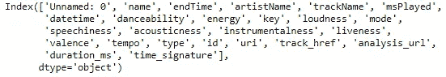

# Spotify 音乐数据分析:第 2 部分

> 原文：<https://medium.com/analytics-vidhya/spotify-music-data-analysis-part-2-3a69ae0f7f01?source=collection_archive---------4----------------------->

## 了解你自己系列—

## 数据清理和预处理


[摄粘土堤](https://unsplash.com/@claybanks?utm_source=medium&utm_medium=referral)上[的 Unsplash](https://unsplash.com?utm_source=medium&utm_medium=referral)

在开始数据分析之前，有必要检查数据并解决其中存在的任何混乱，以获得准确的结果。

在第一部分中，数据集是使用 Spotify API 收集的。这些数据是我从开始在 Spotify 上听音乐以来近两年的数据。

在这个系列的这一部分，我将寻找数据中出现的任何偏差，这些偏差可能会扭曲我们的结果。接下来是数据预处理，以便根据需要转换数据。

本文使用的代码来自我的 [GitHub](https://github.com/pragyy/my-music-analysis) 中的笔记本***data _ cleaning . ipynb***。看看吧！

# 目录

1.  导入数据
2.  删除重复的列
3.  删除重复的行
4.  零检查
5.  数据格式检查
6.  价值检查
7.  导出数据
8.  结论
9.  链接到本系列的其他部分

# 导入数据

首先，让我们导入数据。所以，我有两个数据集——歌曲和播放列表。名为 ***final*** 的 CSV 文件存储所有先前播放的歌曲的历史和特征信息。播放列表数据存储在名为 ***播放列表*** 的 CSV 文件中，该文件给出了播放列表信息以及每个播放列表中所有歌曲的详细信息。

可以使用`read_csv()`加载数据。在`read_csv`中传递的参数是数据文件路径。此外，可以使用`head()`功能查看数据的前几行。

因此将歌曲和播放列表数据集分别加载到两个不同的数据帧 ***df1*** 和 ***df2*** 中。

```
*# loading the song file*
df1 = pd.read_csv('spotify data scraping\output**\\**final.csv')
df1.head()
```


df1.head()的结果

```
*# loading the playlist data file*
df2 = pd.read_csv('spotify data scraping\playlist.csv')
df2.head()
```


df2.head()的结果

# 删除重复的列

现在，为了按列来整理数据，让我们快速浏览一下上面的数据快照，我们可以看到有一些不需要的列，如 ***未命名:0。***

可以使用以下代码请求数据列的完整列表:

```
df1.columns
```



df1 中的列

```
df2.columns
```


df2 中的列

粗略地看一下，可以确认这些属性中的许多在分析中是不需要的。因此，删除这些不必要的列以释放空间并减少处理时间是非常重要的。

可以使用`drop()`函数删除数据列，并提供列名列表作为参数。

```
df1 = df1.drop(columns=['Unnamed: 0', 'name', 'endTime', 'type', 'uri', 'track_href', 'analysis_url', 'duration_ms' ])
df2 = df2.drop(columns=['Unnamed: 0', 'id', 'spotify_id', 'list_id' ])
```

# 删除重复的行

像任何人一样，我听过一首歌很多次。因此，数据集中有同一首歌曲的多个条目。我需要的信息包括总播放时间、一首音乐的播放次数以及更多类似的数据，所以我不会删除重复的内容，否则我会丢失这些信息，数据搜索也不会产生正确的结果。

另一方面，不需要复制来检查所有曲调的特性。因此，为了处理这个问题，我将创建一个新的数据帧，通过删除重复的行来存储唯一的歌曲及其属性。

首先，在删除重复项之前，让我们看看行数。

```
*# shape before dropping duplicate rows*
df1.shape
df2.shape
```

上述代码的输出分别是(8413，17)和(342，18)。因此歌曲数据中有 8413 行，播放列表数据中有 342 行。

为了删除重复的行，我将使用`drop_duplicates()`函数。对于函数参数，提到`keep = "Last"`，因为需要这些行的最新实例。此外，为了定义查找重复项的规则，在名为`subset`的函数中传递了一个参数。它以列的名称为基础，重复项将被识别和删除，如果没有提到，那么该函数将从数据中删除完全相同的重复项。因此，对于歌曲数据，可以基于轨道名称移除重复项，此外，对于播放列表数据集，可以消除属于同一播放列表的歌曲的多个条目。换句话说，基于*列表名称*(播放列表名称)和*歌曲名称*。

```
# we are keeping the last instance instead of the first as we need the latest entry of the songdf1_new = df1.drop_duplicates( subset = 'trackName', keep = 'last')
df2_new = df2.drop_duplicates( subset = ['list_name', 'song_name'], keep = 'last')
```

在删除不需要的行之后，我将它们存储在不同的数据帧中，以便随后可以将它们导出到一个新的 CSV 文件中。

并且得到的数据集的形状分别是(2135，17)和(242，18)。

最后，我有 4 个数据帧 ***df1、df2*** 用于存储原始歌曲和播放列表数据，还有 ***df1_new、df2_new*** 用于存储经过重复数据删除的歌曲和播放列表数据。

# 零检查

空单元格是最常见和预期的数据清理问题。因此，在消除重复行之后，检查任何丢失的数据点是最重要的步骤。

在 python dataframe 中，可以使用`isnull()`检查空单元格，进一步使用`sum()`函数获得空值的总和。我这样做是因为`isnull()`为每个单元格返回真或假的布尔结果，并且滚动每一行寻找空白单元格是一项相当乏味的任务。


df1 的空值检查输出

```
df1.isnull().sum()
```

上面代码行的输出显示空单元格的总和为零。因此，在歌曲的数据集中没有空值需要处理。


df2 的零校验输出

类似地，我将对播放列表数据执行 null 检查。

```
df2.isnull().sum()
```

输出表明有一个空值。

因此，我仔细阅读了数据集，发现我在 Spotify 中创建了一个没有任何歌曲的播放列表。因此，在输出中，没有空的 ***list_name*** 值，但是，它的其余值为空，因为其中没有歌曲。因此，为了处理这个问题，最简单的解决方案是删除该播放列表条目，因为它不包含任何有用的信息。

```
# playlist data
df2.dropna(subset=['song_id', 'song_name', 'artist', 'popularity', 'release_date', 'energy', 'liveness', 'tempo', 'speechiness', 'acousticness', 'instrumentalness', 'danceability', 'duration_ms', 'loudness', 'valence', 'mode', 'key'] , inplace = **True**)# deduplicated playlist data
df2_new.dropna(subset=['song_id', 'song_name', 'artist', 'popularity', 'release_date', 'energy', 'liveness', 'tempo', 'speechiness', 'acousticness', 'instrumentalness', 'danceability', 'duration_ms', 'loudness', 'valence', 'mode', 'key'] , inplace = **True**)
```

删除空行后，再次执行空检查以进行验证。


播放列表数据的空检查

从输出可以得出结论，现在没有空行了。

# 数据格式检查

我现在将检查属性是否有数据类型不匹配，因为有时浮点值被读取为字符串，字符串值被读取为数字格式，还有许多这样的数据不匹配。

对于这个测试，只需使用`dtypes`请求所有列的数据类型，并验证所有数据类型是否都正确。

```
df1.dtypes
```


df1.dtypes 的输出

从上面的输出可以推断，没有数据不匹配，所有数据都以各自的数据类型格式存储。

类似地，我检查了播放列表数据集的数据类型。

```
df2.dtypes
```


df2.types 的输出

这里也可以验证没有数据不匹配。

# 价值检查

在这一步中，我将检查单元格内的内容是否正确。因此，通过找到数值的最大值和最小值，我们可以确定这些值是否在可接受的范围内。

所以我将分别使用`.max()`和`.min()`请求列的最大值和最小值。

```
df1.max(axis=0)
```


d1.max()的输出

```
df1.min(axis=0)
```


df1.min 的输出()

上面的代码表明歌曲数据集中没有数据值问题。所有数值都在可接受的范围内。

# 导出数据

我已经识别并纠正了所有不一致的数据。现在所有的数据都被清理和处理，因此可以使用`to_csv()`将其导出为新的 CSV 文件。

```
df1.to_csv('data\song_data.csv') df1_new.to_csv('data\distinct_song.csv') df2.to_csv('data\playlist_data.csv') df2_new.to_csv('data\distinct_playlist.csv')
```

# 结论

所有的数据异常和困惑被处理。

现在，在下一部分中，我将执行数据探索和分析。

# 链接到本系列的其他部分

*   [Spotify 音乐数据分析第 1 部分:数据收集](/@vermapragya/spotify-music-data-analysis-part-1-c8457bfc53a)
*   Spotify 音乐数据分析第 2 部分:数据清理和预处理
*   [Spotify 音乐数据分析第 3 部分:数据可视化](/@vermapragya/spotify-music-data-analysis-part-3-9097829df16e)
*   [Spotify 音乐数据分析第 4 部分:聚类分析](/@vermapragya/spotify-music-data-analysis-part-4-4016e2954795)