# Spotify 音乐数据分析:第 3 部分

> 原文：<https://medium.com/analytics-vidhya/spotify-music-data-analysis-part-3-9097829df16e?source=collection_archive---------2----------------------->

## 了解你自己系列—

## 数据可视化

卢克·切瑟在 [Unsplash](https://unsplash.com?utm_source=medium&utm_medium=referral) 上的照片

在上一个系列中，检查数据集是否有任何损坏的数据点，即格式不正确、重复或不完整的数据点。经过这次检查，我没有发现任何异常。然后，我修改并转换了数据集，以适应需求。

在这个系列的第三部分，我将深入了解我的流历史和我的心情。此外，我将回顾我的音乐的特点和功能以及我创建的播放列表。

本文使用的代码可以在我的 [GitHub](https://github.com/pragyy/my-music-analysis) 上的文件***explorative _ data _ analysis . ipynb***中找到。

# 目录

1.  音乐属性
2.  我的流媒体历史记录
3.  我多久听一次音乐？
4.  我最听谁的？
5.  我全年的心情
6.  特征分析
7.  音频特征含义
8.  特征直方图
9.  速度直方图
10.  热图
11.  散点图
12.  数据透视表
13.  播放列表分析
14.  按年份排序的歌曲
15.  按键歌曲
16.  结论
17.  链接到本系列的其他部分

# 音乐属性

本系列第一篇文章中收集的数据集包含歌曲属性。在进行数据分析之前，有必要单独了解这些特征。

数据集中的歌曲属性解释如下:

**速度:**歌曲的速度。轨道的总体估计速度，以每分钟节拍数(BPM)为单位。在音乐术语中，速度是给定作品的速度或步调，直接来源于平均节拍持续时间。

**能量:**能量是从 0.0 到 1.0 的度量，代表强度和活动的感知度量。通常，高能轨道感觉起来很快，很响，很嘈杂。值越高，歌曲越有活力。

**可跳舞性:**可跳舞性描述了一首曲目在音乐元素组合的基础上适合跳舞的程度，包括速度、节奏稳定性、节拍强度和整体规律性。该值的范围从 0 到 1。值越高，歌曲越适合跳舞。

**响度:**响度值是整个音轨的平均值。是一首歌的品质。范围从-60 到 0 DB。数值越高，歌声越响亮。

**效价:**从 0.0 到 1.0 的量度，描述一个音轨所传达的音乐积极性。高价曲目听起来更积极(例如，快乐、愉快、欣快)，而低价曲目听起来更消极(例如，悲伤、沮丧、愤怒)。

**活跃度:**检测录音中是否有观众。较高的活跃度值表示音轨被现场执行的概率增加。高于 0.8 的值很有可能表示该音轨是实时的。

**Acousticness:** 从 0.0 到 1.0 的置信度度量，表示音轨是否是声学的。1.0 表示音轨是声学的高置信度。

**语速:**语速检测音轨中是否存在口语单词。越是类似语音的录音(例如脱口秀、有声读物、诗歌)，属性值就越接近 1.0。高于 0.66 的值描述可能完全由口语单词组成的轨道。介于 0.33 和 0.66 之间的值描述可能包含音乐和语音的轨道，可以是分段的，也可以是分层的，包括说唱音乐。低于 0.33 的值很可能代表音乐和其他非语音类轨道。

**调式:**歌曲可以分为大调和小调。1.0 代表大调模式，0 代表小调。

**调:**调是构成歌曲基础的歌曲的音高、音符或音阶。12 个键的范围从 0 到 11。

# 我的流媒体历史记录

在这一部分，我将借助我的音乐聆听历史来分析我的行为和个性。在这里，我使用我的 Spotify 收听历史。我在 2019 年开始使用 Spotify，并继续在上面听歌。因此，在过去的两年里，我已经产生了大量的数据，这些数据足以进行分析。

为了分析流历史，我将导入存储在`song_data.csv`中的全部音乐流数据。

# 我多久听一次音乐？

在这个想象中，我将确定我每天听音乐的时间。这个图类似于 GitHub 上的一个图，它显示了我们每天的提交次数，但是，这里我将显示我听音乐的时间(以分钟为单位)。

为此，首先将时间从*毫秒*转换为*分钟*并将`DateTime`转换为日期格式。一旦数据被转换成所需的格式，然后按日期分组，这样我们就可以得到每天听音乐的分钟数。

获取流时间后，通过删除不必要的列来调整数据帧的形状。最终的数据帧存储在`new_daily_length`中。

使用`calplot`绘制该时间的热图。

上面的代码产生了下图—

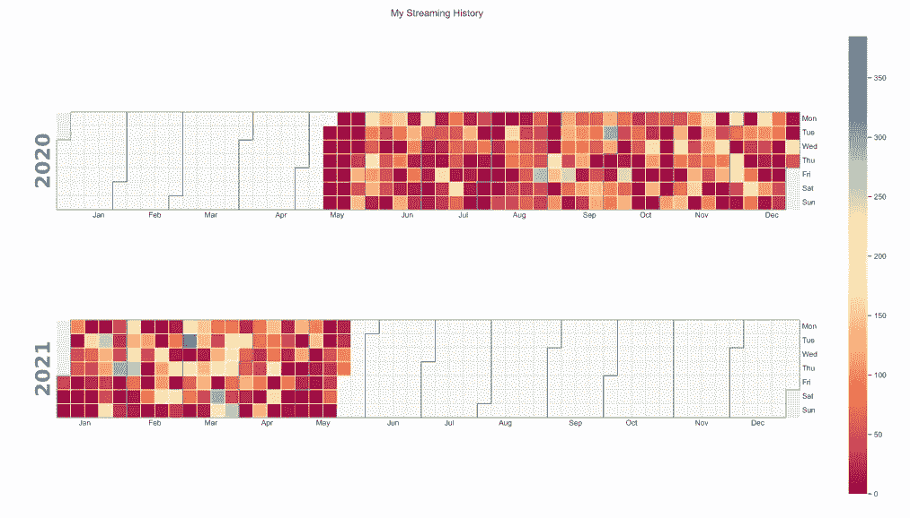

可视化流时间的 Calplot

当我去我的大学旅行的时候，我每天听音乐。根据图表，我听歌的时间从 5 分钟到超过 80 分钟，也有超过 100 分钟的。此外，有很多天我根本没有听，这可能是因为我可能会迟到，或者我从来没有时间插件。自从 2020 年 4 月实施封锁以来，我听的时间更少了(大约不到 30 分钟)。然而，有几天我会听一个多小时。

# 我最听谁的？

我听过数百位艺术家的多首歌曲。这将是很有趣的，以确定艺术家的歌曲，我流了最多。

为了确定这个值，我将按独特的艺术家对数据帧进行分组，并计算每个艺术家听到的时间。此外，按听到的分钟数对数据进行排序，以获得听到最多的艺术家。

现在策划所有艺术家的视觉意志。因此，我提取了前 30 位听过的艺术家，并将它们存储在`most_heard_30`中。

现在可以使用`barplot`将数据框可视化为水平条形图。

视觉效果如下图所示—

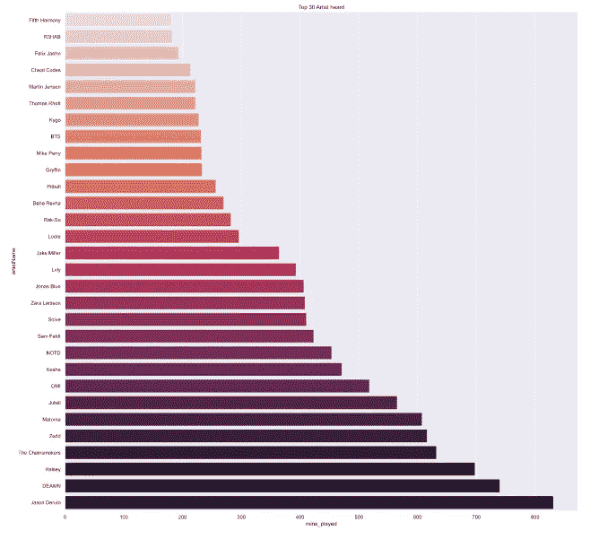

柱状图显示最流畅的艺术家

因为条形图只能清楚地显示 30 位艺术家。在下一个情节中，我制作了一个`word cloud`，在这里我代表了我的 100 位顶级艺术家，没有任何妥协。

云这个词是这样的—

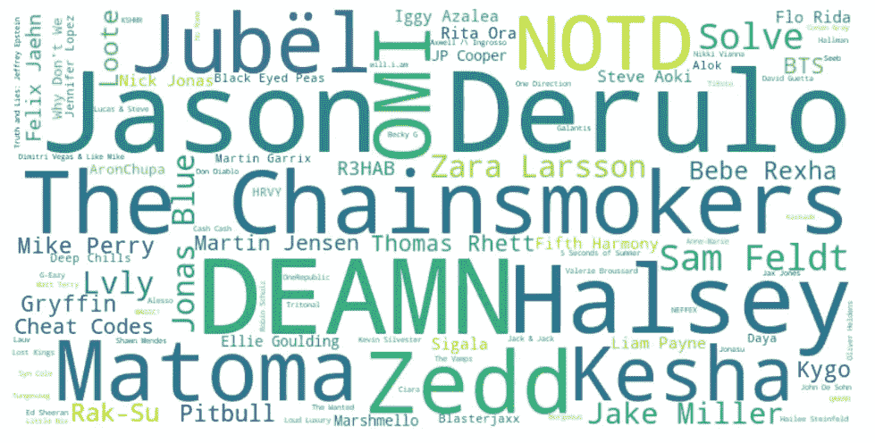

Wordcloud 将展示 100 位顶级艺术家

正如你在上面的图表中看到的，艺术家的名字越大，蓝色越深，我听的越多。此外，尺寸减小，颜色变得越来越淡，越来越黄。而且，这个情节很容易灌输 100 个艺术家。我最熟悉的艺术家有*杰森·德鲁罗、哈尔西、烟鬼、迪蒙、佐德*等等。

现在，除了根据时间获取最常听到的艺术家，我还将提取我听过最多歌曲的艺术家。为了得到这个列表，我将设置 5 首歌曲的下限，然后绘制条形图。

上面的图表产生了以下视觉效果—

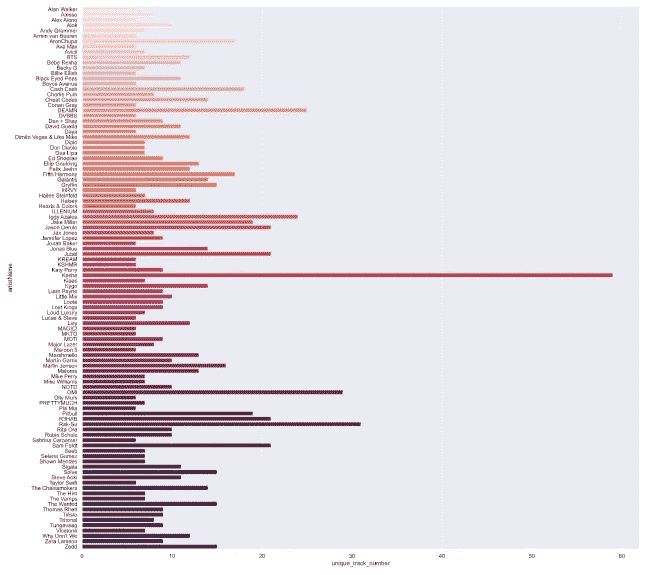

柱状图直观显示每位艺术家的歌曲数

从上面的视频我们可以看到，我的大部分歌曲是由*迪曼、、、和*演唱的。

# 我全年的心情

在理解了流历史之后，发现情绪也是相关的。现在数据集包含数据 ***价*** ，它定量地定义了歌曲的情感。因此，我将使用属性 ***价*** 来确定我的情绪，因为一个人经常根据自己的心境来听音乐。

准备好可以绘图的数据帧。该数据框架可以使用误差图可视化，误差图显示每天的最小值、最大值和平均值。垂直线表示最小值和最大值，上面的小三角形显示平均值。

上面的代码生成了下面的图表—

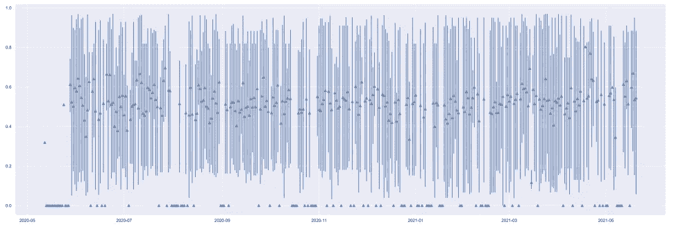

日常情绪可视化误差图

如你所见，我听了你所有类型的音乐，无论是喜庆的还是忧郁的。

类似地，我创造了一个视觉来决定每天舞蹈和音乐能量方面的最小和最大数量。

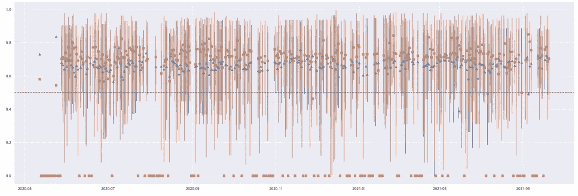

在上图中，我在 0.5 处添加了一条中线，舞蹈和能量水平的平均值几乎每天都在这条线上。即使我听忧郁的歌，它们也有很高的舞蹈和能量水平。

# 特征分析

现在到了这一部分，我将分析我的音乐列表的特征。对于这个分析，我将导入唯一的歌曲列表，因为我不需要流时间数据。导入`distinct_song.csv`,因为所需信息存储在该文件中。

我将分析我的音乐特征，如可舞性、活力、语速、活力、效价等等。

# 音频特征含义

在对定量变量进行任何分析之前，有必要了解这些变量的总体情况。所以我们先来获取每个特征的平均值。

让我们在柱状图中绘制每个特征的平均值。

上面的代码产生了下面的图—

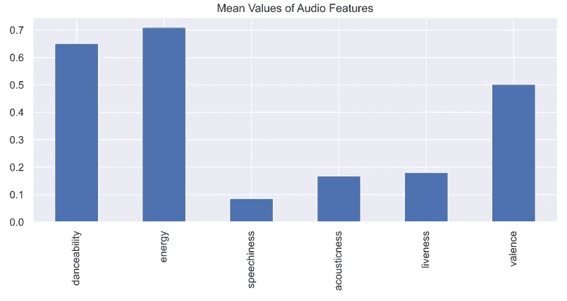

柱状图直观显示音频特征的平均值

从上面的画面可以推断出，平均来说，我的歌曲有更多的舞蹈性和活力，较少的声学特征。不过总体来说情绪是中性的。

# 特征直方图

该数据集包含许多音频特征，因此为了获得它的简要概述，我可以绘制所有特征的直方图。

为了得到每个属性的直方图，我将运行一个循环。代码如下—

结果如下所示—

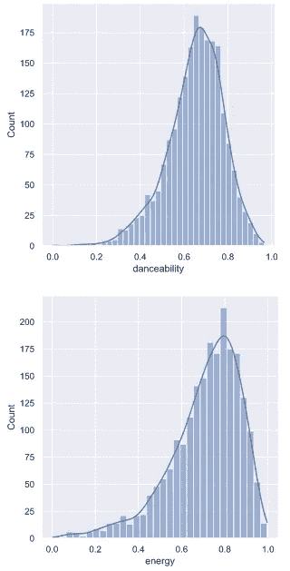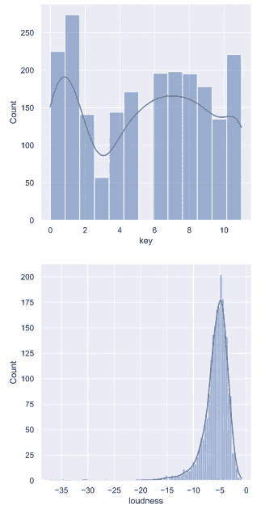

声学特征直方图

该代码将产生一个直方图的所有功能在这里，我刚刚包括 4 个图。

# 拍子

每首歌都有其特定的节奏。我将绘制一个直方图来可视化属于每个*节奏的歌曲的数量。*

*此外，数据集包括歌曲的主要和次要模式。我们也可以使用下面的代码基于不同的**模式**来分离图表*

*上面的代码生成了如下所示的图形。*

*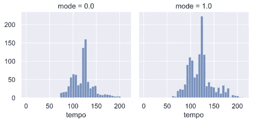*

*按速度和模式统计歌曲数量*

*音乐有 12 个键，所以我们可以使用一个`barplot`来获得每个**键和模式**的歌曲数*

*我们可以简单地用一个`countplot`来得到这个输出，用*模式*作为色调。*

*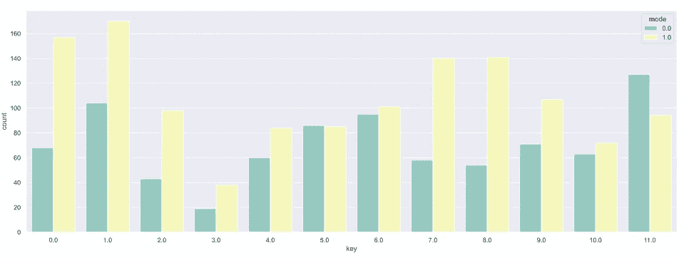*

*直观显示计数的条形图*

# *热图*

*在数据集中有许多歌曲特有的特征。歌曲特征之间是否存在任何关系可以使用热图来确定。这将有助于更好地理解音乐的特性。*

*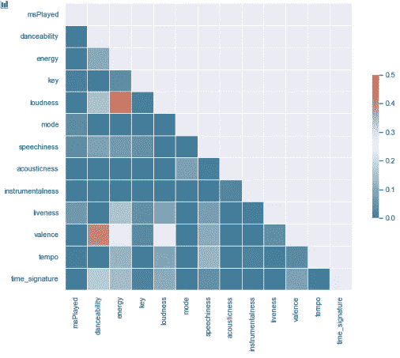*

*歌曲特征热图*

*从上面的热图中，可以推断出以下变量之间存在巨大的相关性——*

1.  *响度 X 能量*

*2.化合价 X 可跳舞度*

*3.价 X 能量*

*4.价 X 响度*

*5.能量 X 时间签名*

# *散点图*

*散点图也是确定两个变量之间关系的好方法。所以我会把它画出来，画出我们在上面发现的强相关的变量。此外，我还将在图中添加**模式**，以便根据主模式和次模式进行分析。*

*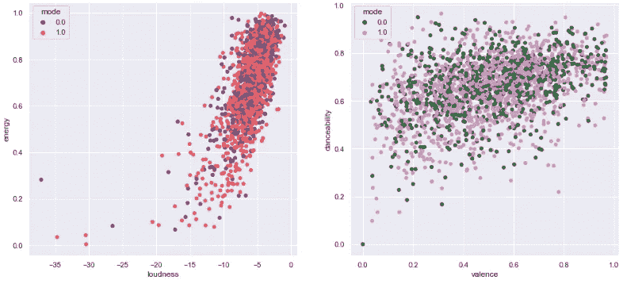**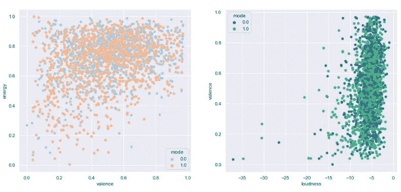**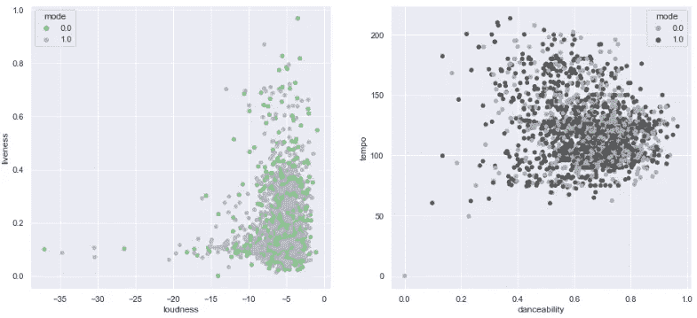*

*散点图*

# *数据透视表*

*不同的艺术家有不同的音高、音量、速度等。调也是音乐中的一个主要因素。*

*在数据透视表的帮助下，我可以得到他们演唱/创作的歌曲的平均音调。*

*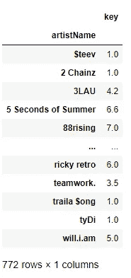*

*艺术家及其音乐平均键的数据透视表*

*我们可以看到上图中几个艺人的平均键值，比如对于 *3LAU* 是 4.2， *will.i.am* 是 5，其他艺人也是如此。*

# *播放列表分析*

*在前面的章节中，我已经广泛地分析了这些歌曲及其特点。现在，在这一部分，让我们简要分析一下我在 Spotify 帐户中创建的播放列表。*

*所以先导入`playlist_data.csv`文件。它将集中于 5 个主要特征——能量、可跳舞性、效价、活性和声学。所以把数据按播放列表分组，得到这些变量的平均值。*

*了解播放列表价值的最佳方式是绘制一张雷达图。*

*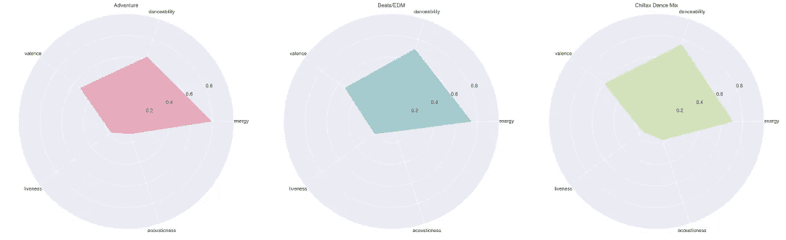**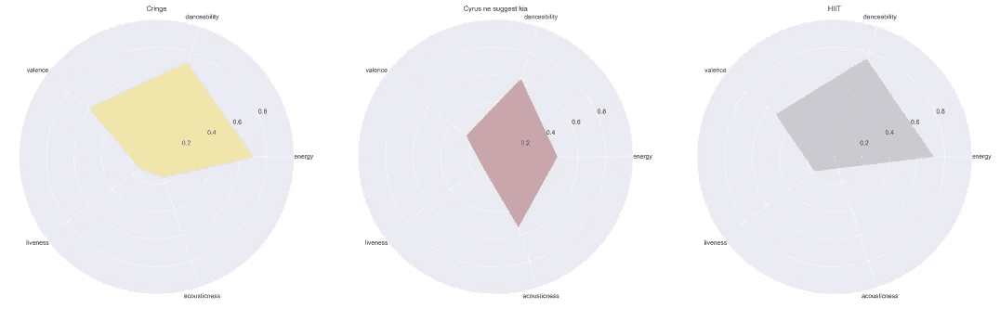**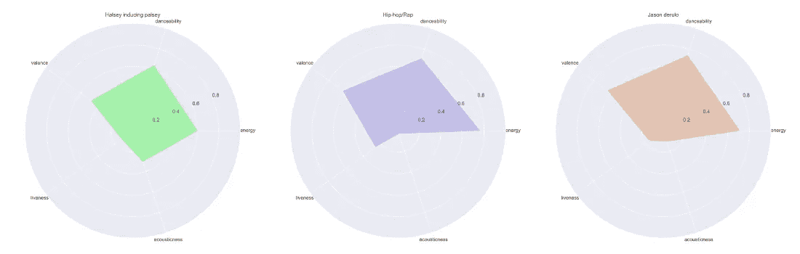*

*播放列表的雷达图*

*在上面的图表中，可以看到我所有播放列表的整体视图。*

# *按年份排列的歌曲*

*播放列表包含许多歌曲。歌曲发行年份很重要，所以我可以决定我是喜欢听更多的老歌还是新歌。*

*数据集包含`release_date`属性。可以从`release_date`中获取*年*，并绘制出每年发布的歌曲数量。*

*该图可以是一个简单的条形图，以获得每年的歌曲数。*

*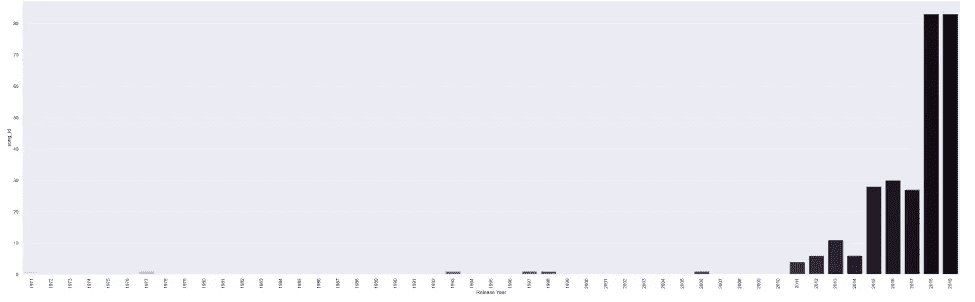*

*从上面的视觉，可以推断出我听的更多的是时下最流行的歌曲而不是老歌。*

# *按键歌曲*

*最后，我还将确定我的播放列表中属于每个键的歌曲。*

*简单地用小节图，我可以得到每个调的歌曲数。*

*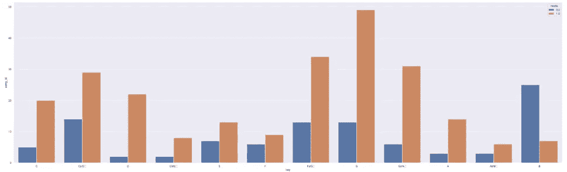*

*按键和模式统计歌曲数量*

# *结论*

*在本文中，进行了可视化分析以更好地理解数据。很多相关的推论被做了出来，比如我的收听历史，以及我的情绪和我对艺术家的选择。更进一步，对我的歌曲和播放列表进行了数学剖析和学习。*

*在下一篇文章中，我将对数据集执行聚类分析。*

# *链接到本系列的其他部分*

*   *[Spotify 音乐数据分析第 1 部分:数据收集](/@vermapragya/spotify-music-data-analysis-part-1-c8457bfc53a)*
*   *[Spotify 音乐数据分析第二部分:数据清洗&预处理](/@vermapragya/spotify-music-data-analysis-part-2-3a69ae0f7f01)*
*   *Spotify 音乐数据分析第 3 部分:数据可视化*
*   *[Spotify 音乐数据分析第四部分:聚类分析](/@vermapragya/spotify-music-data-analysis-part-4-4016e2954795)*