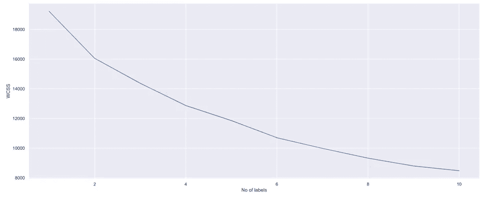
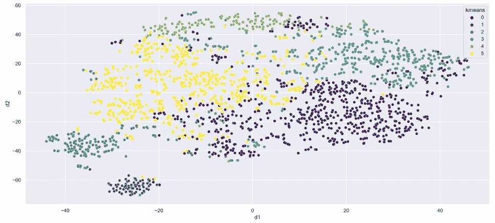
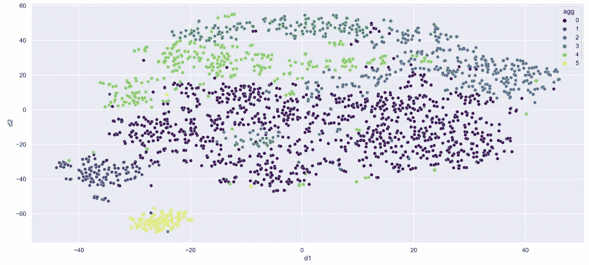
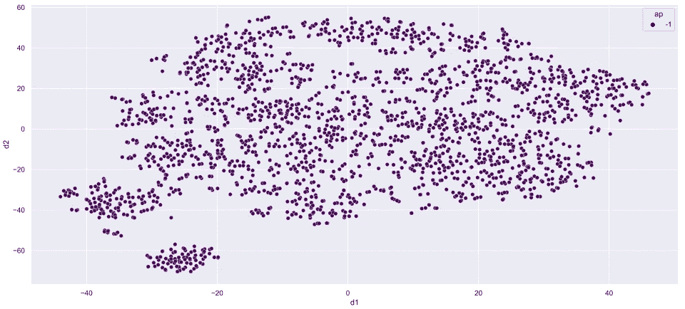
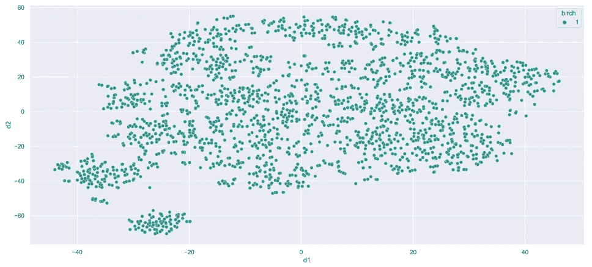
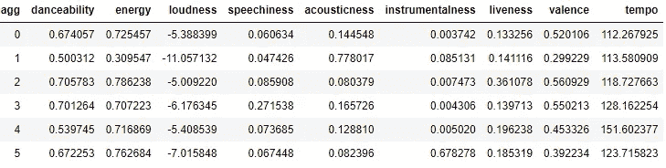

# Spotify 音乐数据分析:第 4 部分

> 原文：<https://medium.com/analytics-vidhya/spotify-music-data-analysis-part-4-4016e2954795?source=collection_archive---------3----------------------->

## 了解你自己系列—

## 聚类分析

由 [Pierre Bamin](https://unsplash.com/@bamin?utm_source=medium&utm_medium=referral) 在 [Unsplash](https://unsplash.com?utm_source=medium&utm_medium=referral) 上拍摄的照片

在本系列的前几篇文章中，我介绍了如何收集 Spotify 数据集，根据需求对其进行预处理，并执行全面的数据分析。

在本系列的这一部分中，我将对数据集执行聚类分析。聚类分析是一种探索性分析，有助于识别数据中的结构。聚类是一种无监督的机器学习算法，用于将相似的数据点分组在一起。

本文使用的代码来自我的 [GitHub](https://github.com/pragyy/my-music-analysis) 中的笔记本***Clustering _ analysis . ipynb***。

# 目录

1.  导入数据集
2.  标准化变量
3.  降维
4.  k 均值
5.  凝聚聚类
6.  其他算法。。。
7.  集群配置文件
8.  结论
9.  链接到本系列的其他部分

# 导入数据集

首要的事情是加载数据集

然后下一步是提取所需的列。数据集包含歌曲特征和其他细节，例如时间、日期等。因此，为了执行聚类分析，我将提取歌曲的特征。然后我会根据这些特征对歌曲进行聚类。

切片数据集包括特征— *可跳舞性、能量、响度、语速、声学、乐器和活性*。

# 标准化变量

一些变量在 0 到 1 的范围内，然而，一些是负的，一些高达 60 和 70 或超过 100。因此，具有属于这种范围极限的值将影响结果，因为聚类算法依赖于测量不同数据点之间的距离。例如，如果其中一个变量的测量范围比其他变量大得多，那么无论何时我们计算两点之间的距离，结果都会受到该变量的过度影响。

# 降维

数据集包含 7 个变量。因此绘制它是不可行的，所以我将数据集的特征或维度减少到 2 或 3，因为它可以使用 2D 或 3D 图形可视化。

可以借助`TSNE`(t-分布式随机邻居嵌入)来实现。它是一种在低维空间中表示高维数据以可视化数据点的工具。

现在，在`scatterplot`的帮助下，我们可以轻松地在二维空间中绘制我们的数据点

散点图

# k 均值

K-means 是一种用于聚类数据点的迭代聚类算法。在实现算法之前，知道需要执行的正确迭代次数是很重要的。借助于肘形法可以确定最佳数量。

肘方法将计算从 1 到 10 的不同聚类数的 WCSS。WCSS(聚类平方和内)是点和聚类之间距离的平方和。

一旦我们将所有的 WCSS 值绘制出来，图形看起来就像一个肘部。

肘形图

根据上图，可以确定最佳的聚类数是 6。

现在训练数据集，将它们聚类到各自的组中。

这些星团看起来像下面这样—

k 均值聚类

# 凝聚聚类

在上面的视觉中，我可以说许多点被错误地分组了。所以我也会尝试其他的聚类算法。

所以我会进行凝聚聚类，看看这个算法表现好不好。

上面的代码产生了下面的集群—

凝聚聚类

以上聚类比 *k-means* 要好很多。

# 其他算法…

为了确定，如果数据点被正确地聚类，我将执行更多的聚类算法来检查。

执行算法来检查数据集聚类——相似性传播聚类、BIRCH、DBSCAN 和小批量 k 均值。

相似传播聚类

桦树

无论我执行哪种算法，都只能产生一个集群。因此，对于我们的数据集，上述算法表现不佳。

# 集群配置文件

进行聚类的主要原因是为了确定我听的不同类型的歌曲。从上面的分析，我可以说我听了 6 组歌曲。

每个聚类的音乐特征的平均值如下所示

集群配置文件

集群描述如下—

1.  **集群 0:** 集群 0 包含具有更多节拍(平庸节拍/分钟)和较少声学和乐器的有活力的歌曲。而且这些歌都有点伤感，歌词灰暗。*(节拍+阴郁)。*
2.  集群 1: 集群 1 包括具有更多节拍和较少声学和语音的充满活力的歌曲。而且这些歌都有点伤感，歌词灰暗。 *(Beats +阴郁)。然而，集群 0 的唯一区别是乐器。除了节拍和能量，这首歌还有很多乐器的声音。*
3.  **聚类 2:** 根据特征，聚类 2 包含高节拍(一般节拍/分钟)的活力歌曲，音响和乐器较少。而且，这些歌都有欢快的歌词。 *(Beats + happy)。*
4.  **聚类 3:** 从特征上看，聚类 3 包含了高节拍、较少音响和乐器的活力歌曲。而且，这些歌曲的歌词都是中性的。*(节拍+中性)。*
5.  **集群 4:** 集群 4 包含具有高节拍且较少音响和乐器的充满活力的歌曲。而且，这些歌曲的歌词都是中性的。 *(Beats + happy)。*
6.  **聚类 5:** 根据特征，聚类 5 包含节拍较少、音响和乐器较多的低能量歌曲。而且，这些歌都有悲伤的歌词。*(声学+悲伤)。*

# 结论

在这个博客中，歌曲根据它们的量化值被分成不同的类别。

# 链接到本系列的其他部分

*   [Spotify 音乐数据分析第 1 部分:数据收集](/@vermapragya/spotify-music-data-analysis-part-1-c8457bfc53a)
*   [Spotify 音乐数据分析第二部分:数据清洗&预处理](/@vermapragya/spotify-music-data-analysis-part-2-3a69ae0f7f01)
*   [Spotify 音乐数据分析第 3 部分:数据可视化](/@vermapragya/spotify-music-data-analysis-part-3-9097829df16e)
*   Spotify 音乐数据分析第 4 部分:聚类分析