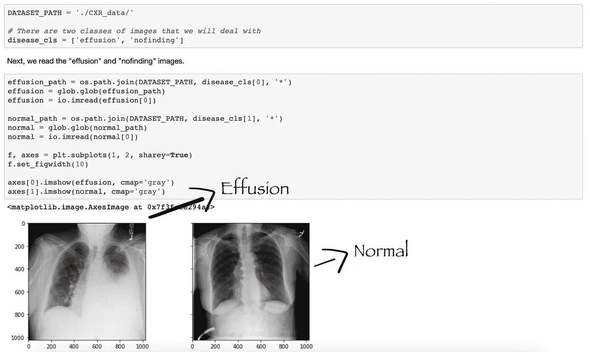
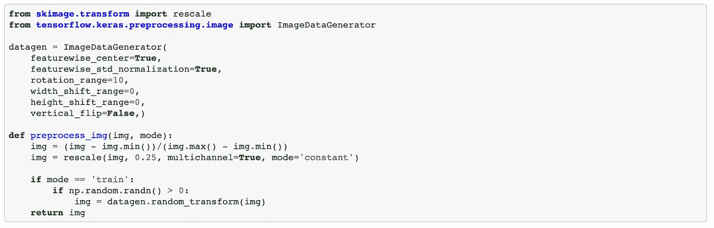
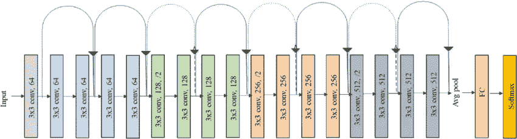

# 使用深度学习发现胸部 X 射线扫描中的异常

> 原文：<https://medium.com/analytics-vidhya/spotting-anomalies-in-chest-x-ray-scans-using-deep-learning-4b8195a7b7bb?source=collection_archive---------14----------------------->

使用卷积神经网络将扫描分类为“渗出”或“正常”。

我们将要处理的数据集是胸部 x 光的灰度(黑白)图像。您可以从这里下载数据集:

```
[https://www.kaggle.com/shaitender/cxr-dataset](https://www.kaggle.com/shaitender/cxr-dataset)
```

您可以在这里查看完整的项目:

```
[https://github.com/Adhithia/XRay_Classification_CNN](https://github.com/Adhithia/XRay_Classification_CNN)
```

肺部*积液*是什么？

积液是肺部周围不寻常的液体量。胸膜是一层薄膜，位于肺部表面和胸壁内部。当你有胸腔积液时，液体会在你的胸膜层之间积聚。正常情况下，胸膜腔中只有几茶匙的水样液体，这使得你呼吸时，你的肺可以在胸腔中顺利移动。您可以在此了解更多信息:

```
[https://www.webmd.com/lung/pleural-effusion-symptoms-causes-treatments](https://www.webmd.com/lung/pleural-effusion-symptoms-causes-treatments)
```

# 1.数据准备

我们将加载数据集并指定放置它们的路径。记得把两个文件夹分开放。



加载数据集并指定路径

你可以从每个类中看到一个样本图像。左图左肺有一些空白，标记为“*积液*”。另一幅图像是“*无发现*或*正常*。

这里你可能还想注意到另一件事——图像是灰度的。这里没有 RGB 颜色，这意味着图像是单通道的。并且通常 X 射线扫描是高分辨率图像。虽然我没有在代码中提到它——它们是 1024x1024。(那就是**巨大！**)

# 2.数据预处理



数据生成程序

现在我们已经加载了数据集，我们需要看看不同的预处理方法。从 *tensorflow.keras .预处理*中，我们导入了一个名为“ *ImageDataGenerator* 的东西。

您可以从这里查看该类的所有参数:

```
[https://keras.io/api/preprocessing/image/](https://keras.io/api/preprocessing/image/)
```

在' *ImageDataGenerator* 中，我们提供了数据扩充的参数。例如，我们已经提到 *rotation_range* 为 10——这是图像在放大时可以随机旋转的范围。在胸部 X 射线的情况下，旋转 90 度或任何超过 20 度的扫描是非常不可能的。

> 类似地，我们将*垂直翻转*指定为*假*。*该参数用于随机垂直翻转图像。同样，获得垂直翻转的 X 射线图像是非常不可能的。*
> 
> 如果你真的有一个这样的，你可能会问那个家伙喝了什么。

参数 *width_shift_range* 和 *height_shift_range* 也被设置为 0。这些参数指定了增强过程中高度和宽度的随机变化。再说一次，你永远不会在 X 射线扫描中看到明显的变化。他们总是将整个图像居中。


但是如果你做了一个只有右肺*的扫描呢？*

*因此，一旦我们指定了我们想要 *ImagDataGenerator* 做的所有事情，我们就继续进行预处理功能。在这里，我们首先将图像归一化，然后将其缩放到 0.25，即缩小到原始大小的 1/4。所以图像现在将是 256x256。这对于一个普通的系统来说要容易得多。*

*请注意，在这里的*归一化*期间，我们使用了图像像素的最大值和最小值，而不是 0 和 255。这是因为这个图像不是一个“*自然图像*”。(不是 3 通道图像)*

# *3.数据生成*

*数据生成器类*

**数据生成器*类是完全可定制的。这个类为我们做的是批量发送数据。一次性发送整个数据集是无效的。因此，我们在这里定义批量大小，类为我们批量生成数据。*

# *4.模型评估方法*

*这里我们应该注意的一件事是*阶级不平衡。渗出*仅占 10%,而*无发现*类在数据集中占 90%。由于大部分数据只属于一个类别，这种情况下的训练将不起作用，因为模型将主要学习和分类大部分数据为'*'没有发现*'从而导致高精度。*

*为了开发一个模型，我们在这里使用了 *ResNet* 。*

**

*ResNet18 结构*

*在这个数据集上评估模型性能的方式必须稍有不同。我们使用所谓的*加权交叉熵损失。损失是这样计算的，低流行率类别的错误分类比其他类别受到更重的惩罚。**

*因此，每当我们的模型在异常类上出错时，我们就通过将损失乘以一个高权重值来对其进行严厉惩罚。这增加了错误分类类别的损失，因此由于反向传播造成的权重变化更大。因此，对错误分类负责的权重的学习曲线更多。*

*假设“*无发现*”为 0 级，“*积液*”为 1 级。*

*一、实际类— 0，预测类— 0:结果— **无罚**，权重 **1。***

*二。实际类— 1，预测类— 1:结果— **无惩罚**，权重 **1。***

*三。实际类— 1，预测类— 0:结果 **—惩罚，**权重 **5。***

*四。实际等级— 0，预测等级— 1:结果 **—惩罚，**权重 **5。***

# *5.最后一步*

*既然您已经准备好了*数据生成器*以及模型评估指标，那么是时候训练模型并测试它了。您可以通过多种方式训练模型。您可以手动更改所有 hyper 参数并执行测试运行。你可以尝试改变批量大小，图像分辨率或增加一些数据增强策略。我们在这里使用了 *ResNet18* ，但是你可以建立你自己的定制 CNN 模型。*

*这是*使用深度学习*在胸部 X 射线扫描中发现异常的终结。你可以在这里查看完整的项目:[https://github.com/Adhithia/XRay_Classification_CNN](https://github.com/Adhithia/XRay_Classification_CNN)*