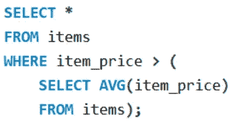

# 数据科学的 SQL 备忘单

> 原文：<https://medium.com/analytics-vidhya/sql-cheat-sheet-for-data-science-cf3005c0fb28?source=collection_archive---------0----------------------->

该资源应该用作 SQL 的查找，以便在面试前复习 SQL 的基础知识。为了复习和面试而写的。

## 基本 SQL 语句

使用下面的例子理解几个基本子句:

**选择**:用于指定要查询的列。(*)如果需要所有列。
**其中**:该语句用于过滤查询返回的数据。在上面的例子中，返回大于 50 小于 100 的分数。
***注意事项*** :
1。该语句主要用于比较运算符，如( *>、≥、<、≤、=、！=* )。也适用于比较 ***日期时间*** 条目值。
2。也可以使用逻辑运算符组合多个条件，如*、 ***或*** 、 ***NOT*** 、 ***IN*** 、 ***BETWEEN*** 等。
3。对于字符串相关的条件， ***像*** 子句一样被使用。更多信息[点击这里](https://www.bankbazaar.com/tax/form-12b.html)。
4。 ***REGEXP*** 现在已经像 一样广泛地取代了 ***，在搜索更复杂模式的字符串时极其强大。更多关于正则表达式[这里](https://developer.mozilla.org/en-US/docs/Web/JavaScript/Guide/Regular_Expressions/Cheatsheet)。
5。 ***为空*** 或 ***不为空*** 可用于检查一个条目是否为空。****

***ORDER BY** —用于在 SQL 查询中按列名对数据进行排序。用于排序的默认列是表的主键。默认顺序是升序，除非由 **DESC** 指定。*

**

*在上面的示例中，条目首先按百分比排序(降序)。对于分数相等的学生，按名字排序(按字典顺序)。对于同名同姓的学生，按其学号排序。
*注意*在 **SELECT** 子句中的别名也可以用来对数据进行排序。*

**

***ORDER BY** 也可以根据 select 子句中的列号调用，比如 1 表示第一个，2 表示第二个。不建议使用这种方法，因为它对于查询的 select 子句的变化不够健壮。*

**

***LIMIT** 将表中的结果数限制为 LIMIT 子句中指定的数。
一个参数:指定要返回的行数。
两个参数:*跳过*前 10 个条目，*返回*后 40 个条目。
用例:网页的分页和惰性加载。这主要用于数据的分页，比如我们只想在一页上显示 10 个结果。*

*类似地， **TOP** 可用于从表格中选择前 *n* 行。ex:(*SELECT****TOP****3 * FROM…*)*

## *多个表格*

*从下面的示例中理解连接的语法:*

**

*内部联接*

***内部连接**:关键字是可选的，用于连接两个表(来自同一个数据库或跨不同数据库)
结果表将包含两个表中的所有条目，这样它们相等且不为空。*

*使用子句，可以在 / **上使用连续的**连接**和**来执行多个连接。*****

***自联接**:当表格的行相互关联时，用于将表格与其自身联接。*

**

*例如，考虑一个雇员经理(他也是公司的雇员)，我们可以在一个查询中查询雇员信息、经理信息，如图所示。
*注意同一个表使用不同的别名。**

*逻辑运算符(如**和**)也可以用来构成复合**连接**子句。这对于具有复合主键的表(在这种表中，我们不能使用单个列唯一地标识表中的一行)特别有用。*

***外连接:**当您需要一列中的所有条目时，不管指定的连接条件是什么，都会使用外连接。以学生表(包含学生信息)和结果表(包含学生的结果)为例。我们可以使用外部连接获得所有学生的结果，即使他们没有参加考试(结果分数中的空条目)。*

**

*“OUTER”关键字是可选的(类似于“INNER”关键字)。左连接比右连接更容易可视化。在一个 SQL 查询中只使用一种类型的外部连接(左或右)是一个好习惯。使用两个外部连接会降低代码的可读性。与内部自联接类似，外部自联接也可用于表中的相关行。*

**

***自然连接:**这允许数据库引擎识别两个表之间的公共列并连接它们(使用内部连接)。不鼓励这种做法，因为它允许数据库引擎猜测表必须联接的列，可能会产生意外的结果。*

***交叉连接:**将第一个表中的每条记录与第二个表中的每条记录合并。可能的用例包括形状和颜色等独立属性之间的表格混合匹配。在这种情况下，查询内容为，给我所有可能的颜色和形状组合的产品。*

**

***联合:**用于合并多个表中的行。
注意:两个查询中的列数应该相等。*

## *汇总数据*

*SQL 为我们提供了真正有用的函数，帮助我们汇总数据。*

**

***聚合函数:**它们接受一系列值作为输入，并返回单个值。最常见的聚合函数有*最小*、*最大*、 *AVG* 、*总和*和*计数*。
*注意*这些函数只对列中的非空值起作用。*

**

***GROUP BY:** 该子句通常与内置的聚合函数一起使用。这使得能够计算不同数据组的值的聚合函数。
*注意*按分组的**中的列也必须出现在 **SELECT** 子句中。
由**分组的**位置在 **WHERE** 子句(如果有)之后，由**排序的**之前。***

**

***HAVING** :当通过子句使用**组时，如果我们必须过滤出每组的数据，那么我们必须使用 **HAVING** 子句。**由于 SQL 语句的执行顺序，WHERE** 子句在这里不起作用。***

## *SQL 内置函数*

## ***数字功能***

***ROUND** —返回舍入后的整数值(例如: *ROUND(5.73)* = 6)。或者，第二个参数定义精度，例如: *ROUND(5.73，1)*= 5.7
**TRUNCATE**—返回十进制值后的截断数(例如: *TRUNCATE(5.7345， 2)* = 5.73)
**上限** —返回大于或等于自变量的最小整数(例如:*上限(5.2)* = 6)
**下限** —返回小于或等于自变量的最大整数(例如:下限(5.2) = 5)
**绝对值** —返回自变量的绝对值(例如:【T68*

*数字功能的详细列表可在[这里](https://dev.mysql.com/doc/refman/8.0/en/numeric-functions.html)找到。*

## ***字符串函数***

***LENGTH** —返回字符串
的长度 **UPPER** —返回只包含大写字母的字符串。
**小写** —只返回小写字母的字符串。
**LTRIM** —返回没有任何前导空白字符的字符串。
**RTRIM** —返回没有任何尾随空白字符的字符串。
**TRIM** —删除任何前导或尾随空白字符后返回字符串。
**LEFT(str，k)** —返回字符串 str 的前 k 个字符。
**RIGHT(str，k)** —返回字符串 str 的最后 k 个字符。
**SUBSTRING(str，I，n)** —返回长度为 *n* (可选)的子字符串，从索引 *i* ( *注意:基于 1 的索引* )
**LOCATE(str1，str2)** —返回 *str2 中 *str1* 第一次出现的索引(注意:在此函数中搜索不区分大小写，如果
**CONCAT(str1，str2，…)** —返回连接的字符串( *str1str2…* )**

*字符串函数的详细列表可以在[这里](https://dev.mysql.com/doc/refman/8.0/en/string-functions.html)找到。*

## *日期时间函数*

***NOW** —返回当前日期和时间，格式为:*(YYYY-MM-DD HH:MM:SS)* **CURDATE***—*返回不带时间成分
**CURTIME** —返回不带日期成分
**YEAR**(*dateTime*)—返回从*yyy*提取的年份 **小时**、**分钟**、**秒** —类似于**年**，它们分别从*日期时间*参数中返回提取的*月*、*日*、*小时*、*分钟*和*秒*。 返回值都是*整数*类型。
**day name**(*dateTime*)—返回从 *dateTime* 对象中提取的日期(*星期一*、*星期二*、…)，作为*字符串*。类似地，可以使用 **MONTHNAME** 提取月份名称。*

**

*另一种常见的日期/时间提取方法是使用**提取**，如图所示。月、日、小时、分钟和秒的工作方式类似。*

## *日期格式*

*更加用户友好的功能，更容易阅读，描述性的日期格式。*

**

*日期格式的结果: *2022 年 1 月 9 日*
注:
1。如果使用 *%y* (而不是 *%Y* )，则只显示年份的后两位。
2。如果使用 *%m* (而不是 *%M* )，月份将以数字(*0–12*)
3 显示。如果使用 *%d* (而不是 *%D* )，日期将显示为*DD*(*00–31*)，不带“ *th* ”。*

*关于日期格式的更多信息可以在***DATE _ FORMAT***[这里](https://dev.mysql.com/doc/refman/8.0/en/date-and-time-functions.html)的文档中找到。*

## *日期时间计算*

*更常见的是，我们需要计算日期和时间来根据日期和时间过滤数据。在这些情况下，以下函数证明是有用的:*

****

**注意*:DATEDIFF 函数只返回(日期之间的)天数差。如果第一个日期(参数)出现在第二个日期参数之前，则为负数。*

## *子查询*

**

*在另一个 SQL 查询的 *"( )"* 中使用的 SQL 查询被称为**子查询**。
该示例显示选择价格高于所有商品平均价格的所有商品。*

**

***SELECT** 子句中的子查询通常用于计算偏差、方差或数据库上的数学/统计运算。*

*子查询可以用在任何子句中( ***SELECT*** ， ***FROM*** ， ***WHERE*** )*

*   *在 **SELECT** 子句中使用的子查询通常返回单个值。*
*   *在**中使用的子查询，其中**子句可以返回单个值或一系列值。*
*   *在来自子句的**中使用的子查询必须返回一个表。子查询表的别名是必需的。***

## *相关子查询*

**

*当我们想要在子查询中引用不同的表时，我们可以使用表别名(在示例中为 *e* )来引用子查询中的表。*

*在子查询中引用表别名的查询称为相关子查询。*

*希望这有所帮助:)*