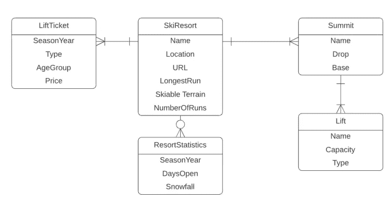

# 用于数据模型的 SQL

> 原文：<https://medium.com/analytics-vidhya/sql-for-data-models-1-7744c9e67bb5?source=collection_archive---------1----------------------->

数据建模是一种为了数据分析而组织和连接数据的方法。数据建模是我们用来组织多个表的信息以及它们如何相互关联的。这在为系统中的信息提供结构方面有很大的帮助。
通常数据模型代表一个业务流程，它也可以帮助你理解一个业务流程。很多时候，你会和业务人员一起理解数据以及数据是如何组合在一起的。
但与此同时，业务人员将从数据建模师那里学到很多东西，通过查看数据以及数据如何相互作用，更好地理解他们的业务实际上是如何协同工作的。
关于数据模型，需要记住的是，它应该总是尽可能地代表真实世界的问题。

示例:

**查询**

1.  **选择语句**

数据科学家使用 SQL 做的大部分工作是检索数据。为了能够做到这一点并开始使用，首先要使用的语句是 SELECT 语句。一个基本的 SELECT 语句，告诉数据库数据来自哪个表，在查询中选择表中的所有或特定列，并限制查询中返回的数据量。使用 SELECT 语句，您将指定两条信息，您想要选择什么和您想要从哪里选择。

**语法:**

> **从 *table_name*** 中选择 *column1* 、 *column2、…*
> 
> 创建、更新和插入表格的方式在很大程度上取决于您正在使用的关系数据库管理系统。
> 
> **这里我们使用的是 SQLite。**

**2。临时表**

我们的另一个选择是创建一个副本，基本上是另一个表的副本，或者从另一个表中提取一个子集。我们可以由此创建一个完整的表，也可以创建一个临时表。

首先，关于这些临时表，需要知道的最重要的事情是，当当前客户端会话终止时，这些表将被删除。这就是为什么他们被称为临时表。

然而，这些确实很好用，因为它们比创建一个真正的表要快得多。因此，如果您有复杂的查询，并且希望通过创建一个子集来简化它，然后连接到该子集并从中驱动新的计算，那么临时表是一个很好的选择。

**语法:
创建临时表*new _ TBL*SELECT * FROM*orig _ TBL*LIMIT 0；**

> 你创建、更新和插入表格的方式很大程度上取决于你使用的关系数据库管理系统。
> 
> 这里我们使用的是 SQLite。

**3。过滤**

我们已经讨论了使用 select 和 from 命令从表中实际获取数据的基础知识。

但这只是故事的一部分，因为大多数数据库包含数千甚至数百万条记录。通常我们不想查看所有的数据。

我知道我没有。

在这一节中，我们将讨论 SQL 的过滤功能。

过滤极其重要，因为它允许我们缩小想要检索的数据。当您进行分析时，也可以使用过滤来获得您想要作为模型的一部分进行分析的非常具体的数据。

理解过滤 SQL 是很重要的，因为当我们直接使用 SQL 而不是依赖客户端应用程序来做时，会有一些巨大的好处。

首先，当我们过滤数据时，通常会减少我们检索的记录数量。我们不需要去抓取整个表并从中提取每一列和每一行，我们可以真正具体地从表中获取我们想要的数据。随后，这减少了我们从系统中获取的数据量。当然，减少您正在分析的数据量将提高查询性能，这反过来将提高我们的整体处理速度。

当我们在数据库级别添加过滤时，它也有帮助，因为这减少了应用程序客户端的压力，这也将允许它更好地运行。

您必须选择您的列，然后选择您想要的列来自哪个表。然后添加 where 以及列名运算符值。您可以使用几个不同的运算符。您可以使用**等于、不等于、大于、小于、大于或等于、小于或等于、介于，并且为 null** 。

> SELECT ProductName，unit price from products where product name = ' coffee '

上述示例将返回所有咖啡产品及其单价。我们将获得的记录数量取决于我们在**产品**表中有多少‘咖啡’产品。

但也许我们想看看价格大于或等于 75 的产品。所以这次我们要查看单价大于或等于 75 的记录。

> 从单价> = 75 的产品中选择产品名称，单价

这将返回单价大于或超过值 75 的所有记录。

我们可以筛选的另一种方法是通过寻找不匹配的产品，也许你没有一个你想购买的产品的清单，比如咖啡，也许你有一大堆产品。简单的说给我一切，除了空白。

因此，基本上，我们想拉除了'咖啡'的所有记录。

> 从产品中选择产品名称，单价

您可以做的另一件很酷的事情是过滤一系列值。这有点不同，因为它没有操作符。它使用的是介于和、和之间的。

> 从单价介于 EN 15 和 50 之间的产品中选择产品名称，单价

另一个例子是过滤空值。在这个例子中，我们所做的是过滤为空的东西。

> 从 ProductName 为空的产品中选择 ProductName，UnitPrice

代表产品名称的列是否对每条记录都有某种类型的信息？

**4。数学运算符**

到目前为止，我们设法获得了数据，过滤了数据，等等，但是正如你可能意识到的，我们实际上可以用我们的数据做更多的事情。

在本节中，我们将对数据进行基本的数学计算。如前所述，我们能够下推到数据库并拥有数据库级别的处理能力越多，就越好。我们通常处理大量的数据，所以我们真的希望减轻客户端应用程序的压力。我们离源头越近，从长远来看就越好。

所以，我们从简单的开始，加减乘除。

在这个例子中，我想做的是按顺序排列所有的单元。我想要，乘以单价，得到总订单成本。

> SELECT 产品名称，单价，单价订单，单价订单*单价作为产品的总订单成本

这里需要注意的一点是，要记住运算的顺序，就像你们以前学过的数学一样。
先处理括号里的东西，然后幂是指数、乘、除、加、减的思想。
在美国，常用的记忆方法是**“请原谅我亲爱的萨莉阿姨”**。

对于这个例子，我现在要把除法和减法结合起来。在括号里，我会把我想发生的操作符放在最前面。对于这个，我有我的单价减去我的折扣，除以数量。

> 从 OrderDetails 中选择产品 ID、数量、单价、折扣、(单价-折扣)/数量作为 Total_Cost

所以，这些都是非常简单的例子，但是当你开始把这些加在一起的时候，又一次变得非常强大。

**5。聚合函数**

我们开心了吗？

我知道我是，但是这一节将会变得更加有趣，因为是时候通过查看 SQL 中的一些聚合函数来真正深入数据分析了。

聚合函数提供了各种汇总数据的方法，这反过来又真正帮助您分析数据并了解您拥有什么。
使用各种聚合函数，包括 **AVERAGE、COUNT、MIN、MAX 和 SUM** 来汇总和分析数据，不要忘记 **DISTINCT** 函数及其用途。

集合函数可用于各种用途，在寻找最高或最低值、记录总数、平均值等方面非常有用。它实际上是建立在前一节中列出的一些数学运算符的基础上的。

只不过它们是内置的函数，所以开始汇总和总结一些数据非常容易，很多时候在描述性统计中，我们开始了解和理解我们的数据。

在本例中，当我们从产品表中选择单价时，我们对**的单价值进行平均**。

> 从产品中选择 AVG(单价)作为 avg_price

继续，当我们想了解一个表的内容时， **COUNT** 函数非常有用。这有助于理解一个表中有多少条记录，或者有多少条记录包含信息。

> 从客户中选择 count (*)作为 total_customers

如果你用星号和括号做一个**计数**，你将计算一个表格中的所有行，这可能是所有的值或者没有值，因为这只是计算一个表格中的任何一行。

您还可以通过选择 count 然后选择列名来计算单个列的数量。这将计算特定列的行数，并忽略空值。

> 从客户中选择 COUNT(CustomerID)作为 total_customers

如果客户 ID 列中没有值，我们可能会得到相同的结果，也可能会得到不同的结果。

好的，我们的另一个聚合函数是最小**和最大**和**再次，你开始理解你的数据，你刚刚得到一个新的表，你想看看这些数据是什么样子的。**

获得一系列数据总是很棒的，比如什么是最小值**什么是最大值**，什么是最大值**什么是最大值**，开始给你一个分布的概念，所有这些都可以在数据库上完成。

> 从产品中选择 MAX(单价)作为 max_prod_price
> 
> 从产品中选择 MAX(单价)作为 max_prod_price，MIN(单价)作为 min_prod_price

另一件要注意的事情是，最小值和最大值函数将忽略空值。

最后，我们有 **SUM** 聚合函数，您可以像使用其他聚合函数一样使用它。

在这个例子中，我想查看库存单位的单价，我想得到一个总数，但我还想把所有这些加在一起。

> 从产品中选择 SUM(单价)作为 total_prod_price
> 
> 选择 SUM(单价*单价)作为产品的总价格，其中供应商 ID = '23 '

现在我有了所有产品的总价，单价和库存单位。

现在，您可以看到在一些聚合函数中使用数学运算符，您可以真正开始更好地理解您的数据，现在甚至可以开始进行一些分析并输入您自己的数据。

聚合函数还有一个重要的用法，就是 distinct 这个词。如果 distinct 一词在语句中不具体，SQL 将总是假设您需要所有数据。

例如，您可能有一个多次出现在一个表中的客户。如果您只是对您的客户 id 进行计数，而没有区分只对不同的客户 id 进行计数，您可能会在那里得到重复的记录，这对于运行计算不同的记录的查询以及查看一列中哪里可能有一些潜在的重复记录非常有帮助。

在对 count 的聚合函数使用 DISTINCT 时，需要记住一些事情。不能对星号使用 DISTINCT on COUNT 函数。

请记住这一点，不仅要考虑何时何地可以使用 DISTINCT，还要考虑何时需要使用 DISTINCT，何时不需要。

我希望这是有帮助的:-)，如果你想了解更多关于处理来自多个表的数据，请查看这里的[我的下一篇文章](https://medium.com/p/68104dcbe55c/edit)。

SQL 示例代码，可以查看我下面的 github 资源库:
[leenakh 123/SQL-Queries(github.com)](https://github.com/LeenaKH123/SQL-Queries)

**参考文献:**
1。学习数据科学的 SQL 基础知识| Coursera
2。SQL 教程(w3schools.com)