# 数据模型的 SQL

> 原文：<https://medium.com/analytics-vidhya/sql-for-data-models-2-68104dcbe55c?source=collection_archive---------12----------------------->

在我的[上一篇文章](https://leenamk.medium.com/sql-for-data-models-1-7744c9e67bb5)中，我回顾了基本的 SQL 查询来分析一个表中的数据，在这篇文章中，我将解释如何一起使用多个表来分析数据，当我们将不同的事实、维度和来源组合在一起以获得新的含义时，我们在关系数据库中获得了很多价值，最简单的方法之一是使用子查询。

# **1。子查询**

数据科学家通常使用子查询来选择特定的记录或列，然后使用该标准作为他们想要选择的下一项的筛选标准。子查询不仅有助于从多个表中获取信息，还经常用于向查询中添加额外的条件，如从另一个表中筛选不在当前表中的条件。

> 从 CustomerID 所在的客户中选择 CustomerID、Region、CompanyName(从运费> 100 的订单中选择 CustomerID)

思考上述示例的一个好方法是，查询语句总是首先执行最内部的 SELECT 部分。它会说，好的，我有运费超过 100 的客户 id，然后它会和他们一起坐在那里。然后，它会不断地引入 CustomerID、CompanyName 和 Region，但它会将这些客户 ID 与之前提取的列表进行匹配，以查看这些客户 id 是否真的在列表中。

然后，它将只返回那些实际上在 select 语句列表中的客户 id。您可以看到，这有助于减少我们必须编写的查询数量，也有助于在一个查询中保持简洁。在最内层的查询中需要记住的两件事是，总是先执行什么。如果我在查看某人的查询并试图对其进行故障诊断，我总是从最内部的查询开始，看看发生了什么，然后从那里慢慢构建并向后工作。在这个例子中，记住数据库实际上执行两个操作。第一，获取运费超过 100 的客户 id。然后，它将提取其他客户信息，并将其与我们已经预先选择的客户 id 进行匹配。

在一个语句中，子查询的数量没有限制。
你可以在一个查询中有一个查询，在一个查询中，在一个查询中。不停地查询。

但是，您将开始注意到，当您进行深度嵌套并编写带有一堆子查询的长查询语句时，获取结果的性能确实会降低。

需要注意的一点是，子查询选择只能检索一个**单列**。你不能说，嘿，从这个表中选择所有这些列，然后把它们放到我的整体查询中。它一次只选择一列。这就是为什么它们被大量用于过滤。

# **2。作为计算的子查询**

在下面的例子中，我们希望获得公司名称和地区，并希望获得这些客户的订单总数。

在编写子查询之前，我们可以做的是计算特定客户 ID 的订单数，但是我们仍然没有客户名称和地区信息。

> SELECT customer_name，customer_state，(SELECT COUNT(*)AS orders FROM orders WHERE orders . customer _ id = customer . customer _ id)AS orders FROM customer ORDER BY customer _ name

我们写了一个子查询，而不是尝试将这两者结合在一起。我们没有使用带有 WHERE 子句的子查询，而是使用它来选择列。它根据客户 id 汇总订单。

# **3。连接表**

为了解释 join，我将返回到客户示例，Join 将允许您快速、动态地将正确的客户信息与正确的订单相关联。
因此，一个连接将允许您快速、动态地将正确的客户信息与正确的订单相关联。
这也允许您在一个查询中从多个表中检索数据。因此，与您过去所看到的不同，您为什么要进行子查询，而不是从一个表中获取一部分，然后从另一个表中获取一部分，然后尝试将这些信息合并在一起。相反，这允许您在一个查询中编写所有内容，并轻松地将来自多个来源的数据放在一起。

有不同类型的连接:

**a .笛卡尔连接/交叉连接**

交叉连接用于生成第一个表的每一行与第二个表的每一行的配对组合。这种连接类型也称为笛卡尔连接。

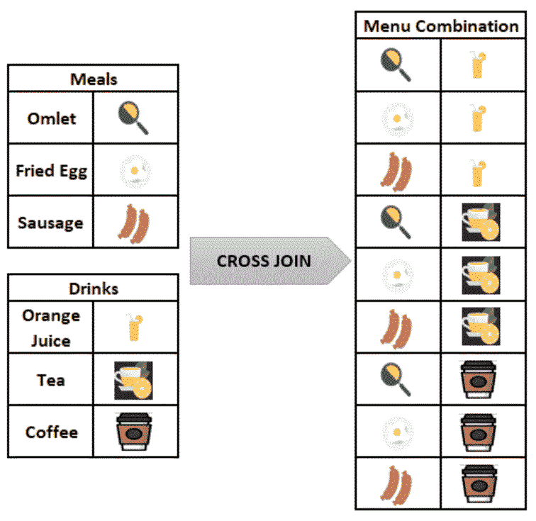

如果你现在感觉饿了也不用担心，看完文章你可以想吃什么就吃什么:-)

从上图中可以看出，在两个表之间执行交叉连接，不会将两个表的项相加，交叉连接会将两个表的记录相乘，从而生成最终结果。

因此，让第一个表中的 **3 记录**与第二个表中的 **3 记录**交叉连接，总会给我们 9 (3 * 3)条记录的最终结果作为输出。

SQL 中交叉连接的语法:

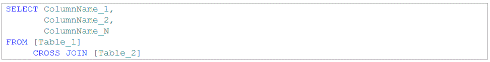

交叉连接语法

在上面的例子中，我们没有进行任何匹配，我们只是简单地将第一个表中的每一行乘以第二个表中的行数。

您可以看到，上述连接需要相当大的计算能力，它可以快速增加数据的大小，并且有可能返回不正确的结果。因为我们没有匹配任何东西，所以我们只是用一个表乘以另一个表。

**b .内部连接**

是 SQL 中最常用的连接之一，用于选择表中具有匹配值的列。

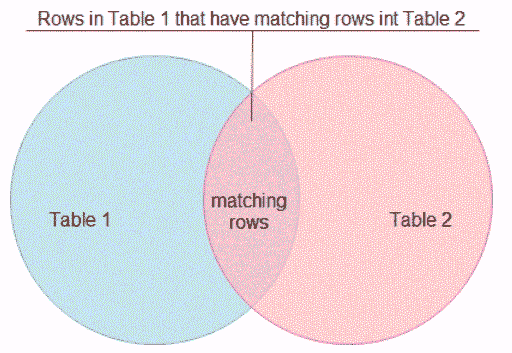

使用维恩图可视化内部连接

这就是键在表中变得非常重要的地方，正如您在上面的图表中看到的，我们有表 1 和表 2，内部连接将只返回两者都匹配的记录。它将在该链接中查找那个键，并返回匹配的记录，忽略所有其他记录。

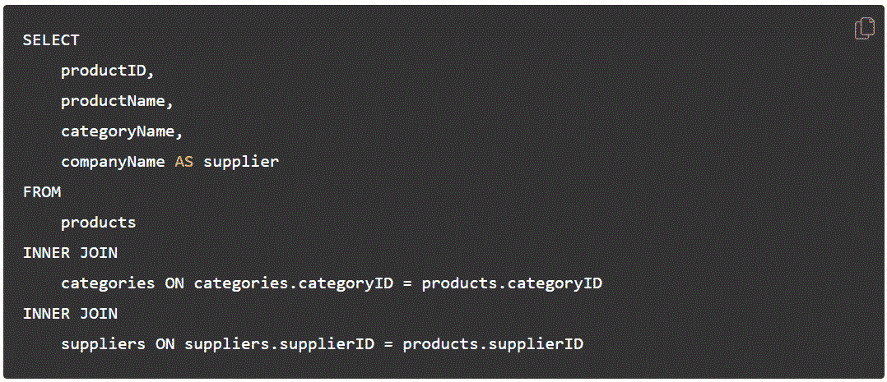

内部连接语法

在上面的示例中，categorid 表中的 categoryID 等于 products 表中的 categoryID，supplierID 表中的 supplierID 等于 products 表中的 supplierID。

我们可以在多个表上进行内部连接，对可以连接的内容没有限制。有一件事要谨慎反对，就是小心不要过度加入。连接非常好，这使得将数据混合在一起变得非常容易。你只需要那把钥匙。但是他们进行的计算很费力。所以如果你不需要加入，就不要加入。

**c .赛尔夫加入**

我们可以将一个表连接到它自己，这叫做自连接。

自连接语法

当我们将一个表连接到它自己时，表别名变得非常重要。我们必须有一个表别名，没有其他方法可以做到这一点，而且它们也有助于明确什么来自什么。

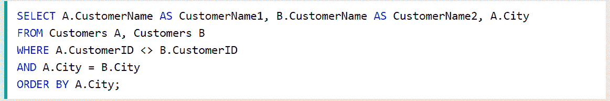

自联接示例

在上面的例子中，我们在表中列出了所有的客户以及他们来自哪里。但是我们想要匹配它们，所以我们要把这个表当作两个独立的表，并把原来的表连接到它自己。

如果我们在示例中看到这一点，我们已经选择了我们的客户名称，这将是公司名称一。然后，我们将再次选择“客户名称”作为“客户名称二”,我们将选择我们想要的城市。

为了得到这些表，我们两次列出同一个表 customers，第一次是 customers 作为 A，第二次是 customers 作为 B。我们将说 A.CustomerID 不等于 B.CustomerID 和 city，A.City 等于 B.City，然后为了更容易阅读，我们将按 A.City 排序。

当我们想要匹配同一个表中的某些元素时，这是一个非常有用的方法，也是 SQL 工具箱中的一个很好的工具。

**d .左、右和全外连接**

**Left join** 对于所有常见的数据库管理系统都是通用的，如下图所示，Left join 将返回左侧表(您首先陈述的表)中的所有记录，以及第二个表中的匹配记录。

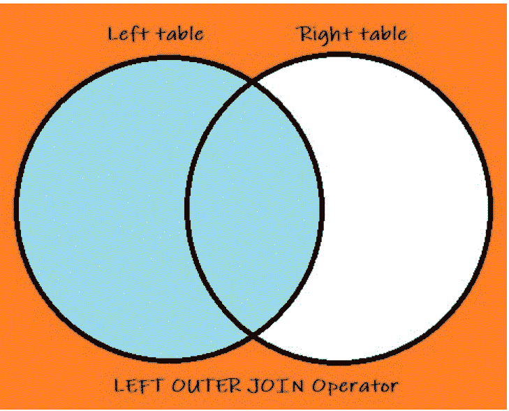

左连接

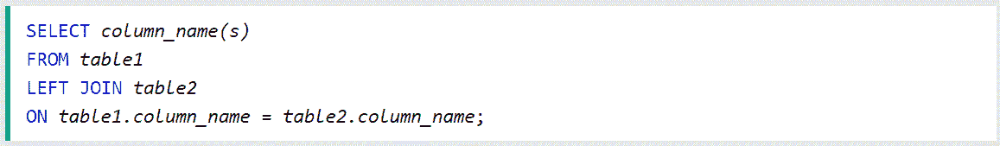

左连接语法

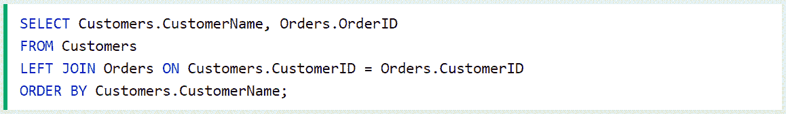

左连接示例

假设您的数据库中有 customers 表和 orders 表，假设您有一个客户向您提供了他们的信息，但是他们还没有下订单。因此，如果您对表 1(客户)和表 2(订单)进行内部连接，您将会错过没有下订单的客户。left join 要做的是允许您从 customer 表中选择所有内容，包括有订单和没有订单的客户。

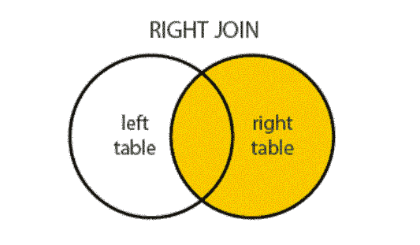

右连接

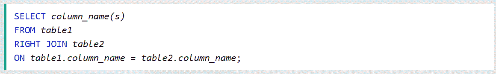

右连接语法

**右连接**非常相似，除了在这种情况下，如果我们仍然坚持客户表在左边，订单在右边，这将做的是拉进所有订单，无论客户是否与该订单相关联，然后，对于有客户与之最相关联的订单，它也将拉进那些记录。所以有点不同。

如果您使用左连接和右连接，以及您首先列出哪个表，请小心，并确保它与您使用的连接类型中的左连接或右连接相关。

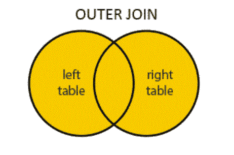

完全外部连接

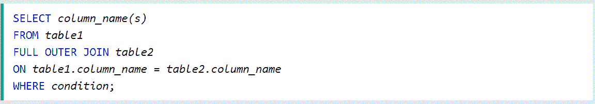

完全外部连接语法

对于完整的外部连接，这将返回表 1 或表 2 中匹配的所有记录。这将返回并给出所有信息，无论是匹配 1 还是匹配 2。

**e 工会**

**Union** 是我们数据库中不常用到的东西之一，但当我们确实需要它时，这正是我们需要用来完成工作的东西。这通常能节省我们很多时间。

**UNION** 用于将两个或多个查询或表集的结果合并到一个表和一个语句中。union 中的每个 select 语句必须具有相同的列数，列必须具有相似的数据类型，每个 select 语句中的列必须具有相同的顺序。

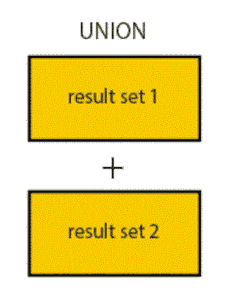

联盟

联合语法

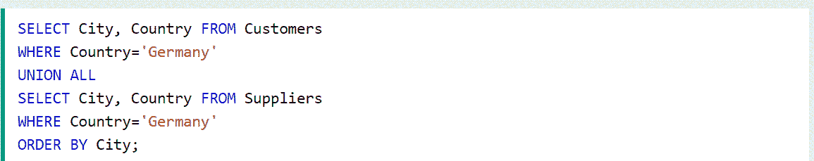

联合示例

在上面的例子中，我们要做的是选择来自德国的客户，我们想知道我们的客户来自德国的哪些城市，我们还想知道我们在哪些城市有供应商。

因此，我们要做的是编写两个单独的查询，一个从客户那里获取城市，另一个从供应商那里获取城市，然后我们将它们加在一起，这样我们就知道我们在哪里存在，是客户还是供应商。

语法是这样的，你有一个 SELECT 语句，包含表中的列名，然后列出 UNION 的位置，然后还有第二个 SELECT 语句。

在本例中，我们从客户表中选择城市和国家，其中国家等于德国，然后在我们的第二条语句中，我们将首先说 UNION，然后我们将编写第二条语句，现在，我们选择城市和国家，但是是从供应商表中选择。

也许这是我们想要在营销地图上绘制的东西，以表明我们与德国的所有城市都有业务关系，所以我们将我们的业务关系分为客户关系和供应商关系。

SQL 示例代码，可以查看我下面的 github 资源库:
[leenakh 123/SQL-Queries(github.com)](https://github.com/LeenaKH123/SQL-Queries)

我希望这有所帮助:-)

**参考文献:**
1。学习数据科学的 SQL 基础知识| Coursera
2。SQL 教程(w3schools.com)