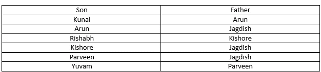
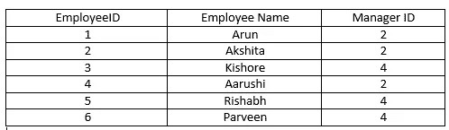
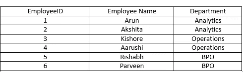
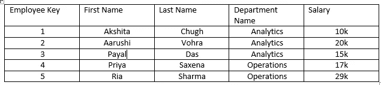
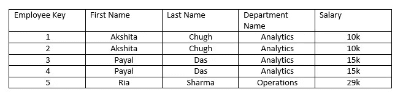

# SQL 面试问题

> 原文：<https://medium.com/analytics-vidhya/sql-interview-questions-c004d91dffc?source=collection_archive---------2----------------------->

**问题 1:什么是 SQL？**

答案 1: SQL 代表结构化查询语言。它是用于与数据库交互的主要语言。在 SQL 的帮助下，人们可以从数据库中提取数据，修改这些数据，并在需要时更新这些数据。

**问题 2:什么是数据库管理系统？**

数据库管理系统(DBMS)是控制数据库的创建、维护和使用的程序。DBMS 可以被称为文件管理器，它管理数据库中的数据，而不是将数据保存在文件系统中。

**问题 3:什么是 SQL server？**

SQL Server 是一个关系数据库管理系统，它以表格格式存储数据。它是“关系型”的，因为每个表中的值都是相互关联的，这使得一次跨多个表运行查询成为可能。

**问题 4:在 SQL 中查找员工的第二高工资？**

```
SELECT MAX(Salary) FROM Employee
WHERE Salary NOT IN (SELECT MAX(Salary) FROM Employee)
```

SQL 查询 select MAX(Salary from Employee)在 Employee 表中查找最高薪金，但是添加“WHERE Salary NOT IN”将筛选不包括最高薪金值的薪金值。例如，如果 Employee 表中的最高薪金是 300，000，则使用“NOT IN”运算符将该值从结果中排除，除 300，000 以外的所有值都将保留在结果中。因此，我们实际获得的最高值是 Employee 表中的第二高值。因此，当我们从新的结果集中选择最高工资时，它给出了雇员表中第二高的工资。

**问题 5:在 SQL 中使用 top 关键字查找员工的第 n 个最高工资？**

我们可以使用 SQL Server 这样的数据库的 TOP 关键字来查找第 n 个最高工资。要理解下面的查询，首先看一下子查询，该子查询在 Employee 表中查找最高的 N 份薪水，并按降序排列。然后，外部查询实际上将按升序重新排列这些值，这就是最后一行“ORDER BY Salary”所做的。最后，这意味着第 n 个最高工资将在工资列表的顶部，这意味着我们只需要第一行，这正是“选择前 1 名工资”将做的。

```
SELECT TOP 1 Salary
FROM (
      SELECT DISTINCT TOP N Salary
      FROM Employee
      ORDER BY Salary DESC
      ) AS Emp
ORDER BY Salary
```

**问题 6:用 SQL 中的稠密秩函数求员工的第 n 高工资？**

dense rank 函数(dense_rank)计算一组有序行中某一行的排名，并以数字形式返回该排名。排名基于 order by 子句中的值。在下面的查询中，根据雇员表的薪金返回排名。在出现平局的情况下，所有行的等级都相同。

```
select * from( select Salary, dense_rank() 
over(order by Salary desc)r from Employee) 
where r=&n;
To find the 2nd highest salary set n = 2
To find the 3rd highest salary set n = 3.
```

**问题 SQL 中的约束是什么？**

约束用于指定关于表中数据的规则。在创建表的过程中，或者在使用 ALTER TABLE 命令创建表之后，它可以应用于 SQL 表中的单个或多个字段。这些限制是:

*   **NOT NULL** —限制将空值插入到列中。
*   **检查** —验证字段中的所有值都满足条件。
*   **默认值** —如果没有为字段指定值，则自动分配默认值。
*   **唯一** —确保插入字段的值是唯一的。
*   **索引** —对字段进行索引，以提供更快的记录检索。
*   **主键** —唯一标识表中的每条记录。
*   **外键** —确保另一个表中记录的引用完整性。

**问题 8:使用%通配符执行简单搜索？**

SQL 模式匹配提供了数据中的模式搜索，而不是写入精确的单词。类似于的**操作符与 **SQL 通配符**一起使用，以获取所需的信息。在下面的查询中，我们从姓氏以 K 开头的学生的表中获取所有记录，通配符%表示零个或多个字符。**

```
**SELECT** *
**FROM** students
**WHERE** last_name **LIKE** 'K%'
```

**问题 9:从学生的表中查找姓氏中第三个字母 k 的所有记录？**

在下面的查询中，我们从学生的表中获取所有记录，其中第三个字母是 k，而' _ '恰好表示一个字符。

```
**SELECT** *
**FROM** students
**WHERE** last_name **LIKE** '___k%'
```

**问题 10:从学生的表中查找姓氏中没有第三个字母 k 的所有记录？**

```
**SELECT** *
**FROM** students
**WHERE** last_name NOT LIKE '__k%'
```

**问题 11:从学生的表中找出姓氏中有字母 k 的所有记录？**

' **%** '通配符的两个实例返回姓氏中任何地方包含 k 的所有记录。

```
**SELECT** *
**FROM** students
**WHERE** last_name LIKE '%k%'
```

问题 12:从学生的表中找出所有记录，该表列出了所有姓氏以字母表前半部分的字母开头但不以元音结尾的学生。

在下面的查询中，' **%** '通配符匹配零个或多个任意类型的字符，可用于定义模式中的通配符。通过将字符范围括在方括号中来指定字符范围。通配符**【a-m】**匹配字母表前半部分的任何字母。此外，通过在左方括号内直接包含克拉字符来否定一系列字符有助于匹配任何非元音字符。例如，在下面的查询中，**【^aeiou】**匹配任何非元音字符。

```
**SELECT** *
**FROM** employees
**WHERE** last_name LIKE '[a-m]%[^aeiou]'
```

问题 13:编写一个 SQL 查询来查找下表中的孙子和爷爷。



表格:父亲-儿子表格

```
SELECT a.Son as grandson, b.Father as grandfather
from Father-Son as a innerjoin Father-Son as b
where a.Father = b.son
```

在上面的查询中，对父子表应用了自连接来查找孙子和外孙。比如 Arun 是 Kunal 的父亲，但他也是 Jagdish 的儿子。因此，Arun 上的自连接表 a 和 B(a 和 B 是父子表的别名，自连接将发生在 Arun 上，Arun 是表 a 中 Kunal 的父亲，表 B 中 Jagdish 的儿子)。

**问题 14:写一个 SQL 查询，在下表中找到雇员的经理。**

在下面的查询中，employee 和 manager 是 employee 表的别名，这两个表在 employee 表的 Manager Id 和 Manager 表的 EmployeeID 上进行自联接。



表格:雇主

```
SELECT employee.EmployeeName , manager.EmployeeName from Employer employee innerjoin Employer manager where employee.ManagerID = manager.EmployeeID
```

**问题 15:列出在同一个部门工作的员工的记录。**



```
SELECT a.EmployeeName ,b.EmployeeName, a.Department from Employer a innerjoin Employer b where a.department = b.department and a.EmployeeID != b.EmployeeID
```

**问题 16:使用 SQL 中的 self join 查找员工的第 n 份最高工资？**

在下面的查询中，我们通过计算 e2 表(employee info 表的别名)中雇员的薪金，找到了 employee info 表中第三高的薪金，它大于 e1 表(employee info 表的别名)中雇员的薪金。对于查找第三高的薪金，不同薪金的计数应为 2，对于查找第 n 高的薪金，计数应为 n-1。

```
SELECT salary from employeeinfo e1 where N-1 = (SELECT COUNT(Distinct salary) from employeeinfo e2 where e2.salary > e1.salary)
```

**问题 17:找出每个部门工资最高的员工？**



雇主表

```
SELECT a.First Name + ' ' + a.Last Name, a.Salary from Employer a Inner Join (Select Department Name,Max(Salary)as Salary from Employer group by Department Name)b
where a.Department Name = b.Department Name and a.Salary = b.Salary.
```

在上面的 SQL 查询中，我们将首先创建表 b，选择每个部门的最高工资。稍后，我们将表 a 与表 b 连接起来，其中表(a)中的部门名称和雇员的薪金与表 b 中每个部门和部门名称的最高薪金相匹配。

**问题 18:什么是丢弃、删除和截断？**

它们是可以用来修改数据库的命令。

1)DROP 从数据库中删除整个表。

2)删除从表格中删除一行。

3)TRUNCATE 从表中删除所有行。

**问题 19:确定一个表中的重复数？**

如果每个不同记录的频率计数

```
SELECT year, country, COUNT(*)
FROM 2019_Sales
GROUP BY year, country
HAVING COUNT(*)>1
```

**问题 20:如何删除表格中重复记录的个数？**

在下表中，我们可以看到名字和姓氏列中的重复记录，但是具有不同的雇员键，我们决定保留最大雇员 id 以防任何重复记录。



雇员

**第一次接近**

在上面的查询中，我们创建了一个名为“雇员 CTE”的临时表，它由一个名为 RowNum 的列组成。这些记录首先按名字和姓氏分组，然后按雇员 ID 的降序分配行号。稍后，我们删除雇员 CTE 表中 RowNum >1 的所有记录。

```
With Employee CTE as(
Select firstName, LastName,EmployeeID, Row_NUMBER() over (partition by First Name, Last Name, order by EmployeeID desc) as RowNum
from dbo.Employee)delete from Employee CTE where RowNum > 1
```

**第二种方法**

在上面的查询中，我们创建了一个名为“雇员 CTE”的临时表，其中包含一个名为“等级”的列名。这些记录首先按名字和姓氏分组，然后按雇员 ID 的降序排列等级。稍后，我们从雇员 CTE 表中删除所有等级> 1 的记录。

```
With Employee CTE as(
Select firstName, LastName,EmployeeID, dense_rank() over (partition by First Name, Last Name, order by EmployeeID desc) as Rank
from dbo.Employee)delete from Employee CTE where Rank > 1
```

**问题 21:秩和密秩的区别？**

RANK 指定有序分区内的等级。然而，如果多个项目具有相同的排名，那么分配的下一个排名将不会是连续的。例如，如果我们有 3 个等级为 2 的记录，那么分配给该记录的下一个等级将是 5。

DENSE_RANK 在有序分区内分配排名，但排名是连续的，如果多个项目被赋予相同的排名，则不会跳过任何排名。

**问题 22:查询薪资高于本部门平均薪资的员工？**

在下面的 SQL 查询中，我们将首先创建一个 AvgEmpSal 表，选择每个部门的平均工资。稍后，我们将在部门名称上将上表与表 a 连接起来，并且表(a)中雇员的薪金应该大于 AvgEmpSal 表中的薪金。

```
Select a.FirstName + ' ' + a.LastName as Employeename , a.DepartmentName, a.Salary from Employee a inner join
(Select DepartmentName, Avg(Salary) as Salary from dbo.Employee group by DepartmentName) AvgEmpSal
on a.DepartmentName = AvgEmpSal.DepartmentName and a.Salary > AvgEmpSal.Salary
```

**问题 23:查询薪资高于部门平均薪资但低于部门整体平均薪资的员工？**

在下面的 SQL 查询中，我们将首先创建一个 AvgEmpSal 表，选择每个部门的平均工资。稍后，我们将在部门名称上将上表与表 a 连接起来，并且表(a)中雇员的薪金应该大于 AvgEmpSal 表中的薪金。但是，表(a)中员工的薪金应该低于员工表中的总体平均薪金。

```
Select a.FirstName + ' ' + a.LastName as Employeename , a.DepartmentName, a.Salary from Employee a inner join
(Select DepartmentName, Avg(Salary) as Salaryfrom dbo.Employee group by DepartmentName) AvgEmpSal
on a.DepartmentName = AvgEmpSal.DepartmentName and a.Salary > AvgEmpSal.Salary
where a.Salary < (select Avg(Salary) from Employee)
```

**问题 24:为在公司工作满两年的员工加薪。**

在下面的查询中，我们将首先使用 SQL 中的 GETDATE()函数来获取当前日期和时间戳。稍后，我们会将 GETDATE()函数的数据类型转换为日期类型。然后，我们将选择 Employeekey、FirstName、LastName、Salary，并从 Employee 表中创建一个新变量 IncrSalary，并筛选出今天的日期与雇用日期相差超过两年的记录。

```
Select CAST(GETDATE() As Date);
Select Employeekey, FirstName,LastName, Salary, Salary*1.15 as IncrSalary from dbo.Employee emp where Datediff(Year,Hiredate, Getdate())>2
```

**问题 25:找出薪水比经理高的员工？**

在下面的 SQL 查询中，我们将首先通过选择经理姓名和薪金来创建一个表 Mng。稍后，我们将把上面的表与 Emp 表的经理键上的 Emp 表以及 Mng 表和 Emp 表的雇员键连接起来。薪金必须大于 Mng.Salary

```
Select Emp.FirstName+ ' ' + Emp.LastName as EmployeeName, Emp.Salary, Mng.ManagerName,Mng.Salary from dbo.Employee Emp join (Select FirstName+ ' ' + LastName as ManagerName, Salary from dbo.Employee) Mng on Emp. Manager Key = Mng.Employer Key and Emp.Salary > Mng.Salary
```

**问题 26:找出所有员工都是男性的部门？**

在下面的查询中，我们首先从 Employee 表中选择了所有有男性雇员的部门名称。后来，我们在 SQL server 中使用 except 子句排除了包含女性和第三性别雇员的部门。

SQL 中的 **EXCEPT** 子句/运算符用于组合两条 SELECT 语句，它只返回第一条 SELECT 语句中的行，这些行在第二条 SELECT 语句中不可用。

```
Select distinct DepartmentName
from dbo.Employee
where Gender = 'M'ExceptSelect distinct DepartmentName
from dbo.Employee
where Gender <> 'M'
```

## 结束注释

希望这篇文章能帮你理清 SQL 面试问题。本文由你管视频链接:【https://youtu.be/_2jhFL1EnF4 