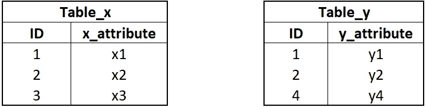
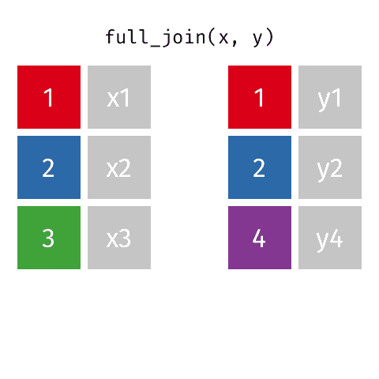
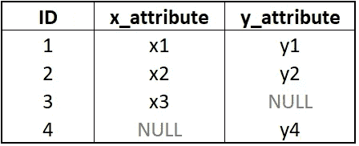
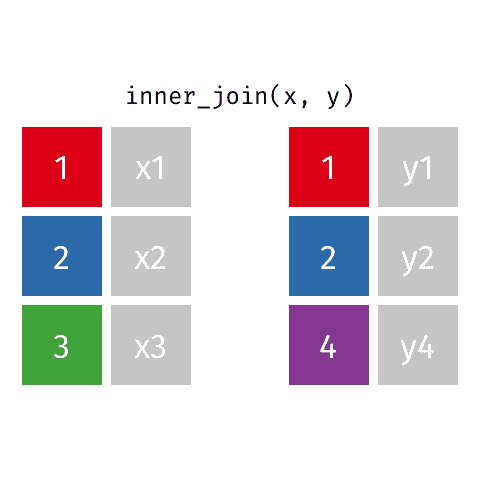
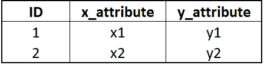
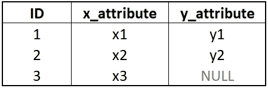
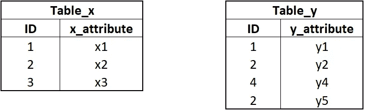
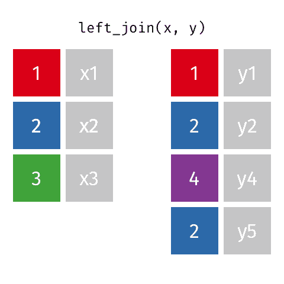
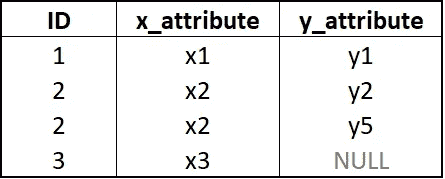
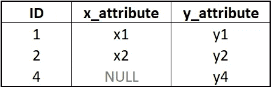

# 可视化的 SQL 连接

> 原文：<https://medium.com/analytics-vidhya/sql-joins-visualized-d2f01909e07d?source=collection_archive---------6----------------------->

## 使用图形的初学者友好指南。

我们都同意连接是 SQL 中最不可避免的语句，无论您在数据合并、数据检索、数据操作、ETL 等过程中处于什么位置。有两个组成部分，一个是理解不同类型的连接，另一个是根据特定的需求来区分应用哪种连接。在选择最合适的(非常低效的实践)之前，我曾经经历过无数次试验和错误。

这些视觉图像的唯一目的是在不需要翻阅教科书和文章的情况下，对不同类型的连接进行长期记忆。

圣杯，对吗？？？

让我们直接开始吧！


# **完全加入**

也称为*完全外连接* —当左表或右表中有匹配时，返回所有记录。简单地说，无论是否有空值，全连接都从两个表中返回记录。



```
SELECT *
FROM Table_x 
FULL JOIN Table_y   ON Table_x.ID = Table_y.ID
```



图片来源:史蒂夫·努里，加里克·阿德恩-布伊，泰勒·史密斯，玛拉·阿威克

*结果*:



# **内部连接**

内部联接返回在两个表中都有匹配值的记录。不满足匹配条件的行将被忽略。我们得到了一个更干净的表组合，因为这消除了所有的空值。


```
SELECT *
FROM Table_x 
INNER JOIN Table_y   ON Table_x.ID = Table_y.ID
```



图片来源:史蒂夫·努里，加里克·阿德恩-布伊，泰勒·史密斯，玛拉·阿威克

*结果:*



# **左连接**

也称为*左外部连接* —返回左表中的所有记录和右表中的匹配记录。这里，最左边表中的所有行都被维护，不管它们是否与右边表中的唯一值匹配。我个人把这个叫做“*左特权*”。


```
SELECT *
FROM Table_x 
LEFT JOIN Table_y   ON Table_x.ID = Table_y.ID
```


图片来源:史蒂夫·努里，加里克·阿德恩-布伊，泰勒·史密斯，玛拉·阿威克

*结果:*



***另一个例子——左连接*** *(表与第一个例子不同，但查询同上)*



图片来源:史蒂夫·努里，加里克·阿德恩-布伊，泰勒·史密斯，玛拉·阿威克

*结果:*



# **右连接**

另一方面，这也被称为*右外部连接*——返回右表中的所有记录和左表中的匹配记录。这里，最右边表中的所有行都被维护，不管它们是否与左边表中的唯一值匹配。我个人把这个叫做“*权限*”。


```
SELECT *
FROM Table_x 
RIGHT JOIN Table_y   ON Table_x.ID = Table_y.ID
```


图片来源:史蒂夫·努里，加里克·阿德恩-布伊，泰勒·史密斯，玛拉·阿威克

*结果:*



# 接下来呢？

通过学习如何联接三个或更多的表，以及如何在单个查询中应用这些不同的联接类型，来扩展您的视野。

敬请关注更多数据操作技巧！

通过留下评论请求主题！！

祝你好运！！！