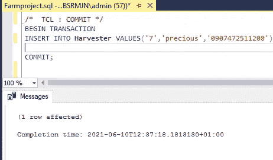
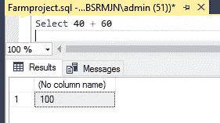

# SQL 第 1 部分:使用 SQL 在 Microsoft SQL Server Management Studio 中构建真实的场管理数据库。

> 原文：<https://medium.com/analytics-vidhya/sql-part-1-using-sql-to-build-a-real-life-farm-management-database-8e87a760d2e?source=collection_archive---------2----------------------->

**农场管理数据库实体关系(ER)图**

# 介绍

**什么是 SQL？**

结构化查询语言(SQL)是一种数据库语言，可用于对现有数据库执行某些操作，也可用于创建数据库。SQL 使用某些命令，如 Create、Drop、Insert 等。来完成要求的任务。这些 SQL 命令主要分为四类:数据定义语言(DDL)。数据查询语言(DQL)。数据操作语言(DML)，事务控制语言(TCL)。

**这个项目的目标**:这个项目演示了如何根据上面显示的实体关系图在**Microsoft SQL Server Management Studio**中构建一个真实的农场管理数据库来实现 SQL，并在 other 中的数据库上应用 SQL 命令来学习一些重要的 SQL 概念。解释了重要的 SQL 概念，并提供了正确的语法。因此，这个项目使得 SQL 对于初学者和中级学习者来说很容易理解。

**在这个项目中，你会学到哪些重要的 SQL 概念？**

(1)数据声明语言(DDL)命令:创建(约束、数据类型和键)、删除和改变

(2)数据操作语言(DML)命令:插入、删除、更新

③数据查询语言(DQL)命令:选择

(4)使用 GROUPBY 聚合函数:计数，平均…

(5) HAVING、CUBE 和 ROLLUP SQL 语句

(6)数据控制语言(DCL)命令:授权、撤销

(7)事务控制语言(TCL):提交、回滚、保存点

(8) SQL 合并

(9)SQL 运算符:+，>，LIKE，CONCAT，UNION…

(10) SQL 连接

(11) SQL 嵌套查询

(12) SQL 存储过程

(13) SQL 异常处理

**(1)数据声明语言(DDL)命令:创建(约束、数据类型和键)、删除和改变**

数据声明性语言命令(DDL)是 SQL 命令，可用于定义数据库模式和修改数据库中数据库对象的结构。它包括创建、删除和更改等命令。

1.1 创建命令:

1.1.1 我们首先使用以下语法在 Microsoft SQL server management studio 上创建场管理数据库:

创建数据库数据库*_ 名称*

使用数据库*名称*

**创建农场管理数据库**

1.1.2 然后使用以下语法在数据库中创建农民、收割机、农产品和农具表:

创建表*TABLE _ name*(
*column 1 datatype*，
…。
)；

1.1.3 然后我们还添加一列作为主键:主键约束惟一地标识表中的每条记录。主键必须包含唯一值，并且不能包含空值。一个表只能有一个主键；在桌子上。

我们还向列添加了一个外键，外键是一个表中的一个字段(或字段集合)，它引用另一个表中的主键。

还要添加约束，如:UNIQUE: SQL UNIQUE 约束。唯一约束确保一列中的所有值都不同。

然后添加另一个约束，如 NOT NULL:NOT NULL 约束强制一个列不接受空值。

还指定列的数据类型:SQL 数据类型定义可以存储在表列中的值的类型，例如 int、tinyint、bigint、float、real 等数字数据类型。日期和时间数据类型，如日期、时间、日期时间等。字符和字符串数据类型，如 char、varchar、text 等。Unicode 字符串数据类型，例如 nchar、nvarchar、ntext 等。

**带有约束、键和数据类型的农民表**

**带有约束、关键字和数据类型的收割机和农产品表**

**带约束、键和数据类型的农具表**

我们现在看到已经创建了表:

**在农场管理数据库中创建的表格**

1.2 下降表

要删除数据库中的表，我们使用以下语法

删除表*表名*；

要删除数据库，我们使用以下语法

删除数据库 DATABASE*_ name*；

**删除农场管理数据库中的表和数据库**

1.3 更改表格

1.3.1 我们可以使用 alter 语句向表中添加一列，如下所示

更改表*表名*增加*列名数据类型*；

**修改农民和农产品表并添加新列**

1.3.2 我们还可以使用 alter 语句从表中删除一列

更改表格*表格 _ 名称*表格 _ 名称
下降列*列 _ 名称*；

**从农民表中删除一列**

1.3.3 也可以用 alter 语句改变列的数据类型

更改表*表名*更改列*列名数据类型*；

**将农民国籍列 varchar 改为 5000**

1.3.4 更改列约束并添加新的约束，如 unique 和 default

更改表名*，*添加唯一的*列名*

更改表*表名*添加约束*列名*默认*列名*的列元素

**向农场管理数据库中的列添加唯一和默认约束**

**(2)数据操作语言(DML)命令:插入、删除、更新。**

数据操作语言(DML)使用插入、删除、更新等命令来处理数据操作。

2.1 插入:

INSERT 的 sql 语法是:

插入到 *table_name* ( *列 1* 、*列 2* 、*列 3* 、…)
VALUES ( *value1* 、 *value2* 、 *value3* 、…)；

运筹学

插入 *table_name*
值( *value1* ， *value2* ， *value3* ，…)；

**插入农民和收割机表格**

**插入农产品和农具表**

2.2 删除

2.2.1 从表中删除特定列。删除的 sql 语法是

从*表名*中删除*条件*；

**从农具表**中删除一个工具

2.2.2 使用以下方法删除表中的所有记录:

从*表名*中删除

**从农具表**中删除所有工具

2.3 更新

更新的 sql 语法是:

更新*table _ name*
SET*column 1*=*value 1*，*column 2*=*value 2*，…
WHERE *条件*；

**更新农民姓名**

**(3)数据查询 LANAGAUGE (DQL)命令:选择**

数据查询语言(DQL)命令语句用于对模式对象中的数据执行查询。选择一个例子。

3.1 选择

3.3.1 我们可以使用以下方法选择表中的所有列:

SELECT * FROM*table _ name*；

**选择农场管理数据库中的所有表格**

3.3.2 使用 select 的另一种方法是:

从 *table_name* 中选择 *column1* 、 *column2、…*
；

**选择农民表中的具体列**

3.3.3 选择 distinct，它用于仅返回 Distinct(不同)值。在一个表中，一列通常包含许多重复的值；有时您只想列出不同的(截然不同的)值。

从*表名*中选择不同的*列名*；

**选择不同的农民国籍**

3.3.4 选择使用 ORDER BY 并结合升序或降序:sql sintax 为:

从 *table_name*
中选择 *column1* 、 *column2、…* 、
ORDER BY*column 1、column2、…* ASC|DESC

**按农民姓名排序**

3.3.5 使用 Select 创建备份表:

从 *table_name* 中选择* INTO new _ table*name*；

**农民表备份**

**(4)使用 GROUPBY 聚合函数:COUNT，AVERAGE..**

聚合函数对一组值执行计算，并返回单个值。除了 COUNT(*)，聚合函数忽略空值。聚合函数通常与 SELECT 语句的 GROUP BY 子句一起使用。`GROUP BY`语句通常与聚合函数(`COUNT()`、`MAX()`、`MIN()`、`SUM()`、`AVG()`)一起使用，按一列或多列对结果集进行分组。

4.1 COUNT:SQL COUNT 函数是一个聚合函数，它返回查询返回的行数。语法:SQL COUNT(column_name)

**统计每个农民班次的农民 ID**

4.2 AVERAGE: SQL Server AVG()函数是一个聚合函数，它返回一个组的平均值。语法是:

从“表名”中选择 **AVG** ( <表达式>)；

**平均农产品篮子数量**

**(5) HAVING、CUBE 和 ROLLUP SQL 语句**

5.1 HAVING:`HAVING`子句被添加到 SQL 中，因为`WHERE`关键字不能与聚合函数一起使用。

从*表名*中选择*列名*其中*条件*

GROUP BY *column_name(s)* 具有*条件*ORDER BY*column _ name(s)；*

**在 farmer 表上使用带有 count aggregate 函数的 having 语句**

5.2 多维数据集和汇总

`ROLLUP`和`CUBE`可以在几个不同的轴上汇总值，满足更详细的报告需求。`ROLLUP`根据`GROUP BY`子句中使用的列的层次结构进行汇总。`CUBE`按值的所有组合分组。

**农民表上的立方体语句**

**农民表上的 rollup 语句**

**(6)数据控制语言命令(DCL):授予、撤销**

DCL 包括诸如 GRANT 和 REVOKE 之类的命令，这些命令主要处理数据库系统的权利、许可和其他控制。

6.1 GRANT: SQL Grant 命令用于向用户提供对数据库对象的访问权限或特权。GRANT 命令的语法是:

将对象名称的权限名称授予{用户名}

**授予用户从农民表中选择的权限**

6.2 撤销

REVOKE 命令删除用户对数据库对象的访问权限或特权。REVOKE 命令的语法是:

将对象名称上的权限名称撤销给{用户名}

**撤销用户从农民表中选择的权限**

**(7)事务控制语言(TCL):提交、回滚、保存点**

事务控制语言(TCL)用于控制事务。它包括提交、授权和保存点。

7.1 提交-保存更改。

**通过提交保存对采集器表的更改**

7.2 回滚-回滚更改

**回滚到带有回滚功能的收割机表**

7.3 保存点——在事务组内创建回滚点。

**使用保存或保存点保存对采集器表的更改**

**(8) SQL 合并**

SQL 中的一个 MERGE 语句，是三个 [INSERT](https://www.geeksforgeeks.org/sql-insert-statement/) 、 [DELETE](https://www.geeksforgeeks.org/sql-delete-statement/) 和 [UPDATE](https://www.geeksforgeeks.org/sql-update-statement/) 语句的组合。所以如果有一个**源表**和一个**目标表**要合并，那么借助于 MERGE 语句，所有这三个操作(插入、更新、删除)可以同时执行。合并语法是:

使用<search_condition>上的<table_source>【作为源】合并<target_table>【作为目标】【匹配时，然后<merge_matched>】【不匹配时【按目标】然后<merge_not_matched>】【不匹配时，然后<merge_matched></merge_matched></merge_not_matched></merge_matched></target_table></table_source></search_condition>

**合并农场管理数据库中的两个表**

**(9) SQL 操作符:+、>、以及 LIKE、UNION…**

9.1 算术运算符:eg+、-、* /等。

例如使用“+”运算符

**+合并两列的运算符**

**+求和运算符**

9.2 逻辑运算符和复合运算符:逻辑运算符包括:and、OR、LIKE、BETWEEN、EXIST。而逻辑运算符是:≥，≤, /= e.t.c

**≥或农场管理数据库**表上的操作符

9.3 并集和交集运算符:

`UNION`操作符用于组合两个或多个`SELECT`语句的结果集。而交集显示了表之间的关系。

从*表 1* 中选择*列名*联合/交集
从*表 2* 中选择*列名*；

**农场管理数据库中两个表的联合**

**(10) SQL 连接**

`JOIN`子句用于根据两个或多个表之间的相关列来组合它们中的行。

`INNER JOIN`关键字选择在两个表中都有匹配值的记录。内部联接语法是:

从*表 1*
内连接*表 2* 中选择*列名*
在*表 1 .列名* = *表 2 .列名*；

`LEFT JOIN`关键字返回左表(表 1)中的所有记录，以及右表(表 2)中的匹配记录。如果没有匹配，结果是右侧的 0 条记录。left join 语法类似于 inner join，只是替换了 inner join。

`RIGHT JOIN`关键字返回右表(表 2)中的所有记录，以及左表(表 1)中的匹配记录。如果没有匹配，结果是左侧的 0 条记录。正确的连接语法类似于内部连接，只需替换内部连接。

当左(表 1)或右(表 2)表记录中有匹配时，`FULL OUTER JOIN`关键字返回所有记录。完整的外部联接语法是:

从*表 1*
中选择*列名*
*表 1 .列名* = *表 2 .列名* 其中*条件*；

内连接和右连接的示例:

**使用 join 查询农场管理数据库中的农产品和收割机表**

**(11)SQL 嵌套查询**

**子查询**或**内部查询**或**嵌套查询**是另一个 **SQL** 查询中的查询，并嵌入在 WHERE 子句中。

语法包括:

SELECT column_name [，column_name ]
FROM table1 [，table2 ]
WHERE column_name 运算符
(SELECT column_name [，column_name ]
FROM table1 [，table 2]
【WHERE】)

**嵌套查询来查询农户表**

**(12)SQL 存储过程**

存储过程是一个准备好的 SQL 代码，您可以保存它，这样代码就可以重复使用。因此，如果您有一个反复编写的 SQL 查询，请将其保存为存储过程，然后调用它来执行它。存储的预处理语法是:

创建过程*过程 _ 名称*
为
*SQL _ 语句*
GO；

执行*过程名*；

**查询农民表的存储过程**

**(13) SQL 异常处理:TRY and CATCH**

SQL Server 中的错误处理使我们能够控制 Transact-SQL 代码。例如，当事情出错时，我们有机会做些什么，并可能再次使它正确。可以使用:TRY，CATCH。

**农民表上的异常处理**

# 结论

这个项目解释了如何将 SQL 应用于数据库，以几种方式创建、操作和查询数据库中的数据。所创建的数据库是一个农场管理数据库，可应用于实际生活中。

**作家**:奥卢耶德·塞贡。(小)

**链接下载本项目使用的 SQL 表:**

[https://projectsss . S3 . us-east-2 . Amazon AWS . com/farm project . SQL](https://projectsss.s3.us-east-2.amazonaws.com/Farmproject.sql)

**在我的 github 上查看本项目使用的 SQL 表:**

[https://github . com/juniorboycoder/FARM _ SQL _ DATABASE/blob/main/FARM project . SQL](https://github.com/juniorboycoder/FARM_SQL_DATABASE/blob/main/Farmproject.sql)

**使用的资源(参考资料)和进一步阅读:**

 [## SQL 教程

### SQL 是一种在数据库中存储、操作和检索数据的标准语言。我们的 SQL 教程将教你…

www.w3schools.com](https://www.w3schools.com/sql/)  [## SQL | DDL、DQL、DML、DCL 和 TCL 命令- GeeksforGeeks

### SQL | DDL，DQL，DML，DCL 和 TCL 命令结构化查询语言(SQL)众所周知是由…

www.geeksforgeeks.org](https://www.geeksforgeeks.org/sql-ddl-dql-dml-dcl-tcl-commands/)  [## SQL 事务

### SQL - Transactions -事务是针对数据库执行的一个工作单元。交易是单位或…

www.tutorialspoint.com](https://www.tutorialspoint.com/sql/sql-transactions.htm)  [## SQL 中的 MERGE 语句解释- GeeksforGeeks

### 先决条件- MERGE 语句作为 SQL 中的 MERGE 语句，如前一篇文章中所讨论的，是…

www.geeksforgeeks.org](https://www.geeksforgeeks.org/merge-statement-sql-explained/) 

**linkedin 简介**:[https://www . LinkedIn . com/in/oluyede-segun-ade deji-Jr-a 5550 b 167/](https://www.linkedin.com/in/oluyede-segun-adedeji-jr-a5550b167/)

推特简介:[https://twitter.com/oluyedejun1](https://twitter.com/oluyedejun1)

**标签**:# SQL #数据库#数据科学#SQLServer