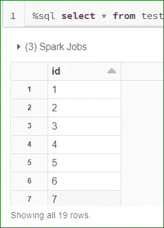
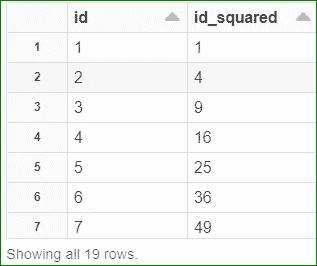
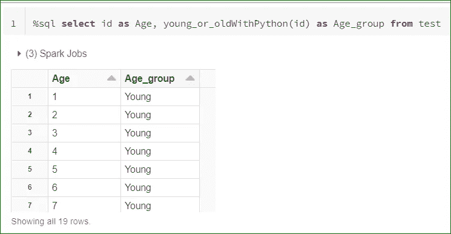

# 使用 Pyspark 解决了 SQL 问题！！

> 原文：<https://medium.com/analytics-vidhya/sql-problem-solved-using-pyspark-1bbc3a0fb108?source=collection_archive---------16----------------------->

这篇文章是写给那些使用 SQL 进行数据分析的人的。我们在使用 SQL 时都面临的一个大问题是，它不允许您创建用户定义的函数并轻松使用它。

C 尤里乌斯？？？想知道你是怎么做到的！！别担心，我会在这篇文章中分享。

Spark 在核心 spark 之上构建了一些 API，如 GraphQL、MLIb、SQL 和 spark Streaming。我们的目标是创建一个函数，自动接受输入并执行一些操作给我们结果，使用 SQL api 中的相同函数来获得所需的输出。

# 如何在 pyspark 中创建自定义函数？？

S park 允许您轻松完成这项工作，即创建用户定义的函数并在 SQL 中使用它。


[来源:Freepik](https://www.freepik.com/premium-vector/flat-thinking-concept_4457224.htm)

# 仍然在想，让我教你一个简单而有趣的方法来学习和创建你自己的用户自定义函数。

> 问题:创建一个接受一个输入并提供作为参数传递给函数的数字的平方的函数

```
**def** squared_func(s):
  **return** s * s
spark.udf.register("squaredWithPython", squared_func)
```

1.  我们用 python 定义了一个函数

2.注册它(在 spark 环境中定义它，以便可以在 sql 命令中使用它)

```
spark.range(1, 20).createOrReplaceTempView(“test”)
```



数据帧测试输出

3.创建 spark 数据帧并创建临时视图以使用 sql 查询数据帧

```
%sql select id, squaredWithPython(id) as id_squared from test
```

4.在 sql 查询中使用 udf 并提供列作为输入，我们将得到如下输出。



数据块示例 1 输出

示例 2:

```
from pyspark.sql.types import StringType
def young_or_old(s):
  return 'Old' if s > 60 else 'Young'

spark.udf.register("young_or_oldWithPython", young_or_old, StringType())
```

上面的示例显示了一个函数，它将年龄作为输入参数，并返回该输入的 age_group。如果你仔细注意到在第二个例子中，我们在函数注册命令中包含了“StringType ”,我们定义了该函数的返回数据类型

```
%sql select id as Age, young_or_oldWithPython(id) as Age_group from test
```



数据块示例 2 输出

# 感谢阅读文章直到最后:)