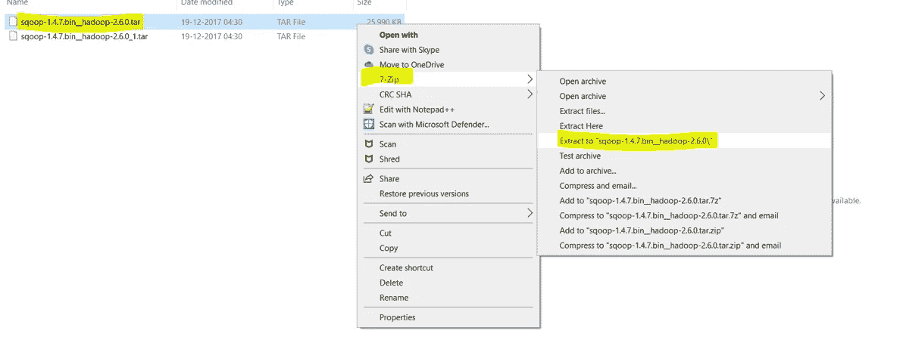
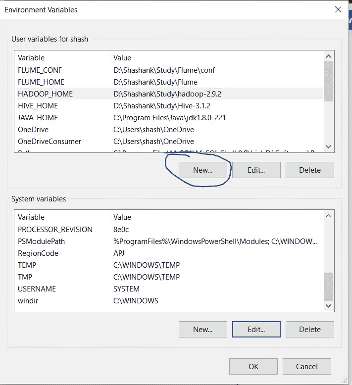
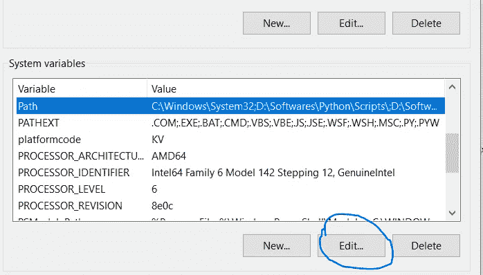

# SQOOP —如何在 Windows 10 中通过 5 个步骤进行安装

> 原文：<https://medium.com/analytics-vidhya/sqoop-how-to-install-in-5-steps-in-windows-10-ca2f17e11e75?source=collection_archive---------1----------------------->

在 Windows 10 中安装 SQOOP 的简单指南。


图片取自谷歌图片

# 1.先决条件

1.  硬件要求
    * RAM —最小值。8GB，如果您的系统中有 SSD，那么 4GB RAM 也可以。
    * CPU —最小值。四核，至少 1.80GHz
2.  [JRE 1.8](https://www.java.com/en/download/windows_offline.jsp)—JRE 的离线安装程序
3.  [Java 开发套件— 1.8](https://www.oracle.com/java/technologies/javase/javase-jdk8-downloads.html#license-lightbox)
4.  我将使用 64 位 windows 操作系统，请检查并下载您的系统 x86 或 x64 支持的所有软件版本。
5.  [Hadoop](https://archive.apache.org/dist/hadoop/core/hadoop-2.9.2/)
    *我使用的是 Hadoop-2.9.2，你也可以使用任何其他稳定版本的 Hadoop。
    *如果没有 Hadoop，可以参考 [Hadoop:如何在 Windows 10 中 5 步安装](/analytics-vidhya/hadoop-how-to-install-in-5-steps-in-windows-10-61b0e67342f8)安装。
6.  [MySQL 查询浏览器](https://dev.mysql.com/downloads/mysql/)
7.  [下载 SQOOP zip](https://downloads.apache.org/sqoop/1.4.7/)
    *我使用的是 SQOOP-1.4.7，你也可以使用任何其他稳定版本的 SQOOP。


图 1:-下载 Sqoop 1.4.7

# 2.解压缩并安装 SQOOP

下载完 SQOOP 后，我们需要解压 sq OOP-1 . 4 . 7 . bin _ _ Hadoop-2 . 6 . 0 . tar . gz 文件。


图 2:-提取 Sqoop 步骤 1

提取之后，我们会得到一个新文件 sqoop-1 . 4 . 7 . bin _ _ Hadoop-2 . 6 . 0 . tar
现在，我们需要再次提取这个 tar 文件。



图 3:-提取 SQOOP 步骤 2

*   现在，我们可以组织我们的 SQOOP 安装，我们可以创建一个文件夹，并在其中移动最终提取的文件。比如说


图 4:- SQOOP 目录

*   请注意，创建文件夹时，不要在文件夹名称之间添加空格。(这可能会导致以后出现问题)
*   我已经把我的 SQOOP 放在 D: drive 中了，你也可以使用 C:或者任何其他的驱动器。

# **3。设置环境变量**

设置工作环境的另一个重要步骤是设置系统环境变量。

要编辑环境变量，进入控制面板>系统>点击“高级系统设置”链接
,或者，我们可以右键单击此 PC 图标，点击属性，然后点击“高级系统设置”链接
,或者，最简单的方法是在搜索栏中搜索环境变量，这样就可以了…😉


图 5:-环境变量的路径


图 6:-高级系统设置屏幕

**3.1 设置 SQOOP_HOME**

*   打开环境变量，点击“用户变量”中的“新建”



图 7:-添加环境变量

*   点击“新建”,我们进入下面的屏幕。


图 8:-添加 SQOOP_HOME

*   现在如图所示，在变量名中添加 SQOOP_HOME，在变量值中添加 SQOOP 的路径。
*   单击 OK，我们就完成了 SQOOP_HOME 设置的一半。

**3.2 设置路径变量**

*   设置环境变量的最后一步是在系统变量中设置路径。



图 9:-设置路径变量

*   在系统变量中选择路径变量并点击“编辑”。


图 10:-添加路径

*   现在我们需要将这些路径添加到路径变量:-
    * %SQOOP_HOME%\bin
*   单击确定和确定。&我们已经完成了环境变量的设置。

> 注意:-如果您想要为所有用户设置路径，您需要从系统变量中选择“新建”。

**3.3 验证路径**

*   现在我们需要验证我们所做的是正确的和反映的。
*   打开一个**新的**命令窗口
*   运行以下命令

```
echo %SQOOP_HOME%
```

# 4.配置 SQOOP

一旦我们配置了环境变量，下一步就是配置 SQOOP。它有三个部分:-

**4.1 安装 MySQL 数据库**

> 如果您已经安装了 MySQL 数据库或任何其他数据库，如 MySQL、PostgreSQL、Oracle、SQL Server 和 DB2，您可以跳过这一步继续。

我将使用 MySQL 数据库，因为 SQOOP 包含 MySQL 的快速路径连接器。

可以从这里参考[如何安装 MySQL】。](https://dev.mysql.com/doc/mysql-installation-excerpt/8.0/en/mysql-installer.html)

**4.2 为 SQOOP 获取 MySQL 连接器**

下载[MySQL-connector-Java . jar](https://mvnrepository.com/artifact/mysql/mysql-connector-java/8.0.16)放在 SQOOP 的`lib`文件夹中。


图 11:-将 MySQL jar 放入 SQOOP lib 文件夹

**4.3 在 MySQL 中创建用户**

配置 SQOOP 的下一个重要步骤是为 MySQL 创建用户。
这些用户用于将 SQOOP 连接到 MySQL 数据库，以便从中读取和写入数据。

*   首先，我们需要打开 MySQL 工作台并打开工作区(默认或任何特定的，如果你想)。我们现在将只使用默认的工作空间。


图 12:-打开 MySQL 工作台

*   现在打开工作区的`Administration`选项，选择`Management.`下的`Users and privileges`选项


图 13:-打开用户和权限

**4.3.1 在 MySQL 中创建 SQOOP 用户**

*   现在选择`Add Account`选项，创建一个新用户，用`Login Name`作为`sqoop`，用`Limit to Host Mapping`作为你选择的`localhost`和`Password`。


图 14:-创建 SQOOP 用户

*   现在我们必须在`Administrative Roles`下为该用户定义角色，并选择`DBManager`、`DBDesigner`和`BackupAdmin`角色


图 15:-分配角色

*   现在我们需要通过使用`Add Entry`选项并选择我们需要访问的`schemas`来授予用户`schema privileges`。


图 16:-模式特权

> 对于所有与 bigdata 相关的模式，我使用`schema matching pattern`作为`%_bigdata%`。您也可以使用其他两个选项。

*   点击`OK`后，我们需要选择该模式的所有权限。


图 17:-选择模式中的所有特权

*   单击 Apply，我们就完成了创建 SQOOP 用户的工作。

**4.3.2 在 MySQL 中创建 Hive 用户**

*   我们需要在 MySQL 中再创建一个用户`hive`。
*   我们可以按照与上面(4.3.1)相同的步骤来创建新用户。

**4.4 授予用户权限**

一旦我们创建了 2 个用户，下一步就是授予这些用户对之前选择的模式中的所有表的所有特权。

*   打开 MySQL cmd 窗口。我们可以使用窗口的搜索栏打开它。


图 18:- MySQL cmd

*   一打开它就会询问你的`root`用户密码(在设置 MySQL 时创建的)。
*   现在我们需要在 cmd 窗口中逐个运行下面的命令。

```
grant all privileges on test_bigdata.* to 'sqoop'@'localhost';
grant all privileges on test_bigdata.* to 'hive'@'localhost';
```

其中`test_bigdata`将是您的模式名，`sqoop@localhost`和`hive@localhost`将是用户名@主机名。

# 5.测试设置

祝贺..！！！！！
我们已经完成了系统中的 SQOOP 设置。

现在我们需要检查是否一切顺利…

打开一个 cmd 窗口，运行以下命令来测试连接和 SQOOP。

```
sqoop list-databases --connect jdbc:mysql://localhost/ --username sqoop -P
```

在运行该命令时，它会询问用户密码`sqoop`，一旦提供，它将显示数据库列表。


图 19:-运行 SQOOP

# 6.恭喜..！！！！🎉

恭喜你！我们已经成功安装了 SQOOP。
我们中的一些人可能会遇到一些问题…不要担心，这很可能是由于一些小失误或不兼容的软件。如果您遇到任何此类问题，请再次仔细访问所有步骤，并验证软件版本是否正确。
如果你仍然无法启动并运行 SQOOP，请不要犹豫，在评论区描述你的问题。

# 7.记名票据🙏

别忘了喜欢并分享给你的朋友和同事。另外，不要错过分享你对这篇文章或新文章的看法和建议的机会。

在这里你可以了解更多关于我的[。](https://shashank-singhal.medium.com/about-me-shashank-singhal-6654366c8a05)。

快乐学习…！！！🙂