# SQS，EMR，KINESIS

> 原文：<https://medium.com/analytics-vidhya/sqs-emr-kinesis-755dac335062?source=collection_archive---------18----------------------->

# **SQS**

为了理解 SQS，让我们考虑一个场景。

假设你正在主持一个电视节目，来自世界各地的数百万人应该同时投票。传统上，您需要部署一个 web 服务器来处理每秒的所有消息(投票),并且必须预先配置最大的预期工作负载。

我知道这不是一件很难做的工作，但是如果流量变得太大，服务器无法处理，服务器崩溃，或者说，你没有得到你预期的那么多选民，从而最终为基础设施支付了过多的费用。

您需要排队机制来处理这种情况，它可以吸收每秒 10 条消息或每秒 1000 万条消息，并具有灵活的定价模型。

进入 SQS！！

SQS 或简单队列服务是 AWS 中第一个可用的服务，它允许您在等待计算机处理消息时访问可用于存储消息的消息队列。该队列完全由 AWS 管理，可帮助您在任何数量的软件组件之间发送、存储和接收消息，而不会丢失消息或要求其他服务始终可用。AWS SQS 可以在 Amazon 控制台、命令行界面和 SDK 等工具的帮助下启动。

AWS SQS 有助于在任何地区发送无限数量的消息。消息有效负载由 256KB 的文本组成，可以是任何格式，除非您使用扩展的客户端库。如果文本的大小超过了 Java 编程的扩展客户端库可以使用的大小。

以下是使用亚马逊简单队列服务的热门公司:

*   德国宝马汽车公司(Bavarian Motor Works)
*   美国国家航空航天局
*   大写一
*   红色巴士

**创建并读取 SQS 队列**

打开 https://console.aws.amazon.com/sqs/[的亚马逊 SQS 控制台](https://console.aws.amazon.com/sqs/)，点击**创建队列。**

您最终会看到一个创建新队列页面。您可以创建标准队列或先进先出(FIFO)队列。标准队列是默认队列，但是如果您想要创建 fifo 队列，那么您可以选择 fifo 队列，记住，要创建 fifo 队列，队列名称必须以*结尾。先进先出*

这两种队列类型有很大的不同，在选择其中一种时需要小心。创建队列类型后，您不能更改它。

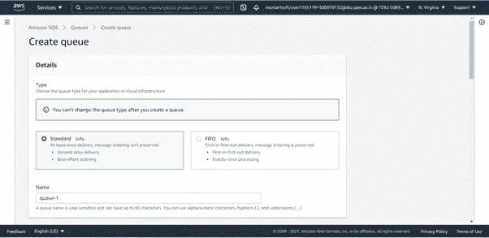

接下来，您需要定义一些关键属性来创建队列。

可见性超时—从队列接收的消息对其他接收组件不可见的时间长度。

邮件保留期——邮件在亚马逊 SQS 队列中保留或不被删除的时间。

传递延迟—在将消息添加到队列后，您可以引入一个延迟，在一定时间内，任何组件都无法选取该特定消息。

最大消息大小—消息有效负载由 256KB 的文本组成，可以是任何格式。

接收消息等待时间—组件在返回空响应之前等待消息的时间。

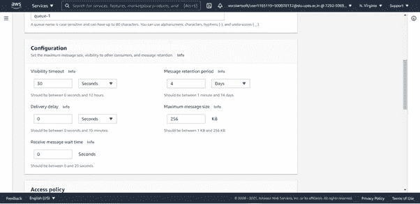

您可以根据需要更改访问策略，但对于本演示，我们将继续使用默认策略。

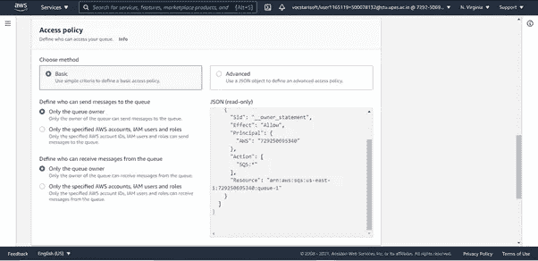

让一切保持原样，最后，点击**创建队列**

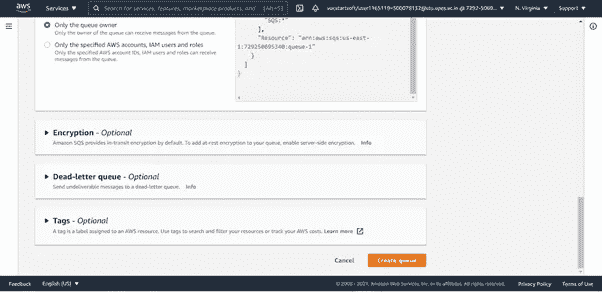

从仪表板中，您可以看到队列已经创建。

现在我们已经有了一个队列，点击右上角的**发送和接收消息**，开始发送消息。

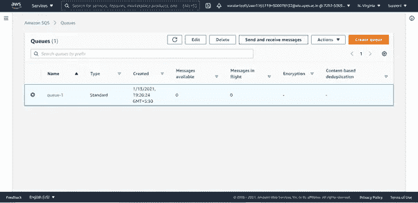

在消息正文部分下键入消息。如果需要，添加延迟时间并编辑其他属性。

点击**发送消息**

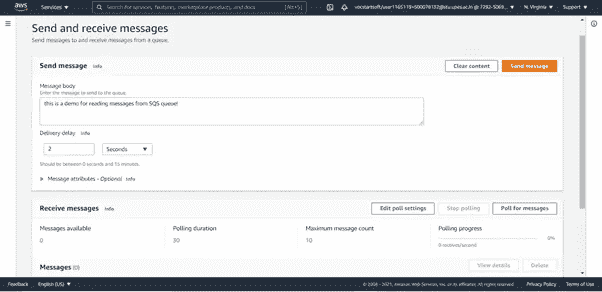

现在，这条消息将被发送到您创建的队列中，一个消息 ID 将像这样在您的屏幕上弹出。

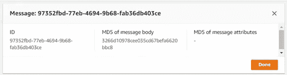

要查看消息，向下滚动一点可以点击消息的投票。

亚马逊 SQS 开始轮询服务器，寻找队列中的消息。**接收消息**部分右侧的进度条显示轮询持续时间。

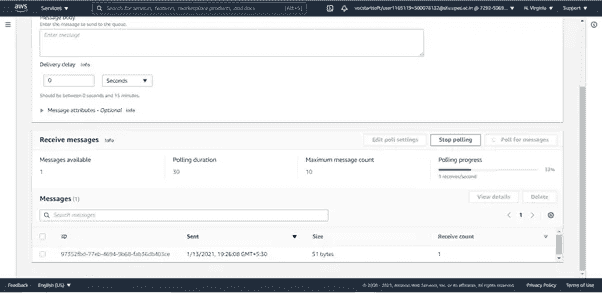

一旦轮询进度达到 100%，您可以在接收消息部分查看您的消息。

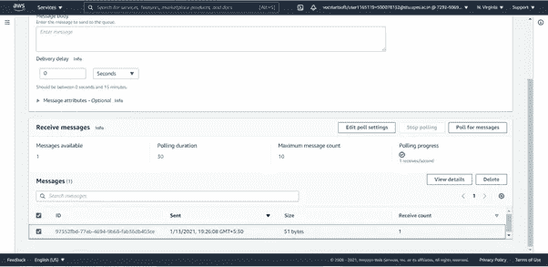

点击消息 ID 查看消息正文*和*。

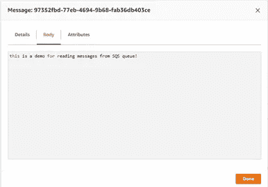

您也可以通过切换到*详细信息*选项卡来查看消息详细信息。

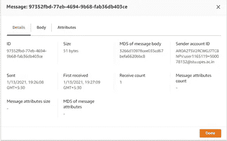

# **EMR**

无论分析的术语是什么，在需要分析大数据的任何时候运行集群基础架构都是对资源的浪费。除非你有亚马逊电子病历。

Amazon EMR(Amazon Elastic MapReduce)提供了一个托管的 Apache Hadoop 框架和其他用于大数据和数据分析的框架，这些框架将数据的计算分布在多个 Amazon EC2 实例上，允许开发人员处理大量的非结构化数据。

为大数据计算任务配置和调配现场服务器既耗时又昂贵。因此，AWS 所做的是将 Hadoop 框架的所有基础设施封装到一个集成环境中，以便您可以在几分钟内启动大型集群，并根据您的需求处理您的数据。

AWS EMR 易于使用，因为用户可以开始将数据上传到 S3 桶。然后，用户可以在几分钟内配置并启动群集。

Amazon EMR 可用于构建各种应用程序，例如它为 TensorFLow、Apache Spark MLib 等可扩展的机器学习算法提供内置的机器学习工具

使用 EMR 笔记本，您将获得一个基于开源 Jupyter 的托管分析环境。

# **驱动力**

Amazon kinesis 是一项 Amazon Web 服务，它提供了一个实时、全面管理和可扩展的平台，可以轻松地从移动客户端、网站点击流、社交媒体源和各种事件等来源收集、处理和传输每秒数千兆字节的数据，如视频、音频、应用程序日志。以便您可以获得及时的见解，并对新信息做出快速反应。*网飞*，使用 Kinesis 监控其应用程序之间的所有通信，使其能够检测并快速解决任何技术问题。

它有不同的子模块，

Kinesis 消防软管

运动学分析

Kinesis 流

亚马逊 Kinesis Firehose 使您能够将流数据加载到亚马逊 Kinesis analytics、亚马逊 S3、亚马逊红移和亚马逊弹性搜索服务中。Amazon Kinesis Analytics 使您能够在流数据上编写标准的 SQL 查询。Amazon Kinesis Streams 使您能够构建定制的应用程序来处理或分析特殊需求的流数据。

有了 amazon kinesis，你可以将数据传递给 AWS 上的任何其他服务，也许还可以将它用作发布-订阅系统，因为它非常容易上手，无需提供任何东西就可以推送数据。

Amazon Kinesis 用于各种目的，如欺诈检测、live leader boards 和应用程序监控，甚至来自嵌入式传感器、消费电器和电视机顶盒等物联网设备的流数据也可以使用 Amazon Kinesis 进行处理。

***欢迎来到 AWS 的大数据世界！！***

如果你觉得这篇文章有帮助，请为它鼓掌

*谢谢！*